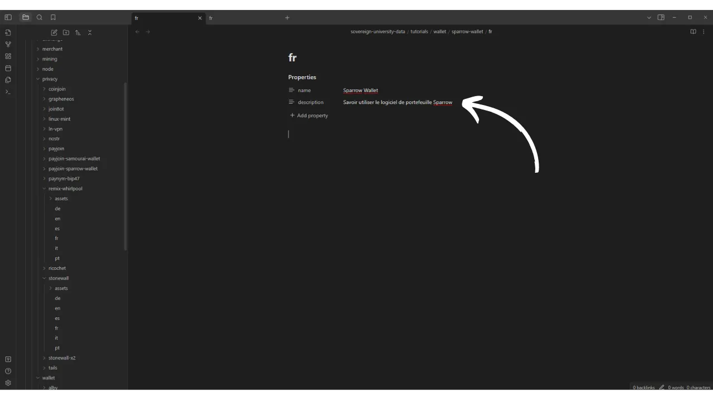
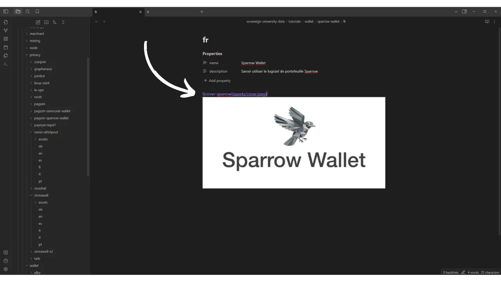

La missione di PlanB è fornire risorse educative di prim'ordine su Bitcoin, nel maggior numero di lingue possibile. Tutti i contenuti pubblicati sul sito sono open-source e ospitati su GitHub, offrendo così a chiunque l'opportunità di partecipare all'arricchimento della piattaforma. I contributi possono assumere varie forme: correzione e revisione di testi esistenti, traduzione in altre lingue, aggiornamento delle informazioni o creazione di nuovi tutorial non ancora disponibili sul nostro sito.

Se desideri contribuire alla Rete PlanB, ma non ti senti a tuo agio nell'uso di GitHub, questo tutorial è pensato appositamente per te. Dettaglieremo come contribuire alla Rete PlanB tramite GitHub, utilizzando Obsidian, uno strumento progettato per facilitare la scrittura.

Vedrai che impostare l'intero processo di lavoro è piuttosto lungo, specialmente se non hai mai usato GitHub prima. Tuttavia, l'uso di Git rende la collaborazione nella scrittura di contenuti più facile, poiché permette un tracciamento preciso delle modifiche, una gestione efficiente delle versioni e consente anche la revisione e il miglioramento dei contenuti da parte di altri collaboratori. Inoltre, una volta impostato il processo di lavoro sul tuo PC, troverai che Git facilita notevolmente il tuo lavoro. Potresti persino uscire con il desiderio di usare Git per i tuoi altri progetti personali, perché questo software è così efficace.

## Glossario Git
- **Fetch origin:** Comando che recupera informazioni recenti e modifiche da un repository remoto senza unirle al tuo lavoro locale.
- **Pull origin:** Comando che recupera aggiornamenti da un repository remoto e li integra immediatamente nel tuo ramo locale per sincronizzarlo.
- **Sync Fork:** Comando su GitHub che aggiorna il tuo fork di un progetto con le ultime modifiche dal repository sorgente.
- **Push origin:** Comando usato per inviare le tue modifiche locali a un repository remoto.
- **Pull Request:** Una richiesta inviata da un collaboratore per indicare che hanno effettuato modifiche su un ramo in un repository remoto e desiderano che queste modifiche vengano esaminate e potenzialmente integrate (unite) nel ramo principale del repository.
- **Commit:** Salvare le tue modifiche. Un commit è come uno scatto istantaneo del tuo lavoro in un dato momento, che aiuta a mantenere una storia delle modifiche.
- **Branch:** Una versione parallela del repository, che ti permette di lavorare su modifiche senza influenzare il ramo principale (chiamato "`dev`" sul repository di PlanB).
- **Merge:** Unire consiste nell'integrare le modifiche da un ramo all'altro. Viene usato, ad esempio, per aggiungere le modifiche da un ramo di lavoro al ramo principale.
- **Fork:** Fare un fork di un repository significa creare una copia di quel repository sul proprio account GitHub, permettendoti di lavorare sul progetto senza influenzare il repository originale.
- **Clone:** Clonare un repository significa fare una copia locale sul tuo computer, dandoti accesso a tutti i file e alla storia delle modifiche.

- **Repository:** Uno spazio di archiviazione per un progetto su GitHub. Contiene tutti i file del progetto così come la storia di tutte le modifiche che sono state fatte.

## Che tipo di contenuto scrivere sulla Rete PlanB?
Stiamo cercando principalmente tutorial su strumenti relativi a Bitcoin o al suo ecosistema. Questi contenuti possono essere strutturati attorno a sei categorie principali:
- Wallet;
- Nodo;
- Mining;
- Commerciante;
- Exchange;
- Privacy.

Oltre a questi argomenti specificamente legati a Bitcoin, PlanB è anche alla ricerca di contributi su temi che evidenziano la sovranità individuale, come:
- Strumenti open source;
- Informatica;
- Crittografia;
- Energia;
- Matematica;
- Economia;
- Fai da te;
- LifeHacking...
Ad esempio, attualmente disponiamo di tutorial su Tails, Nostr o GrapheneOS. Questi strumenti non sono direttamente collegati a Bitcoin, ma sono sistemi che possono interessarci in un approccio di sovranità nel mondo digitale, o nell'apprendimento per raggiungerla. Questi contenuti possono essere integrati in una sottocategoria della sezione "Altri".
Hai la scelta tra progettare un tutorial da zero o ripubblicare un tutorial precedentemente pubblicato sul tuo sito web (a condizione che tu ne detenga i diritti d'autore) per condividerlo anche su PlanB Network, aggiungendo un link all'articolo originale.

Qualunque sia la tua scelta, tieni presente che tutti i contenuti pubblicati su PlanB Network sono sotto la licenza libera [CC-BY-SA](https://creativecommons.org/licenses/by-sa/4.0/). Questa licenza consente a chiunque di copiare e, potenzialmente, modificare il tuo contenuto, a condizione che la fonte originale sia debitamente accreditata.

## Processo di Contribuzione
Per aggiungere un tutorial al sito di PlanB Network, è necessario effettuare una Pull Request sul repository GitHub attualmente denominato [sovereign-university-data](https://github.com/DecouvreBitcoin/sovereign-university-data). Il tuo contributo deve conformarsi alla struttura standard e includere tutti i file necessari. Questo è precisamente ciò che dettaglieremo nelle parti seguenti.

Successivamente, un amministratore esaminerà il tuo tutorial. Se sono necessari aggiustamenti, ti informerà affinché le modifiche possano essere apportate. Una volta approvato, il tutorial verrà integrato nel repository.

## Passo 1: Creare un Account GitHub
Se non ti sei ancora iscritto a GitHub, dovrai creare un account. Per farlo, vai su [https://github.com/signup](https://github.com/signup). Inserisci il tuo indirizzo email, poi scegli una password forte. 
Successivamente, scegli il tuo nome utente. Hai l'opzione di rivelare la tua vera identità o di preferire l'uso di uno pseudonimo. Clicca su `Continua` e completa il Captcha. Ti verrà inviata un'email contenente un codice di conferma; dovrai inserirlo per finalizzare la creazione del tuo account.

Rispondi alle domande se desideri che GitHub ti guidi verso determinati strumenti, o clicca su `salta personalizzazione` per saltare.

Scegli il piano gratuito cliccando sul pulsante `Continua gratuitamente`.

Verrai quindi reindirizzato alla tua dashboard. Se lo desideri, puoi personalizzare il tuo account cliccando sulla tua immagine del profilo situata in alto a destra dello schermo, poi accedendo al menu `Impostazioni`.

In questa sezione, hai l'opzione di aggiungere una nuova immagine del profilo, selezionare un nome, personalizzare la tua biografia o aggiungere un link al tuo sito web personale.

Ti consiglio anche di dare un'occhiata al menu `Password e autenticazione`, per impostare l'autenticazione a due fattori.

## Passo 2: Installare GitHub Desktop
Vai su https://desktop.github.com/ per scaricare il software GitHub Desktop. Questo software ti permette di interagire facilmente con GitHub, senza dover usare un terminale.

Alla prima apertura del software, ti verrà chiesto di collegare il tuo account GitHub. Per farlo, clicca su `Accedi a GitHub.com`.

Si aprirà una pagina di autenticazione nel tuo browser. Inserisci il tuo indirizzo email e la password scelta nel passaggio precedente, poi clicca sul pulsante `Accedi`.

Clicca su `Autorizza desktop` per confermare la connessione tra il tuo account e il software. 
Sarai automaticamente reindirizzato al software GitHub Desktop. Clicca su `Termina`.

Se hai appena creato il tuo account GitHub, sarai reindirizzato a una pagina che indica che non hai ancora creato alcun repository. A questo punto, metti da parte il software GitHub Desktop; ci ritorneremo più tardi.

## Passo 3: Installa Obsidian
Passiamo ora all'installazione del software di scrittura. Qui, hai diverse opzioni. Esiste una moltitudine di software specializzati nella modifica di file Markdown, come Typora, progettato specificamente per la scrittura. Anche se non è l'ideale, è possibile scegliere anche un editor di codice, come Visual Studio Code (VSC) o Sublime Text. Tuttavia, come scrittore, preferisco utilizzare il software Obsidian. Vediamo insieme come installarlo e iniziare. 
Vai su https://obsidian.md/download e scarica il software. Installalo, scegli la tua lingua, poi clicca su `Avvio Rapido`.

Arriverai al software Obsidian. Al momento, non hai nessun file aperto.

## Passo 4: Fork del repository della Rete PlanB
Vai al repository dei dati della Rete PlanB al seguente indirizzo: [https://github.com/DecouvreBitcoin/sovereign-university-data](https://github.com/DecouvreBitcoin/sovereign-university-data). Se non hai effettuato l'accesso al tuo account GitHub, per favore accedi nuovamente.

Da questa pagina, clicca sul pulsante `Fork` in alto a destra della finestra.

Nel menu di creazione, puoi lasciare le impostazioni predefinite. Assicurati che la casella `Copia solo il ramo dev` sia selezionata, poi clicca sul pulsante `Crea fork`.

Arriverai quindi al tuo fork personale del repository della Rete PlanB. 

Questo fork costituisce quindi un repository separato dall'originale, anche se attualmente contiene gli stessi dati. Ora lavorerai su questo nuovo repository.

## Passo 5: Clona il tuo repository
Ritorna al software GitHub Desktop. A questo punto, il tuo fork dovrebbe apparire nella sezione `I tuoi repository`. Se non lo vedi immediatamente, usa il pulsante con la doppia freccia per aggiornare l'elenco. Quando il tuo fork appare, cliccaci sopra per selezionarlo.

Poi clicca sul pulsante blu: `Clona [username]/sovereign-university-data`.

Successivamente, hai l'opzione di modificare il percorso di accesso locale sul tuo computer dove verrà memorizzato il clone del tuo repository. Puoi mantenere il percorso predefinito. Per confermare, clicca sul pulsante blu `Clona`.

Attendi mentre GitHub Desktop clona localmente il tuo fork.

Dopo aver clonato il repository, il software ti offre due opzioni. Devi selezionare la prima: `Per contribuire al progetto principale`. Questa scelta ti permetterà di presentare il tuo futuro lavoro come un contributo al progetto principale (`DecouvreBitcoin/sovereign-university-data`), e non esclusivamente come una modifica del tuo fork personale (`[username]/sovereign-university-data`). Una volta selezionata l'opzione, clicca su `Continua`.

Il tuo GitHub Desktop è ora configurato correttamente. Ora, puoi lasciare il software aperto in background per seguire le modifiche che faremo.

## Passo 6: Crea un nuovo vault in Obsidian
Apri il software Obsidian e clicca sull'icona del piccolo vault in basso a sinistra della finestra.

Clicca sul pulsante `Apri` per aprire una cartella esistente come vault.

Si aprirà il tuo esplora file. Devi localizzare e selezionare la cartella intitolata `GitHub`, che dovrebbe trovarsi nella tua directory `Documenti` tra i tuoi file. Questo percorso corrisponde a quello che hai stabilito durante il passo 5. Dopo aver scelto la cartella, conferma la sua selezione. La creazione del tuo vault su Obsidian verrà quindi avviata su una nuova pagina del software.

-> **Attenzione**, è importante non scegliere la cartella `sovereign-university-data` quando si crea un nuovo vault in Obsidian. Invece, seleziona la cartella principale, `GitHub`. Se selezioni la cartella `sovereign-university-data`, la cartella di configurazione `.obsidian`, contenente le tue impostazioni locali di Obsidian, verrà automaticamente integrata nel repository. Vogliamo evitare questo, poiché non è necessario trasferire le tue configurazioni di Obsidian al repository della Rete PlanB. Un'alternativa è aggiungere la cartella `.obsidian` al file `.gitignore`, ma anche questo metodo comporterebbe una modifica del file `.gitignore` del repository sorgente, il che non è desiderabile.

Sul lato sinistro della finestra, puoi vedere l'albero dei file con i tuoi diversi repository GitHub che sono stati clonati localmente. Cliccando sulle frecce accanto ai nomi delle cartelle, puoi espanderle per accedere ai sottocartelle dei repository e ai loro documenti.

Non dimenticare di impostare Obsidian in modalità scura: "*La luce attira gli insetti*" ;)

## Passo 7: Installa un editor di codice
La maggior parte delle tue modifiche sarà su file in formato Markdown (`.md`). Per modificare questi documenti, puoi usare Obsidian, il software di cui abbiamo parlato in precedenza. Tuttavia, la Rete PlanB utilizza altri formati di file, e dovrai modificarne alcuni.
Ad esempio, quando crei un nuovo tutorial, dovrai creare un file YAML (`.yml`) per includere i tag del tuo tutorial, il suo titolo, così come il tuo identificativo di insegnante. Obsidian non offre la possibilità di modificare questo tipo di file, quindi avrai bisogno di un editor di codice.
Per questo, diverse opzioni sono a tua disposizione. Anche se il blocco note standard sul tuo computer può essere usato per fare queste modifiche, questa soluzione non è ideale per un lavoro ordinato. Raccomando piuttosto di scegliere un software specificamente progettato per questo scopo, come [VS Code](https://code.visualstudio.com/download) o [Sublime Text](https://www.sublimetext.com/download). Sublime Text, essendo particolarmente leggero, sarà più che sufficiente per le nostre esigenze.

Installa uno di questi programmi, e tienilo da parte per dopo.

## Passo 8: Aggiungi un nuovo insegnante (opzionale)
Se hai precedentemente contribuito alla Rete PlanB, hai già un identificativo di contributore. Puoi trovarlo nella tua cartella insegnante accessibile tramite [questa pagina](https://github.com/DecouvreBitcoin/sovereign-university-data/tree/dev/professors). Se questo è il caso, puoi saltare questo passo e andare direttamente al passo 9.

Se non hai ancora contribuito alla Rete PlanB, dovrai creare il tuo profilo affinché il tuo nome appaia nei tuoi futuri tutorial. Per fare ciò, inizieremo creando un nuovo ramo dedicato all'aggiunta del tuo profilo docente. Un ramo in Git è una versione parallela del progetto, che ti permette di apportare modifiche senza influenzare il ramo principale, fino a quando il lavoro non è pronto per essere unito.

Prima di procedere alla creazione di un nuovo ramo, è importante assicurarsi di lavorare sulla versione più recente del progetto per ridurre il rischio di conflitti durante l'unione delle tue modifiche. Per fare ciò, apri il tuo browser e vai alla pagina del tuo fork del repository PlanB. Questo è il fork che hai stabilito su GitHub al passo 4. L'URL del tuo fork dovrebbe apparire così:

`https://github.com/[username]/sovereign-university-data`

Assicurati di essere sul ramo principale `dev` poi clicca sul pulsante `Sync fork`. Se il tuo fork non è aggiornato, GitHub offrirà di aggiornare il tuo ramo. Procedi con questa sincronizzazione. Se, al contrario, il tuo ramo è già aggiornato, GitHub ti informerà.

Ora che il tuo fork su GitHub è sincronizzato con il repository sorgente della Rete PlanB, è il momento di aggiornare anche il repository locale sul tuo computer. Apri il software GitHub Desktop e assicurati che il tuo fork sia correttamente selezionato nell'angolo in alto a sinistra della finestra.
Clicca sul pulsante `Fetch origin`. Se il tuo repository locale è già aggiornato, GitHub Desktop non suggerirà ulteriori azioni. Altrimenti, apparirà l'opzione `Pull origin`. Clicca su questo pulsante per aggiornare il tuo repository locale.

Dopo aver sincronizzato il tuo repository con gli ultimi contributi, sei pronto per creare un nuovo ramo di lavoro. Ancora utilizzando GitHub Desktop, assicurati di essere sul ramo principale `dev`.

Clicca su questo ramo, poi clicca sul pulsante `New Branch`.

Assicurati che il nuovo ramo sia basato sul repository sorgente, ovvero `DecouvreBitcoin/sovereign-university-data`. Nominare il tuo ramo in modo che il titolo sia chiaro riguardo al suo scopo, utilizzando trattini per separare ogni parola. Poiché questo ramo è destinato all'aggiunta di un profilo professore, un esempio di nome potrebbe essere: `add-professor-[tuo-nome]`. Dopo aver inserito il nome, clicca su `Create branch` per confermare la sua creazione.

Ora clicca sul pulsante `Publish branch` per salvare il tuo nuovo ramo di lavoro sul tuo fork online su GitHub.

A questo punto, su GitHub Desktop, dovresti trovarti sul tuo nuovo ramo. Questo significa che tutte le modifiche effettuate localmente sul tuo computer saranno registrate esclusivamente su questo ramo specifico. Inoltre, finché questo ramo rimane selezionato su GitHub Desktop, i file visibili localmente sulla tua macchina corrispondono a quelli di questo ramo (`add-professor-tuo-nome`), e non a quelli del ramo principale (`dev`).

Per aggiungere il tuo profilo professore, apri l'esplora file e dirigiti al tuo repository locale, nella cartella `professors`. La troverai sotto il percorso: `\GitHub\sovereign-university-data\professors`.

All'interno di questa cartella, crea una nuova cartella nominata con il tuo nome o pseudonimo. Assicurati che non ci siano spazi nel nome della cartella. Quindi, se il tuo nome è "Loic Pandul" e nessun altro professore ha questo nome, la cartella da creare sarà nominata `loic-pandul`.

Per rendere il compito più facile, puoi già copiare e incollare tutti i documenti da un altro professore nella tua propria cartella. Procederemo poi a modificare questi documenti per personalizzarli secondo il tuo profilo.
Inizia navigando nella cartella `assets`. Elimina la foto profilo del professore che avevi precedentemente copiato e sostituiscila con la tua foto profilo. È imperativo che questa immagine sia in formato `.webp` e che sia nominata `profile`, fornendo così il nome completo del file `profile.webp`. Sii consapevole che questa immagine verrà pubblicata su Internet e sarà accessibile a tutti. 

Successivamente, apri il file `professor.yml` con il tuo editor di codice (VSC o Sublime Text). Arriverai al file copiato da un professore esistente.

Dovrai quindi aggiornare le informazioni esistenti con le tue:
- **name:** inserisci il tuo nome o il tuo pseudonimo;
- **links:** indica i tuoi account sui social network come Twitter e Nostr, così come l'URL del tuo sito web personale (opzionale);
- **affiliation:** menziona il nome dell'azienda che ti impiega (opzionale);
- **tags:** specifica le tue aree di specializzazione dalla seguente lista, sapendo che puoi aggiungere i tuoi temi. Tuttavia, assicurati di limitare il numero di tag a massimo 4 per garantire una buona UI:
	- privacy,
	- crittografia,
	- bitcoin,
	- mining,
	- lightning-network,
	- economia,
	- storia,
	- commercianti,
	- sicurezza,
	- ...
- **tips:** fornisci il tuo indirizzo Lightning per donazioni per permettere ai lettori dei tuoi futuri tutorial di inviarti alcuni sats (opzionale);
- **company:** se ne possiedi una, indica il nome della tua azienda (opzionale).

Devi anche modificare il `contributor-id`. Questo identificatore viene utilizzato per riconoscerti sul sito web, ma non viene reso pubblico al di fuori di GitHub. Sei libero di scegliere qualsiasi combinazione di due parole, facendo riferimento alla lista inglese di 2048 parole del BIP39, accessibile qui: [https://github.com/bitcoin/bips/blob/master/bip-0039/english.txt](https://github.com/bitcoin/bips/blob/master/bip-0039/english.txt). Non dimenticare di inserire un trattino tra le due parole scelte. Ad esempio, qui, ho scelto `crazy-cactus`.

Una volta che hai finito di modificare il documento `professor.yml`, clicca su `File > Salva` per salvare il tuo file. Puoi poi uscire dal tuo editor di codice.

È il momento di procedere con la scrittura della tua biografia. All'interno del tuo file docente, puoi eliminare i documenti scritti in lingue che non ti riguardano, che erano inizialmente copiati da un altro docente. Mantieni esclusivamente il file corrispondente alla tua lingua madre. Ad esempio, nel mio caso, ho mantenuto solo il file `fr.yml`, dato che la mia lingua è il francese.

Fai doppio clic su questo file per aprirlo con il tuo editor di codice. In questo file, hai l'opportunità di scrivere la tua biografia completa nella sezione `bio` e un riassunto o un titolo succinto sotto `short_bio`.

Dopo aver salvato il tuo documento `fr.yml`, è necessario creare una copia di questo file per ciascuna delle seguenti sei lingue:
- Tedesco (DE);
- Inglese (EN);
- Francese (FR);
- Spagnolo (ES);
- Italiano (IT);
- Portoghese (PT).
Procedi a copiare-incollare il tuo file originale, quindi traduci ogni documento nella lingua corrispondente. Se sei competente nella lingua, puoi eseguire la traduzione manualmente. Altrimenti, sentiti libero di utilizzare uno strumento di traduzione automatica o un chatbot. Se preferisci, è anche possibile mantenere solo la biografia nella tua lingua madre; ci occuperemo noi della traduzione dopo la presentazione della tua Pull Request.

La cartella del tuo insegnante dovrebbe quindi apparire così:

Ora torna a GitHub Desktop. Sul lato sinistro della tua finestra, dovresti osservare tutte le modifiche apportate ai documenti, specifiche per il tuo ramo. Assicurati che queste modifiche siano effettivamente corrette.

Se le modifiche ti sembrano corrette, aggiungi un titolo per il tuo commit. Un commit è un salvataggio delle modifiche apportate al ramo, accompagnato da un messaggio descrittivo, che consente di seguire l'evoluzione di un progetto nel tempo. Una volta inserito il titolo, premi il pulsante blu `Commit to [your branch]` per convalidare queste modifiche.

Quindi clicca sul pulsante `Push origin`. Questo invierà il tuo commit al tuo fork.

Se hai terminato le tue modifiche per questo ramo, clicca ora sul pulsante `Preview Pull Request`.

Puoi controllare un'ultima volta che le tue modifiche siano effettivamente corrette, quindi clicca sul pulsante `Create pull request`.

Sarai automaticamente reindirizzato al tuo browser su GitHub alla pagina per preparare la tua Pull Request. Una Pull Request è una richiesta fatta per integrare le modifiche del tuo ramo nel ramo principale del repository di PlanB Network, che consente la revisione e la discussione delle modifiche prima della loro fusione.

Su questa pagina di preparazione, indica un titolo che riassuma brevemente le modifiche che desideri unire al repository sorgente. Aggiungi un breve commento che descriva queste modifiche. Dopo aver completato questi passaggi, clicca sul pulsante verde `Create pull request` per confermare la richiesta di fusione. 
La tua PR sarà quindi visibile nella scheda `Pull Request` del repository principale di PlanB Network. Non ti resta che attendere che un amministratore ti contatti per confermare la fusione del tuo contributo o per richiedere eventuali modifiche aggiuntive.

Dopo aver unito la tua PR con il ramo principale, si consiglia di eliminare il tuo ramo di lavoro (`add-professor-your-name`) per mantenere uno storico pulito sul tuo fork. GitHub ti offrirà automaticamente questa opzione sulla tua pagina PR:

Sul software GitHub Desktop, puoi tornare al ramo principale del tuo fork (`dev`).

Se desideri apportare modifiche al tuo contributo dopo aver già inviato la tua PR, la procedura da seguire dipende dallo stato attuale della tua PR:
- Se la tua PR è ancora aperta e non è stata ancora unita, apporta le modifiche localmente rimanendo sullo stesso ramo. Una volta finalizzate le modifiche, utilizza il pulsante `Push origin` per aggiungere un nuovo commit alla tua PR ancora aperta;
- Nel caso in cui la tua PR sia già stata unita al ramo principale, dovrai iniziare il processo dall'inizio creando un nuovo ramo, quindi inviando una nuova PR. Assicurati che il tuo repository locale sia sincronizzato con il repository sorgente di PlanB Network prima di procedere.

## Passo 9: Aggiungere un Nuovo Tutorial
Congratulazioni, hai completato tutti i passaggi preparatori! Ora sei pronto per contribuire alla Rete PlanB. D'ora in poi, per ogni nuovo articolo che desideri pubblicare, dovrai creare un nuovo ramo da `dev`. Un ramo in Git è una versione parallela del progetto, che ti permette di apportare modifiche senza influenzare il ramo principale, fino a quando il lavoro non è pronto per essere unito.

Prima di procedere alla creazione di un nuovo ramo, è importante assicurarsi di lavorare sulla versione più recente del progetto per ridurre il rischio di conflitti durante l'unione delle tue modifiche. Per fare ciò, apri il tuo browser e vai alla pagina del tuo fork del repository PlanB. Questo è il fork che hai creato su GitHub al passo 4. L'URL del tuo fork dovrebbe apparire così: `https://github.com/[il-tuo-username]/sovereign-university-data`.

Assicurati di essere sul ramo principale `dev` e poi clicca sul pulsante `Sync fork`. Se il tuo fork non è aggiornato, GitHub offrirà di aggiornare il tuo ramo. Procedi con questo aggiornamento. Se, al contrario, il tuo ramo è già aggiornato, GitHub ti informerà.

Ora che il tuo fork su GitHub è sincronizzato con il repository sorgente della Rete PlanB, è il momento di aggiornare anche il repository locale sul tuo computer. Apri il software GitHub Desktop e assicurati che il tuo fork sia correttamente selezionato nell'angolo in alto a sinistra della finestra.

Clicca sul pulsante `Fetch origin`. Se il tuo repository locale è già aggiornato, GitHub Desktop non suggerirà ulteriori azioni. Altrimenti, apparirà l'opzione `Pull origin`. Clicca su questo pulsante per aggiornare il tuo repository locale.

Dopo aver sincronizzato il tuo repository con gli ultimi contributi, sei pronto per creare un nuovo ramo di lavoro. Ancora da GitHub Desktop, verifica di essere effettivamente sul ramo principale `dev`.

Clicca su questo ramo, poi clicca sul pulsante `New Branch`.

Assicurati che il nuovo ramo sia basato sul repository sorgente, ovvero `DecouvreBitcoin/sovereign-university-data`. Nominare il tuo ramo in modo che il titolo sia chiaro riguardo al suo scopo, usando i trattini per separare ogni parola. Per esempio, diciamo che il nostro obiettivo è scrivere un tutorial sull'uso del software Sparrow Wallet. In questo caso, il ramo di lavoro dedicato alla scrittura di questo tutorial potrebbe essere chiamato: `tuto-sparrow-wallet-loic`. Una volta inserito il nome appropriato, dovrai solo cliccare su `Create branch` per confermare la creazione del ramo.

Ora clicca sul pulsante `Publish branch` per salvare il tuo nuovo ramo di lavoro sul tuo fork online su GitHub.

A questo punto, su GitHub Desktop, dovresti trovarti sul tuo nuovo ramo. Questo significa che tutte le modifiche fatte localmente sul tuo computer saranno registrate esclusivamente su questo ramo specifico. Inoltre, finché questo ramo rimane selezionato su GitHub Desktop, i file visibili localmente sulla tua macchina corrispondono a quelli di questo ramo (`tuto-sparrow-wallet-loic`), e non a quelli del ramo principale (`dev`).
Ora che il ramo di lavoro è stato creato, è il momento di integrare il tuo nuovo tutorial. Per fare ciò, apri il tuo gestore di file e naviga fino alla cartella `sovereign-university-data`, che rappresenta il clone locale del tuo repository. Normalmente dovresti trovarla sotto `Documents\GitHub\sovereign-university-data`. All'interno di questa directory, sarà necessario localizzare la sottocartella appropriata per posizionare il tuo tutorial. L'organizzazione delle cartelle riflette le diverse sezioni del sito web della Rete PlanB. Nel nostro esempio, poiché vogliamo aggiungere un tutorial su Sparrow Wallet, è appropriato andare al seguente percorso: `sovereign-university-data\tutorials\wallet` che corrisponde alla sezione `WALLET` sul sito web.

All'interno della cartella `wallet`, è necessario creare una nuova directory specificamente dedicata al tuo tutorial. Il nome di questa cartella dovrebbe evocare il software trattato nel tutorial, assicurandosi di collegare le parole con trattini. Per il mio esempio, la cartella sarà intitolata `sparrow-wallet`.

In questa nuova cartella dedicata al tuo tutorial, è opportuno preparare vari elementi:
- Creare una cartella `assets`, destinata a ricevere tutte le illustrazioni necessarie per il tuo tutorial;
	- All'interno di questa cartella `assets`, è necessario creare 6 sottocartelle denominate `fr`, `de`, `en`, `it`, `es` e `pt`, al fine di classificare le immagini secondo le lingue corrispondenti.
- Deve essere creato un file `tutorial.yml` per registrare i dettagli relativi al tuo tutorial;
- Un file in formato markdown deve essere creato per scrivere il contenuto effettivo del tuo tutorial. Questo file deve essere intitolato secondo il codice della lingua della scrittura. Ad esempio, per un tutorial scritto in francese, il file deve essere chiamato `fr.md`.

L'organizzazione della tua cartella dovrebbe apparire così:

Per iniziare, apri il tuo file `tutorial.yml` utilizzando il tuo editor di codice. Compilalo con le informazioni specificate di seguito:
- **builder**: Inserisci il titolo del tuo tutorial, che deve essere sia preciso che evocativo del contenuto che presenterai;
- **tags**: Determina una serie di parole chiave strettamente correlate all'argomento del tuo articolo, per facilitarne la ricerca e l'indicizzazione;
- **category**: Seleziona una sottocategoria appropriata tra quelle disponibili sul sito PlanB, in base al contenuto del tuo tutorial. Ad esempio, per un tutorial relativo alla sezione `WALLET`, le opzioni disponibili sono `Desktop`, `Hardware` e `Mobile`;
- **level**: Indica il livello di difficoltà del tuo tutorial optando per una delle seguenti quattro categorie:
	- Principiante (`beginner`),
	- Intermedio (`intermediary`),
	- Avanzato (`advanced`),
	- Esperto (`expert`).- **professor**: Inserisci il tuo ID di contributore come appare sul tuo profilo professore. Per maggiori dettagli, fare riferimento al passo 8 di questo articolo;
- **link** (opzionale): Se desideri accreditare un sito web sorgente per il tutorial che stai sviluppando, come il tuo sito personale, qui puoi aggiungere il link pertinente.

Una volta che hai finito di modificare il tuo file `tutorial.yml`, salva il tuo documento cliccando su `File > Salva`. Ora puoi chiudere il tuo editor di codice.
All'interno della cartella `assets`, è necessario aggiungere un file denominato `logo.webp`, che fungerà da miniatura per il tuo articolo. Questa immagine, che deve essere in formato `.webp`, dovrebbe avere una dimensione quadrata per allinearsi con l'interfaccia utente. Sei libero di scegliere il logo del software trattato nel tutorial o qualsiasi altra immagine pertinente, purché sia libera da diritti.
Inoltre, aggiungi anche un'immagine intitolata `cover.jpeg` nella stessa posizione. Questa immagine verrà visualizzata in cima al tuo tutorial. Assicurati che questa immagine, come il logo, rispetti i diritti di utilizzo e sia adatta al contesto del tuo tutorial.

Le sottocartelle linguistiche situate nella cartella `assets` sono utilizzate per organizzare i diagrammi e le immagini che accompagneranno il tuo tutorial. Se le tue immagini contengono testo, considera di tradurle per ogni lingua interessata, per rendere il tuo contenuto accessibile a un pubblico internazionale.

**-> Suggerimento:** Quando si condividono file pubblicamente, come le immagini, è importante rimuovere i metadati superflui. Questi possono contenere informazioni sensibili, come dati sulla posizione, date di creazione o dettagli sull'autore. Per proteggere la tua privacy, è consigliabile eliminare questi metadati. Per semplificare questa operazione, puoi utilizzare strumenti specializzati come [Exif Cleaner](https://exifcleaner.com/), che consente di pulire i metadati di un documento attraverso un semplice trascinamento.

Ora, puoi aprire il tuo file che ospiterà il tuo tutorial, denominato con il codice della tua lingua, come `en.md`. Vai su Obsidian, sul lato sinistro della finestra, scorri l'albero delle cartelle fino a raggiungere la cartella del tuo tutorial e il file che stai cercando.

Clicca sul file per aprirlo.

Inizieremo compilando la sezione `Properties` in cima al documento. Nel caso in cui questa sezione manchi dal tuo file (se il documento è completamente vuoto), puoi riprodurla copiandola da un altro tutorial esistente.

Puoi anche aggiungerla manualmente in questo modo utilizzando il tuo editor di codice:

Compila il nome del tuo tutorial così come una breve descrizione dello stesso.

Poi aggiungi la tua immagine di copertina all'inizio del tuo tutorial. Per farlo, digita:

``

Questa sintassi sarà utile ogni volta che sarà necessario aggiungere un'immagine al tuo tutorial. Il punto esclamativo indica che si tratta di un'immagine, con il testo alternativo (alt) specificato tra le parentesi quadre. Il percorso dell'immagine è indicato tra le parentesi.

Continua a scrivere il tuo tutorial scrivendo il tuo contenuto. Quando vuoi integrare un sottotitolo, applica il formato markdown appropriato prefissando il testo con `##`.

Quando aggiungi elementi visivi al tuo tutorial, assicurati di selezionare il percorso corrispondente alla lingua del tuo contenuto. Ad esempio:

``

Se il tuo elemento visivo contiene testo, come un diagramma, è consigliabile tradurlo nelle sei lingue proposte (tedesco, inglese, francese, italiano, spagnolo e portoghese) e posizionare ogni versione tradotta nella sua sottocartella linguistica dedicata all'interno della cartella `assets`.
Le immagini devono essere numerate in sequenza secondo il loro ordine di apparizione nel tutorial. Pertanto, la prima immagine sarà denominata `1.webp`, la seconda `2.webp`, e così via. È possibile utilizzare diversi formati di immagine come `jpeg`, `png` o `webp`.  Una volta terminato di scrivere il tuo tutorial nella lingua di tua scelta, il passo successivo è inviare una Pull Request. L'amministratore aggiungerà quindi le cinque traduzioni mancanti del tuo tutorial, grazie al nostro metodo di traduzione automatizzato. Per procedere con la Pull Request, apri il software GitHub Desktop. Dovrebbe rilevare automaticamente le modifiche che hai apportato localmente rispetto al repository originale. Prima di continuare, verifica attentamente sul lato sinistro dell'interfaccia che queste modifiche corrispondano esattamente a ciò che ti aspettavi.

Se le modifiche ti sembrano corrette, aggiungi un titolo per il tuo commit. Un commit è un salvataggio delle modifiche apportate al ramo, accompagnato da un messaggio descrittivo, che permette di seguire l'evoluzione di un progetto nel tempo. Una volta inserito il titolo, premi il pulsante blu `Commit to [your branch]` per convalidare queste modifiche.

Quindi clicca sul pulsante `Push origin`. Questo invierà il tuo commit al tuo fork.

 Se hai terminato le tue modifiche per questo ramo, clicca ora sul pulsante `Preview Pull Request`.

Puoi controllare un'ultima volta che le tue modifiche siano corrette, poi clicca sul pulsante `Create pull request`.

Sarai automaticamente reindirizzato sul tuo browser su GitHub alla pagina di preparazione della tua Pull Request. Una Pull Request è una richiesta fatta per integrare le modifiche dal tuo ramo al ramo principale del repository di PlanB Network, che permette la revisione e la discussione delle modifiche prima della loro fusione.
 Su questa pagina di preparazione, indica un titolo che riassuma brevemente le modifiche che desideri unire al repository sorgente. Aggiungi un breve commento che descriva queste modifiche. Dopo aver completato questi passaggi, clicca sul pulsante verde `Create pull request` per confermare la richiesta di fusione.

La tua PR sarà quindi visibile nella scheda `Pull Request` del repository principale di PlanB Network. Tutto ciò che devi fare ora è attendere fino a quando un amministratore ti contatterà per confermare la fusione del tuo contributo o per richiedere eventuali modifiche aggiuntive.

Dopo la fusione della tua PR con il ramo principale, si raccomanda di eliminare il tuo ramo di lavoro (`tuto-sparrow-wallet`) per mantenere uno storico pulito sul tuo fork. GitHub ti offrirà automaticamente questa opzione sulla pagina della tua PR:

Sul software GitHub Desktop, puoi tornare al ramo principale del tuo fork (`dev`).

Se desideri apportare modifiche al tuo contributo dopo aver già inviato la tua PR, la procedura da seguire dipende dallo stato attuale della tua PR:
- Se la tua PR è ancora aperta e non è ancora stata fusa, esegui le modifiche localmente rimanendo sullo stesso ramo. Una volta finalizzate le modifiche, usa il pulsante `Push origin` per aggiungere un nuovo commit alla tua PR ancora aperta;
- Nel caso in cui la tua PR sia già stata fusa con il ramo principale, dovrai iniziare il processo dall'inizio creando un nuovo ramo, poi inviando una nuova PR. Assicurati che il tuo repository locale sia sincronizzato con il repository sorgente di PlanB Network prima di procedere.