PlanBのミッションは、できるだけ多くの言語でBitcoinに関する最高級の教育リソースを提供することです。サイトに公開されているすべてのコンテンツはオープンソースであり、GitHubにホストされているため、誰でもプラットフォームを豊かにするために参加する機会があります。貢献は様々な形を取ることができます：既存のテキストの修正や校正、他の言語への翻訳、情報の更新、または当サイトにまだない新しいチュートリアルの作成などです。

GitHubの使用に慣れていないけれども、PlanB Networkに貢献したいと考えている場合、このチュートリアルは特にあなたのために設計されています。GitHubを介してPlanB Networkに貢献する方法と、執筆を容易にするために設計されたツールであるObsidianの使用方法について詳しく説明します。

GitHubを初めて使用する場合、特に作業プロセスの設定はかなり時間がかかります。しかし、Gitの使用により、変更の正確な追跡、効率的なバージョン管理が可能になり、他の貢献者によるコンテンツのレビューと改善も可能になるため、コンテンツ作成の共同作業が容易になります。さらに、PC上で作業プロセスが設定されると、Gitが作業を大いに容易にすることがわかります。このソフトウェアが非常に効果的であるため、他の個人プロジェクトにGitを使用したいという願望を持つかもしれません。

## Git用語集
- **Fetch origin:** ローカル作業とマージせずに、リモートリポジトリから最近の情報と変更を取得するコマンド。
- **Pull origin:** リモートリポジトリから更新を取得し、それを直ちにローカルブランチに統合して同期するコマンド。
- **Sync Fork:** GitHub上のコマンドで、プロジェクトのフォークをソースリポジトリの最新の変更で更新します。
- **Push origin:** ローカルの変更をリモートリポジトリに送信するために使用されるコマンド。
- **Pull Request:** 貢献者がリモートリポジトリのブランチに変更をプッシュしたことを示し、これらの変更をレビューして、可能であればリポジトリのメインブランチに統合（マージ）してほしいというリクエスト。
- **Commit:** 変更を保存すること。コミットは、特定の瞬間における作業の瞬間的なスナップショットのようなもので、変更の履歴を保持するのに役立ちます。
- **Branch:** リポジトリの並行バージョンで、メインブランチ（PlanBリポジトリでは"`dev`"と呼ばれる）に影響を与えることなく、変更作業を行うことができます。
- **Merge:** 一つのブランチから別のブランチに変更を統合することです。例えば、作業ブランチからメインブランチに変更を追加するために使用されます。
- **Fork:** リポジトリをフォークするとは、そのリポジトリのコピーを自分のGitHubアカウント上に作成し、元のリポジトリに影響を与えることなくプロジェクトに取り組むことを意味します。
- **Clone:** リポジトリをクローンするとは、コンピュータ上にローカルコピーを作成し、すべてのファイルと変更履歴にアクセスできるようにすることを意味します。

- **Repository:** GitHub上のプロジェクトのためのストレージスペース。プロジェクトファイルすべてと、行われたすべての変更の履歴を含みます。

## PlanB Networkにどのようなコンテンツを書くか？
私たちは主に、Bitcoinまたはそのエコシステムに関連するツールに関するチュートリアルを求めています。これらのコンテンツは、以下の六つの主要なカテゴリーを中心に構成することができます：
- ウォレット；
- ノード；
- マイニング；
- マーチャント；
- 交換所；
- プライバシー。

これらのトピックに特に関連するBitcoinに限らず、PlanBは個人の主権を強調するテーマに関する貢献も求めています。例えば：
- オープンソースツール；
- コンピューティング；
- 暗号学；
- エネルギー；
- 数学；
- 経済学；
- DIY；
- ライフハッキング...
たとえば、現在私たちはTails、Nostr、GrapheneOSに関するチュートリアルを提供しています。これらのツールはBitcoinと直接関連しているわけではありませんが、デジタル世界での主権を追求するアプローチや、それを達成する方法を学ぶ上で興味を持つことができるシステムです。これらのコンテンツは「その他」セクションのサブカテゴリに統合することができます。
あなたは、ゼロからチュートリアルを設計するか、またはあなたが著作権を所有している場合に限り、あなたのウェブサイトで以前に公開されたチュートリアルを再公開して、PlanB Network上でも共有することを選択できます（元の記事へのリンクを追加してください）。

どちらを選択するにしても、PlanB Network上で公開されるすべてのコンテンツは、フリーライセンス[CC-BY-SA](https://creativecommons.org/licenses/by-sa/4.0/)の下にあることを念頭に置いてください。このライセンスは、元のソースが適切にクレジットされている限り、誰でもあなたのコンテンツをコピーし、潜在的には修正することを許可します。

## 投稿プロセス
PlanB Networkサイトにチュートリアルを追加するには、現在[sovereign-university-data](https://github.com/DecouvreBitcoin/sovereign-university-data)と名付けられているGitHubリポジトリにプルリクエストを作成する必要があります。あなたの貢献は、標準的な構造に従い、必要なすべてのファイルを含む必要があります。これについては、以下の部分で詳しく説明します。

その後、管理者があなたのチュートリアルをレビューします。調整が必要な場合は、変更を行うように通知されます。承認されると、チュートリアルはリポジトリに統合されます。

## ステップ1: GitHubアカウントの作成
まだGitHubにサインアップしていない場合は、アカウントを作成する必要があります。これを行うには、[https://github.com/signup](https://github.com/signup)にアクセスしてください。メールアドレスを入力し、強力なパスワードを選択してください。 
次に、ユーザー名を選択します。本名を公開するか、偽名の使用を好むかを選択できます。`Continue`をクリックし、キャプチャを完了してください。確認コードが含まれたメールが送信されるので、アカウントの作成を完了するためにそれを入力する必要があります。
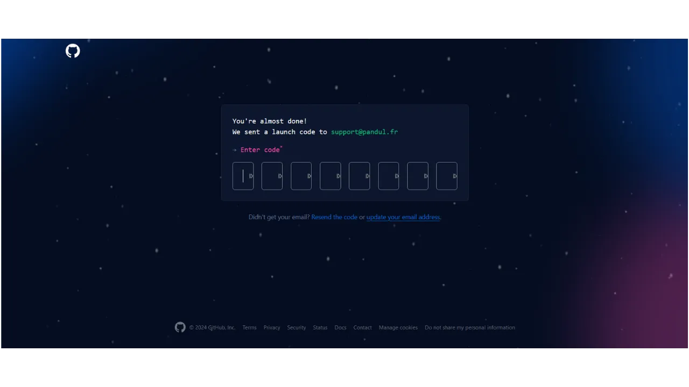
GitHubが特定のツールへのガイドを提供することを望む場合は質問に回答するか、`skip personalization`をクリックしてスキップしてください。

`Continue for free`ボタンをクリックして無料プランを選択します。
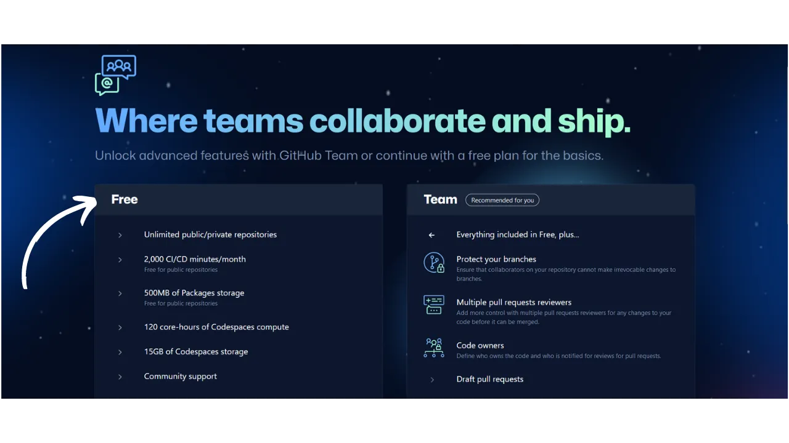
その後、ダッシュボードにリダイレクトされます。希望する場合は、画面右上にあるプロフィール写真をクリックし、`Settings`メニューにアクセスすることでアカウントをカスタマイズできます。

このセクションでは、新しいプロフィール写真を追加したり、名前を選択したり、伝記をカスタマイズしたり、個人のウェブサイトへのリンクを追加したりするオプションがあります。
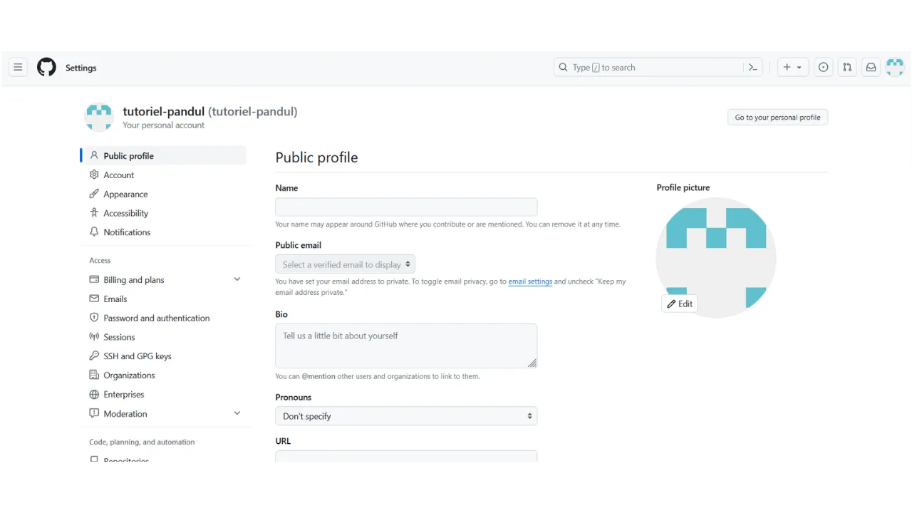
また、`Password and authentication`メニューを確認し、二要素認証を設定することをお勧めします。
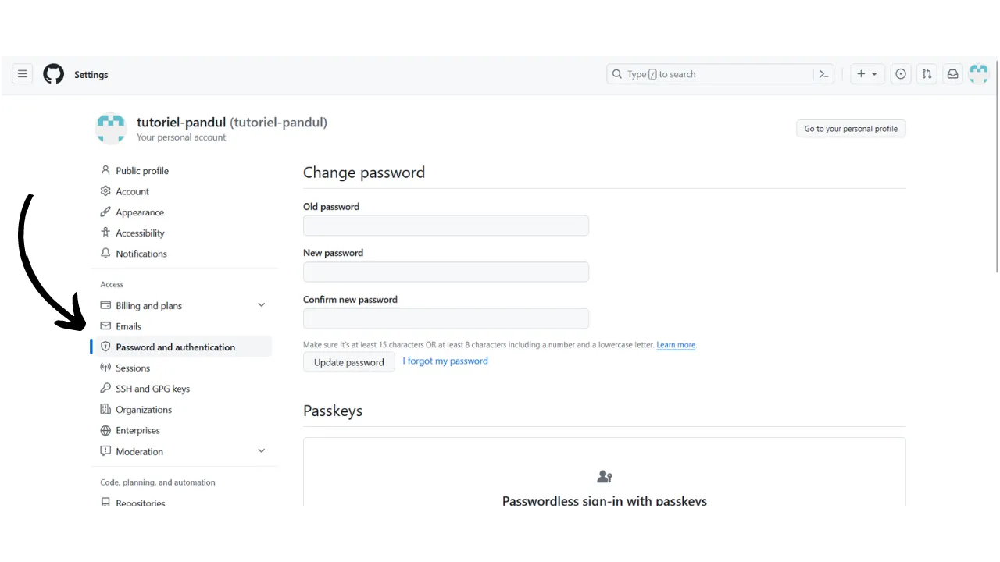

## ステップ2: GitHub Desktopのインストール
GitHub Desktopソフトウェアをダウンロードするには、https://desktop.github.com/ にアクセスしてください。このソフトウェアを使用すると、ターミナルを使用せずにGitHubと簡単にやり取りできます。

ソフトウェアを初めて起動すると、GitHubアカウントに接続するよう求められます。これを行うには、`Sign in to GitHub.com`をクリックしてください。

ブラウザで認証ページが開きます。前のステップで選択したメールアドレスとパスワードを入力し、`Sign in`ボタンをクリックしてください。

`Authorize desktop`をクリックして、アカウントとソフトウェア間の接続を確認してください。
GitHub Desktopソフトウェアに自動的にリダイレクトされます。`Finish`をクリックしてください。

GitHubアカウントを作成したばかりの場合、リポジトリをまだ作成していないことを示すページにリダイレクトされます。この段階では、GitHub Desktopソフトウェアを一旦脇に置いて、後ほど戻ります。

## ステップ3: Obsidianのインストール
次に、執筆ソフトウェアのインストールに移りましょう。ここでは、いくつかの選択肢があります。Markdownファイルの編集に特化したソフトウェアが多数あります。例えば、執筆用に特別に設計されたTyporaなどです。理想的ではありませんが、Visual Studio Code (VSC) や Sublime Textのようなコードエディタを選択することも可能です。しかし、私としては、執筆者としてObsidianソフトウェアの使用を好みます。インストール方法と使い始め方を見ていきましょう。
https://obsidian.md/download にアクセスし、ソフトウェアをダウンロードしてください。インストールし、言語を選択した後、`Quick Start`をクリックしてください。

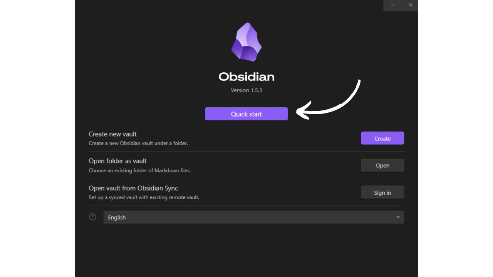

Obsidianソフトウェアに到着します。現時点では、開いているファイルはありません。

## ステップ4: PlanB Networkリポジトリのフォーク
次のアドレスにあるPlanB Networkデータリポジトリにアクセスしてください: [https://github.com/DecouvreBitcoin/sovereign-university-data](https://github.com/DecouvreBitcoin/sovereign-university-data)。GitHubアカウントにログインしていない場合は、再度ログインしてください。

このページから、ウィンドウの右上にある`Fork`ボタンをクリックしてください。

作成メニューでは、デフォルト設定のままにしておいて大丈夫です。`Copy the dev branch only`ボックスがチェックされていることを確認し、`Create fork`ボタンをクリックしてください。

そうすると、PlanB Networkリポジトリの自分のフォークに到着します。

このフォークは、現在同じデータを含んでいるものの、元のリポジトリからは別のリポジトリとなります。これからは、この新しいリポジトリで作業を進めます。

## ステップ5: リポジトリのクローン
GitHub Desktopソフトウェアに戻ります。この時点で、`Your repositories`セクションにフォークが表示されるはずです。すぐに表示されない場合は、二重矢印ボタンを使用してリストを更新してください。フォークが表示されたら、それをクリックして選択します。

次に、青いボタン`Clone [username]/sovereign-university-data`をクリックします。

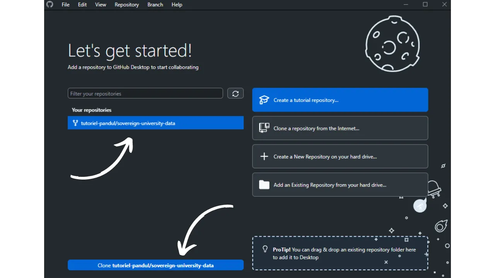

その後、リポジトリのクローンをコンピュータ上で保存するローカルアクセスパスを変更するオプションがあります。デフォルトパスをそのまま使用しても構いません。確認するには、青い`Clone`ボタンをクリックしてください。

GitHub Desktopがローカルにフォークをクローンするのを待ちます。

リポジトリをクローンした後、ソフトウェアは2つのオプションを提供します。最初のオプション「To contribute to the parent project」を選択する必要があります。この選択により、将来の作業を親プロジェクト（`DecouvreBitcoin/sovereign-university-data`）への貢献として、個人のフォーク（`[username]/sovereign-university-data`）の修正としてではなく、提示することができます。オプションを選択したら、`Continue`をクリックしてください。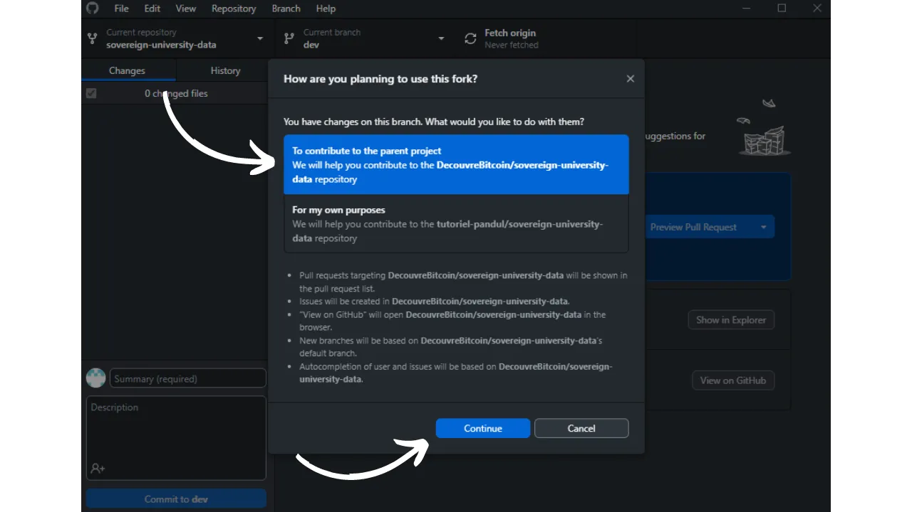

これで、GitHub Desktopは正しく設定されました。これから、私たちが行う変更を追跡するために、ソフトウェアをバックグラウンドで開いたままにしておくことができます。

## ステップ6: 新しいObsidianの保管庫を作成する
Obsidianソフトウェアを開き、ウィンドウの左下にある小さな保管庫アイコンをクリックします。

`Open`ボタンをクリックして、既存のフォルダを保管庫として開きます。

ファイルエクスプローラーが開きます。`Documents`ディレクトリ内のファイルの中から、`GitHub`というタイトルのフォルダを探して選択する必要があります。このパスは、ステップ5で設定したものに対応しています。フォルダを選択した後、その選択を確認します。そうすると、ソフトウェアの新しいページでObsidian上の保管庫の作成が開始されます。

-> **注意**、Obsidianで新しい保管庫を作成する際には、`sovereign-university-data`フォルダを選択しないことが重要です。代わりに、親フォルダである`GitHub`を選択してください。`sovereign-university-data`フォルダを選択すると、ローカルのObsidian設定を含む設定フォルダ`.obsidian`が自動的にリポジトリに統合されてしまいます。これを避けたいのは、Obsidianの設定をPlanB Networkのリポジトリに転送する必要がないからです。代替案として、`.obsidian`フォルダを`.gitignore`ファイルに追加する方法がありますが、この方法も元のリポジトリの`.gitignore`ファイルを変更することになり、望ましくありません。

ウィンドウの左側には、ローカルにクローンされた異なるGitHubリポジトリのファイルツリーが表示されます。フォルダ名の隣にある矢印をクリックすると、リポジトリのサブフォルダとそのドキュメントにアクセスするためにそれらを展開することができます。

Obsidianをダークモードに設定することを忘れないでください: "*光は虫を引き寄せる*";)

## ステップ7: コードエディタをインストールする
変更を加えるファイルのほとんどはMarkdown形式（`.md`）です。これらのドキュメントを編集するには、先ほど話したObsidianソフトウェアを使用できます。しかし、PlanB Networkは他のファイル形式も使用しており、そのいくつかを変更する必要があります。
例えば、新しいチュートリアルを作成する際には、チュートリアルのタグ、タイトル、および教師識別子を含むYAML（`.yml`）ファイルを作成する必要があります。Obsidianはこのタイプのファイルを変更する機能を提供していないため、コードエディタが必要になります。
このためには、いくつかのオプションがあります。コンピュータの標準ノートパッドを使用してこれらの変更を行うこともできますが、この解決策はきれいな作業には理想的ではありません。私は、この目的のために特別に設計されたソフトウェア、例えば[VS Code](https://code.visualstudio.com/download)や[Sublime Text](https://www.sublimetext.com/download)を選択することをお勧めします。特に軽量なSublime Textは、私たちのニーズに十分すぎるほどです。

これらのプログラムのいずれかをインストールし、後で使うために取っておいてください。
## ステップ8: 新しい教師を追加する（オプション）
以前にPlanB Networkに貢献したことがある場合は、既に貢献者識別子を持っています。これは、[このページ](https://github.com/DecouvreBitcoin/sovereign-university-data/tree/dev/professors)経由でアクセス可能なあなたの教師フォルダーで見つけることができます。その場合、このステップをスキップしてステップ9に直接進むことができます。

まだPlanB Networkに貢献していない場合は、将来のチュートリアルに名前が表示されるようにプロファイルを作成する必要があります。これを行うために、まず教師プロファイルを追加するために専用の新しいブランチを作成することから始めます。Gitのブランチはプロジェクトの並行バージョンであり、作業がマージされる準備ができるまで、メインブランチに影響を与えることなく変更を加えることができます。

新しいブランチを作成する前に、変更をマージする際の競合のリスクを減らすために、プロジェクトの最新バージョンで作業していることを確認することが重要です。これを行うには、ブラウザを開いて、ステップ4でGitHubに設定したPlanBリポジトリのフォークのページに移動します。フォークのURLは次のようになります：

`https://github.com/[username]/sovereign-university-data`

メインブランチ`dev`にいることを確認し、その後`Sync fork`ボタンをクリックします。フォークが最新ではない場合、GitHubはブランチを更新するよう提案します。この同期を進めてください。逆に、ブランチが既に最新の場合、GitHubはその旨を通知します。

GitHub上のフォークがPlanB Networkのソースリポジトリと同期されたので、次にコンピュータ上のローカルリポジトリを更新する時が来ました。GitHub Desktopソフトウェアを開き、フォークがウィンドウの左上隅で正しく選択されていることを確認します。
`Fetch origin`ボタンをクリックします。ローカルリポジトリが既に最新の場合、GitHub Desktopはこれ以上のアクションを提案しません。そうでない場合は、`Pull origin`オプションが表示されます。このボタンをクリックしてローカルリポジトリを更新します。

最新の貢献とリポジトリを同期した後、新しい作業ブランチを作成する準備が整いました。GitHub Desktopを使用している間、メインブランチ`dev`にいることを確認してください。

このブランチをクリックし、その後`New Branch`ボタンをクリックします。

新しいブランチがソースリポジトリ、つまり`DecouvreBitcoin/sovereign-university-data`に基づいていることを確認してください。ブランチのタイトルがその目的について明確であるように、各単語を区切るためにダッシュを使用して名前を付けます。このブランチが教授プロファイルを追加することを目的としている場合、例の名前は次のようになります：`add-professor-[your-name]`。名前を入力した後、`Create branch`をクリックしてその作成を確認します。

次に、`Publish branch`ボタンをクリックして、新しい作業ブランチをGitHub上のオンラインフォークに保存します。

この時点で、GitHub Desktop上では新しいブランチにいるはずです。これは、コンピュータ上でローカルに行われたすべての変更が、この特定のブランチ（`add-professor-your-name`）にのみ記録されることを意味します。また、このブランチがGitHub Desktop上で選択されたままである限り、ローカルマシン上で見えるファイルはこのブランチのもの（`add-professor-your-name`）であり、メインブランチ（`dev`）のものではありません。

教授プロファイルを追加するには、ファイルエクスプローラーを開いてローカルリポジトリの`professors`フォルダーに移動します。これは、`\GitHub\sovereign-university-data\professors`のパスの下にあります。
このフォルダ内に、あなたの名前または偽名で新しいフォルダを作成してください。フォルダ名に空白がないようにしてください。したがって、あなたの名前が「Loic Pandul」で他にその名前の教授がいない場合、作成するフォルダは`loic-pandul`と命名されます。
作業を簡単にするために、他の教授のフォルダからすべてのドキュメントをあなたのフォルダにコピー＆ペーストすることができます。その後、これらのドキュメントを修正して、あなたのプロファイルに合わせてカスタマイズします。
まず、`assets`フォルダに移動します。以前にコピーした教授のプロフィール写真を削除し、あなた自身のプロフィール写真に置き換えてください。この画像は`.webp`形式であり、`profile`という名前であることが必須です。これにより、完全なファイル名は`profile.webp`となります。この画像はインターネット上に公開され、誰でもアクセスできることに注意してください。
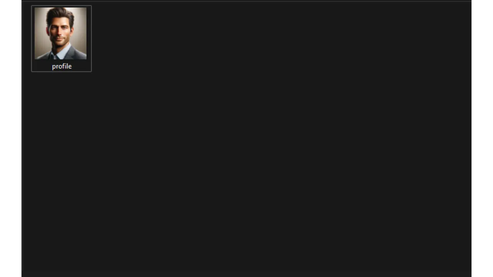

次に、コードエディタ（VSCまたはSublime Text）で`professor.yml`ファイルを開きます。既存の教授からコピーしたファイルが表示されます。

その後、既存の情報をあなた自身のものに更新する必要があります：
- **name:** あなたの名前または偽名を入力してください；
- **links:** TwitterやNostrのようなソーシャルネットワーク上のあなたのアカウント、およびあなたの個人ウェブサイトのURLを示してください（任意）；
- **affiliation:** あなたを雇用している会社の名前を記載してください（任意）；
- **tags:** 以下のリストからあなたの専門分野を指定してください。ただし、UIが良好であることを確保するために、タグの数を最大4つまでに制限してください：
	- privacy,
	- cryptography,
	- bitcoin,
	- mining,
	- lightning-network,
	- economy,
	- history,
	- merchants,
	- security,
	- ...
- **tips:** あなたの将来のチュートリアルの読者があなたにいくつかのsatsを送ることができるように、あなたのLightningアドレスを提供してください（任意）；
- **company:** もしあなたが会社を所有している場合は、あなたの会社の名前を示してください（任意）。

また、`contributor-id`を変更する必要があります。この識別子はウェブサイト上であなたを認識するために使用されますが、GitHubの外部には公開されません。BIP39からの2048語の英語リストを参照して、任意の2つの単語の組み合わせを自由に選択できます。ここにアクセスしてください：[https://github.com/bitcoin/bips/blob/master/bip-0039/english.txt](https://github.com/bitcoin/bips/blob/master/bip-0039/english.txt)。選択した2つの単語の間にダッシュを挿入することを忘れないでください。例えば、ここでは`crazy-cactus`を選びました。

`professor.yml`ドキュメントの修正が完了したら、`File > Save`をクリックしてファイルを保存します。その後、コードエディタを終了できます。

あなたの伝記を書く作業に進む時が来ました。あなたの教師ファイル内で、あなたに関係のない言語で書かれたドキュメントを削除できます。これらは最初に別の教師からコピーされたものです。あなたの母国語に対応するファイルのみを保持してください。例えば、私の場合は、私の言語がフランス語であるため、`fr.yml`ファイルのみを保持しました。

このファイルをダブルクリックして、コードエディタで開きます。このファイルでは、`bio`セクションの下にあなたの完全な伝記を書く機会があります。また、`short_bio`の下には要約または簡潔なタイトルを書くことができます。

`fr.yml`ドキュメントを保存した後、以下の6つの言語それぞれに対してこのファイルのコピーを作成する必要があります：
- ドイツ語（DE）;
- 英語（EN）;
- フランス語（FR）;
- スペイン語（ES）;
- イタリア語（IT）;
- ポルトガル語（PT）。

元のファイルをコピー＆ペーストし、それぞれのドキュメントを対応する言語に翻訳してください。その言語に熟達している場合は、手動で翻訳を行うことができます。そうでない場合は、自動翻訳ツールやチャットボットを自由に使用してください。もし好ましいなら、自分の母国語での伝記のみを保持することも可能です。その場合、プルリクエストの提出後に翻訳を行います。

このように、あなたの教師フォルダは次のようになるはずです：

次に、GitHub Desktopに戻ります。ウィンドウの左側で、あなたのブランチに特有のドキュメントの変更をすべて確認できるはずです。これらの変更が確かに正しいことを確認してください。

変更が正しいと思われる場合は、コミットのタイトルを追加してください。コミットとは、ブランチに行われた変更を保存し、プロジェクトの進化を時間とともに追跡するための説明的なメッセージを伴うものです。タイトルを入力したら、青い`Commit to [your branch]`ボタンを押してこれらの変更を確定します。

その後、`Push origin`ボタンをクリックします。これにより、あなたのコミットがフォークに送信されます。

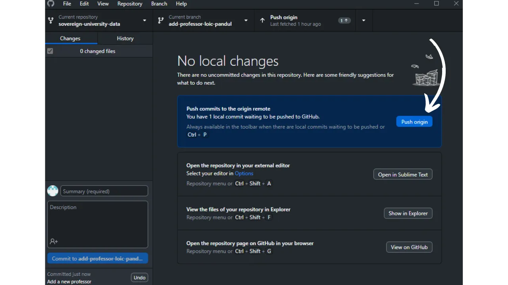

このブランチの変更が完了した場合は、`Preview Pull Request`ボタンを今すぐクリックしてください。

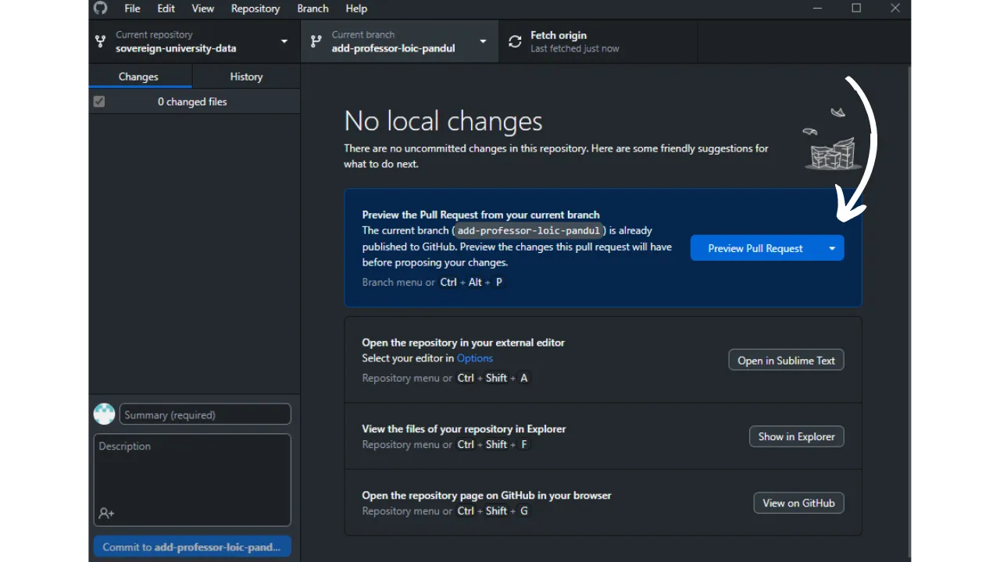

変更が確かに正しいことを最後に確認した後、`Create pull request`ボタンをクリックしてください。

プルリクエストを作成するための準備ページに自動的にリダイレクトされます。プルリクエストとは、PlanB Networkリポジトリのメインブランチにあなたのブランチの変更を統合するためのリクエストであり、変更のレビューと議論を行う前にマージを許可します。

この準備ページで、ソースリポジトリとマージしたい変更を簡潔に要約するタイトルを指定します。これらの変更を説明する簡単なコメントを追加します。これらの手順を完了したら、緑色の`Create pull request`ボタンをクリックしてマージリクエストを確認します。
あなたのPRは、PlanB Networkのメインリポジトリの`Pull Request`タブに表示されます。あとは、管理者があなたに連絡して、あなたの貢献のマージを確認するか、追加の変更を要求するまで待つだけです。

メインブランチとあなたのPRをマージした後、フォークの履歴をクリーンに保つために作業ブランチ（`add-professor-your-name`）を削除することをお勧めします。GitHubはあなたのPRページで自動的にこのオプションを提供します：

GitHub Desktopソフトウェアで、フォークのメインブランチ（`dev`）に戻ることができます。

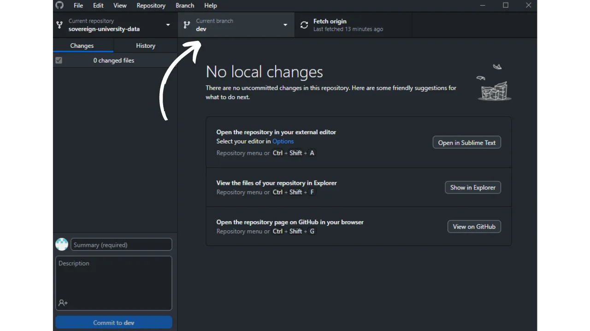

すでにPRを提出した後で貢献に変更を加えたい場合、フォローする手順はあなたのPRの現在の状態に依存します：
- あなたのPRがまだオープンであり、まだマージされていない場合は、同じブランチにとどまりながらローカルで変更を行います。変更が完了したら、`Push origin`ボタンを使用して、まだオープンなPRに新しいコミットを追加します。
あなたのPRが既にメインブランチにマージされている場合は、新しいブランチを作成し、新しいPRを提出することからプロセスを始める必要があります。PlanB Networkのソースリポジトリとローカルリポジトリが同期していることを確認してから進めてください。
## ステップ9: 新しいチュートリアルの追加
おめでとうございます、すべての準備ステップを完了しました！これで、PlanB Networkに貢献する準備が整いました。これからは、公開したい新しい記事ごとに、`dev`から新しいブランチを作成する必要があります。Gitのブランチはプロジェクトの並行バージョンであり、メインブランチに影響を与えることなく変更を加えることができます。作業がマージの準備が整うまでです。

新しいブランチを作成する前に、プロジェクトの最新バージョンで作業していることを確認し、変更をマージする際のコンフリクトのリスクを減らすことが重要です。これを行うには、ブラウザを開いて、ステップ4でGitHubに設定したPlanBリポジトリのフォークのページに移動します。フォークのURLは次のようになります：`https://github.com/[your-username]/sovereign-university-data`。

メインブランチ`dev`にいることを確認し、`Sync fork`ボタンをクリックします。フォークが最新でない場合、GitHubはブランチを更新するよう提案します。この更新を進めてください。逆に、ブランチが既に最新の場合、GitHubはあなたに知らせます。
GitHub上のフォークがPlanB Networkのソースリポジトリと同期されたので、次にコンピュータ上のローカルリポジトリを更新する時が来ました。GitHub Desktopソフトウェアを開き、フォークがウィンドウの左上隅で正しく選択されていることを確認します。

`Fetch origin`ボタンをクリックします。ローカルリポジトリが既に最新の場合、GitHub Desktopはこれ以上のアクションを提案しません。そうでない場合は、`Pull origin`オプションが表示されます。このボタンをクリックして、ローカルリポジトリを更新します。

最新の貢献とリポジトリを同期した後、新しい作業ブランチを作成する準備が整いました。GitHub Desktopから、確かにメインブランチ`dev`にいることを確認します。

このブランチをクリックし、次に`New Branch`ボタンをクリックします。

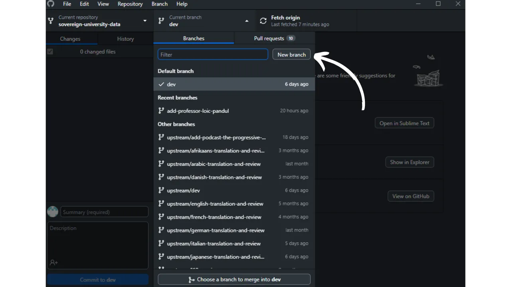

新しいブランチがソースリポジトリ、つまり`DecouvreBitcoin/sovereign-university-data`に基づいていることを確認します。目的が明確になるように、各単語をダッシュで区切ってブランチに名前を付けます。例えば、Sparrow Walletソフトウェアの使用に関するチュートリアルを書くことが目標だとしましょう。この場合、このチュートリアルの執筆に専念する作業ブランチは、`tuto-sparrow-wallet-loic`と名付けることができます。適切な名前を入力したら、`Create branch`をクリックしてブランチの作成を確認します。

次に、`Publish branch`ボタンをクリックして、新しい作業ブランチをGitHub上のオンラインフォークに保存します。

この時点で、GitHub Desktop上で新しいブランチにいるはずです。これは、コンピューター上でローカルに行われたすべての変更が、この特定のブランチ上でのみ記録されることを意味します。また、このブランチがGitHub Desktop上で選択されている限り、マシン上でローカルに表示されるファイルは、このブランチ（`tuto-sparrow-wallet-loic`）のものであり、メインブランチ（`dev`）のものではありません。
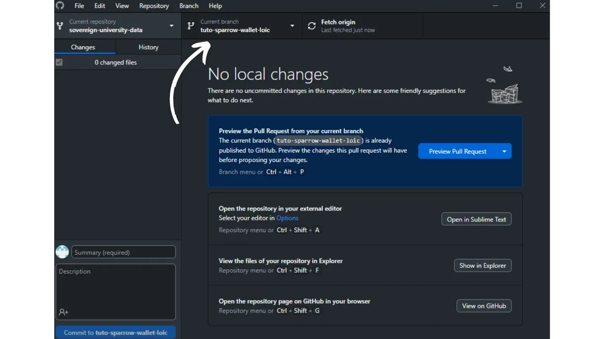
作業ブランチが作成された今、新しいチュートリアルを統合する時が来ました。これを行うには、ファイルマネージャーを開き、リポジトリのローカルクローンを表す`sovereign-university-data`フォルダーに移動します。通常、`Documents\GitHub\sovereign-university-data`の下に見つかるはずです。このディレクトリ内で、チュートリアルを配置する適切なサブフォルダーを見つける必要があります。フォルダーの構成は、PlanB Networkウェブサイトの異なるセクションを反映しています。私たちの例では、Sparrow Walletに関するチュートリアルを追加したいので、次のパスに進むのが適切です：`sovereign-university-data\tutorials\wallet` これは、ウェブサイト上の`WALLET`セクションに対応しています。
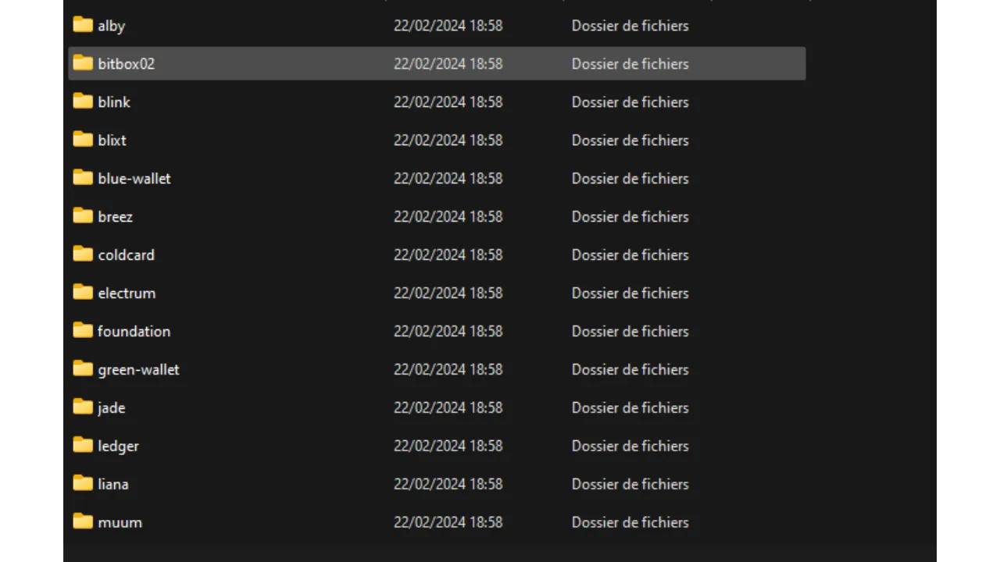

`wallet`フォルダー内で、チュートリアル専用の新しいディレクトリを作成する必要があります。このフォルダーの名前は、チュートリアルで取り上げられるソフトウェアを連想させ、単語をダッシュでつなぐようにしてください。私の例では、フォルダーは`sparrow-wallet`というタイトルになります。

チュートリアル専用のこの新しいフォルダーでは、さまざまな要素を準備することが適切です：
- チュートリアルに必要なすべてのイラストを受け取るための`assets`フォルダーを作成します；
	- この`assets`フォルダー内には、視覚資料を対応する言語に分類するために、`fr`、`de`、`en`、`it`、`es`、`pt`という名前の6つのサブフォルダーを作成する必要があります。
- チュートリアルに関連する詳細を記録するための`tutorial.yml`ファイルを作成する必要があります；
- 実際のチュートリアルの内容を書くためのマークダウン形式のファイルを作成する必要があります。このファイルは、執筆の言語コードに従ってタイトルを付ける必要があります。例えば、フランス語で書かれたチュートリアルの場合、ファイルは`fr.md`と呼ばれる必要があります。

フォルダーの構成は次のようになります：

始めるには、コードエディターを使用して`tutorial.yml`ファイルを開きます。以下に指定された情報でそれを埋めてください：
- **builder**: チュートリアルのタイトルを入力してください。これは、提示する内容を正確かつ想起させるものでなければなりません；
- **tags**: 記事の主題に密接に関連する一連のキーワードを決定し、その検索と索引付けを容易にします；
- **category**: チュートリアルの内容に基づいて、PlanBサイトで利用可能なサブカテゴリーの中から適切なものを選択してください。例えば、`WALLET`セクションに関連するチュートリアルの場合、利用可能なオプションは`Desktop`、`Hardware`、`Mobile`です；
- **level**: チュートリアルの難易度レベルを、以下の四つのカテゴリーの中から選択して示してください：
	- 初心者（`beginner`）、
	- 中級者（`intermediary`）、
	- 上級者（`advanced`）、
	- 専門家（`expert`）。- **professor**: 教授プロファイルに表示されるように、あなたの貢献者IDを入力してください。詳細については、この記事のステップ8を参照してください；
- **link**（オプション）：開発中のチュートリアルにクレジットを与えたいソースウェブサイト、例えばあなた自身の個人サイトがある場合、ここに関連するリンクを追加できます。
`tutorial.yml`ファイルの編集が完了したら、`File > Save`をクリックしてドキュメントを保存してください。これでコードエディターを閉じることができます。

`assets`フォルダ内に、`logo.webp`という名前のファイルを追加する必要があります。この画像は、チュートリアルのサムネイルとして機能します。`.webp`形式である必要があり、ユーザーインターフェースに合わせて正方形の寸法であるべきです。チュートリアルで取り上げられているソフトウェアのロゴ、または関連する他の画像を自由に選択できますが、権利の制約がないものである必要があります。

さらに、同じ場所に`cover.jpeg`というタイトルの画像も追加してください。この画像は、チュートリアルのトップに表示されます。この画像もロゴと同様に、使用権を尊重し、チュートリアルのコンテキストに適していることを確認してください。

`assets`フォルダ内にある言語サブフォルダは、チュートリアルを伴う図表やビジュアルを整理するために使用されます。画像にテキストが含まれている場合は、対象となる各言語について翻訳を検討し、コンテンツを国際的な観客にアクセスしやすくしてください。

**-> ヒント:** 画像などのファイルを公開する際には、位置データ、作成日、著者に関する詳細など、機密情報を含むことがある余分なメタデータを削除することが重要です。プライバシーを保護するために、このメタデータを削除することをお勧めします。この操作を簡素化するために、[Exif Cleaner](https://exifcleaner.com/)のような専門ツールを使用すると、ドキュメントのメタデータをドラッグアンドドロップで簡単にクリーニングできます。

これで、チュートリアルをホストするファイルを開くことができます。言語のコードで名付けられたファイル、例えば`en.md`です。Obsidianで、ウィンドウの左側にあるフォルダツリーをスクロールして、チュートリアルのフォルダと探しているファイルに到達します。

ファイルをクリックして開きます。

ドキュメントの上部にある`Properties`セクションを記入することから始めます。このセクションがファイルから欠落している場合（ドキュメントが完全に空白の場合）、別の既存のチュートリアルからコピーして再現することができます。

または、このようにコードエディタを使用して手動で追加することもできます：

チュートリアルの名前と短い説明を記入してください。

その後、チュートリアルの始めにカバー画像を追加します。これを行うには、次のように入力します：

``

この構文は、チュートリアルに画像を追加する必要がある場合にいつでも役立ちます。感嘆符は画像であることを示し、代替テキスト（alt）は括弧の間に指定されます。画像へのパスは括弧の間に示されます。

チュートリアルを書き続ける際に、サブタイトルを統合したい場合は、テキストの前に`##`を付けて適切なマークダウンフォーマットを適用します。

チュートリアルにビジュアル要素を追加する際には、コンテンツの言語に対応するパスを選択してください。例えば：

``
ビジュアルにテキストが含まれている場合（例えば、図表など）、ドイツ語、英語、フランス語、イタリア語、スペイン語、ポルトガル語の6つの提案された言語に翻訳し、各翻訳バージョンを`assets`フォルダ内の専用言語サブフォルダに配置することをお勧めします。画像は、チュートリアル内の出現順に従って連番で番号付けする必要があります。したがって、最初のビジュアルは`1.webp`、2番目は`2.webp`という名前になり、以降も同様です。`jpeg`、`png`、`webp`など、異なる画像フォーマットを使用することができます。

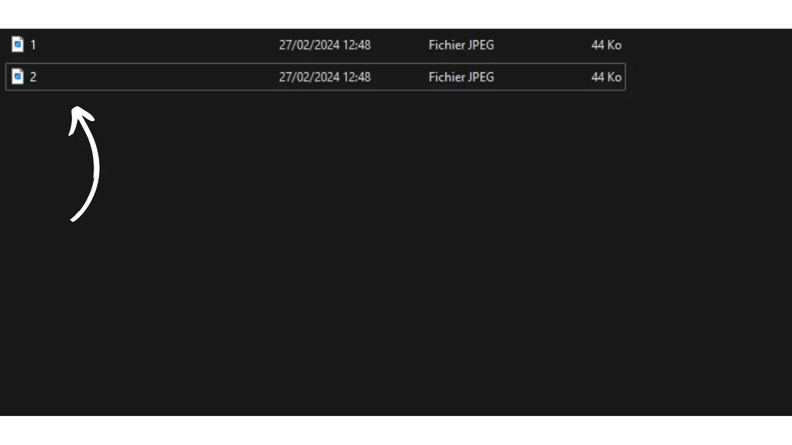

選択した言語でチュートリアルの執筆を終えたら、次のステップはプルリクエストを提出することです。管理者が自動翻訳方法を利用して、チュートリアルの残りの5つの翻訳を追加します。プルリクエストを進めるには、GitHub Desktopソフトウェアを開きます。これにより、元のリポジトリと比較してローカルで行った変更が自動的に検出されます。続行する前に、インターフェースの左側でこれらの変更が期待したものと正確に一致するかを慎重に確認してください。

変更が正しいと思われる場合は、コミットのタイトルを追加してください。コミットとは、ブランチへの変更の保存であり、プロジェクトの経過を追跡するための説明的なメッセージが付随します。タイトルを入力したら、これらの変更を確定するために青色の`Commit to [your branch]`ボタンを押してください。

次に、`Push origin`ボタンをクリックします。これにより、コミットがフォークに送信されます。

このブランチの編集が完了したら、`Preview Pull Request`ボタンを今すぐクリックしてください。
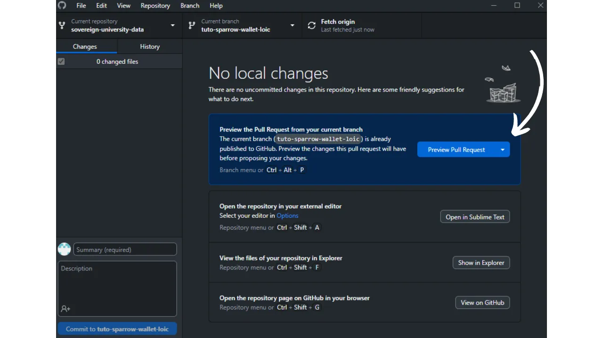

最後にもう一度、修正が正しいことを確認したら、`Create pull request`ボタンをクリックしてください。

プルリクエストの準備ページに自動的にブラウザでGitHubにリダイレクトされます。プルリクエストとは、PlanB Networkリポジトリのメインブランチに対して、ブランチからの変更を統合するためのリクエストであり、マージ前に変更のレビューと議論を可能にします。

この準備ページで、ソースリポジトリとマージしたい修正を簡潔に要約するタイトルを指定します。これらの変更を説明する簡単なコメントを追加します。これらのステップを完了したら、マージリクエストを確認するために緑色の`Create pull request`ボタンをクリックしてください。

あなたのPRは、PlanB Networkのメインリポジトリの`Pull Request`タブに表示されます。あとは、管理者があなたに連絡して、あなたの貢献のマージを確認するか、追加の修正を要求するまで待つだけです。

PRがメインブランチとマージされた後、フォーク上の履歴をクリーンに保つために作業ブランチ（`tuto-sparrow-wallet`）を削除することをお勧めします。GitHubは、PRのページでこのオプションを自動的に提供します：

GitHub Desktopソフトウェアで、フォークのメインブランチ（`dev`）に戻ることができます。

既にPRを提出した後で、貢献に対する修正を行いたい場合、フォローする手順はPRの現在の状態に依存します：
- PRがまだオープンであり、まだマージされていない場合は、同じブランチにとどまりながらローカルで修正を行います。修正が完了したら、`Push origin`ボタンを使用して、まだオープンなPRに新しいコミットを追加します。
あなたのPRが既にメインブランチにマージされている場合、新しいブランチを作成し、新しいPRを提出することからプロセスを始める必要があります。進める前に、ローカルリポジトリがPlanB Networkのソースリポジトリと同期していることを確認してください。