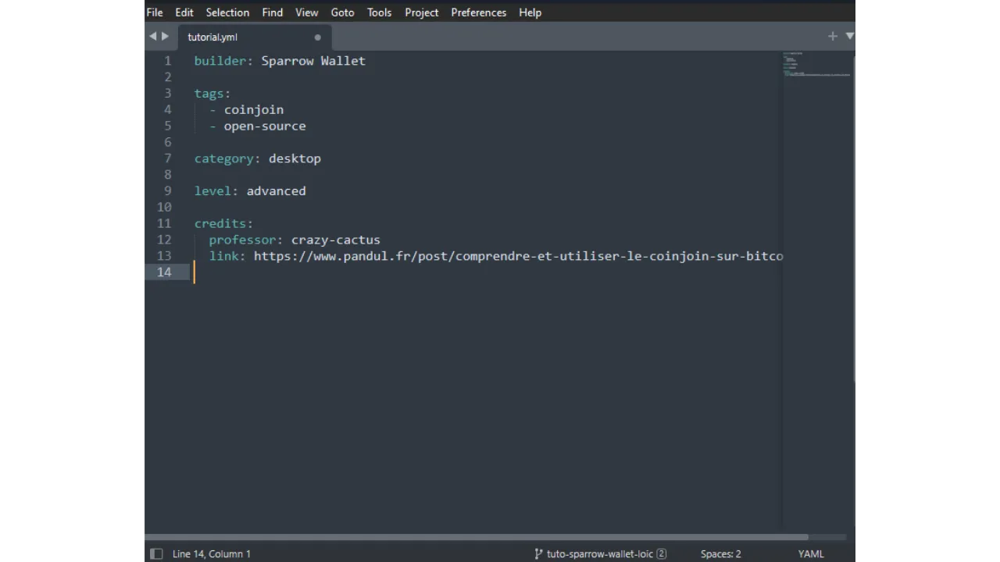

A missão da PlanB é fornecer recursos educacionais de primeira linha sobre Bitcoin, em tantos idiomas quanto possível. Todo o conteúdo publicado no site é de código aberto e hospedado no GitHub, oferecendo assim a qualquer pessoa a oportunidade de participar no enriquecimento da plataforma. As contribuições podem assumir várias formas: corrigir e revisar textos existentes, traduzir para outros idiomas, atualizar informações ou criar novos tutoriais ainda não disponíveis em nosso site.

Se você deseja contribuir para a Rede PlanB, mas não se sente confortável usando o GitHub, este tutorial é especialmente para você. Detalharemos como contribuir para a Rede PlanB via GitHub, enquanto usamos o Obsidian, uma ferramenta projetada para facilitar a escrita.

Você verá que configurar todo o processo de trabalho é bastante longo, especialmente se você nunca usou o GitHub antes. No entanto, o uso do Git torna a colaboração na escrita de conteúdo mais fácil, pois permite um rastreamento preciso das alterações, gerenciamento eficiente de versões e também possibilita a revisão e melhoria do conteúdo por outros colaboradores. Além disso, uma vez que o processo de trabalho esteja configurado em seu PC, você descobrirá que o Git facilita muito seu trabalho. Você pode até sair com o desejo de usar o Git para seus outros projetos pessoais, porque este software é tão eficaz.

## Glossário Git
- **Fetch origin:** Comando que recupera informações e alterações recentes de um repositório remoto sem mesclá-las com seu trabalho local.
- **Pull origin:** Comando que busca atualizações de um repositório remoto e as integra imediatamente à sua ramificação local para sincronizá-la.
- **Sync Fork:** Comando no GitHub que atualiza seu fork de um projeto com as últimas alterações do repositório fonte.
- **Push origin:** Comando usado para enviar suas modificações locais para um repositório remoto.
- **Pull Request:** Um pedido enviado por um colaborador para indicar que eles enviaram modificações em uma ramificação em um repositório remoto e desejam que essas modificações sejam revisadas e potencialmente integradas (mescladas) na ramificação principal do repositório.
- **Commit:** Salvar suas modificações. Um commit é como um instantâneo instantâneo do seu trabalho em um determinado momento, o que ajuda a manter um histórico de alterações.
- **Branch:** Uma versão paralela do repositório, permitindo trabalhar em modificações sem afetar a ramificação principal (chamada "`dev`" no repositório PlanB).
- **Merge:** Mesclar consiste em integrar as modificações de uma ramificação em outra. É usado, por exemplo, para adicionar as modificações de uma ramificação de trabalho à ramificação principal.
- **Fork:** Fazer um fork de um repositório significa criar uma cópia desse repositório em sua própria conta do GitHub, permitindo que você trabalhe no projeto sem afetar o repositório original.
- **Clone:** Clonar um repositório significa fazer uma cópia local em seu computador, dando acesso a todos os arquivos e ao histórico de modificações.

- **Repository:** Um espaço de armazenamento para um projeto no GitHub. Contém todos os arquivos do projeto, bem como o histórico de todas as modificações que foram feitas.

## Que tipo de conteúdo escrever na Rede PlanB?
Estamos principalmente à procura de tutoriais sobre ferramentas relacionadas ao Bitcoin ou seu ecossistema. Esses conteúdos podem ser estruturados em torno de seis categorias principais:
- Carteira;
- Nó;
- Mineração;
- Comerciante;
- Exchange;
- Privacidade.

Além desses tópicos especificamente relacionados ao Bitcoin, a PlanB também está procurando contribuições em temas que destacam a soberania individual, como:
- Ferramentas de código aberto;
- Computação;
- Criptografia;
- Energia;
- Matemática;
- Economia;
- Faça você mesmo (DIY);
- LifeHacking...
Por exemplo, atualmente temos tutoriais sobre Tails, Nostr ou GrapheneOS. Essas ferramentas não estão diretamente relacionadas ao Bitcoin, mas são sistemas que podem nos interessar em uma abordagem de soberania no mundo digital, ou em aprender a alcançá-la. Esses conteúdos podem ser integrados em uma subcategoria da seção "Outros".
Você tem a escolha entre projetar um tutorial do zero ou republicar um tutorial previamente publicado em seu site (desde que você possua os direitos autorais) para também compartilhá-lo na Rede PlanB, adicionando um link para o artigo original.

Independentemente da sua escolha, tenha em mente que todo o conteúdo publicado na Rede PlanB está sob a licença livre [CC-BY-SA](https://creativecommons.org/licenses/by-sa/4.0/). Esta licença permite que qualquer pessoa copie e, potencialmente, modifique seu conteúdo, desde que a fonte original seja devidamente creditada.

## Processo de Contribuição
Para adicionar um tutorial ao site da Rede PlanB, você precisa fazer um Pull Request no repositório do GitHub atualmente nomeado [sovereign-university-data](https://github.com/DecouvreBitcoin/sovereign-university-data). Sua contribuição deve estar de acordo com a estrutura padrão e incluir todos os arquivos necessários. É exatamente isso que detalharemos nas partes seguintes.

Em seguida, um administrador revisará seu tutorial. Se ajustes forem necessários, eles irão informá-lo para que as modificações possam ser feitas. Uma vez aprovado, o tutorial será integrado ao repositório.

## Passo 1: Criando uma Conta no GitHub
Se você ainda não se inscreveu no GitHub, precisará criar uma conta. Para fazer isso, acesse [https://github.com/signup](https://github.com/signup). Insira seu endereço de e-mail, depois escolha uma senha forte. 
Em seguida, escolha seu nome de usuário. Você tem a opção de revelar sua verdadeira identidade ou preferir o uso de um pseudônimo. Clique em `Continue` e complete o Captcha. Um e-mail contendo um código de confirmação será enviado a você; você precisará inseri-lo para finalizar a criação de sua conta.

Preencha as perguntas se você quiser que o GitHub o guie em direção a certas ferramentas, ou clique em `skip personalization` para pular.

Escolha o plano gratuito clicando no botão `Continue for free`.

Você será então redirecionado para o seu painel de controle. Se desejar, você pode personalizar sua conta clicando na sua foto de perfil localizada no canto superior direito da tela, e então acessando o menu `Settings`.

Nesta seção, você tem a opção de adicionar uma nova foto de perfil, selecionar um nome, personalizar sua biografia ou adicionar um link para seu site pessoal.

Eu também aconselho que você dê uma olhada no menu `Password and authentication`, a fim de configurar a autenticação de dois fatores.

## Passo 2: Instalar o GitHub Desktop
Acesse https://desktop.github.com/ para baixar o software GitHub Desktop. Este software permite que você interaja facilmente com o GitHub, sem ter que usar um terminal.

Na primeira inicialização do software, será solicitado que você conecte sua conta do GitHub. Para fazer isso, clique em `Sign in to GitHub.com`.

Uma página de autenticação será aberta em seu navegador. Insira seu endereço de e-mail e senha escolhidos na etapa anterior, e então clique no botão `Sign in`.

Clique em `Authorize desktop` para confirmar a conexão entre sua conta e o software. 
Você será automaticamente redirecionado para o software GitHub Desktop. Clique em `Finish`.

Se você acabou de criar sua conta no GitHub, será redirecionado para uma página indicando que você ainda não criou nenhum repositório. Neste estágio, deixe de lado o software GitHub Desktop; voltaremos a ele mais tarde.

## Passo 3: Instalar o Obsidian
Vamos prosseguir com a instalação do software de escrita. Aqui, você tem várias opções. Existe uma infinidade de softwares especializados na edição de arquivos Markdown, como o Typora, projetado especificamente para escrita. Embora não seja ideal, também é possível escolher um editor de código, como o Visual Studio Code (VSC) ou o Sublime Text. No entanto, como escritor, prefiro usar o software Obsidian. Vamos ver juntos como instalá-lo e começar. 
Acesse https://obsidian.md/download e baixe o software. Instale-o, escolha seu idioma e, em seguida, clique em `Quick Start`.

Você chegará ao software Obsidian. No momento, você não tem nenhum arquivo aberto.

## Passo 4: Fork do repositório da PlanB Network
Vá ao repositório de dados da PlanB Network no seguinte endereço: [https://github.com/DecouvreBitcoin/sovereign-university-data](https://github.com/DecouvreBitcoin/sovereign-university-data). Se você não estiver logado na sua conta do GitHub, por favor, faça login novamente.

Desta página, clique no botão `Fork` no canto superior direito da janela.

No menu de criação, você pode deixar as configurações padrão. Certifique-se de que a caixa `Copy the dev branch only` esteja marcada, e então clique no botão `Create fork`.

Você então chegará ao seu próprio fork do repositório da PlanB Network. 

Este fork constitui assim um repositório separado do original, embora atualmente contenha os mesmos dados. Agora você trabalhará neste novo repositório.

## Passo 5: Clone seu repositório
Retorne ao software GitHub Desktop. Até agora, seu fork deve aparecer na seção `Your repositories`. Se você não o vir imediatamente, use o botão de seta dupla para atualizar a lista. Quando seu fork aparecer, clique nele para selecioná-lo.

Em seguida, clique no botão azul: `Clone [username]/sovereign-university-data`.

Depois, você tem a opção de modificar o caminho de acesso local no seu computador onde o clone do seu repositório será armazenado. Você pode manter o caminho padrão. Para confirmar, clique no botão azul `Clone`.

Aguarde enquanto o GitHub Desktop clona seu fork localmente.

Após clonar o repositório, o software oferece duas opções. Você deve selecionar a primeira: `To contribute to the parent project`. Esta escolha permitirá que você apresente seu trabalho futuro como uma contribuição ao projeto pai (`DecouvreBitcoin/sovereign-university-data`), e não exclusivamente como uma modificação do seu fork pessoal (`[username]/sovereign-university-data`). Uma vez selecionada a opção, clique em `Continue`.

Seu GitHub Desktop está agora corretamente configurado. Agora, você pode deixar o software aberto em segundo plano para acompanhar as modificações que faremos.

## Passo 6: Criar um novo cofre no Obsidian
Abra o software Obsidian e clique no pequeno ícone de cofre na parte inferior esquerda da janela.

Clique no botão `Abrir` para abrir uma pasta existente como um cofre.

Seu explorador de arquivos será aberto. Você precisa localizar e selecionar a pasta intitulada `GitHub`, que deve estar no seu diretório `Documentos` entre seus arquivos. Este caminho corresponde ao que você estabeleceu durante o passo 5. Após escolher a pasta, confirme sua seleção. A criação do seu cofre no Obsidian será então iniciada em uma nova página do software.

-> **Atenção**, é importante não escolher a pasta `sovereign-university-data` ao criar um novo cofre no Obsidian. Em vez disso, selecione a pasta pai, `GitHub`. Se você selecionar a pasta `sovereign-university-data`, a pasta de configuração `.obsidian`, contendo suas configurações locais do Obsidian, será automaticamente integrada ao repositório. Queremos evitar isso, pois não é necessário transferir suas configurações do Obsidian para o repositório da Rede PlanB. Uma alternativa é adicionar a pasta `.obsidian` ao arquivo `.gitignore`, mas este método também resultaria em uma modificação do arquivo `.gitignore` do repositório de origem, o que não é desejável.

No lado esquerdo da janela, você pode ver a árvore de arquivos com seus diferentes repositórios do GitHub que foram clonados localmente. Clicando nas setas ao lado dos nomes das pastas, você pode expandi-las para acessar os subdiretórios dos repositórios e seus documentos.

Não se esqueça de configurar o Obsidian para o modo escuro: "*A luz atrai bugs*" ;)

## Passo 7: Instalar um editor de código
A maioria das suas modificações será em arquivos no formato Markdown (`.md`). Para editar esses documentos, você pode usar o Obsidian, o software que discutimos anteriormente. No entanto, a Rede PlanB usa outros formatos de arquivo, e você precisará modificar alguns deles.
Por exemplo, ao criar um novo tutorial, você precisará criar um arquivo YAML (`.yml`) para incluir as tags do seu tutorial, seu título, bem como seu identificador de professor. O Obsidian não oferece a possibilidade de modificar este tipo de arquivos, então você precisará de um editor de código.
Para isso, várias opções estão disponíveis para você. Embora o bloco de notas padrão do seu computador possa ser usado para fazer essas modificações, essa solução não é ideal para um trabalho organizado. Eu recomendo escolher um software especificamente projetado para esse propósito, como [VS Code](https://code.visualstudio.com/download) ou [Sublime Text](https://www.sublimetext.com/download). O Sublime Text, sendo particularmente leve, será mais do que suficiente para nossas necessidades.

Instale um desses programas e mantenha-o à parte para mais tarde.

## Passo 8: Adicionar um novo professor (opcional)
Se você já contribuiu anteriormente para a Rede PlanB, você já tem um identificador de contribuidor. Você pode encontrá-lo na sua pasta de professor acessível via [esta página](https://github.com/DecouvreBitcoin/sovereign-university-data/tree/dev/professors). Se este for o caso, você pode pular este passo e ir diretamente para o passo 9.

Se você ainda não contribuiu para a Rede PlanB, precisará criar seu perfil para que seu nome apareça nos seus futuros tutoriais. Para fazer isso, começaremos criando um novo ramo dedicado a adicionar seu perfil de professor. Um ramo no Git é uma versão paralela do projeto, que permite fazer alterações sem afetar o ramo principal, até que o trabalho esteja pronto para ser mesclado.
Antes de prosseguir para criar um novo ramo, é importante garantir que você está trabalhando na versão mais recente do projeto para reduzir o risco de conflitos ao mesclar suas alterações. Para fazer isso, abra seu navegador e vá para a página do seu fork do repositório PlanB. Este é o fork que você estabeleceu no GitHub na etapa 4. A URL do seu fork deve parecer com:

`https://github.com/[username]/sovereign-university-data`

Certifique-se de que você está no ramo principal `dev` e então clique no botão `Sync fork`. Se o seu fork não estiver atualizado, o GitHub oferecerá para atualizar seu ramo. Prossiga com esta sincronização. Se, ao contrário, seu ramo já estiver atualizado, o GitHub informará.

Agora que seu fork no GitHub está sincronizado com o repositório fonte da Rede PlanB, é hora de também atualizar o repositório local no seu computador. Abra o software GitHub Desktop e certifique-se de que seu fork está corretamente selecionado no canto superior esquerdo da janela.
Clique no botão `Fetch origin`. Se o seu repositório local já estiver atualizado, o GitHub Desktop não sugerirá nenhuma ação adicional. Caso contrário, a opção `Pull origin` aparecerá. Clique neste botão para atualizar seu repositório local.

Após sincronizar seu repositório com as últimas contribuições, você está pronto para criar um novo ramo de trabalho. Ainda usando o GitHub Desktop, certifique-se de que você está no ramo principal `dev`.

Clique neste ramo, depois clique no botão `New Branch`.

Certifique-se de que o novo ramo é baseado no repositório fonte, ou seja, `DecouvreBitcoin/sovereign-university-data`. Nomeie seu ramo de uma maneira que o título seja claro sobre seu propósito, usando hífens para separar cada palavra. Uma vez que este ramo é destinado para adicionar um perfil de professor, um exemplo de nome poderia ser: `add-professor-[seu-nome]`. Após inserir o nome, clique em `Create branch` para confirmar a criação.

Agora clique no botão `Publish branch` para salvar seu novo ramo de trabalho no seu fork online no GitHub.

Neste ponto, no GitHub Desktop, você deve se encontrar no seu novo ramo. Isso significa que todas as modificações feitas localmente no seu computador serão exclusivamente registradas neste ramo específico. Além disso, enquanto este ramo permanecer selecionado no GitHub Desktop, os arquivos visíveis localmente na sua máquina correspondem àqueles deste ramo (`add-professor-seu-nome`), e não aos do ramo principal (`dev`).

Para adicionar seu perfil de professor, abra seu explorador de arquivos e vá até o seu repositório local, na pasta `professors`. Você a encontrará sob o caminho: `\GitHub\sovereign-university-data\professors`.

Dentro desta pasta, crie uma nova pasta nomeada com seu nome ou pseudônimo. Certifique-se de que não haja espaços no nome da pasta. Assim, se seu nome é "Loic Pandul" e nenhum outro professor tem esse nome, a pasta a ser criada será nomeada `loic-pandul`.

Para facilitar a tarefa, você já pode copiar e colar todos os documentos de outro professor na sua própria pasta. Em seguida, procederemos para modificar esses documentos para personalizá-los de acordo com seu perfil.
Comece navegando até a pasta `assets`. Delete a foto de perfil do professor que você copiou anteriormente e substitua-a pela sua própria foto de perfil. É imperativo que esta imagem esteja no formato `.webp` e que seja nomeada `profile`, resultando no nome completo do arquivo `profile.webp`. Esteja ciente de que esta imagem será publicada na Internet e acessível a todos. 

Em seguida, abra o arquivo `professor.yml` com o seu editor de código (VSC ou Sublime Text). Você chegará ao arquivo copiado de um professor existente.

Você deve então atualizar as informações existentes com as suas próprias:
- **name:** insira seu nome ou seu pseudônimo;
- **links:** indique suas contas em redes sociais como Twitter e Nostr, bem como a URL do seu site pessoal (opcional);
- **affiliation:** mencione o nome da empresa que o emprega (opcional);
- **tags:** especifique suas áreas de especialização a partir da seguinte lista, sabendo que você pode adicionar seus próprios temas. No entanto, certifique-se de limitar o número de tags a no máximo 4 para garantir uma boa UI:
	- privacy (privacidade),
	- cryptography (criptografia),
	- bitcoin,
	- mining (mineração),
	- lightning-network,
	- economy (economia),
	- history (história),
	- merchants (comerciantes),
	- security (segurança),
	- ...
- **tips:** forneça seu endereço Lightning para doações para permitir que os leitores de seus futuros tutoriais lhe enviem alguns sats (opcional);
- **company:** se você possui uma, indique o nome da sua empresa (opcional).

Você também deve modificar o `contributor-id`. Este identificador é usado para reconhecê-lo no site, mas não é tornado público fora do GitHub. Você é livre para escolher qualquer combinação de duas palavras, referindo-se à lista inglesa de 2048 palavras do BIP39, acessível aqui: [https://github.com/bitcoin/bips/blob/master/bip-0039/english.txt](https://github.com/bitcoin/bips/blob/master/bip-0039/english.txt). Não se esqueça de inserir um traço entre as duas palavras escolhidas. Por exemplo, aqui, eu escolhi `crazy-cactus`.

Uma vez que você tenha terminado de modificar o documento `professor.yml`, clique em `File > Save` para salvar seu arquivo. Você pode então sair do seu editor de código.

É hora de prosseguir com a escrita da sua biografia. Dentro do seu arquivo de professor, você pode deletar documentos escritos em idiomas que não lhe dizem respeito, que foram inicialmente copiados de outro professor. Mantenha exclusivamente o arquivo correspondente ao seu idioma nativo. Por exemplo, no meu caso, eu mantive apenas o arquivo `fr.yml`, dado que meu idioma é o francês.

Dê um duplo clique neste arquivo para abri-lo com o seu editor de código. Neste arquivo, você tem a oportunidade de escrever sua biografia completa sob a seção `bio` e um resumo ou um título sucinto sob `short_bio`.

Após salvar o seu documento `fr.yml`, é necessário criar uma cópia deste arquivo para cada um dos seguintes seis idiomas:
- Alemão (DE);
- Inglês (EN);
- Francês (FR);
- Espanhol (ES);
- Italiano (IT);
- Português (PT).
Prossiga copiando e colando seu arquivo original, depois traduza cada documento para o idioma correspondente. Se você for proficiente no idioma, pode realizar a tradução manualmente. Caso contrário, sinta-se à vontade para usar uma ferramenta de tradução automática ou um chatbot. Se preferir, também é possível manter apenas a biografia no seu idioma nativo; nós então cuidaremos da tradução após a submissão do seu Pull Request.

Sua pasta de professor deve ficar assim:

Agora retorne ao GitHub Desktop. No lado esquerdo da sua janela, você deve observar todas as modificações feitas nos documentos, específicas para a sua branch. Certifique-se de que essas modificações estão de fato corretas.

Se as modificações parecerem corretas para você, adicione um título para o seu commit. Um commit é um salvamento das modificações feitas na branch, acompanhado por uma mensagem descritiva, permitindo acompanhar a evolução de um projeto ao longo do tempo. Uma vez que o título seja inserido, pressione o botão azul `Commit to [your branch]` para validar essas modificações.

Em seguida, clique no botão `Push origin`. Isso enviará o seu commit para o seu fork.

Se você terminou suas modificações para esta branch, clique agora no botão `Preview Pull Request`.

Você pode verificar uma última vez que suas modificações estão de fato corretas, e então clicar no botão `Create pull request`.

Você será automaticamente redirecionado para o seu navegador no GitHub para a página de preparação do seu Pull Request. Um Pull Request é um pedido feito para integrar as modificações da sua branch na branch principal do repositório PlanB Network, o que permite a revisão e discussão das mudanças antes da sua fusão.

Nesta página de preparação, indique um título que resuma brevemente as mudanças que você deseja mesclar com o repositório fonte. Adicione um breve comentário descrevendo essas mudanças. Após completar esses passos, clique no botão verde `Create pull request` para confirmar o pedido de fusão. 
Seu PR então será visível na aba `Pull Request` do repositório principal do PlanB Network. Tudo o que você precisa fazer é esperar até que um administrador entre em contato com você para confirmar a fusão da sua contribuição ou para solicitar quaisquer modificações adicionais.

Após a fusão do seu PR com a branch principal, é recomendado deletar a sua branch de trabalho (`add-professor-your-name`) para manter um histórico limpo no seu fork. O GitHub automaticamente oferecerá essa opção na sua página de PR:

No software GitHub Desktop, você pode voltar para a branch principal do seu fork (`dev`).

Se você deseja fazer mudanças na sua contribuição depois de já ter submetido o seu PR, o procedimento a seguir depende do estado atual do seu PR:
- Se o seu PR ainda está aberto e ainda não foi mesclado, faça as mudanças localmente enquanto permanece na mesma branch. Uma vez que as modificações estejam finalizadas, use o botão `Push origin` para adicionar um novo commit ao seu PR ainda aberto;
- No caso de o seu PR já ter sido mesclado com a branch principal, você precisará iniciar o processo desde o início, criando uma nova branch, e então submetendo um novo PR. Certifique-se de que o seu repositório local está sincronizado com o repositório fonte do PlanB Network antes de prosseguir.

## Passo 9: Adicionando um Novo Tutorial
Parabéns, você completou todas as etapas de preparação! Agora você está pronto para contribuir com a Rede PlanB. A partir de agora, para cada novo artigo que desejar publicar, precisará criar uma nova ramificação a partir de `dev`. Uma ramificação no Git é uma versão paralela do projeto, que permite fazer alterações sem afetar a ramificação principal, até que o trabalho esteja pronto para ser mesclado.
Antes de prosseguir para criar uma nova ramificação, é importante garantir que você está trabalhando na versão mais recente do projeto para reduzir o risco de conflitos ao mesclar suas modificações. Para fazer isso, abra seu navegador e vá para a página do seu fork do repositório PlanB. Este é o fork que você estabeleceu no GitHub na etapa 4. A URL do seu fork deve parecer com: `https://github.com/[seu-nome-de-usuario]/sovereign-university-data`.

Certifique-se de que você está na ramificação principal `dev` e então clique no botão `Sync fork`. Se o seu fork não estiver atualizado, o GitHub oferecerá para atualizar sua ramificação. Prossiga com esta atualização. Se, pelo contrário, sua ramificação já estiver atualizada, o GitHub informará. 
Agora que o seu fork no GitHub está sincronizado com o repositório fonte da Rede PlanB, é hora de também atualizar o repositório local no seu computador. Abra o software GitHub Desktop e certifique-se de que o seu fork está corretamente selecionado no canto superior esquerdo da janela.

Clique no botão `Fetch origin`. Se o seu repositório local já estiver atualizado, o GitHub Desktop não sugerirá nenhuma ação adicional. Caso contrário, a opção `Pull origin` aparecerá. Clique neste botão para atualizar o seu repositório local.

Após sincronizar o seu repositório com as últimas contribuições, você está pronto para criar uma nova ramificação de trabalho. Ainda pelo GitHub Desktop, verifique se você está de fato na ramificação principal `dev`.

Clique nesta ramificação, depois clique no botão `New Branch`.

Certifique-se de que a nova ramificação é baseada no repositório fonte, ou seja, `DecouvreBitcoin/sovereign-university-data`. Nomeie sua ramificação de forma que o título seja claro sobre seu propósito, usando hífens para separar cada palavra. Por exemplo, digamos que nosso objetivo é escrever um tutorial sobre o uso do software Sparrow Wallet. Neste caso, a ramificação de trabalho dedicada à escrita deste tutorial poderia ser nomeada: `tuto-sparrow-wallet-loic`. Uma vez que o nome apropriado seja inserido, você só precisará clicar em `Create branch` para confirmar a criação da ramificação.

Agora clique no botão `Publish branch` para salvar sua nova ramificação de trabalho no seu fork online no GitHub.

Neste ponto, no GitHub Desktop, você deve se encontrar na sua nova ramificação. Isso significa que todas as modificações feitas localmente no seu computador serão registradas exclusivamente nesta ramificação específica. Além disso, enquanto esta ramificação permanecer selecionada no GitHub Desktop, os arquivos visíveis localmente na sua máquina correspondem àqueles desta ramificação (`tuto-sparrow-wallet-loic`), e não aos da ramificação principal (`dev`).

Agora que o ramo de trabalho foi criado, é hora de integrar seu novo tutorial. Para fazer isso, abra seu gerenciador de arquivos e navegue até a pasta `sovereign-university-data`, que representa o clone local do seu repositório. Normalmente, você deve encontrá-la em `Documents\GitHub\sovereign-university-data`. Dentro deste diretório, será necessário localizar a subpasta apropriada para colocar seu tutorial. A organização das pastas reflete as diferentes seções do site da Rede PlanB. Em nosso exemplo, já que queremos adicionar um tutorial sobre Sparrow Wallet, é apropriado ir para o seguinte caminho: `sovereign-university-data\tutorials\wallet` que corresponde à seção `WALLET` no site.

Dentro da pasta `wallet`, você precisa criar um novo diretório especificamente dedicado ao seu tutorial. O nome desta pasta deve evocar o software abordado no tutorial, garantindo conectar palavras com hífens. Para o meu exemplo, a pasta será intitulada `sparrow-wallet`.

Nesta nova pasta dedicada ao seu tutorial, é apropriado preparar vários elementos:
- Criar uma pasta `assets`, destinada a receber todas as ilustrações necessárias para o seu tutorial;
	- Dentro desta pasta `assets`, você precisa criar 6 subpastas nomeadas `fr`, `de`, `en`, `it`, `es` e `pt`, para classificar os visuais de acordo com os idiomas correspondentes.
- Um arquivo `tutorial.yml` deve ser criado para registrar os detalhes relacionados ao seu tutorial;
- Um arquivo no formato markdown deve ser criado para escrever o conteúdo real do seu tutorial. Este arquivo deve ser intitulado de acordo com o código do idioma da escrita. Por exemplo, para um tutorial escrito em francês, o arquivo deve ser chamado `fr.md`.

A organização da sua pasta deve parecer com isso:

Para começar, abra seu arquivo `tutorial.yml` usando seu editor de código. Preencha-o com as informações especificadas abaixo:
- **builder**: Insira o título do seu tutorial, que deve ser tanto preciso quanto evocativo do conteúdo que você apresentará;
- **tags**: Determine uma série de palavras-chave intimamente relacionadas ao assunto do seu artigo, para facilitar sua busca e indexação;
- **category**: Selecione uma subcategoria apropriada entre as disponíveis no site PlanB, com base no conteúdo do seu tutorial. Por exemplo, para um tutorial relacionado à seção `WALLET`, as opções disponíveis são `Desktop`, `Hardware` e `Mobile`;
- **level**: Indique o nível de dificuldade do seu tutorial optando por uma das seguintes quatro categorias:
	- Iniciante (`beginner`),
	- Intermediário (`intermediary`),
	- Avançado (`advanced`),
- Especialista (`expert`).- **professor**: Insira seu ID de contribuidor conforme aparece no seu perfil de professor. Para mais detalhes, consulte a etapa 8 deste artigo;
- **link** (opcional): Se desejar creditar um site fonte para o tutorial que está desenvolvendo, como seu próprio site pessoal, aqui é onde você pode adicionar o link relevante.

Uma vez que você tenha terminado de modificar seu arquivo `tutorial.yml`, salve seu documento clicando em `Arquivo > Salvar`. Agora você pode fechar seu editor de código.

Dentro da pasta `assets`, você precisa adicionar um arquivo chamado `logo.webp`, que servirá como miniatura para o seu artigo. Esta imagem, que deve estar no formato `.webp`, deve ter uma dimensão quadrada para se alinhar com a interface do usuário. Você é livre para escolher o logo do software abordado no tutorial ou qualquer outra imagem relevante, desde que seja livre de direitos.
Além disso, adicione também uma imagem intitulada `cover.jpeg` no mesmo local. Esta imagem será exibida no topo do seu tutorial. Certifique-se de que esta imagem, assim como o logo, respeite os direitos de uso e seja adequada para o contexto do seu tutorial.

As subpastas de idiomas localizadas na pasta `assets` são usadas para organizar os diagramas e visuais que acompanharão o seu tutorial. Se suas imagens contêm texto, considere traduzi-las para cada idioma em questão, para tornar o seu conteúdo acessível a um público internacional.

**-> Dica:** Ao compartilhar arquivos publicamente, como imagens, é importante remover metadados supérfluos. Estes podem conter informações sensíveis, como dados de localização, datas de criação ou detalhes sobre o autor. Para proteger sua privacidade, é aconselhável deletar esses metadados. Para simplificar essa operação, você pode usar ferramentas especializadas como [Exif Cleaner](https://exifcleaner.com/), que permite a limpeza dos metadados de um documento através de um simples arrastar e soltar.

Agora, você pode abrir o arquivo que hospedará o seu tutorial, nomeado com o código do seu idioma, como `en.md`. Vá ao Obsidian, no lado esquerdo da janela, percorra a árvore de pastas até chegar à pasta do seu tutorial e ao arquivo que você está procurando.

Clique no arquivo para abri-lo.

Vamos começar preenchendo a seção `Properties` no topo do documento. Caso essa seção esteja faltando no seu arquivo (se o documento estiver completamente em branco), você pode reproduzi-la copiando-a de outro tutorial existente.

Você também pode adicioná-la manualmente desta forma usando o seu editor de código:

Preencha o nome do seu tutorial, bem como uma breve descrição do mesmo.

Em seguida, adicione a sua imagem de capa no início do seu tutorial. Para fazer isso, digite:

``

Esta sintaxe será útil sempre que for necessário adicionar uma imagem ao seu tutorial. O ponto de exclamação indica que se trata de uma imagem, com o texto alternativo (alt) especificado entre colchetes. O caminho para a imagem é indicado entre parênteses.

Continue escrevendo o seu tutorial, redigindo o seu conteúdo. Quando quiser integrar um subtítulo, aplique a formatação markdown apropriada, prefixando o texto com `##`.

Ao adicionar elementos visuais ao seu tutorial, certifique-se de selecionar o caminho correspondente ao idioma do seu conteúdo. Por exemplo:

``

Se o seu visual contém texto, como um diagrama, é aconselhável traduzi-lo para os seis idiomas propostos (alemão, inglês, francês, italiano, espanhol e português) e colocar cada versão traduzida em sua subpasta linguística dedicada dentro da pasta `assets`.
As imagens devem ser numeradas sequencialmente de acordo com a ordem de aparição no tutorial. Assim, a primeira visualização será nomeada `1.webp`, a segunda `2.webp`, e assim por diante. Você pode usar diferentes formatos de imagem, como `jpeg`, `png` ou `webp`. 
Uma vez que você tenha terminado de escrever seu tutorial no idioma de sua escolha, o próximo passo é submeter um Pull Request. O administrador então adicionará as cinco traduções faltantes do seu tutorial, graças ao nosso método de tradução automatizado. Para prosseguir com o Pull Request, abra o software GitHub Desktop. Ele deve detectar automaticamente as mudanças que você fez localmente em comparação com o repositório original. Antes de continuar, verifique cuidadosamente no lado esquerdo da interface se essas mudanças correspondem exatamente ao que você esperava.

Se as mudanças parecerem corretas para você, adicione um título para o seu commit. Um commit é um salvamento das mudanças feitas na branch, acompanhado por uma mensagem descritiva, permitindo acompanhar a evolução de um projeto ao longo do tempo. Uma vez que o título seja inserido, pressione o botão azul `Commit to [your branch]` para validar essas mudanças.

Em seguida, clique no botão `Push origin`. Isso enviará o seu commit para o seu fork.

Se você terminou suas edições para esta branch, clique agora no botão `Preview Pull Request`.

Você pode verificar uma última vez que suas modificações estão corretas, então clique no botão `Create pull request`.

Você será automaticamente redirecionado para o seu navegador no GitHub para a página de preparação do seu Pull Request. Um Pull Request é um pedido feito para integrar as mudanças da sua branch para a branch principal do repositório da PlanB Network, o que permite a revisão e discussão das mudanças antes da sua fusão.

Nesta página de preparação, indique um título que resuma brevemente as modificações que você deseja mesclar com o repositório fonte. Adicione um breve comentário descrevendo essas mudanças. Após completar esses passos, clique no botão verde `Create pull request` para confirmar o pedido de fusão.

Seu PR então será visível na aba `Pull Request` do repositório principal da PlanB Network. Agora tudo o que você precisa fazer é esperar até que um administrador entre em contato com você para confirmar a fusão da sua contribuição ou para solicitar quaisquer modificações adicionais.

Após a fusão do seu PR com a branch principal, é recomendado deletar sua branch de trabalho (`tuto-sparrow-wallet`) para manter um histórico limpo no seu fork. O GitHub automaticamente oferecerá essa opção na página do seu PR:

No software GitHub Desktop, você pode voltar para a branch principal do seu fork (`dev`).

Se você deseja fazer modificações na sua contribuição após já ter submetido o seu PR, o procedimento a seguir depende do estado atual do seu PR:
- Se o seu PR ainda está aberto e ainda não foi mesclado, realize as modificações localmente enquanto permanece na mesma branch. Uma vez que as modificações estejam finalizadas, use o botão `Push origin` para adicionar um novo commit ao seu PR ainda aberto;
- No caso de o seu PR já ter sido mesclado com a branch principal, você precisará iniciar o processo desde o início, criando uma nova branch e, em seguida, submetendo um novo PR. Certifique-se de que seu repositório local está sincronizado com o repositório fonte da PlanB Network antes de prosseguir.