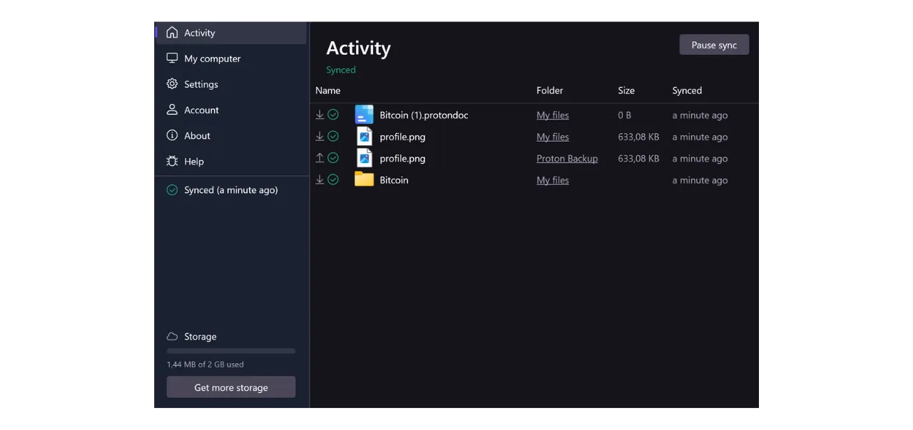

V dnešní době je důležité stanovit strategii, která zajistí dostupnost, bezpečnost a zálohování vašich osobních souborů, jako jsou osobní dokumenty, fotografie nebo důležité projekty. Ztráta těchto dat může být katastrofální.

Aby se předešlo těmto problémům, doporučuji udržovat více záloh vašich souborů na různých médiích. Běžně používaná strategie v informatice je "3-2-1" strategie zálohování, která zajišťuje ochranu vašich souborů:
- **3** kopie vašich souborů;
- Uložené na alespoň **2** různých typech médií;
- S alespoň **1** kopií uloženou mimo místo.

Jinými slovy, je vhodné ukládat vaše soubory na 3 různých místech, používající různé typy médií, jako je váš počítač, externí pevný disk, USB klíčenka nebo online úložiště. A konečně, mít kopii uloženou mimo domov nebo firmu znamená, že byste měli mít zálohu uloženou mimo váš domov nebo podnik. Tento poslední bod pomáhá vyhnout se totální ztrátě vašich souborů v případě lokálních katastrof, jako jsou požáry nebo záplavy. Externí kopie, vzdálená od vašeho domova nebo podniku, zajišťuje, že vaše data přežijí bez ohledu na lokální rizika.

Pro usnadnění implementace strategie 3-2-1 zálohování můžete použít online úložiště. Tyto řešení, běžně označovaná jako "cloud", vám nabízejí dodatečnou ochranu tím, že ukládají vaše data na zabezpečených serverech přístupných z jakéhokoli zařízení. Termín "cloud" jednoduše odkazuje na ukládání dat na externích serverech.

Mnoho lidí využívá úložná řešení velkých digitálních společností: Google Drive, Microsoft OneDrive nebo Apple iCloud.

Tato řešení jsou pohodlná pro každodenní použití a zajišťují dostupnost vašich dat, ale nezajišťují důvěrnost. V tomto tutoriálu navrhuji objevit jiné řešení, stejně snadno použitelné jako úložné nástroje Big Tech, ale s dodatečnými opatřeními na ochranu vašeho soukromí. Tímto řešením je Proton Drive, online úložný nástroj od švýcarské společnosti Proton. Také uvidíme, jak snadno implementovat strategii 3-2-1 vhodnou pro každodenní použití.

## Úvod do Proton Drive
Proton Drive je zajímavým řešením pro online úložiště, protože kombinuje snadné použití se zabezpečením vašich souborů. Na rozdíl od tradičních cloudových služeb od technologických gigantů, Proton Drive zavádí opatření na ochranu vašeho soukromí. Zajišťuje šifrování od konce ke konci pro všechny vaše soubory, což znamená, že ani týmy Protonu nemohou přistupovat k vašim datům. Navíc, Proton Drive je open-source, což umožňuje nezávislým expertům volně auditovat kód softwaru.

Obchodní model Protonu je založen na systému předplatného, což je uklidňující, protože to naznačuje, že společnost je financována bez nutnosti nutně využívat data uživatelů. V tomto tutoriálu vám vysvětlím, jak používat bezplatnou verzi Proton Drive, ale jsou k dispozici také různé úrovně předplatného nabízející více funkcí. Tento obchodní model je preferován před systémem zdarma ve stylu Big Tech, který by mohl vést k obavám, zda nejsou naše osobní data využívána pro zisk. To se zdá, že není případ Protonu.

Proton Drive nabízí mnohem více než jen možnosti úložiště; umožňuje také sdílení, úpravy a spolupráci na dokumentech online s editačními nástroji, podobně jako softwarová sada od Google.
Týkajíc se [ceníku](https://proton.me/pricing), bezplatná verze nabízí až 5 GB úložiště a zahrnuje základní funkce. Pro rozšíření kapacity na 200 GB úložiště je k dispozici specifické předplatné Proton Drive za 4 € měsíčně. Plán Proton Unlimited na druhou stranu nabízí až 500 GB úložiště na Proton Drive za 10 € měsíčně, kromě toho zahrnuje všechny placené služby Proton, jako jsou VPN a správce hesel, stejně jako další výhody u bezplatných nástrojů (e-mail a kalendář).

## Jak vytvořit účet Proton?

Pokud ještě nemáte účet Proton, budete ho potřebovat vytvořit. Odkazuji vás na náš tutoriál Proton Mail, ve kterém podrobně vysvětlujeme, jak vytvořit bezplatný účet Proton a nastavit ho:

https://planb.network/tutorials/others/proton-mail

## Jak nastavit Proton Drive?

Po přihlášení do vašeho Proton mailu klikněte na ikonu se čtyřmi malými čtverečky v levém horním rohu obrazovky.

Poté klikněte na "*Drive*".

Nyní jste na svém Proton Drive.

## Jak používat Proton Drive?
Chcete-li přidat soubory do vašeho Proton Drive, pokud používáte výhradně webovou verzi (použití lokální verze probereme později), jednoduše přetáhněte své dokumenty přímo do rozhraní.

Poté najdete svůj dokument na úvodní stránce.

Chcete-li přidat novou položku, klikněte na tlačítko "*Nový*" v levém horním rohu obrazovky.

Funkce "*Nahrát soubor*" otevře váš lokální průzkumník souborů, což vám umožní vybrat a importovat nové dokumenty do Proton Drive, stejně jako byste je přetáhli.

"*Nahrát složku*" umožňuje importovat celou složku.

"*Nová složka*" umožňuje vytvořit složku pro lepší organizaci vašich dokumentů na Proton Drive.

Klikněte na tuto možnost, přiřaďte název vaší složce.

Poté ji najdete přímo na úvodní stránce Proton Drive.

Nakonec, "*Nový dokument*" umožňuje vytvořit nový textový dokument přímo v Proton Drive.

Kliknutím na něj se otevře nový prázdný dokument.

Můžete na něm psát a upravovat ho.

Pokud kliknete na tlačítko "*Sdílet*" v pravém horním rohu, můžete dokument sdílet.

Poté stačí zadat e-mail přispěvatele, kterému chcete umožnit přístup k dokumentu, buď pouze pro čtení nebo s právy na úpravy.

Pokud se vrátíte na svůj Proton Drive, uvidíte, že dokument byl uložen.
Na záložce "*Shared*" najdete dokumenty, které jste sdíleli s ostatními.

A na záložce "*Shared with me*" uvidíte dokumenty, které s vámi sdíleli ostatní.

Nakonec na záložce "*Trash*" najdete vaše nedávno smazané dokumenty.

Většina nastavení vašeho Proton Drive je integrována do vašeho účtu Proton. Pro podrobné instrukce k nastavení vašeho účtu vás zvu, abyste si prohlédli tento tutoriál:

https://planb.network/tutorials/others/proton-mail

## Jak nainstalovat software Proton Drive?
Proton Drive nabízí také software, který umožňuje synchronizaci vašich lokálních souborů s vaším online úložištěm. Tato funkce usnadňuje a automatizuje implementaci naší zálohovací strategie 3-2-1. S softwarem Proton Drive získáte 2 synchronizované kopie vašich souborů: jednu na vašem počítači a druhou na serverech Protonu, čímž splňujete kritéria pro 2 typy médií a zálohu mimo místo. Stačí vytvořit třetí kopii, kterou nastavíme později.
Pro použití softwaru klikněte na záložku "*Computers*" ve vašem účtu Proton Drive a vyberte tlačítko odpovídající vašemu operačnímu systému, abyste mohli pokračovat v stahování.

Po instalaci se budete muset přihlásit, abyste odemkli svůj účet, a poté kliknout na "*Sign in*".

Vyberte lokální soubory, které chcete synchronizovat s vaším Proton Drive.

Například jsem vybral pouze složku "*Proton Backup*". Poté klikněte na tlačítko "*Continue*".

Poté se dostanete do rozhraní softwaru, které je podobné webové aplikaci.

Odteď budete mít na svém počítači lokálně složku s názvem "*Proton Drive*", která bude seskupovat všechny vaše dokumenty uložené online na Protonu. Pokud do této složky na vašem počítači přidáte soubor, automaticky jej najdete na úvodní stránce webové aplikace Proton Drive a naopak. Pro složky, které jste si vybrali k synchronizaci během instalace softwaru, je můžete také najít online přechodem do sekce "*Computers*" Proton Drive a poté výběrem vašeho počítače.

Takto jsou všechny vaše soubory zálohovány a synchronizovány jak lokálně na vašem stroji, tak na online serverech Proton Drive.

## Jak zálohovat Proton Drive?

Pokud jste postupovali podle předchozích kroků, nyní máte 2 odlišná místa pro zálohu vašich důležitých souborů. Abychom dokončili naši zálohovací strategii 3-2-1, potřebujeme přidat třetí kopii.
Doporučuji provést tuto dodatečnou zálohu na externím médiu, jako je například pevný disk nebo USB klíčenka. V závislosti na intenzitě vašeho používání nastavte vhodnou frekvenci aktualizace zálohy (týdně, měsíčně, pololetně...). V každém zvoleném intervalu budete muset stáhnout celý obsah vašeho Proton Drive, abyste zálohovali data na vybraném externím médiu. Tímto způsobem, i v případě krádeže vašeho počítače a současného zničení serverů Protonu, stále udržíte bezpečný přístup k vašim souborům díky kopii na USB klíčence.
Pro provedení této akce přejděte na váš Proton Drive. 
Vyberte všechny své soubory.

Poté klikněte na malou šipku pro jejich stažení.

Tuto operaci poté zopakujeme se soubory synchronizovanými z našeho počítače.

Následně najdete ve vašich stažených souborech .zip soubory. Stačí připojit externí médium dle vašeho výběru k počítači a poté na něj tyto soubory přenést.

Pokud se obáváte, že by vám mohl být USB klíč ukraden, zvažte jeho šifrování pomocí softwaru jako je VeraCrypt (brzy na toto téma připravíme návod).

Gratulujeme, nyní máte velmi robustní zálohovací strategii 3-2-1, která vám umožňuje drasticky snížit riziko ztráty přístupu k vašim osobním dokumentům za jakýchkoli okolností. Volbou Proton Drive pro vaše online zálohy také získáváte výhodu koncového šifrování, které zaručuje ochranu vašeho soukromí.

Pokud se chcete dozvědět více o zabezpečení vaší online přítomnosti a vyhnutí se hackování, doporučuji také prostudovat náš podrobný návod na správce hesel Bitwarden:

https://planb.network/tutorials/others/bitwarden