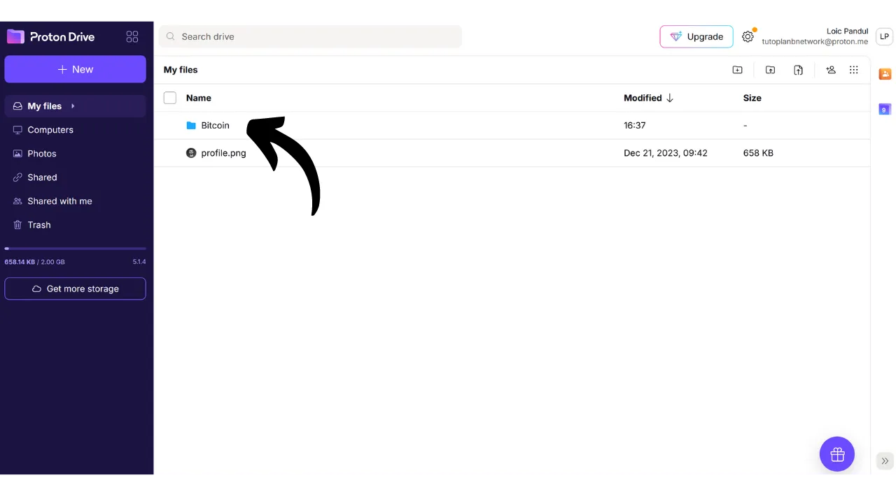
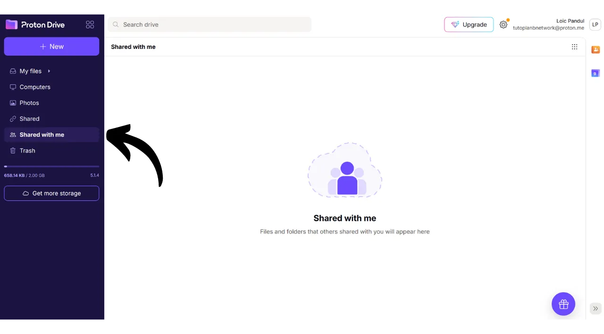
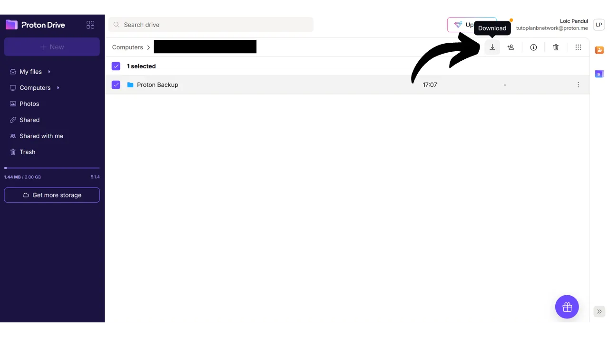

Heutzutage ist es wichtig, eine Strategie zu etablieren, um die Zugänglichkeit, Sicherheit und das Backup Ihrer persönlichen Dateien, wie Ihre persönlichen Dokumente, Fotos oder wichtige Projekte, zu gewährleisten. Der Verlust dieser Daten kann katastrophal sein.

Um diese Probleme zu verhindern, rate ich Ihnen, mehrere Backups Ihrer Dateien auf verschiedenen Medien zu pflegen. Eine in der Informatik häufig verwendete Strategie ist die "3-2-1"-Backup-Strategie, die den Schutz Ihrer Dateien gewährleistet:
- **3** Kopien Ihrer Dateien;
- Gespeichert auf mindestens **2** verschiedenen Arten von Medien;
- Mit mindestens **1** Kopie außerhalb des Standorts.

Mit anderen Worten, es ist ratsam, Ihre Dateien an 3 verschiedenen Orten zu speichern, unter Verwendung verschiedener Arten von Medien, wie Ihrem Computer, einer externen Festplatte, einem USB-Stick oder einem Online-Speicherdienst. Und schließlich bedeutet eine außerhalb des Standorts aufbewahrte Kopie, dass Sie ein Backup außerhalb Ihres Hauses oder Geschäfts haben sollten. Dieser letzte Punkt hilft, den Totalverlust Ihrer Dateien im Falle lokaler Katastrophen wie Brände oder Überschwemmungen zu vermeiden. Eine externe Kopie, weit entfernt von Ihrem Zuhause oder Geschäft, stellt sicher, dass Ihre Daten unabhängig von lokalen Risiken überleben.

Um die Implementierung der 3-2-1-Backup-Strategie zu erleichtern, können Sie einen Online-Speicherdienst nutzen. Diese Lösungen, allgemein als "Cloud" bezeichnet, bieten Ihnen zusätzlichen Schutz, indem sie Ihre Daten auf sicheren Servern speichern, die von jedem Gerät aus zugänglich sind. Der Begriff "Cloud" bezieht sich einfach auf die Speicherung von Daten auf externen Servern.

Viele Menschen nutzen die Speicherlösungen großer digitaler Unternehmen: Google Drive, Microsoft OneDrive oder Apple iCloud.

Diese Lösungen sind bequem für den täglichen Gebrauch und gewährleisten die Zugänglichkeit Ihrer Daten, aber sie gewährleisten nicht die Vertraulichkeit. In diesem Tutorial schlage ich vor, eine andere Lösung zu entdecken, die genauso einfach zu verwenden ist wie die Speicherwerkzeuge von Big Tech, aber mit zusätzlichen Maßnahmen zum Schutz Ihrer Privatsphäre. Diese Lösung ist Proton Drive, das Online-Speicherwerkzeug der Schweizer Firma Proton. Wir werden auch sehen, wie man eine 3-2-1-Strategie, die für den täglichen Gebrauch geeignet ist, leicht umsetzen kann.

## Einführung in Proton Drive
Proton Drive ist eine interessante Lösung für Online-Speicher, da es Benutzerfreundlichkeit mit Sicherheit für Ihre Dateien verbindet. Im Gegensatz zu traditionellen Cloud-Diensten von Technologiegiganten implementiert Proton Drive Maßnahmen zum Schutz Ihrer Privatsphäre. Es gewährleistet eine Ende-zu-Ende-Verschlüsselung für alle Ihre Dateien, was bedeutet, dass selbst die Teams von Proton keinen Zugriff auf Ihre Daten haben. Darüber hinaus ist Proton Drive Open-Source, was unabhängigen Experten erlaubt, den Code der Software frei zu prüfen.

Das Geschäftsmodell von Proton basiert auf einem Abonnement-System, was beruhigend ist, da es darauf hinweist, dass das Unternehmen finanziert wird, ohne notwendigerweise die Daten seiner Nutzer auszubeuten. In diesem Tutorial werde ich erklären, wie man die kostenlose Version von Proton Drive verwendet, aber es gibt auch mehrere Abonnementstufen, die mehr Funktionen bieten. Dieses Geschäftsmodell ist einem kostenlosen System im Stil von Big Tech vorzuziehen, das Bedenken aufwerfen könnte, ob unsere persönlichen Daten zum Profit genutzt werden. Dies scheint bei Proton nicht der Fall zu sein.

Proton Drive bietet viel mehr als einfache Speicheroptionen; es ermöglicht auch das Teilen, Bearbeiten und Zusammenarbeiten an Dokumenten online mit Bearbeitungswerkzeugen, ähnlich wie die Software-Suite von Google.
Bezüglich der [Preisgestaltung](https://proton.me/pricing) bietet die kostenlose Version bis zu 5 GB Speicherplatz und umfasst wesentliche Funktionen. Um die Kapazitäten auf 200 GB Speicherplatz zu erweitern, ist ein spezifisches Abonnement für Proton Drive für 4 € pro Monat verfügbar. Der Proton Unlimited-Tarif bietet andererseits bis zu 500 GB Speicherplatz auf Proton Drive für 10 € pro Monat und beinhaltet alle bezahlten Dienste von Proton, wie das VPN und den Passwortmanager, sowie zusätzliche Vorteile bei kostenlosen Tools (E-Mail und Kalender). 
## Wie erstelle ich ein Proton-Konto?

Wenn Sie noch kein Proton-Konto haben, müssen Sie eines erstellen. Ich verweise Sie auf unser Proton Mail-Tutorial, in dem wir detailliert erklären, wie Sie ein kostenloses Proton-Konto erstellen und einrichten:

https://planb.network/tutorials/others/proton-mail

## Wie richte ich Proton Drive ein?

Sobald Sie in Ihrem Proton-Mail eingeloggt sind, klicken Sie oben links auf dem Bildschirm auf das Symbol mit den vier kleinen Quadraten.

Klicken Sie dann auf "*Drive*".

Sie befinden sich jetzt auf Ihrem Proton Drive.

## Wie verwende ich Proton Drive?
Um Dateien zu Ihrem Proton Drive hinzuzufügen, wenn Sie ausschließlich die Webversion verwenden (die Verwendung der lokalen Version besprechen wir später), müssen Sie Ihre Dokumente einfach per Drag-and-Drop direkt in die Schnittstelle ziehen.

Sie können dann Ihr Dokument auf der Startseite finden.

Um einen neuen Eintrag hinzuzufügen, klicken Sie oben links auf dem Bildschirm auf den Button "*Neu*".

Die Funktion "*Datei hochladen*" öffnet Ihren lokalen Dateiexplorer, sodass Sie neue Dokumente zu Proton Drive hinzufügen können, genau wie Sie es durch Drag-and-Drop tun würden.

"*Ordner hochladen*" ermöglicht es Ihnen, einen ganzen Ordner zu importieren.

"*Neuer Ordner*" ermöglicht es Ihnen, einen Ordner zu erstellen, um Ihre Dokumente auf Proton Drive besser zu organisieren.

Klicken Sie auf diese Option, geben Sie Ihrem Ordner einen Namen.

Dann finden Sie ihn direkt auf der Startseite von Proton Drive.

Schließlich ermöglicht "*Neues Dokument*", ein neues Textdokument direkt in Proton Drive zu erstellen.

Durch Klicken darauf öffnet sich ein neues leeres Dokument.

Sie können darauf schreiben und es bearbeiten.

Wenn Sie oben rechts auf den Button "*Teilen*" klicken, können Sie das Dokument teilen.

Sie müssen dann nur die E-Mail des Mitwirkenden eingeben, dem Sie Zugriff auf das Dokument gewähren möchten, entweder nur zum Lesen oder mit Bearbeitungsrechten.

Wenn Sie zu Ihrem Proton Drive zurückkehren, können Sie sehen, dass das Dokument gespeichert wurde.
Im Tab "*Geteilt*" finden Sie die Dokumente, die Sie mit anderen geteilt haben.

Und im Tab "*Mit mir geteilt*" können Sie die Dokumente sehen, die andere mit Ihnen geteilt haben.

Schließlich finden Sie im Tab "*Papierkorb*" Ihre kürzlich gelöschten Dokumente.

Die meisten Einstellungen für Ihr Proton Drive sind in Ihr Proton-Konto integriert. Für detaillierte Anweisungen zur Einrichtung Ihres Kontos lade ich Sie ein, dieses Tutorial zu konsultieren:

https://planb.network/tutorials/others/proton-mail

## Wie installiert man die Proton Drive Software?
Proton Drive bietet auch Software, die die Synchronisierung Ihrer lokalen Dateien mit Ihrem Online-Speicherplatz ermöglicht. Diese Funktion erleichtert und automatisiert die Umsetzung unserer 3-2-1-Backup-Strategie. Mit der Proton Drive Software erhalten Sie 2 synchronisierte Kopien Ihrer Dateien: eine auf Ihrem Computer und die andere auf den Servern von Proton, was die Kriterien von 2 Medientypen und Off-Site-Backup erfüllt. Sie müssen lediglich eine dritte Kopie erstellen, die wir später einrichten werden.
Um die Software zu nutzen, klicken Sie auf den Tab "*Computer*" in Ihrem Proton Drive-Konto und wählen Sie die Schaltfläche, die Ihrem Betriebssystem entspricht, um mit dem Download fortzufahren.

Einmal installiert, müssen Sie sich anmelden, um Ihr Konto freizuschalten, und dann auf "*Anmelden*" klicken.

Wählen Sie die lokalen Dateien aus, die Sie mit Ihrem Proton Drive synchronisieren möchten.

Zum Beispiel habe ich nur den Ordner "*Proton Backup*" ausgewählt. Dann klicken Sie auf die Schaltfläche "*Weiter*".

Sie gelangen dann zur Softwareoberfläche, die der Webanwendung ähnelt.

Von nun an haben Sie einen Ordner mit dem Titel "*Proton Drive*" lokal auf Ihrem Computer, der alle Ihre auf Proton online gespeicherten Dokumente gruppiert. Wenn Sie eine Datei zu diesem Ordner von Ihrem Computer hinzufügen, finden Sie sie automatisch auf der Startseite der Proton Drive Webanwendung und umgekehrt. Für die Ordner, die Sie während der Softwareinstallation zur Synchronisierung ausgewählt haben, können Sie sie auch online finden, indem Sie zum Abschnitt "*Computer*" von Proton Drive gehen und dann Ihren Computer auswählen.

So sind alle Ihre Dateien sowohl lokal auf Ihrer Maschine als auch auf den Online-Servern von Proton Drive gesichert und synchronisiert.

## Wie sichert man Proton Drive?

Wenn Sie den vorherigen Schritten gefolgt sind, haben Sie jetzt 2 verschiedene Sicherungsorte für Ihre wichtigen Dateien. Um unsere 3-2-1-Backup-Strategie zu vervollständigen, müssen wir eine dritte Kopie hinzufügen.
Ich schlage vor, dass Sie dieses zusätzliche Backup auf einem externen Medium durchführen, wie zum Beispiel einer Festplatte oder einem USB-Stick. Abhängig von der Intensität Ihrer Nutzung setzen Sie eine angemessene Backup-Aktualisierungsfrequenz fest (wöchentlich, monatlich, halbjährlich...). Bei jedem gewählten Intervall müssen Sie die Gesamtheit Ihres Proton Drive herunterladen, um die Daten auf dem gewählten externen Medium zu sichern. Auf diese Weise behalten Sie selbst im Falle des Diebstahls Ihres Computers und der gleichzeitigen Zerstörung der Proton-Server dank der Kopie auf dem USB-Stick einen sicheren Zugang zu Ihren Dateien.
Um dies zu tun, gehen Sie zu Ihrem Proton Drive. 
Wählen Sie alle Ihre Dateien aus.

Klicken Sie dann auf den kleinen Pfeil, um sie herunterzuladen.

Wir werden die Operation dann mit unseren Dateien wiederholen, die von unserem Computer synchronisiert wurden.

Sie finden dann .zip-Dateien in Ihren Downloads. Verbinden Sie einfach das externe Medium Ihrer Wahl mit Ihrem Computer und übertragen Sie diese Dateien darauf.

Wenn Sie besorgt sind, dass dieser USB-Stick gestohlen werden könnte, erwägen Sie, ihn mit Software wie VeraCrypt zu verschlüsseln (wir werden bald ein Tutorial zu dieser Software erstellen).

Herzlichen Glückwunsch, Sie haben jetzt eine sehr robuste 3-2-1-Backup-Strategie, die es Ihnen ermöglicht, das Risiko, den Zugang zu Ihren persönlichen Dokumenten zu verlieren, drastisch zu reduzieren, egal unter welchen Umständen. Indem Sie Proton Drive für Ihre Online-Backups wählen, profitieren Sie auch von einer Ende-zu-Ende-Verschlüsselung, die den Schutz Ihrer Privatsphäre garantiert.

Um mehr darüber zu erfahren, wie Sie Ihre Online-Präsenz sichern und Hacking vermeiden können, empfehle ich auch, unser detailliertes Tutorial zum Passwortmanager Bitwarden zu konsultieren:

https://planb.network/tutorials/others/bitwarden