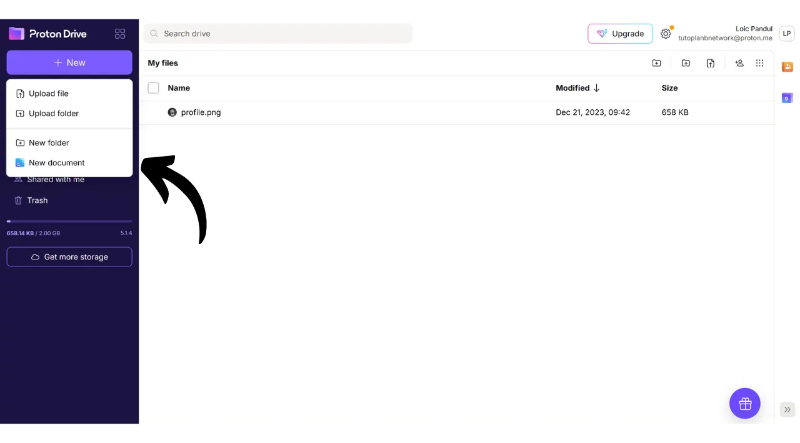
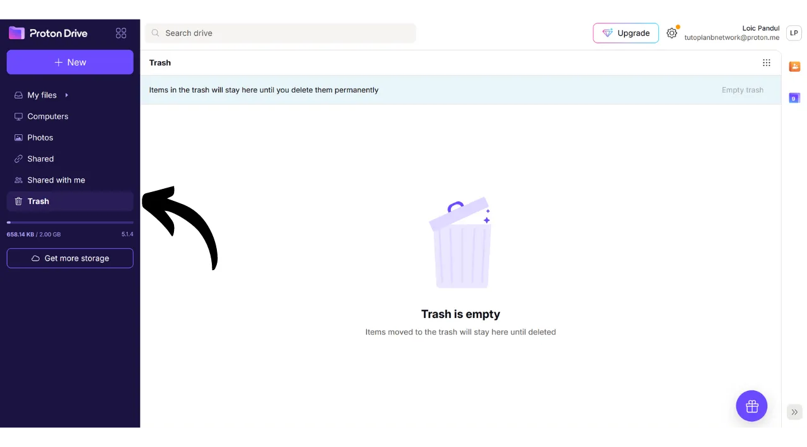
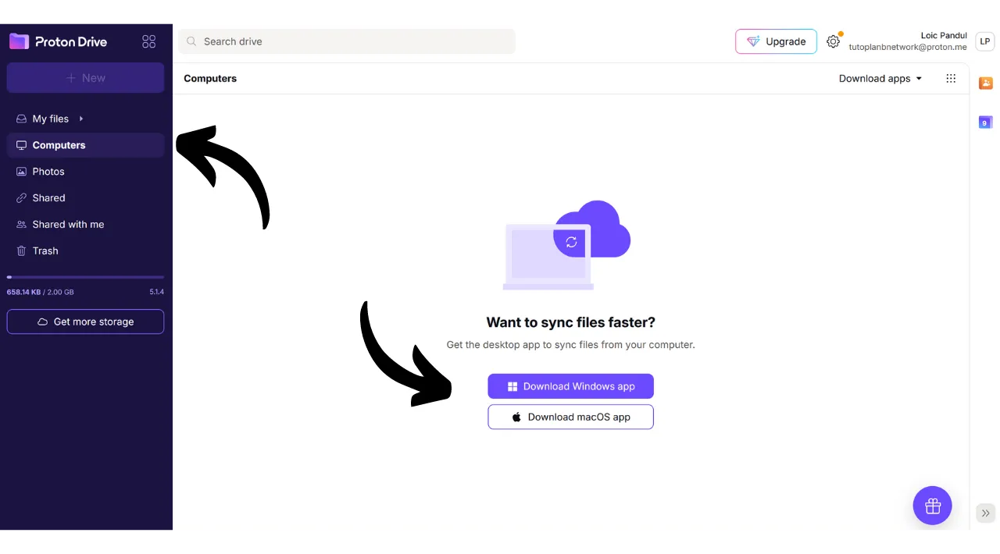

Tänapäeval on hädavajalik välja töötada strateegia, et tagada oma isiklike failide, nagu isiklikud dokumendid, fotod või olulised projektid, kättesaadavus, turvalisus ja varundamine. Nende andmete kaotamine võib olla katastroofiline.

Nende probleemide vältimiseks soovitan säilitada mitu failide varukoopiaid erinevatel andmekandjatel. Arvutustehnikas kasutatakse laialdaselt "3-2-1" varundamise strateegiat, mis tagab failide kaitse:
- **3** koopiat teie failidest;
- Salvestatud vähemalt **2** erinevale andmekandjale;
- Vähemalt **1** koopia hoitakse väljaspool asukohta.

Teisisõnu, on soovitatav hoida oma faile 3 erinevas kohas, kasutades erinevaid andmekandjaid, nagu arvuti, väline kõvaketas, USB mälupulk või veebipõhine salvestusteenus. Ja lõpuks, väljaspool asuva koopia olemasolu tähendab, et peaksite omama varukoopiat väljaspool oma kodu või äri. See viimane punkt aitab vältida failide täielikku kaotust kohalike katastroofide, nagu tulekahjud või üleujutused, korral. Väline koopia, mis asub kaugel teie kodust või ärist, tagab, et teie andmed jäävad alles sõltumata kohalikest riskidest.

3-2-1 varundamise strateegia rakendamise hõlbustamiseks võite kasutada veebipõhist salvestusteenust. Neid lahendusi, mida tavaliselt nimetatakse "pilveks", pakuvad lisakaitset, salvestades teie andmed turvalistele serveritele, mis on juurdepääsetavad igast seadmest. Termin "pilv" viitab lihtsalt andmete salvestamisele välistele serveritele.

Paljud inimesed kasutavad suurte digitaalsete ettevõtete salvestuslahendusi: Google Drive, Microsoft OneDrive või Apple iCloud.

Need lahendused on igapäevaseks kasutamiseks mugavad ja tagavad teie andmete kättesaadavuse, kuid nad ei taga konfidentsiaalsust. Selles õpetuses pakun avastada teist lahendust, mis on sama lihtne kasutada kui Big Tech'i salvestusvahendid, kuid lisameetmetega teie privaatsuse kaitsmiseks. See lahendus on Proton Drive, Šveitsi ettevõtte Proton veebipõhine salvestusvahend. Samuti vaatame, kuidas hõlpsalt rakendada 3-2-1 strateegiat, mis sobib igapäevaseks kasutamiseks.

## Tutvustus Proton Drive'ile
Proton Drive on huvitav lahendus veebipõhiseks salvestamiseks, kuna see ühendab kasutusmugavuse failide turvalisusega. Erinevalt traditsioonilistest pilveteenustest, mida pakuvad tehnoloogiahiiglased, rakendab Proton Drive meetmeid teie privaatsuse kaitsmiseks. See tagab kõigi teie failide lõpp-punktist lõpp-punkti krüpteerimise, mis tähendab, et isegi Protoni meeskonnad ei pääse teie andmetele ligi. Lisaks on Proton Drive avatud lähtekoodiga, mis võimaldab sõltumatutel ekspertidel vabalt tarkvara koodi auditeerida.

Protoni ärimudel põhineb tellimussüsteemil, mis on julgustav, kuna see näitab, et ettevõte on rahastatud ilma tingimata oma kasutajate andmeid ära kasutamata. Selles õpetuses selgitan, kuidas kasutada Proton Drive'i tasuta versiooni, kuid on olemas ka mitu tellimustaset, mis pakuvad rohkem funktsioone. See ärimudel on eelistatavam kui Big Tech'i stiilis tasuta süsteem, mis võib panna mõtlema, kas meie isiklikke andmeid kasutatakse kasumi teenimiseks. Protoniga tundub, et see ei ole nii.

Proton Drive pakub rohkem kui lihtsalt salvestusvõimalusi; see võimaldab ka dokumentide jagamist, redigeerimist ja koostööd dokumentide kallal veebis redigeerimisvahenditega, sarnaselt Google'i tarkvarakomplektiga.
Hinnakujunduse osas pakub tasuta versioon kuni 5 GB salvestusruumi ja sisaldab olulisi funktsioone. Võimaluste laiendamiseks 200 GB salvestusruumini on saadaval konkreetne tellimus Proton Drive'ile, mis maksab 4 € kuus. Teisest küljest pakub Proton Unlimited pakett 10 € kuus kuni 500 GB salvestusruumi Proton Drive'is, lisaks kaasnevad kõik Protoni tasulised teenused, nagu VPN ja paroolihaldur, samuti lisaeelised tasuta tööriistadel (e-post ja kalender). 
## Kuidas luua Protoni konto?

Kui teil ei ole veel Protoni kontot, peate selle looma. Viitan teid meie Proton Maili õpetusele, milles selgitame üksikasjalikult, kuidas luua tasuta Protoni konto ja seda seadistada:

https://planb.network/tutorials/others/proton-mail

## Kuidas seadistada Proton Drive'i?

Oma Protoni postkasti sisse logides klõpsake ekraani vasakus ülanurgas asuval ikoonil, millel on neli väikest ruutu.

Seejärel klõpsake "*Drive*" peal.

Nüüd olete oma Proton Drive'is.

## Kuidas kasutada Proton Drive'i?
Failide lisamiseks oma Proton Drive'i, kasutades ainult veebiversiooni (räägime kohaliku versiooni kasutamisest hiljem), peate lihtsalt lohistama oma dokumendid otse liidesesse.  Seejärel leiate oma dokumendi avalehelt.  Uue üksuse lisamiseks klõpsake ekraani vasakus ülanurgas nuppu "*Uus*".  Funktsioon "*Laadi fail üles*" avab teie kohaliku failihalduri, võimaldades teil valida ja importida uusi dokumente Proton Drive'i, täpselt nagu teeksite lohistades ja kukutades.  "*Laadi kaust üles*" võimaldab teil importida terve kausta.  "*Uus kaust*" võimaldab teil luua kausta, et paremini organiseerida oma dokumente Proton Drive'is.  Klõpsake sellel valikul, määrake oma kaustale nimi.  Seejärel leiate selle otse Proton Drive'i avalehelt.  Lõpuks võimaldab "*Uus dokument*" teil luua Proton Drive'is otse uue tekstidokumendi.  Sellel klõpsates avaneb uus tühi dokument.  Saate seda kirjutada ja redigeerida.  Kui klõpsate ekraani paremas ülanurgas nuppu "*Jaga*", saate dokumenti jagada.  Peate lihtsalt sisestama meiliaadressi, kellele soovite anda dokumendile juurdepääsu, kas ainult lugemisõigusega või redigeerimisõigustega.  Kui lähete tagasi oma Proton Drive'i, näete, et dokument on edukalt salvestatud.  Vahekaardil "*Jagatud*" leiate dokumendid, mida olete teistega jaganud.  Ja vahekaardil "*Minuga jagatud*" näete dokumente, mida teised on teiega jaganud.  Lõpuks vahekaardil "*Prügikast*" leiate hiljuti kustutatud dokumendid.  Enamik teie Proton Drive'i seadeid on integreeritud teie Protoni kontoga. Oma konto seadistamise detailsete juhiste saamiseks soovitan teil konsulteerida selle õpetusega:
https://planb.network/tutorials/others/proton-mail

## Kuidas paigaldada Proton Drive tarkvara?
Proton Drive pakub ka tarkvara, mis võimaldab teie kohalike failide sünkroniseerimist teie veebipõhise salvestusruumiga. See funktsioon hõlbustab ja automatiseerib meie 3-2-1 varundusstrateegia rakendamist. Proton Drive tarkvaraga saate 2 sünkroniseeritud koopiat oma failidest: ühe oma arvutis ja teise Protoni serverites, täites seeläbi 2 meediumitüübi ja väljaspool asuva varukoopia kriteeriumid. Lihtsalt peate looma kolmanda koopia, mille seadistame hiljem.
Tarkvara kasutamiseks klõpsake oma Proton Drive'i kontol vahekaardil "*Arvutid*" ja valige oma operatsioonisüsteemile vastav nupp allalaadimise jätkamiseks.
Pärast paigaldamist peate sisse logima, et oma kontot avada, seejärel klõpsake nupul "*Logi sisse*".

Valige kohalikud failid, mida soovite oma Proton Drive'iga sünkroniseerida.

Näiteks olen valinud ainult kausta "*Proton Backup*". Seejärel klõpsake nupul "*Jätka*".

Seejärel jõuate tarkvara liidesesse, mis on sarnane veebirakendusega.

Edaspidi on teil arvutis kohalikult kaust pealkirjaga "*Proton Drive*", mis kogub kõik teie Protoni veebis salvestatud dokumendid. Kui lisate sellele kaustale arvutist faili, leiate selle automaatselt Proton Drive'i veebirakenduse avalehelt ja vastupidi. Kaustade puhul, mille valisite tarkvara paigaldamisel sünkroniseerima, leiate need veebis, minnes Proton Drive'i jaotisse "*Arvutid*" ja seejärel valides oma arvuti.

Nii on kõik teie failid varundatud ja sünkroniseeritud nii kohapeal teie masinas kui ka Proton Drive'i veebiserverites.

## Kuidas teha Proton Drive'ist varukoopia?

Kui olete järginud eelnevaid samme, on teil nüüd kaks eraldi varukoopiate asukohta oma oluliste failide jaoks. Meie 3-2-1 varundusstrateegia lõpetamiseks peame lisama kolmanda koopia.
Soovitan teil teha selle täiendava varukoopia välisele andmekandjale, näiteks välisele kõvakettale või USB-mälupulgale. Sõltuvalt teie kasutusintensiivsusest seadke sobiv varunduse uuendamise sagedus (iganädalane, igakuine, poolaastane...). Igal valitud intervallil peate alla laadima kogu oma Proton Drive'i, et varundada andmed valitud välisele andmekandjale. Nii säilitate isegi arvuti varguse ja Protoni serverite samaaegse hävimise korral turvalise juurdepääsu oma failidele tänu koopiale USB-mälupulgal.

Selleks minge oma Proton Drive'i.

Valige kõik oma failid.

Seejärel klõpsake väikesele noolele, et neid alla laadida.

Seejärel kordame toimingut meie arvutist sünkroniseeritud failidega.

Seejärel leiate oma allalaadimistest .zip failid. Lihtsalt ühendage oma valitud väline andmekandja arvutiga ja seejärel kandke need failid sinna üle.

Kui olete mures, et see USB-mälupulk võidakse varastada, kaaluge selle krüpteerimist tarkvaraga nagu VeraCrypt (me teeme selle tarkvara kohta varsti õpetuse).

Palju õnne, teil on nüüd väga tugev 3-2-1 varundusstrateegia, mis võimaldab teil drastiliselt vähendada juurdepääsu kaotamise riski oma isiklikele dokumentidele, olenemata asjaoludest. Proton Drive'i valimisega oma veebivarunduste jaoks saate kasu ka otsast lõpuni krüpteerimisest, mis tagab teie privaatsuse kaitse.

Et rohkem teada saada oma veebipresendi turvamise ja häkkimise vältimise kohta, soovitan teil tutvuda ka meie üksikasjaliku õpetusega Bitwarden paroolihalduri kohta:

https://planb.network/tutorials/others/bitwarden