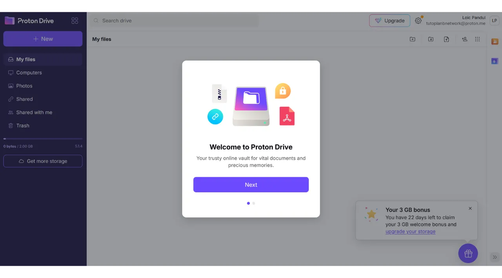
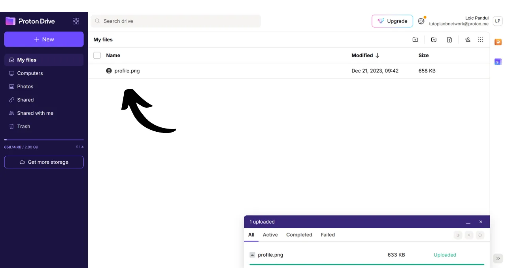
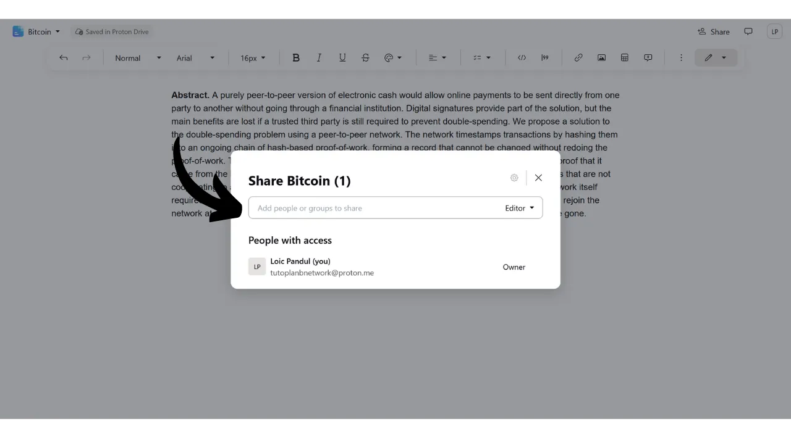

Nykyään on tärkeää luoda strategia henkilökohtaisten tiedostojen, kuten henkilökohtaisten dokumenttien, valokuvien tai tärkeiden projektien, saatavuuden, turvallisuuden ja varmuuskopioinnin varmistamiseksi. Näiden tietojen menettäminen voi olla katastrofaalista.

Näiden ongelmien estämiseksi neuvon sinua ylläpitämään useita varmuuskopioita tiedostoistasi eri medioilla. Tietotekniikassa yleisesti käytetty strategia on "3-2-1" varmuuskopiointistrategia, joka varmistaa tiedostojesi suojan:
- **3** kopiota tiedostoistasi;
- Tallennettuna ainakin **2** eri tyyppiselle medialle;
- Vähintään **1** kopio säilytetään ulkopuolisessa sijainnissa.

Toisin sanoen on suositeltavaa säilyttää tiedostoja 3 eri paikassa, käyttäen eri tyyppisiä medioita, kuten tietokonettasi, ulkoista kovalevyä, USB-tikkua tai online-tallennuspalvelua. Ja lopuksi, ulkopuolisen kopion säilyttäminen tarkoittaa, että sinulla tulisi olla varmuuskopio tallennettuna kotisi tai yrityksesi ulkopuolelle. Tämä viimeinen kohta auttaa välttämään tiedostojen täydellisen menetyksen paikallisten katastrofien, kuten tulipalojen tai tulvien, sattuessa. Ulkoinen kopio, kaukana kodistasi tai yrityksestäsi, varmistaa, että tietosi säilyvät riippumatta paikallisista riskeistä.

"3-2-1" varmuuskopiointistrategian toteuttamisen helpottamiseksi voit käyttää online-tallennuspalvelua. Nämä ratkaisut, joita yleisesti kutsutaan "pilveksi", tarjoavat sinulle lisäsuojaa tallentamalla tietosi turvallisille palvelimille, jotka ovat käytettävissä mistä tahansa laitteesta. Termi "pilvi" viittaa yksinkertaisesti tietojen tallentamiseen ulkoisille palvelimille.

Monet ihmiset käyttävät suurten digitaalisten yritysten tallennusratkaisuja: Google Drive, Microsoft OneDrive tai Apple iCloud.

Nämä ratkaisut ovat käteviä päivittäisessä käytössä ja takaavat tietojesi saatavuuden, mutta ne eivät takaa luottamuksellisuutta. Tässä oppaassa ehdotan toisen ratkaisun tutkimista, joka on yhtä helppokäyttöinen kuin Big Techin tallennustyökalut, mutta sisältää lisätoimenpiteitä yksityisyytesi suojaamiseksi. Tämä ratkaisu on Proton Drive, sveitsiläisen Proton-yrityksen online-tallennustyökalu. Näemme myös, miten "3-2-1" strategia voidaan helposti toteuttaa päivittäisessä käytössä.

## Johdanto Proton Driveen
Proton Drive on mielenkiintoinen ratkaisu online-tallennukseen, sillä se yhdistää helppokäyttöisyyden tiedostojesi turvallisuuteen. Toisin kuin perinteiset pilvipalvelut teknologiajäteiltä, Proton Drive toteuttaa toimenpiteitä yksityisyytesi suojaamiseksi. Se varmistaa tiedostoillesi päästä päähän -salauksen, mikä tarkoittaa, että edes Protonin tiimit eivät pääse käsiksi tietoihisi. Lisäksi Proton Drive on avoimen lähdekoodin, mikä mahdollistaa riippumattomien asiantuntijoiden vapaan ohjelmiston koodin tarkastelun.

Protonin liiketoimintamalli perustuu tilausjärjestelmään, mikä on rauhoittavaa, sillä se osoittaa, että yritys saa rahoituksensa ilman, että sen tarvitsee välttämättä hyödyntää käyttäjiensä tietoja. Tässä oppaassa selitän, miten käyttää Proton Driven ilmaista versiota, mutta tarjolla on myös useita tilaustasoja, jotka tarjoavat enemmän ominaisuuksia. Tämä liiketoimintamalli on suositeltavampi kuin Big Techin tyylinen ilmainen järjestelmä, joka voisi herättää huolta siitä, käytetäänkö henkilökohtaisia tietojamme voiton tavoitteluun. Protonin kanssa näin ei vaikuta olevan.

Proton Drive tarjoaa paljon enemmän kuin pelkkiä tallennusvaihtoehtoja; se mahdollistaa myös tiedostojen jakamisen, muokkaamisen ja yhteistyön dokumenttien parissa online-muokkaustyökalujen avulla, samankaltaisesti kuin Googlen ohjelmistopaketti.
Hinnoittelusta [hinnat](https://proton.me/pricing) löytyy, että ilmainen versio tarjoaa jopa 5 GB tallennustilaa ja sisältää olennaiset ominaisuudet. Mahdollisuuksien laajentamiseksi 200 GB tallennustilaan on saatavilla erityinen tilaus Proton Driveen, joka maksaa 4 € kuukaudessa. Toisaalta Proton Unlimited -suunnitelma tarjoaa jopa 500 GB tallennustilaa Proton Drivessa 10 € kuukaudessa, sisältäen kaikki Protonin maksulliset palvelut, kuten VPN:n ja salasanojen hallinnan, sekä lisäetuja ilmaisissa työkaluissa (sähköposti ja kalenteri).
## Kuinka luoda Proton-tili?

Jos sinulla ei vielä ole Proton-tiliä, sinun on luotava sellainen. Ohjaan sinut Proton Mail -oppaaseemme, jossa selitämme yksityiskohtaisesti, kuinka luoda ilmainen Proton-tili ja ottaa se käyttöön:

https://planb.network/tutorials/others/proton-mail

## Kuinka ottaa Proton Drive käyttöön?

Kirjauduttuasi Proton-sähköpostiisi, napsauta neljän pienen neliön kuvaketta näytön vasemmassa yläkulmassa.

Sen jälkeen klikkaa "*Drive*".

Olet nyt Proton Drivessasi.

## Kuinka käyttää Proton Drivea?
Lisätäksesi tiedostoja Proton Driveen, jos käytät yksinomaan web-versiota (käsittelemme paikallisen version käyttöä myöhemmin), sinun tarvitsee vain raahata ja pudottaa asiakirjasi suoraan käyttöliittymään.

Sen jälkeen löydät asiakirjasi kotisivulta.

Lisätäksesi uuden kohteen, klikkaa "*Uusi*" -painiketta näytön vasemmassa yläkulmassa.

"*Lataa tiedosto*" -toiminto avaa paikallisen tiedostonhallintasi, jolloin voit valita ja tuoda uusia asiakirjoja Proton Driveen, aivan kuten raahaten ja pudottaen.

"*Lataa kansio*" mahdollistaa kokonaisen kansion tuonnin.

"*Uusi kansio*" mahdollistaa kansion luomisen asiakirjojesi parempaan järjestämiseen Proton Drivessa.

Klikkaa tätä vaihtoehtoa, anna kansiollasi nimi.

Sen jälkeen löydät sen suoraan Proton Driven kotisivulta.

Lopuksi, "*Uusi asiakirja*" mahdollistaa uuden tekstiasiakirjan luomisen suoraan Proton Drivessa.

Klikkaamalla sitä, uusi tyhjä asiakirja avautuu.

Voit kirjoittaa siihen ja muokata sitä.

Jos klikkaat "*Jaa*" -painiketta näytön oikeassa yläkulmassa, voit jakaa asiakirjan.

Sinun tarvitsee vain syöttää yhteistyökumppanin sähköposti, jolle haluat antaa pääsyn asiakirjaan, joko vain luku -oikeudella tai muokkausoikeuksilla.

Jos palaat takaisin Proton Driveesi, näet, että asiakirja on tallennettu.
 "*Jaetut*" -välilehdeltä löydät asiakirjat, jotka olet jakanut muiden kanssa.

Ja "*Minulle jaetut*" -välilehdellä näet asiakirjat, jotka muut ovat jakaneet sinulle.

Lopuksi "*Roskakori*" -välilehdeltä löydät äskettäin poistamasi asiakirjat.

Useimmat Proton Drive -asetuksesi on integroitu Proton-tiliisi. Tarkkoja ohjeita tilisi asettamiseksi kutsun sinut tutustumaan tähän oppaaseen:

https://planb.network/tutorials/others/proton-mail

## Kuinka asentaa Proton Drive -ohjelmisto?
Proton Drive tarjoaa myös ohjelmiston, joka mahdollistaa paikallisten tiedostojen synkronoinnin online-tallennustilasi kanssa. Tämä ominaisuus helpottaa ja automatisoi 3-2-1-varmuuskopiointistrategiamme toteuttamista. Proton Drive -ohjelmiston avulla saat 2 synkronoitua kopiota tiedostoistasi: toisen tietokoneellasi ja toisen Protonin palvelimilla, täyttäen siten kahden median tyypin ja sijainnin ulkopuolisen varmuuskopion kriteerit. Sinun tarvitsee vain luoda kolmas kopio, jonka asetamme myöhemmin.
Ohjelmiston käyttämiseksi, klikkaa Proton Drive -tilisi "*Tietokoneet*" -välilehteä ja valitse käyttöjärjestelmääsi vastaava painike jatkaaksesi latausta.

Asennuksen jälkeen sinun tulee kirjautua sisään vapauttaaksesi tilisi, sitten klikkaa "*Kirjaudu sisään*".

Valitse paikalliset tiedostot, jotka haluat synkronoida Proton Driveen.

Esimerkiksi olen valinnut vain "*Proton Backup*" -kansion. Sen jälkeen klikkaa "*Jatka*" -painiketta.

Tämän jälkeen saavut ohjelmiston käyttöliittymään, joka on samankaltainen kuin web-sovelluksessa.

Tästä lähtien sinulla on tietokoneellasi paikallisesti kansio nimeltä "*Proton Drive*", joka ryhmittelee kaikki Protonin online-palvelussa säilytetyt asiakirjasi. Jos lisäät tiedoston tähän kansioon tietokoneeltasi, löydät sen automaattisesti Proton Drive -web-sovelluksen kotisivulta, ja päinvastoin. Valitsemillesi synkronoitaville kansioille ohjelmiston asennuksen aikana, voit myös löytää ne online-palvelusta menemällä Proton Driveen ja valitsemalla sitten tietokoneesi.

Näin ollen kaikki tiedostosi varmuuskopioidaan ja synkronoidaan sekä paikallisesti koneellasi että Proton Drive -palvelun online-palvelimilla.

## Kuinka varmuuskopioida Proton Drive?

Jos olet noudattanut edellisiä vaiheita, sinulla on nyt 2 erillistä varmuuskopiointisijaintia tärkeille tiedostoillesi. Jotta voimme täydentää 3-2-1-varmuuskopiointistrategiamme, meidän on lisättävä kolmas kopio.
Ehdotan, että suoritat tämän lisävarmuuskopion ulkoiselle medialle, kuten kovalevylle tai USB-tikulle esimerkiksi. Riippuen käyttösi intensiteetistä, aseta sopiva varmuuskopion päivitystiheys (viikoittain, kuukausittain, puolivuosittain...). Valitsemallasi aikavälillä sinun tulee ladata koko Proton Drive -varmuuskopioi tiedot valitsemallesi ulkoiselle medialle. Näin, jopa tietokoneesi varkauden ja Protonin palvelimien samanaikaisen tuhoutumisen tapauksessa, säilytät silti turvallisen pääsyn tiedostoihisi USB-tikun kopion ansiosta.
Tehdäksesi tämän, siirry Proton Drive -asemaasi.

Valitse kaikki tiedostosi.

Klikkaa sitten pientä nuolta ladataksesi ne.

Toistamme sitten operaation tiedostoillemme, jotka on synkronoitu tietokoneeltamme.

Löydät sitten .zip-tiedostoja latauksistasi. Yhdistä vain valitsemasi ulkoinen väline tietokoneeseesi ja siirrä sitten nämä tiedostot sille.

Jos olet huolissasi siitä, että tämä USB-tikku saattaisi tulla varastetuksi, harkitse sen salaamista ohjelmistolla, kuten VeraCrypt (teemme pian tutoriaalin tästä ohjelmistosta).

Onnittelut, sinulla on nyt erittäin vankka 3-2-1 varmuuskopiointistrategia, joka mahdollistaa henkilökohtaisten dokumenttiesi menettämisen riskin merkittävän vähentämisen, missä tahansa olosuhteissa. Valitsemalla Proton Drive online-varmuuskopioillesi, hyödyt myös päästä päähän salauksesta, joka takaa yksityisyytesi suojan.

Lisätietoja online-läsnäolosi turvaamisesta ja hakkeroinnin välttämisestä suosittelen myös yksityiskohtaisen tutoriaalimme konsultointia Bitwarden salasananhallinnasta:

https://planb.network/tutorials/others/bitwarden