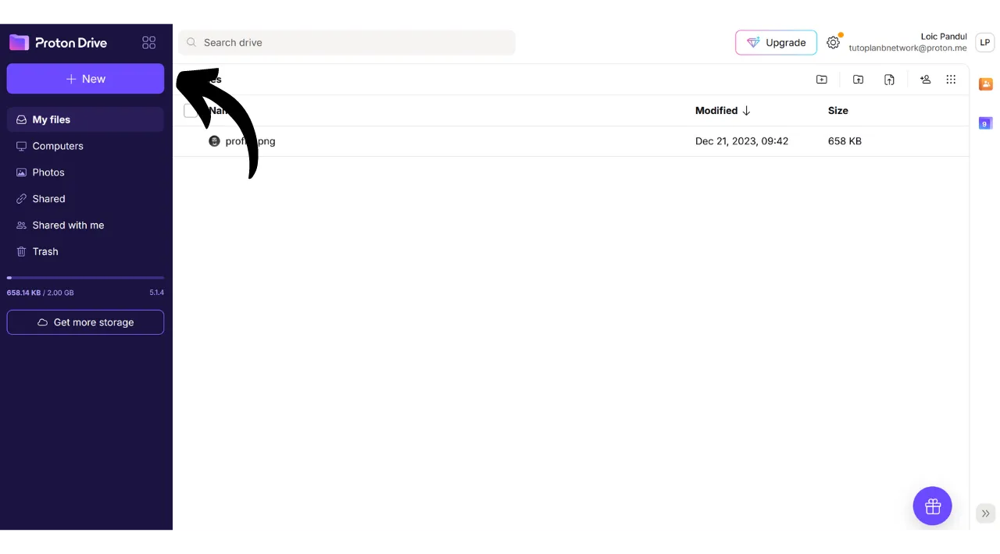

Nykyään on ratkaisevan tärkeää luoda strategia henkilökohtaisten tiedostojen, kuten henkilökohtaisten dokumenttien, valokuvien tai tärkeiden projektien, saatavuuden, turvallisuuden ja varmuuskopioiden varmistamiseksi. Näiden tietojen menettäminen voi olla katastrofaalista.

Välttääksesi nämä ongelmat, suosittelen ylläpitämään useita varmuuskopioita tiedostoistasi eri medioilla. Tietotekniikassa yleisesti käytetty strategia on "3-2-1" varmuuskopiointistrategia, joka varmistaa tiedostojesi suojan:
- **3** kappaletta tiedostoistasi;
- Tallennettuna ainakin **2** eri tyyppiselle medialle;
- Vähintään **1** kopio säilytetään ulkoisesti.

Toisin sanoen on suositeltavaa säilyttää tiedostoja 3 eri paikassa, käyttäen eri tyyppisiä medioita, kuten tietokonettasi, ulkoista kovalevyä, USB-tikkua tai online-tallennuspalvelua. Ja lopuksi, ulkoisen kopion säilyttäminen tarkoittaa, että sinulla tulisi olla varmuuskopio tallennettuna kodin tai yrityksen ulkopuolelle. Tämä viimeinen kohta auttaa välttämään tiedostojen täydellisen menetyksen paikallisten katastrofien, kuten tulipalojen tai tulvien, sattuessa. Ulkoinen kopio, kaukana kodistasi tai yrityksestäsi, varmistaa, että tietosi säilyvät riippumatta paikallisista riskeistä.

Helpottaaksesi 3-2-1 varmuuskopiointistrategian toteuttamista, voit käyttää online-tallennuspalvelua. Nämä ratkaisut, joita yleisesti kutsutaan "pilveksi", tarjoavat lisäsuojaa tallentamalla tietosi turvallisille palvelimille, jotka ovat saavutettavissa mistä tahansa laitteesta. Termi "pilvi" viittaa yksinkertaisesti tietojen tallentamiseen ulkoisille palvelimille.

Monet ihmiset käyttävät suurten digitaalisten yritysten tallennusratkaisuja: Google Drive, Microsoft OneDrive tai Apple iCloud.

Nämä ratkaisut ovat käteviä päivittäisessä käytössä ja takaavat tietojesi saatavuuden, mutta ne eivät takaa luottamuksellisuutta. Tässä oppaassa ehdotan toisen ratkaisun tutkimista, joka on yhtä helppokäyttöinen kuin Big Techin tallennustyökalut, mutta tarjoaa lisätoimenpiteitä yksityisyytesi suojaamiseksi. Tämä ratkaisu on Proton Drive, sveitsiläisen Proton-yrityksen online-tallennustyökalu. Näemme myös, miten helposti toteuttaa 3-2-1 strategia, joka soveltuu päivittäiseen käyttöön.

## Johdanto Proton Driveen
Proton Drive on mielenkiintoinen ratkaisu online-tallennukseen, koska se yhdistää helppokäyttöisyyden tiedostojesi turvallisuuteen. Toisin kuin perinteiset pilvipalvelut teknologiajäteiltä, Proton Drive toteuttaa toimenpiteitä yksityisyytesi suojaamiseksi. Se varmistaa tiedostoillesi päästä päähän -salauksen, mikä tarkoittaa, että edes Protonin tiimit eivät pääse käsiksi tietoihisi. Lisäksi Proton Drive on avoimen lähdekoodin, mikä mahdollistaa riippumattomien asiantuntijoiden vapaan ohjelmiston koodin tarkastelun.

Protonin liiketoimintamalli perustuu tilausjärjestelmään, mikä on rauhoittavaa, sillä se viittaa siihen, että yritys saa rahoitusta ilman, että sen tarvitsee välttämättä hyödyntää käyttäjiensä tietoja. Tässä oppaassa selitän, miten käyttää Proton Driven ilmaista versiota, mutta tarjolla on myös useita tilaustasoja, jotka tarjoavat enemmän ominaisuuksia. Tämä liiketoimintamalli on suositeltavampi kuin Big Techin tyylinen ilmainen järjestelmä, joka saattaa herättää kysymyksen, käytetäänkö henkilökohtaisia tietojamme voiton tavoitteluun. Protonin kanssa näin ei vaikuta olevan.

Proton Drive tarjoaa paljon enemmän kuin pelkkiä tallennusvaihtoehtoja; se mahdollistaa myös tiedostojen jakamisen, muokkaamisen ja yhteistyön dokumenttien parissa online-muokkaustyökalujen avulla, samankaltaisesti kuin Googlen ohjelmistopaketti.
Hinnoittelusta [hinnat](https://proton.me/pricing) osalta ilmainen versio tarjoaa jopa 5 GB tallennustilaa ja sisältää olennaiset ominaisuudet. Laajentaaksesi ominaisuuksia 200 GB tallennustilaan, on saatavilla erityinen tilaus Proton Driveen hintaan 4 € kuukaudessa. Toisaalta Proton Unlimited -paketti tarjoaa 10 € kuukaudessa jopa 500 GB tallennustilaa Proton Drivessa, sisältäen lisäksi kaikki Protonin maksulliset palvelut, kuten VPN:n ja salasanojen hallinnan, sekä lisäetuja ilmaisissa työkaluissa (sähköposti ja kalenteri).

## Kuinka luoda Proton-tili?

Jos sinulla ei vielä ole Proton-tiliä, sinun tulee luoda sellainen. Ohjaan sinut Proton Mail -oppaaseemme, jossa selitämme yksityiskohtaisesti, kuinka luoda ilmainen Proton-tili ja ottaa se käyttöön:

https://planb.network/tutorials/others/proton-mail

## Kuinka ottaa Proton Drive käyttöön?

Kirjauduttuasi Proton sähköpostiisi, klikkaa neljän pienen neliön kuvaketta näytön vasemmassa yläkulmassa.

Klikkaa sitten "*Drive*".

Olet nyt Proton Drivessasi.

## Kuinka käyttää Proton Drivea?
Lisätäksesi tiedostoja Proton Driveen, kun käytät yksinomaan web-versiota (käsittelemme paikallisen version käyttöä myöhemmin), sinun tarvitsee vain raahata ja pudottaa dokumenttisi suoraan käyttöliittymään.  Sen jälkeen löydät dokumenttisi kotisivulta.  Lisätäksesi uuden kohteen, klikkaa "*Uusi*" -painiketta näytön vasemmassa yläkulmassa.  "*Lataa tiedosto*" -toiminto avaa paikallisen tiedostonhallintasi, jolloin voit valita ja tuoda uusia dokumentteja Proton Driveen, aivan kuten raahaamalla ja pudottamalla.  "*Lataa kansio*" mahdollistaa kokonaisen kansion tuomisen.  "*Uusi kansio*" mahdollistaa kansion luomisen dokumenttiesi parempaan järjestämiseen Proton Drivessa.  Klikkaa tätä vaihtoehtoa, anna kansiollasi nimi.  Sen jälkeen löydät sen suoraan Proton Driven kotisivulta.  Lopuksi, "*Uusi dokumentti*" mahdollistaa uuden tekstidokumentin luomisen suoraan Proton Drivessa.  Klikkaamalla sitä, uusi tyhjä dokumentti avautuu.  Voit kirjoittaa siihen ja muokata sitä.  Jos klikkaat "*Jaa*" -painiketta näytön oikeassa yläkulmassa, voit jakaa dokumentin.  Sinun tarvitsee vain syöttää sen henkilön sähköpostiosoite, jonka kanssa haluat jakaa dokumentin, joko vain luku -oikeudella tai muokkausoikeuksilla.  Jos palaat takaisin Proton Driveesi, näet, että dokumentti on tallennettu onnistuneesti.  "*Jaetut*" -välilehdessä voit löytää dokumentit, jotka olet jakanut muiden kanssa.  Ja "*Minulle jaetut*" -välilehdessä voit nähdä dokumentit, jotka muut ovat jakaneet sinulle.  Lopuksi, "*Roskakori*" -välilehdessä voit löytää äskettäin poistamasi dokumentit.  Useimmat asetukset Proton Driveesi on integroitu Proton-tiliisi. Tarkempien ohjeiden saamiseksi tilisi asettamiseen, kutsun sinut tutustumaan tähän opastukseen:
https://planb.network/tutorials/others/proton-mail

## Miten asentaa Proton Drive -ohjelmisto?
Proton Drive tarjoaa myös ohjelmiston, joka mahdollistaa paikallisten tiedostojen synkronoinnin online-tallennustilasi kanssa. Tämä ominaisuus helpottaa ja automatisoi 3-2-1-varmuuskopiointistrategiamme toteuttamista. Proton Drive -ohjelmiston avulla saat 2 synkronoitua tiedostokopiota: toisen tietokoneellesi ja toisen Protonin palvelimille, täyttäen siten kahden median tyypin ja sijainnin ulkopuolisen varmuuskopion kriteerit. Sinun tarvitsee vain luoda kolmas kopio, jonka asetamme myöhemmin.
Ohjelmiston käyttämiseksi, klikkaa "*Tietokoneet*" -välilehteä Proton Drive -tililläsi ja valitse käyttöjärjestelmääsi vastaava painike jatkaaksesi latausta.
Kun olet asentanut ohjelman, sinun tulee kirjautua sisään avataksesi tilisi, ja sitten klikata "*Kirjaudu sisään*".

Valitse paikalliset tiedostot, jotka haluat synkronoida Proton Driveen.

Esimerkiksi minä valitsin vain "*Proton Backup*" -kansion. Sen jälkeen klikkaa "*Jatka*" -painiketta.

Tämän jälkeen päädyt ohjelmiston käyttöliittymään, joka on samankaltainen kuin web-sovelluksessa.

Tästä lähtien sinulla on tietokoneellasi paikallisesti kansio nimeltä "*Proton Drive*", joka kokoaa kaikki Protonin online-palvelussa säilytetyt dokumenttisi. Jos lisäät tiedoston tähän kansioon tietokoneeltasi, löydät sen automaattisesti Proton Drive -websovelluksen etusivulta, ja päinvastoin. Ohjelmiston asennuksen aikana synkronoimiesi kansioiden osalta voit myös löytää ne online-palvelusta menemällä Proton Driven "*Tietokoneet*" -osioon ja valitsemalla tietokoneesi.

Näin ollen kaikki tiedostosi varmuuskopioidaan ja synkronoidaan sekä paikallisesti koneellasi että Proton Driven online-palvelimilla.

## Kuinka tehdä varmuuskopio Proton Drivesta?

Jos olet noudattanut edellisiä vaiheita, sinulla on nyt kaksi erillistä varmuuskopiointipaikkaa tärkeille tiedostoillesi. Jotta voimme täydentää 3-2-1 varmuuskopiointistrategiamme, meidän tarvitsee lisätä kolmas kopio.
Ehdotan, että suoritat tämän lisävarmuuskopioinnin ulkoiselle medialle, kuten ulkoiselle kovalevylle tai USB-tikulle esimerkiksi. Käyttösi intensiteetistä riippuen aseta sopiva varmuuskopioiden päivitystiheys (viikoittain, kuukausittain, puolivuosittain...). Valitsemallasi aikavälillä sinun tulee ladata koko Proton Drivesi varmuuskopioidaksesi tiedot valitulle ulkoiselle medialle. Näin ollen, jopa tietokoneesi varkauden ja Protonin palvelimien samanaikaisen tuhoutumisen tapauksessa, säilytät silti turvallisen pääsyn tiedostoihisi USB-tikun kopion ansiosta.

Tätä varten, mene Proton Driveesi.

Valitse kaikki tiedostosi.

Klikkaa sitten pientä nuolta ladataksesi ne.

Toistamme sitten operaation tietokoneeltamme synkronoitujen tiedostojen kanssa.

Löydät sitten .zip-tiedostoja latauksistasi. Yhdistä vain valitsemasi ulkoinen media tietokoneeseesi, ja siirrä sitten nämä tiedostot sille.

Jos olet huolissasi siitä, että tämä USB-tikku saatetaan varastaa, harkitse sen salaamista ohjelmistolla, kuten VeraCrypt (teemme pian tutoriaalin tästä ohjelmistosta).

Onnittelut, sinulla on nyt erittäin vankka 3-2-1 varmuuskopiointistrategia, joka mahdollistaa merkittävästi riskin vähentämisen menettää pääsy henkilökohtaisiin dokumentteihisi, missä tahansa olosuhteissa. Valitsemalla Proton Driven online-varmuuskopioillesi, hyödyt myös päästä päähän salauksesta, joka takaa yksityisyytesi suojan.

Lisätietoja online-läsnäolosi turvaamisesta ja hakkeroinnin välttämisestä suosittelemme myös tutustumaan yksityiskohtaiseen tutoriaaliimme Bitwarden salasananhallintaohjelmasta:

https://planb.network/tutorials/others/bitwarden