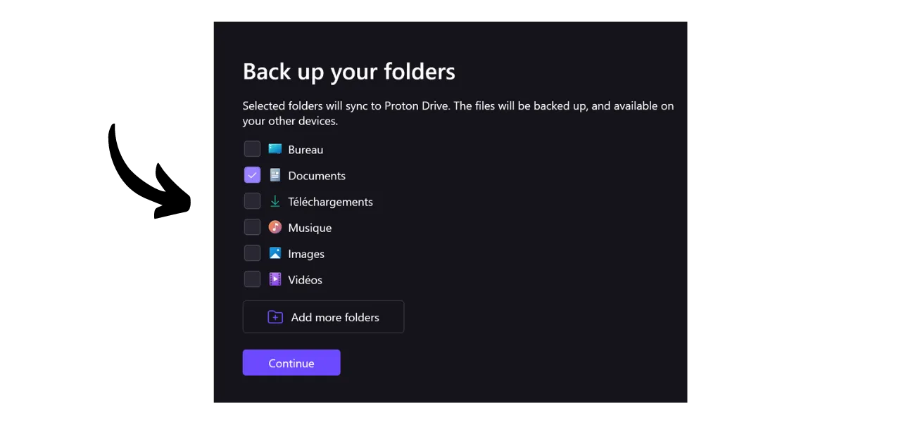

Saat ini, sangat penting untuk menetapkan strategi untuk memastikan aksesibilitas, keamanan, dan backup file pribadi Anda, seperti dokumen pribadi, foto, atau proyek penting. Kehilangan data ini bisa menjadi bencana.

Untuk mencegah masalah ini, saya menyarankan untuk menjaga beberapa backup file Anda di media yang berbeda. Strategi yang umum digunakan dalam komputasi adalah strategi backup "3-2-1", yang menjamin perlindungan file Anda:
- **3** salinan file Anda;
- Disimpan setidaknya pada **2** jenis media yang berbeda;
- Dengan setidaknya **1** salinan disimpan di lokasi lain.

Dengan kata lain, disarankan untuk menyimpan file Anda di 3 lokasi yang berbeda, menggunakan jenis media yang berbeda, seperti komputer Anda, hard drive eksternal, USB stick, atau layanan penyimpanan online. Dan akhirnya, memiliki salinan di lokasi lain berarti Anda harus memiliki backup yang disimpan di luar rumah atau bisnis Anda. Poin terakhir ini membantu menghindari kehilangan total file Anda dalam kasus bencana lokal seperti kebakaran atau banjir. Salinan eksternal, yang jauh dari rumah atau bisnis Anda, memastikan bahwa data Anda akan bertahan terlepas dari risiko lokal.

Untuk memfasilitasi implementasi strategi backup 3-2-1, Anda dapat menggunakan layanan penyimpanan online. Solusi ini, yang umumnya disebut sebagai "cloud," menawarkan perlindungan tambahan dengan menyimpan data Anda di server yang aman dan dapat diakses dari perangkat apa pun. Istilah "cloud" hanya merujuk pada penyimpanan data di server eksternal.

Banyak orang menggunakan solusi penyimpanan dari perusahaan digital besar: Google Drive, Microsoft OneDrive, atau Apple iCloud.

Solusi ini nyaman untuk penggunaan sehari-hari dan memastikan aksesibilitas data Anda, tetapi mereka tidak menjamin kerahasiaan. Dalam tutorial ini, saya mengusulkan untuk menemukan solusi lain, sama mudahnya digunakan seperti alat penyimpanan dari Big Tech, tetapi dengan langkah tambahan untuk melindungi privasi Anda. Solusi ini adalah Proton Drive, alat penyimpanan online dari perusahaan Swiss, Proton. Kami juga akan melihat bagaimana cara mudah mengimplementasikan strategi 3-2-1 yang cocok untuk penggunaan sehari-hari.

## Pengenalan ke Proton Drive
Proton Drive adalah solusi menarik untuk penyimpanan online karena menggabungkan kemudahan penggunaan dengan keamanan untuk file Anda. Tidak seperti layanan cloud tradisional dari raksasa teknologi, Proton Drive mengimplementasikan langkah-langkah untuk melindungi privasi Anda. Ini memastikan enkripsi end-to-end untuk semua file Anda, yang berarti bahkan tim Proton tidak dapat mengakses data Anda. Selain itu, Proton Drive bersifat open-source, memungkinkan para ahli independen untuk secara bebas mengaudit kode perangkat lunak.

Model bisnis Proton didasarkan pada sistem berlangganan, yang menenangkan karena menunjukkan bahwa perusahaan didanai tanpa harus mengeksploitasi data penggunanya. Dalam tutorial ini, saya akan menjelaskan cara menggunakan versi gratis dari Proton Drive, tetapi ada juga beberapa tingkat langganan yang menawarkan lebih banyak fitur. Model bisnis ini lebih disukai daripada sistem gratis ala Big Tech, yang mungkin membuat seseorang bertanya-tanya apakah data pribadi kita digunakan untuk keuntungan. Hal ini tampaknya tidak terjadi dengan Proton.

Proton Drive menawarkan lebih dari sekadar opsi penyimpanan; ini juga memungkinkan berbagi, mengedit, dan berkolaborasi dalam dokumen online dengan alat pengeditan, serupa dengan suite perangkat lunak Google.
Mengenai [penetapan harga](https://proton.me/pricing), versi gratis menawarkan hingga 5 GB penyimpanan dan mencakup fitur-fitur esensial. Untuk memperluas kemampuan hingga 200 GB penyimpanan, tersedia langganan khusus Proton Drive seharga 4 € per bulan. Paket Proton Unlimited, di sisi lain, menawarkan untuk 10 € per bulan ruang penyimpanan hingga 500 GB di Proton Drive, selain termasuk semua layanan berbayar Proton, seperti VPN dan pengelola kata sandi, serta manfaat tambahan pada alat gratis (email dan kalender).

## Bagaimana cara membuat akun Proton?

Jika Anda belum memiliki akun Proton, Anda perlu membuat satu. Saya mengarahkan Anda ke tutorial Proton Mail kami di mana kami menjelaskan secara detail cara membuat akun Proton gratis dan mengaturnya:

https://planb.network/tutorials/others/proton-mail

## Bagaimana cara mengatur Proton Drive?

Setelah masuk ke Proton mail Anda, klik pada ikon dengan empat kotak kecil di pojok kiri atas layar.

Kemudian klik pada "*Drive*".

Anda sekarang berada di Proton Drive Anda.

## Bagaimana cara menggunakan Proton Drive?
Untuk menambahkan file ke Proton Drive Anda, ketika Anda hanya menggunakan versi web (kami akan membahas penggunaan versi lokal nanti), Anda cukup menyeret dan melepaskan dokumen Anda langsung ke dalam antarmuka.  Kemudian Anda dapat menemukan dokumen Anda di halaman utama.  Untuk menambahkan item baru, klik tombol "*Baru*" di kiri atas layar.  Fungsi "*Unggah file*" membuka penjelajah file lokal Anda, memungkinkan Anda untuk memilih dan mengimpor dokumen baru ke Proton Drive, sama seperti Anda akan melakukannya dengan menyeret dan melepaskan.  "*Unggah folder*" memungkinkan Anda untuk mengimpor seluruh folder.  "*Folder baru*" memungkinkan Anda untuk membuat folder untuk mengorganisir dokumen Anda di Proton Drive dengan lebih baik.  Klik pada opsi ini, beri nama pada folder Anda.  Kemudian Anda akan menemukannya langsung di halaman utama Proton Drive.  Akhirnya, "*Dokumen baru*" memungkinkan Anda untuk membuat dokumen teks baru langsung di Proton Drive.  Dengan mengkliknya, dokumen kosong baru terbuka.  Anda dapat menulis di dalamnya dan mengeditnya.  Jika Anda mengklik tombol "*Bagikan*" di kanan atas, Anda dapat membagikan dokumen.  Anda hanya perlu memasukkan email dari kontributor yang ingin Anda berikan akses ke dokumen, baik dalam mode baca-saja atau dengan hak untuk mengedit.  Jika Anda kembali ke Proton Drive Anda, Anda dapat melihat bahwa dokumen telah berhasil disimpan.  Di tab "*Dibagikan*", Anda dapat menemukan dokumen yang telah Anda bagikan dengan orang lain.  Dan di tab "*Dibagikan dengan saya*", Anda dapat melihat dokumen yang telah dibagikan dengan Anda.  Akhirnya, di tab "*Sampah*", Anda dapat menemukan dokumen yang baru-baru ini Anda hapus.  Sebagian besar pengaturan untuk Proton Drive Anda terintegrasi ke dalam akun Proton Anda. Untuk instruksi terperinci tentang pengaturan akun Anda, saya mengundang Anda untuk berkonsultasi dengan tutorial ini:
https://planb.network/tutorials/others/proton-mail

## Bagaimana cara menginstal perangkat lunak Proton Drive?
Proton Drive juga menawarkan perangkat lunak yang memungkinkan sinkronisasi file lokal Anda dengan ruang penyimpanan online Anda. Fitur ini memfasilitasi dan mengotomatiskan implementasi strategi cadangan 3-2-1 kami. Dengan perangkat lunak Proton Drive, Anda memperoleh 2 salinan file yang disinkronkan: satu di komputer Anda dan yang lainnya di server Proton, sehingga memenuhi kriteria dari 2 jenis media dan cadangan di luar lokasi. Anda hanya perlu membuat salinan ketiga, yang akan kami atur nanti.
Untuk menggunakan perangkat lunak, klik pada tab "*Komputer*" di akun Proton Drive Anda dan pilih tombol yang sesuai dengan sistem operasi Anda untuk melanjutkan dengan pengunduhan.
Setelah terinstal, Anda perlu masuk untuk membuka akun Anda, kemudian klik pada "*Sign in*".

Pilih file lokal yang ingin Anda sinkronkan dengan Proton Drive Anda.

Sebagai contoh, saya hanya memilih folder "*Proton Backup*". Kemudian klik tombol "*Continue*".

Anda kemudian akan sampai pada antarmuka perangkat lunak, yang serupa dengan aplikasi web.

Mulai sekarang, Anda akan memiliki folder berjudul "*Proton Drive*" secara lokal di komputer Anda, yang akan mengumpulkan semua dokumen Anda yang tersimpan di Proton secara online. Jika Anda menambahkan file ke folder ini dari komputer Anda, Anda akan secara otomatis menemukannya di halaman utama aplikasi web Proton Drive, dan sebaliknya. Untuk folder yang Anda pilih untuk disinkronkan selama instalasi perangkat lunak, Anda juga dapat menemukannya secara online dengan pergi ke bagian "*Computers*" dari Proton Drive dan kemudian memilih komputer Anda.

Dengan demikian, semua file Anda dicadangkan dan disinkronkan baik secara lokal di mesin Anda maupun di server online Proton Drive.

## Bagaimana cara membuat cadangan dari Proton Drive?

Jika Anda telah mengikuti langkah-langkah sebelumnya, sekarang Anda memiliki 2 lokasi cadangan yang berbeda untuk file penting Anda. Untuk melengkapi strategi cadangan 3-2-1 kami, kita perlu menambahkan salinan ketiga.
Saya sarankan Anda melakukan cadangan tambahan ini pada media eksternal, seperti hard drive eksternal atau USB stick, misalnya. Tergantung pada intensitas penggunaan Anda, tetapkan frekuensi pembaruan cadangan yang sesuai (mingguan, bulanan, semi-tahunan...). Pada setiap interval yang dipilih, Anda perlu mengunduh seluruh Proton Drive Anda untuk mencadangkan data pada media eksternal yang dipilih. Dengan cara ini, bahkan dalam kejadian pencurian komputer Anda dan penghancuran simultan server Proton, Anda masih akan mempertahankan akses aman ke file Anda berkat salinan pada USB stick.

Untuk melakukan ini, pergi ke Proton Drive Anda.

Pilih semua file Anda.

Kemudian klik pada panah kecil untuk mengunduhnya.

Kami kemudian akan mengulangi operasi dengan file kami yang disinkronkan dari komputer kami.

Anda kemudian akan menemukan file .zip di unduhan Anda. Cukup hubungkan media eksternal pilihan Anda ke komputer, dan kemudian transfer file-file ini ke sana.

Jika Anda khawatir USB stick ini mungkin dicuri, pertimbangkan untuk mengenkripsinya dengan perangkat lunak seperti VeraCrypt (kami akan membuat tutorial tentang perangkat lunak ini segera).

Selamat, Anda sekarang memiliki strategi cadangan 3-2-1 yang sangat kuat, yang memungkinkan Anda untuk secara drastis mengurangi risiko kehilangan akses ke dokumen pribadi Anda, apa pun keadaannya. Dengan memilih Proton Drive untuk cadangan online Anda, Anda juga mendapatkan keuntungan dari enkripsi end-to-end, yang menjamin perlindungan privasi Anda.

Untuk mempelajari lebih lanjut tentang mengamankan kehadiran online Anda dan menghindari peretasan, saya juga merekomendasikan untuk berkonsultasi dengan tutorial terperinci kami tentang manajer kata sandi Bitwarden:

https://planb.network/tutorials/others/bitwarden