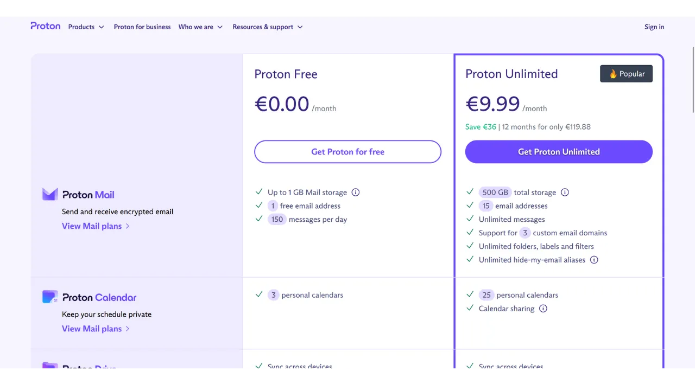
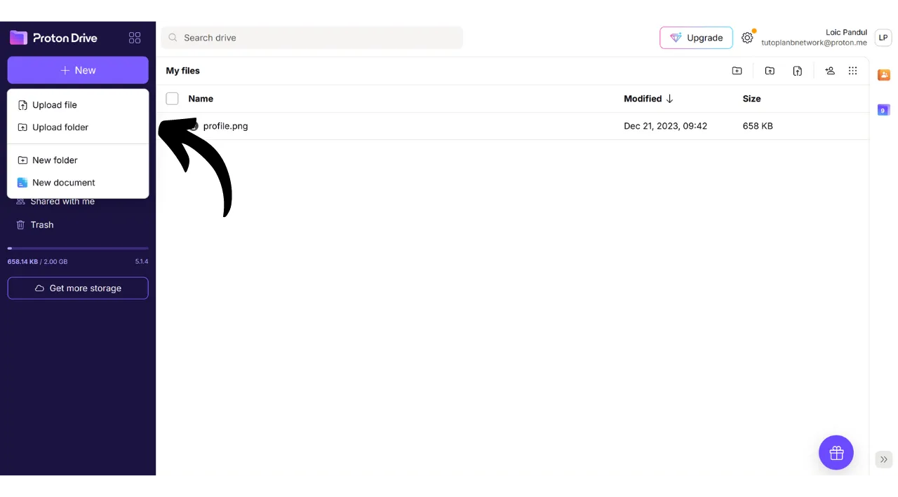

Oggi è importante stabilire una strategia per garantire l'accessibilità, la sicurezza e il backup dei propri file personali, come documenti personali, foto o progetti importanti. La perdita di questi dati può essere catastrofica.

Per prevenire questi problemi, consiglio di mantenere più backup dei tuoi file su diversi supporti. Una strategia comunemente utilizzata nell'informatica è la strategia di backup "3-2-1", che garantisce la protezione dei tuoi file:
- **3** copie dei tuoi file;
- Salvate su almeno **2** tipi diversi di supporti;
- Con almeno **1** copia conservata fuori sede.

In altre parole, è consigliabile conservare i tuoi file in 3 luoghi diversi, utilizzando tipi diversi di supporti, come il tuo computer, un disco rigido esterno, una chiavetta USB o un servizio di archiviazione online. E infine, avere una copia fuori sede significa che dovresti avere un backup conservato fuori dalla tua casa o azienda. Quest'ultimo punto aiuta ad evitare la perdita totale dei tuoi file in caso di disastri locali come incendi o alluvioni. Una copia esterna, distante dalla tua casa o azienda, garantisce che i tuoi dati sopravvivranno indipendentemente dai rischi locali.

Per facilitare l'implementazione della strategia di backup 3-2-1, puoi utilizzare un servizio di archiviazione online. Queste soluzioni, comunemente denominate "cloud", offrono una protezione aggiuntiva memorizzando i tuoi dati su server sicuri accessibili da qualsiasi dispositivo. Il termine "cloud" si riferisce semplicemente alla memorizzazione di dati su server esterni.

Molte persone utilizzano le soluzioni di archiviazione delle principali aziende digitali: Google Drive, Microsoft OneDrive o Apple iCloud.

Queste soluzioni sono comode per l'uso quotidiano e garantiscono l'accessibilità dei tuoi dati, ma non assicurano la confidenzialità. In questo tutorial, propongo di scoprire un'altra soluzione, altrettanto facile da usare quanto gli strumenti di archiviazione di Big Tech, ma con misure aggiuntive per proteggere la tua privacy. Questa soluzione è Proton Drive, lo strumento di archiviazione online della società svizzera Proton. Vedremo anche come implementare facilmente una strategia 3-2-1 adatta all'uso quotidiano.

## Introduzione a Proton Drive
Proton Drive è una soluzione intrigante per l'archiviazione online, poiché combina facilità d'uso con sicurezza per i tuoi file. A differenza dei tradizionali servizi cloud dei giganti tecnologici, Proton Drive implementa misure per proteggere la tua privacy. Garantisce la crittografia end-to-end per tutti i tuoi file, il che significa che nemmeno i team di Proton possono accedere ai tuoi dati. Inoltre, Proton Drive è open-source, consentendo a esperti indipendenti di esaminare liberamente il codice del software.

Il modello di business di Proton si basa su un sistema di abbonamento, il che è rassicurante poiché indica che l'azienda è finanziata senza necessariamente sfruttare i dati dei suoi utenti. In questo tutorial, spiegherò come utilizzare la versione gratuita di Proton Drive, ma ci sono anche diversi livelli di abbonamento che offrono più funzionalità. Questo modello di business è preferibile a un sistema gratuito nello stile di Big Tech, che potrebbe sollevare preoccupazioni su come i nostri dati personali vengano utilizzati a scopo di lucro. Questo non sembra essere il caso di Proton.

Proton Drive offre molto più di semplici opzioni di archiviazione; consente anche di condividere, modificare e collaborare a documenti online con strumenti di editing, simili alla suite software di Google.
Riguardo al [prezzo](https://proton.me/pricing), la versione gratuita offre fino a 5 GB di spazio di archiviazione e include le funzionalità essenziali. Per espandere le capacità fino a 200 GB di spazio di archiviazione, è disponibile un abbonamento specifico a Proton Drive per 4€ al mese. Il piano Proton Unlimited, d'altra parte, offre fino a 500 GB di spazio su Proton Drive per 10€ al mese, oltre a includere tutti i servizi a pagamento di Proton, come la VPN e il gestore di password, così come benefici aggiuntivi sugli strumenti gratuiti (email e calendario). 
## Come creare un account Proton?

Se non hai ancora un account Proton, dovrai crearne uno. Ti rimando al nostro tutorial su Proton Mail in cui spieghiamo dettagliatamente come creare un account Proton gratuito e configurarlo:

https://planb.network/tutorials/others/proton-mail

## Come configurare Proton Drive?

Una volta effettuato l'accesso alla tua mail Proton, clicca sull'icona con quattro piccoli quadrati in alto a sinistra dello schermo.

Poi clicca su "*Drive*".

Ora sei sul tuo Proton Drive.

## Come usare Proton Drive?
Per aggiungere file al tuo Proton Drive, se stai usando esclusivamente la versione web (discuteremo dell'uso della versione locale più avanti), devi semplicemente trascinare e rilasciare i tuoi documenti direttamente nell'interfaccia.

Potrai poi trovare il tuo documento nella homepage.

Per aggiungere un nuovo elemento, clicca sul pulsante "*Nuovo*" in alto a sinistra dello schermo.

La funzione "*Carica file*" apre l'esplora file locale, permettendoti di selezionare e importare nuovi documenti su Proton Drive, proprio come faresti trascinandoli e rilasciandoli.

"*Carica cartella*" ti permette di importare un'intera cartella.

"*Nuova cartella*" ti consente di creare una cartella per organizzare meglio i tuoi documenti su Proton Drive.

Clicca su questa opzione, assegna un nome alla tua cartella.

Poi la troverai direttamente sulla homepage di Proton Drive.

Infine, "*Nuovo documento*" ti permette di creare un nuovo documento di testo direttamente in Proton Drive.

Cliccandoci sopra, si apre un nuovo documento vuoto.

Puoi scriverci sopra e modificarlo.

Se clicchi sul pulsante "*Condividi*" in alto a destra, puoi condividere il documento.

Devi semplicemente inserire l'email del collaboratore a cui desideri dare accesso al documento, sia in sola lettura che con diritti di modifica.

Se torni al tuo Proton Drive, puoi vedere che il documento è stato salvato.
Nella scheda "*Condivisi*", puoi trovare i documenti che hai condiviso con altri.
E nella scheda "*Condivisi con me*", puoi vedere i documenti che altri hanno condiviso con te.
Infine, nella scheda "*Cestino*", puoi trovare i tuoi documenti recentemente eliminati.
La maggior parte delle impostazioni per il tuo Proton Drive sono integrate nel tuo account Proton. Per istruzioni dettagliate su come configurare il tuo account, ti invito a consultare questo tutorial:

https://planb.network/tutorials/others/proton-mail

## Come installare il software Proton Drive?
Proton Drive offre anche un software che consente la sincronizzazione dei tuoi file locali con il tuo spazio di archiviazione online. Questa funzionalità facilita e automatizza l'implementazione della nostra strategia di backup 3-2-1. Con il software Proton Drive, ottieni 2 copie sincronizzate dei tuoi file: una sul tuo computer e l'altra sui server di Proton, soddisfacendo così i criteri di 2 tipi di media e backup fuori sede. Devi semplicemente creare una terza copia, che configureremo in seguito.
Per utilizzare il software, clicca sulla scheda "*Computer*" sul tuo account Proton Drive e seleziona il pulsante corrispondente al tuo sistema operativo per procedere con il download.
Una volta installato, dovrai accedere per sbloccare il tuo account, quindi cliccare su "*Accedi*".
Seleziona i file locali che desideri sincronizzare con il tuo Proton Drive.
Ad esempio, ho selezionato solo la cartella "*Proton Backup*". Poi clicca sul pulsante "*Continua*".
Arriverai quindi all'interfaccia del software, che è simile all'applicazione web.
Da ora in poi, avrai una cartella intitolata "*Proton Drive*" localmente sul tuo computer, che raggrupperà tutti i tuoi documenti memorizzati online su Proton. Se aggiungi un file a questa cartella dal tuo computer, lo troverai automaticamente sulla homepage dell'applicazione web di Proton Drive, e viceversa. Per le cartelle che hai scelto di sincronizzare durante l'installazione del software, puoi anche trovarle online andando nella sezione "*Computer*" di Proton Drive e poi selezionando il tuo computer.
In questo modo, tutti i tuoi file sono salvati e sincronizzati sia localmente sulla tua macchina sia sui server online di Proton Drive.

## Come fare il backup di Proton Drive?

Se hai seguito i passaggi precedenti, ora hai 2 ubicazioni di backup distinte per i tuoi file importanti. Per completare la nostra strategia di backup 3-2-1, dobbiamo aggiungere una terza copia.
Ti suggerisco di eseguire questo backup aggiuntivo su un supporto esterno, come un disco rigido o una chiavetta USB, ad esempio. A seconda dell'intensità del tuo utilizzo, stabilisci una frequenza di aggiornamento del backup appropriata (settimanale, mensile, semestrale...). Ad ogni intervallo scelto, dovrai scaricare l'intero contenuto del tuo Proton Drive per eseguire il backup dei dati sul supporto esterno scelto. In questo modo, anche in caso di furto del tuo computer e della simultanea distruzione dei server di Proton, manterrai comunque un accesso sicuro ai tuoi file grazie alla copia sulla chiavetta USB.
Per fare ciò, vai su Proton Drive.

Seleziona tutti i tuoi file.

Poi clicca sulla piccola freccia per scaricarli.

Ripeteremo quindi l'operazione con i nostri file sincronizzati dal nostro computer.

Troverai quindi file .zip nei tuoi download. Semplicemente collega il supporto esterno di tua scelta al tuo computer, e poi trasferisci questi file su di esso.

Se sei preoccupato che questa chiavetta USB possa essere rubata, considera di criptarla con software come VeraCrypt (realizzeremo presto un tutorial su questo software).

Congratulazioni, ora hai una strategia di backup 3-2-1 molto robusta, che ti permette di ridurre drasticamente il rischio di perdere l'accesso ai tuoi documenti personali, qualunque siano le circostanze. Scegliendo Proton Drive per i tuoi backup online, benefici anche della crittografia end-to-end, che garantisce la protezione della tua privacy.

Per saperne di più su come proteggere la tua presenza online ed evitare il hacking, ti consiglio anche di consultare il nostro tutorial dettagliato sul gestore di password Bitwarden:

https://planb.network/tutorials/others/bitwarden