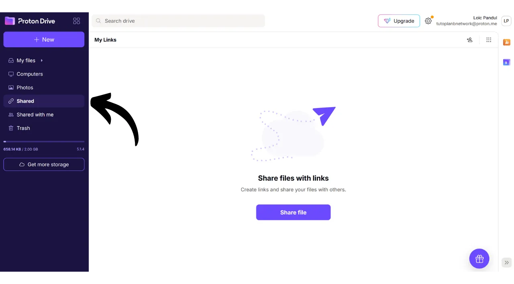
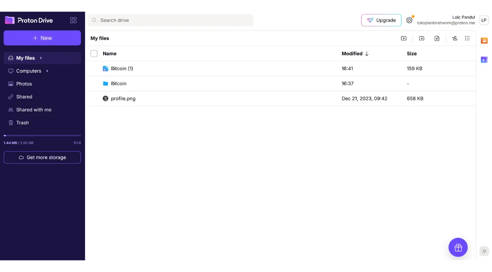

現代では、個人文書、写真、重要なプロジェクトなど、個人ファイルのアクセシビリティ、セキュリティ、バックアップ戦略を確立することが重要です。これらのデータを失うことは、壊滅的な結果を招く可能性があります。

これらの問題を防ぐために、異なるメディア上でファイルの複数のバックアップを維持することをお勧めします。コンピューティングで一般的に使用される戦略は、「3-2-1」バックアップ戦略であり、ファイルの保護を保証します：
- ファイルの**3**つのコピー；
- 少なくとも**2**種類の異なるメディアに保存される；
- 少なくとも**1**つのコピーをオフサイトに保管する。

言い換えれば、異なる種類のメディアを使用して、3つの異なる場所にファイルを保存することが望ましいです。例えば、コンピューター、外付けハードドライブ、USBスティック、またはオンラインストレージサービスなどです。そして最後に、オフサイトにコピーを持つということは、自宅やビジネスの外にバックアップを保管するべきだということを意味します。この最後の点は、火災や洪水などの地元の災害の場合に、ファイルの全損を避けるのに役立ちます。自宅やビジネスから遠い外部のコピーは、地元のリスクに関係なく、あなたのデータが生き残ることを保証します。

3-2-1バックアップ戦略の実装を容易にするために、オンラインストレージサービスを使用できます。これらのソリューションは一般的に「クラウド」と呼ばれ、任意のデバイスからアクセス可能なセキュアなサーバー上にデータを保存することで、追加の保護を提供します。「クラウド」という用語は単に、外部サーバー上にデータを保存することを指します。

多くの人々は、Google Drive、Microsoft OneDrive、またはApple iCloudなど、大手デジタル企業のストレージソリューションを使用しています。

これらのソリューションは日常使用に便利で、データのアクセシビリティを保証しますが、機密性を保証するものではありません。このチュートリアルでは、Big Techのストレージツールと同じくらい使いやすい別のソリューションを紹介しますが、プライバシーを保護するための追加の措置があります。このソリューションは、スイスの企業Protonが提供するオンラインストレージツールであるProton Driveです。また、日常使用に適した3-2-1戦略を簡単に実装する方法も見ていきます。

## Proton Driveの紹介
Proton Driveは、ファイルのセキュリティと使いやすさを組み合わせたオンラインストレージの興味深いソリューションです。テックジャイアントの従来のクラウドサービスとは異なり、Proton Driveはあなたのプライバシーを保護する措置を実装しています。すべてのファイルに対してエンドツーエンドの暗号化を保証し、これはProtonのチームでさえあなたのデータにアクセスできないことを意味します。さらに、Proton Driveはオープンソースであり、独立した専門家がソフトウェアのコードを自由に監査できます。

Protonのビジネスモデルは、サブスクリプションシステムに基づいており、これは会社が必ずしもユーザーのデータを搾取することなく資金を得ていることを示しているため、安心です。このチュートリアルでは、Proton Driveの無料バージョンの使用方法を説明しますが、より多くの機能を提供するいくつかのサブスクリプションレベルもあります。このビジネスモデルは、個人データが利益のために使用されているかどうかについての懸念を引き起こす可能性のあるBig Techのスタイルの無料システムよりも好ましいです。Protonの場合、このようなことはないようです。

Proton Driveは、単なるストレージオプション以上のものを提供します。Googleのソフトウェアスイートに似た編集ツールを使用して、オンラインで文書の共有、編集、共同作業も可能です。
[価格設定](https://proton.me/pricing)に関して、無料版では最大5GBのストレージが提供され、基本的な機能が含まれています。200GBのストレージを利用可能にするためには、Proton Driveの特定のサブスクリプションが月額€4で利用できます。一方、Proton Unlimitedプランでは、月額€10でProton Drive上で最大500GBのストレージを提供する他、VPNやパスワードマネージャーなど、Protonの有料サービス全てが含まれ、無料ツール（メールとカレンダー）に追加の特典があります。
## Protonアカウントの作成方法は？

まだProtonアカウントをお持ちでない場合は、アカウントを作成する必要があります。無料のProtonアカウントの作成と設定方法を詳しく説明しているProton Mailチュートリアルを参照してください：

https://planb.network/tutorials/others/proton-mail

## Proton Driveの設定方法は？

Protonメールにログインしたら、画面の左上にある小さな四角いアイコンをクリックします。

次に、"*Drive*"をクリックします。

これで、あなたはProton Driveにいます。

## Proton Driveの使用方法は？
Proton Driveにファイルを追加するには、ウェブ版を専用で使用している場合（ローカル版の使用については後で説明します）、ドキュメントを直接インターフェースにドラッグアンドドロップするだけです。

その後、ホームページでドキュメントを見つけることができます。

新しいアイテムを追加するには、画面の左上にある"*New*"ボタンをクリックします。

"*Upload file*"機能は、ローカルのファイルエクスプローラーを開き、ドラッグアンドドロップするのと同じように、新しいドキュメントをProton Driveに選択してインポートすることができます。

"*Upload folder*"は、フォルダー全体をインポートすることができます。

"*New folder*"は、Proton Drive上でドキュメントをより整理するためのフォルダーを作成することができます。

このオプションをクリックし、フォルダーに名前を付けます。

すると、Proton Driveのホームページに直接表示されます。

最後に、"*New document*"は、Proton Drive内に新しいテキストドキュメントを直接作成することができます。

それをクリックすると、新しい空白のドキュメントが開きます。

その上で文章を書いたり、編集したりすることができます。

右上にある"*Share*"ボタンをクリックすると、ドキュメントを共有することができます。

その後、ドキュメントへのアクセスを許可したい寄稿者のメールアドレスを入力するだけで、読み取り専用または編集権限を与えることができます。

Proton Driveに戻ると、ドキュメントが保存されていることがわかります。
「*共有*」タブでは、他の人と共有したドキュメントを見つけることができます。

そして、「*私と共有された*」タブでは、他の人があなたと共有したドキュメントを確認できます。

最後に、「*ゴミ箱*」タブでは、最近削除したドキュメントを見つけることができます。

Proton Driveのほとんどの設定は、Protonアカウントに統合されています。アカウントの設定方法についての詳細な指示については、このチュートリアルを参照してください：

https://planb.network/tutorials/others/proton-mail

## Proton Driveソフトウェアのインストール方法は？
Proton Driveは、ローカルファイルをオンラインストレージスペースと同期させるソフトウェアも提供しています。この機能により、3-2-1バックアップ戦略の実装が容易になり、自動化されます。Proton Driveソフトウェアを使用すると、ファイルの2つの同期コピーを取得できます：1つはコンピューター上に、もう1つはProtonのサーバー上にあり、これにより2種類のメディアとオフサイトバックアップの基準を満たします。単に第三のコピーを作成する必要がありますが、これについては後で設定します。
ソフトウェアを使用するには、Proton Driveアカウントの「*コンピューター*」タブをクリックし、ダウンロードを進めるために対応するオペレーティングシステムのボタンを選択します。

インストールが完了したら、アカウントのロックを解除するためにサインインする必要があります。その後、「*サインイン*」をクリックします。

Proton Driveと同期したいローカルファイルを選択します。

例えば、私は「*Proton Backup*」フォルダーのみを選択しました。その後、「*続行*」ボタンをクリックします。

すると、ウェブアプリケーションに似たソフトウェアインターフェースに到着します。

これで、コンピューター上に「*Proton Drive*」というタイトルのフォルダーがローカルに作成され、Protonオンライン上に保存されているすべてのドキュメントがこのフォルダーに集約されます。コンピューターからこのフォルダーにファイルを追加すると、自動的にProton Driveウェブアプリケーションのホームページに表示され、その逆も同様です。ソフトウェアのインストール中に同期するように選択したフォルダーは、Proton Driveの「*コンピューター*」セクションに移動し、コンピューターを選択することでオンラインでも見つけることができます。

このようにして、すべてのファイルは、コンピューター上のローカルとProton Driveのオンラインサーバーの両方でバックアップされ、同期されます。

## Proton Driveをバックアップする方法は？

前のステップに従っていれば、重要なファイルのための2つの異なるバックアップ場所を持っているはずです。3-2-1バックアップ戦略を完成させるために、第三のコピーを追加する必要があります。
外部メディア、例えばハードドライブやUSBスティックなどに、この追加のバックアップを実行することを提案します。使用の強度に応じて、適切なバックアップ更新頻度（週次、月次、半年ごと...）を設定します。選択した間隔ごとに、Proton Driveの全体をダウンロードして、選択した外部メディア上にデータをバックアップする必要があります。この方法により、コンピューターの盗難とProtonのサーバーの同時破壊が発生しても、USBスティック上のコピーのおかげでファイルへの安全なアクセスを維持できます。
これを行うには、Proton Driveにアクセスしてください。

すべてのファイルを選択します。

次に、小さな矢印をクリックしてダウンロードします。

その後、コンピューターから同期されたファイルで操作を繰り返します。

そうすると、ダウンロードした.zipファイルが見つかります。単にお好みの外部メディアをコンピューターに接続し、それらのファイルを転送するだけです。

このUSBメモリが盗まれることを心配している場合は、VeraCryptのようなソフトウェアで暗号化することを検討してください（このソフトウェアに関するチュートリアルを近々作成します）。

おめでとうございます、これであなたは非常に堅牢な3-2-1バックアップ戦略を持つことになり、どのような状況でも個人文書へのアクセスを失うリスクを大幅に減らすことができます。オンラインバックアップにProton Driveを選択することで、エンドツーエンドの暗号化も利用でき、プライバシーの保護が保証されます。

オンラインでの存在を安全に保ち、ハッキングを避ける方法についてさらに学びたい場合は、Bitwardenパスワードマネージャーに関する詳細なチュートリアルもお勧めします：

https://planb.network/tutorials/others/bitwarden