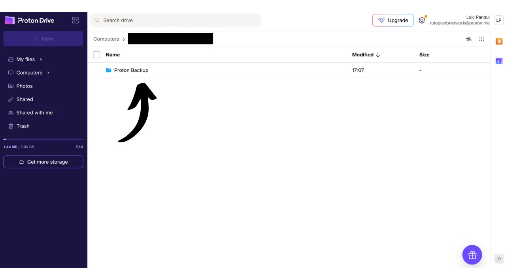

現代では、個人の文書、写真、重要なプロジェクトなど、個人ファイルのアクセシビリティ、セキュリティ、バックアップ戦略を確立することが極めて重要です。これらのデータを失うことは、壊滅的な結果を招く可能性があります。

これらの問題を防ぐために、異なるメディア上にファイルの複数のバックアップを維持することをお勧めします。コンピューティングで一般的に使用される戦略は、「3-2-1」バックアップ戦略であり、ファイルの保護を保証します：
- ファイルの**3**つのコピー；
- 少なくとも**2**種類の異なるメディアに保存される；
- 少なくとも**1**つのコピーをオフサイトに保管する。

言い換えれば、コンピュータ、外付けハードドライブ、USBスティック、またはオンラインストレージサービスなど、異なるタイプのメディアを使用して、3つの異なる場所にファイルを保存することが望ましいです。そして最後に、オフサイトにコピーを保持するということは、自宅やビジネスの外にバックアップを保管するべきであるということを意味します。この最後の点は、火災や洪水などの地元の災害の場合にファイルの全損を避けるのに役立ちます。自宅やビジネスから遠い外部のコピーは、地元のリスクに関係なく、あなたのデータが生き残ることを保証します。

3-2-1バックアップ戦略の実装を容易にするために、オンラインストレージサービスを使用できます。これらのソリューションは一般に「クラウド」と呼ばれ、任意のデバイスからアクセス可能なセキュアなサーバー上にデータを保存することで追加の保護を提供します。「クラウド」という用語は単に外部サーバー上のデータの保存を指します。

多くの人々は、Google Drive、Microsoft OneDrive、またはApple iCloudなど、大手デジタル企業のストレージソリューションを使用しています。

これらのソリューションは日常使用に便利で、データのアクセシビリティを保証しますが、機密性を保証するものではありません。このチュートリアルでは、Big Techのストレージツールと同じくらい使いやすい別のソリューションを紹介しますが、プライバシーを保護するための追加の措置があります。このソリューションは、スイスの企業ProtonからのオンラインストレージツールであるProton Driveです。また、日常使用に適した3-2-1戦略を簡単に実装する方法についても見ていきます。

## Proton Driveの紹介
Proton Driveは、ファイルのセキュリティと使いやすさを組み合わせたオンラインストレージの興味深いソリューションです。テックジャイアンツの従来のクラウドサービスとは異なり、Proton Driveはあなたのプライバシーを保護するための措置を実装しています。すべてのファイルに対してエンドツーエンドの暗号化を保証し、これはProtonのチームでさえあなたのデータにアクセスできないことを意味します。さらに、Proton Driveはオープンソースであり、独立した専門家がソフトウェアのコードを自由に監査できます。

Protonのビジネスモデルは、サブスクリプションシステムに基づいており、これは会社が必ずしもユーザーのデータを搾取することなく資金を得ていることを示しているため、安心できます。このチュートリアルでは、Proton Driveの無料バージョンの使用方法を説明しますが、より多くの機能を提供するいくつかのサブスクリプションレベルもあります。このビジネスモデルは、個人データが利益のために使用されているのではないかと疑問に思わせるかもしれないBig Techの無料システムのスタイルよりも好ましいです。Protonの場合、このようなことはないようです。

Proton Driveは単なるストレージオプション以上のものを提供します。Googleのソフトウェアスイートに似た編集ツールを使用して、オンラインで文書の共有、編集、共同作業も可能です。
[料金について](https://proton.me/pricing)、無料版では最大5GBのストレージが提供され、基本的な機能が含まれています。ストレージを200GBまで拡張するには、Proton Driveの特定のサブスクリプションが月額4ユーロで利用可能です。一方、Proton Unlimitedパッケージは、月額10ユーロでProton Drive上で最大500GBのストレージスペースを提供するほか、VPNやパスワードマネージャーなどProtonの有料サービス全てを含み、無料ツール（メールとカレンダー）に追加の特典もあります。
## Protonアカウントの作成方法

まだProtonアカウントをお持ちでない場合は、アカウントを作成する必要があります。無料のProtonアカウントの作成と設定方法を詳しく説明しているProton Mailチュートリアルを参照してください：

https://planb.network/tutorials/others/proton-mail

## Proton Driveの設定方法

Protonメールにログインしたら、画面の左上にある四つの小さな四角のアイコンをクリックします。

次に、「*Drive*」をクリックします。

これで、あなたはProton Driveにいます。

## Proton Driveの使用方法
Proton Driveにファイルを追加するには、ウェブバージョンを専用で使用している場合（ローカルバージョンの使用については後で説明します）、ドキュメントを直接インターフェースにドラッグアンドドロップするだけです。  その後、ホームページでドキュメントを見つけることができます。  新しいアイテムを追加するには、画面の左上にある「*New*」ボタンをクリックします。  「*Upload file*」機能は、ローカルのファイルエクスプローラーを開き、ドラッグアンドドロップするのと同じように、新しいドキュメントをProton Driveに選択してインポートすることができます。  「*Upload folder*」では、フォルダー全体をインポートできます。  「*New folder*」を使うと、Proton Drive上でドキュメントをより整理しやすくするためのフォルダーを作成できます。  このオプションをクリックし、フォルダーに名前を付けます。  すると、Proton Driveのホームページで直接見つけることができます。  最後に、「*New document*」を使うと、Proton Drive内に新しいテキストドキュメントを直接作成できます。  それをクリックすると、新しい空白のドキュメントが開きます。  それに書き込み、編集することができます。  右上にある「*Share*」ボタンをクリックすると、ドキュメントを共有できます。  ドキュメントにアクセスを許可したい寄稿者のメールアドレスを入力するだけです。読み取り専用モードまたは編集権限で。  Proton Driveに戻ると、ドキュメントが正常に保存されたことがわかります。  「*Shared*」タブでは、他の人と共有したドキュメントを見つけることができます。  そして、「*Shared with me*」タブでは、他の人があなたと共有したドキュメントを見ることができます。  最後に、「*Trash*」タブでは、最近削除したドキュメントを見つけることができます。  Proton Driveのほとんどの設定は、Protonアカウントに統合されています。アカウントの設定方法についての詳細な指示については、このチュートリアルを参照してください：
https://planb.network/tutorials/others/proton-mail

## Proton Driveソフトウェアのインストール方法は？
Proton Driveは、ローカルファイルをオンラインストレージスペースと同期させるソフトウェアも提供しています。この機能は、3-2-1バックアップ戦略の実装を容易にし、自動化します。Proton Driveソフトウェアを使用すると、2つの同期されたファイルコピーを取得します：1つはコンピューター上に、もう1つはProtonのサーバー上にあり、これにより2つのメディアタイプとオフサイトバックアップの基準を満たします。後で設定する第3のコピーを作成するだけです。
ソフトウェアを使用するには、Proton Driveアカウントの「*Computers*」タブをクリックし、ダウンロードを進めるために対応するオペレーティングシステムのボタンを選択します。
インストールが完了したら、アカウントのロックを解除するためにサインインする必要があります。その後、「*サインイン*」をクリックしてください。

Proton Driveと同期したいローカルファイルを選択してください。

例えば、私は「*Proton Backup*」フォルダーのみを選択しました。その後、「*続行*」ボタンをクリックしてください。

すると、ソフトウェアのインターフェースに到達します。これはウェブアプリケーションに似ています。

これからは、コンピューターのローカルに「*Proton Drive*」というタイトルのフォルダーが作成され、Protonオンラインに保存されているすべてのドキュメントがこのフォルダーに集められます。コンピューターからこのフォルダーにファイルを追加すると、自動的にProton Driveウェブアプリケーションのホームページに表示され、その逆も同様です。ソフトウェアのインストール中に同期するように選択したフォルダーは、Proton Driveの「*Computers*」セクションに移動し、コンピューターを選択することでオンラインでも見つけることができます。

このようにして、すべてのファイルは、コンピューターのローカルとProton Driveのオンラインサーバーの両方でバックアップされ、同期されます。

## Proton Driveのバックアップを作成する方法は？

前述の手順に従った場合、重要なファイルのための2つの異なるバックアップ場所を持つことになります。3-2-1バックアップ戦略を完成させるために、第三のコピーを追加する必要があります。
外部メディア、例えば外付けハードドライブやUSBスティックなどに、この追加のバックアップを実行することをお勧めします。使用の強度に応じて、適切なバックアップ更新頻度（週次、月次、半年ごと...）を設定してください。選択した各間隔で、Proton Driveの全データをダウンロードして、選択した外部メディアにデータをバックアップする必要があります。この方法により、コンピューターが盗まれ、Protonのサーバーが同時に破壊された場合でも、USBスティック上のコピーのおかげでファイルへの安全なアクセスを維持できます。

これを行うには、Proton Driveにアクセスしてください。

すべてのファイルを選択してください。

その後、小さな矢印をクリックしてダウンロードします。

次に、コンピューターから同期したファイルと同じ操作を繰り返します。

ダウンロードした.zipファイルが見つかります。単に選択した外部メディアをコンピューターに接続し、これらのファイルを転送してください。

このUSBスティックが盗まれることを心配する場合は、VeraCryptのようなソフトウェアで暗号化することを検討してください（このソフトウェアに関するチュートリアルを近々作成します）。

おめでとうございます、これで非常に堅牢な3-2-1バックアップ戦略を持つことができ、どのような状況でも個人文書へのアクセスを失うリスクを大幅に減らすことができます。オンラインバックアップにProton Driveを選択することで、エンドツーエンドの暗号化も利用でき、プライバシーの保護が保証されます。

オンラインプレゼンスのセキュリティを強化し、ハッキングを避ける方法についてさらに学びたい場合は、Bitwardenパスワードマネージャーに関する詳細なチュートリアルもご覧ください：

https://planb.network/tutorials/others/bitwarden