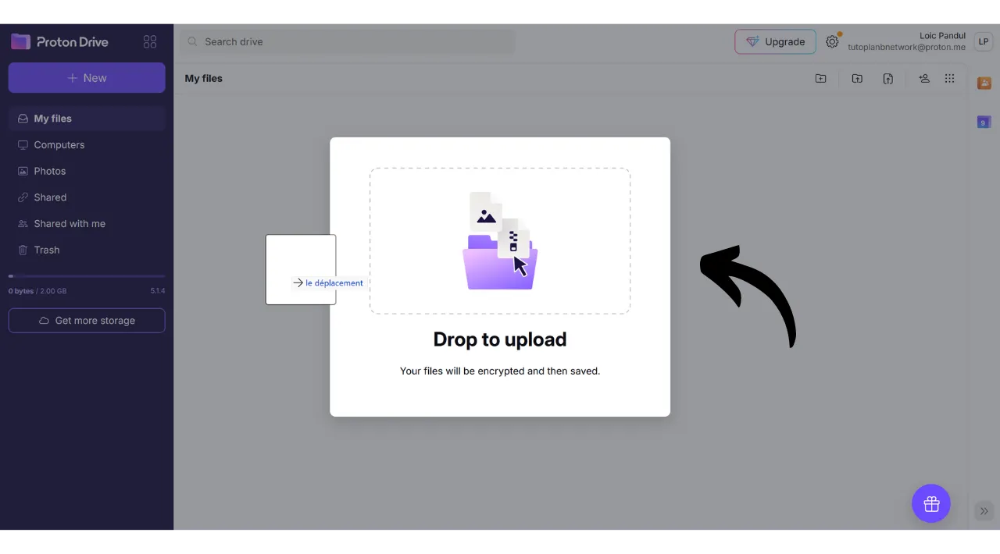
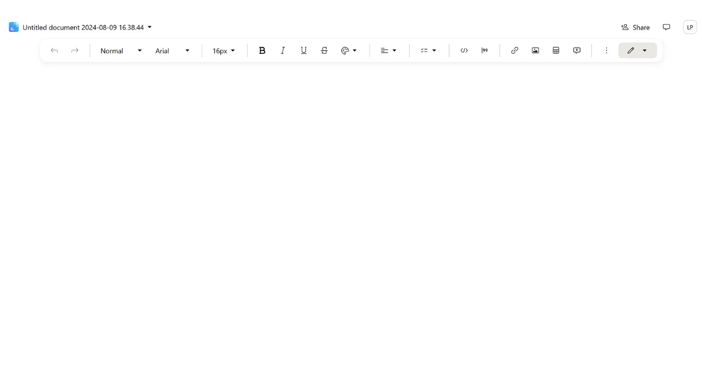
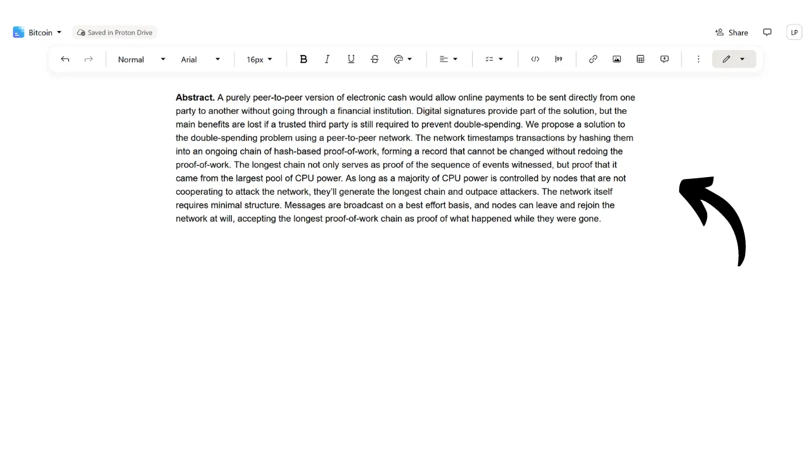

Hoje em dia, é crucial estabelecer uma estratégia para garantir a acessibilidade, segurança e backup de seus arquivos pessoais, como seus documentos pessoais, fotos ou projetos importantes. Perder esses dados pode ser catastrófico.

Para prevenir esses problemas, aconselho manter múltiplos backups de seus arquivos em diferentes mídias. Uma estratégia comumente usada em computação é a estratégia de backup "3-2-1", que garante a proteção de seus arquivos:
- **3** cópias de seus arquivos;
- Salvas em pelo menos **2** tipos diferentes de mídia;
- Com pelo menos **1** cópia mantida fora do local.

Em outras palavras, é aconselhável armazenar seus arquivos em 3 locais diferentes, usando tipos diferentes de mídia, como seu computador, um disco rígido externo, um pendrive ou um serviço de armazenamento online. E, finalmente, ter uma cópia fora do local significa que você deve ter um backup armazenado fora de sua casa ou empresa. Este último ponto ajuda a evitar a perda total de seus arquivos em caso de desastres locais, como incêndios ou inundações. Uma cópia externa, distante de sua casa ou empresa, garante que seus dados sobreviverão independentemente dos riscos locais.

Para facilitar a implementação da estratégia de backup 3-2-1, você pode usar um serviço de armazenamento online. Essas soluções, comumente referidas como "nuvem", oferecem proteção adicional armazenando seus dados em servidores seguros acessíveis de qualquer dispositivo. O termo "nuvem" simplesmente se refere ao armazenamento de dados em servidores externos.

Muitas pessoas usam as soluções de armazenamento de grandes empresas digitais: Google Drive, Microsoft OneDrive ou Apple iCloud.

Essas soluções são convenientes para uso diário e garantem a acessibilidade de seus dados, mas não garantem a confidencialidade. Neste tutorial, proponho descobrir outra solução, tão fácil de usar quanto as ferramentas de armazenamento das Big Techs, mas com medidas adicionais para proteger sua privacidade. Esta solução é o Proton Drive, a ferramenta de armazenamento online da empresa suíça Proton. Veremos também como implementar facilmente uma estratégia 3-2-1 adequada para uso diário.

## Introdução ao Proton Drive
Proton Drive é uma solução intrigante para armazenamento online porque combina facilidade de uso com segurança para seus arquivos. Ao contrário dos serviços tradicionais de nuvem das gigantes da tecnologia, o Proton Drive implementa medidas para proteger sua privacidade. Ele garante criptografia de ponta a ponta para todos os seus arquivos, o que significa que até mesmo as equipes da Proton não podem acessar seus dados. Além disso, o Proton Drive é de código aberto, permitindo que especialistas independentes auditem livremente o código do software.

O modelo de negócios da Proton é baseado em um sistema de assinatura, o que é tranquilizador, pois indica que a empresa é financiada sem necessariamente explorar os dados de seus usuários. Neste tutorial, explicarei como usar a versão gratuita do Proton Drive, mas também existem vários níveis de assinatura oferecendo mais recursos. Este modelo de negócios é preferível a um sistema gratuito ao estilo das Big Techs, o que pode levar alguém a se perguntar se nossos dados pessoais estão sendo usados para lucro. Isso não parece ser o caso com o Proton.

O Proton Drive oferece muito mais do que simples opções de armazenamento; ele também permite compartilhar, editar e colaborar em documentos online com ferramentas de edição, semelhante à suíte de software do Google.
Sobre [preços](https://proton.me/pricing), a versão gratuita oferece até 5 GB de armazenamento e inclui recursos essenciais. Para estender as capacidades para 200 GB de armazenamento, uma assinatura específica do Proton Drive está disponível por 4 € por mês. O pacote Proton Unlimited, por outro lado, oferece por 10 € por mês um espaço de armazenamento de até 500 GB no Proton Drive, além de incluir todos os serviços pagos do Proton, como a VPN e o gerenciador de senhas, bem como benefícios adicionais em ferramentas gratuitas (email e calendário). 
## Como criar uma conta Proton?

Se você ainda não tem uma conta Proton, precisará criar uma. Eu o encaminho para o nosso tutorial do Proton Mail no qual explicamos em detalhes como criar uma conta Proton gratuita e configurá-la:

https://planb.network/tutorials/others/proton-mail

## Como configurar o Proton Drive?

Uma vez logado no seu Proton Mail, clique no ícone com quatro pequenos quadrados no canto superior esquerdo da tela.

Em seguida, clique em "*Drive*".

Você está agora no seu Proton Drive.

## Como usar o Proton Drive?
Para adicionar arquivos ao seu Proton Drive, quando você estiver usando exclusivamente a versão web (discutiremos o uso da versão local mais tarde), você simplesmente precisa arrastar e soltar seus documentos diretamente na interface.  Você pode então encontrar seu documento na página inicial.  Para adicionar um novo item, clique no botão "*Novo*" no canto superior esquerdo da tela.  A função "*Enviar arquivo*" abre o explorador de arquivos local, permitindo que você selecione e importe novos documentos para o Proton Drive, assim como faria arrastando e soltando.  "*Enviar pasta*" permite que você importe uma pasta inteira.  "*Nova pasta*" permite que você crie uma pasta para organizar melhor seus documentos no Proton Drive.  Clique nesta opção, atribua um nome à sua pasta.  Então você a encontrará diretamente na página inicial do Proton Drive.  Finalmente, "*Novo documento*" permite que você crie um novo documento de texto diretamente no Proton Drive.  Ao clicar nisso, um novo documento em branco se abre.  Você pode escrever nele e editá-lo.  Se você clicar no botão "*Compartilhar*" no canto superior direito, você pode compartilhar o documento.  Você só precisa inserir o email do colaborador a quem deseja dar acesso ao documento, seja no modo somente leitura ou com direitos de edição.  Se você voltar ao seu Proton Drive, pode ver que o documento foi salvo com sucesso.  Na aba "*Compartilhados*", você pode encontrar os documentos que compartilhou com outros.  E na aba "*Compartilhados comigo*", você pode ver os documentos que outros compartilharam com você.  Finalmente, na aba "*Lixeira*", você pode encontrar seus documentos recentemente excluídos.  A maioria das configurações para o seu Proton Drive está integrada à sua conta Proton. Para instruções detalhadas sobre a configuração da sua conta, convido você a consultar este tutorial:
https://planb.network/tutorials/others/proton-mail

## Como instalar o software Proton Drive?
O Proton Drive também oferece um software que possibilita a sincronização dos seus arquivos locais com seu espaço de armazenamento online. Este recurso facilita e automatiza a implementação da nossa estratégia de backup 3-2-1. Com o software Proton Drive, você obtém 2 cópias sincronizadas dos seus arquivos: uma no seu computador e a outra nos servidores do Proton, cumprindo assim os critérios de 2 tipos de mídia e backup fora do local. Você simplesmente precisará criar uma terceira cópia, que configuraremos mais tarde.
Para usar o software, clique na aba "*Computadores*" na sua conta Proton Drive e selecione o botão correspondente ao seu sistema operacional para prosseguir com o download.
 Uma vez instalado, você precisará fazer login para desbloquear sua conta e, em seguida, clicar em "*Sign in*".

Selecione os arquivos locais que deseja sincronizar com o seu Proton Drive.

Por exemplo, selecionei apenas a pasta "*Proton Backup*". Em seguida, clique no botão "*Continue*".

Você então chegará à interface do software, que é semelhante à aplicação web.

A partir de agora, você terá uma pasta intitulada "*Proton Drive*" localmente no seu computador, que reunirá todos os seus documentos armazenados no Proton online. Se você adicionar um arquivo a esta pasta do seu computador, automaticamente o encontrará na página inicial da aplicação web do Proton Drive, e vice-versa. Para as pastas que você escolheu sincronizar durante a instalação do software, você também pode encontrá-las online acessando a seção "*Computers*" do Proton Drive e, em seguida, selecionando seu computador.

Assim, todos os seus arquivos são salvos e sincronizados tanto localmente na sua máquina quanto nos servidores online do Proton Drive.

## Como fazer um backup do Proton Drive?

Se você seguiu os passos anteriores, agora tem 2 locais de backup distintos para seus arquivos importantes. Para completar nossa estratégia de backup 3-2-1, precisamos adicionar uma terceira cópia.
Sugiro que você realize este backup adicional em um meio externo, como um disco rígido externo ou um pendrive, por exemplo. Dependendo da intensidade do seu uso, defina uma frequência de atualização de backup apropriada (semanal, mensal, semestral...). Em cada intervalo escolhido, você precisará baixar a totalidade do seu Proton Drive para fazer backup dos dados no meio externo escolhido. Desta forma, mesmo no caso de roubo do seu computador e destruição simultânea dos servidores do Proton, você ainda manterá acesso seguro aos seus arquivos graças à cópia no pendrive.

Para fazer isso, vá até o seu Proton Drive.

Selecione todos os seus arquivos.

Em seguida, clique na pequena seta para baixá-los.

Em seguida, repetiremos a operação com nossos arquivos sincronizados do nosso computador.

Você então encontrará arquivos .zip em seus downloads. Simplesmente conecte o meio externo de sua escolha ao seu computador e, em seguida, transfira esses arquivos para ele.

Se você estiver preocupado que este pendrive possa ser roubado, considere criptografá-lo com softwares como o VeraCrypt (faremos um tutorial sobre este software em breve).

Parabéns, você agora possui uma estratégia de backup 3-2-1 muito robusta, que permite reduzir drasticamente o risco de perder acesso aos seus documentos pessoais, quaisquer que sejam as circunstâncias. Ao escolher o Proton Drive para seus backups online, você também se beneficia da criptografia de ponta a ponta, que garante a proteção da sua privacidade.

Para saber mais sobre como proteger sua presença online e evitar hacking, recomendo também consultar nosso tutorial detalhado sobre o gerenciador de senhas Bitwarden:

https://planb.network/tutorials/others/bitwarden