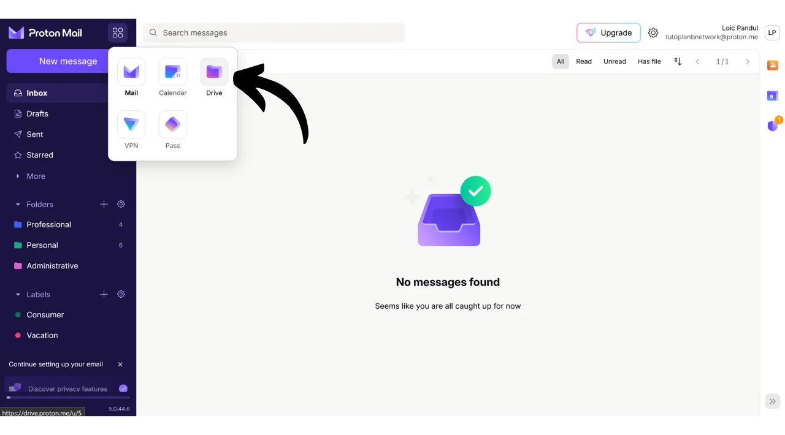
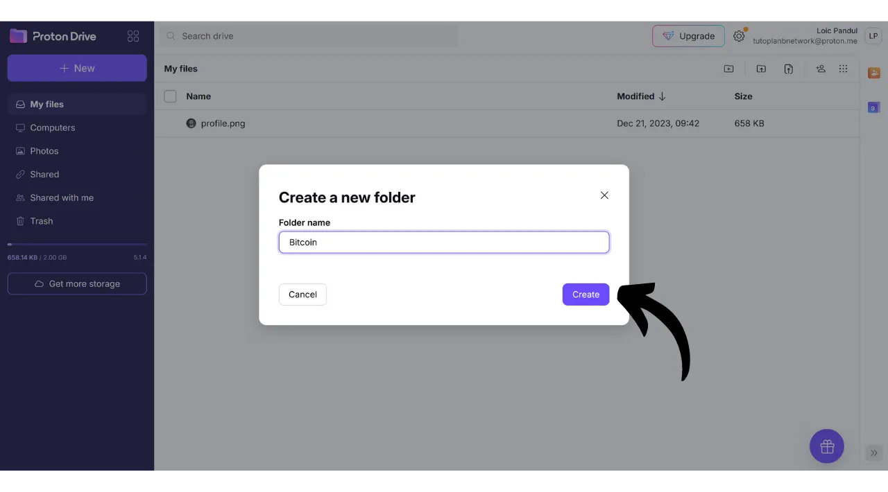
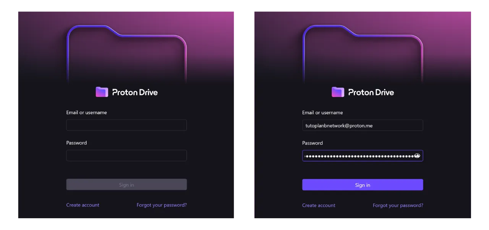
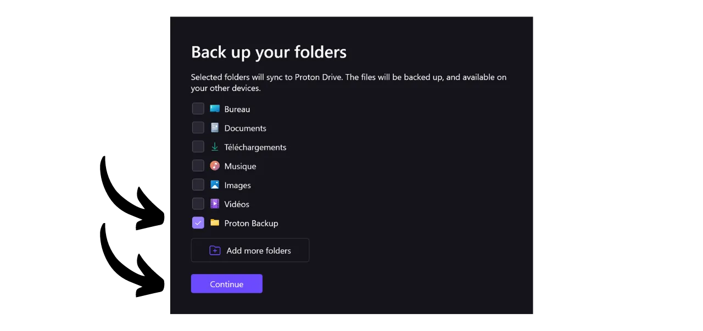
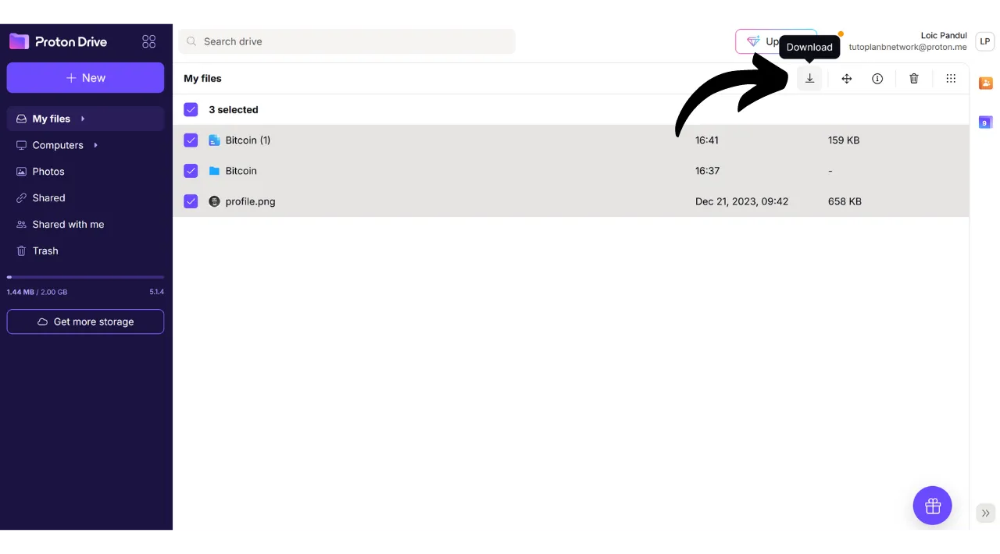

В наше время важно разработать стратегию, чтобы обеспечить доступность, безопасность и резервное копирование ваших личных файлов, таких как личные документы, фотографии или важные проекты. Потеря этих данных может быть катастрофической.

Чтобы предотвратить эти проблемы, я советую вам поддерживать несколько резервных копий ваших файлов на разных носителях. Обычно используемая стратегия в информатике - это стратегия резервного копирования "3-2-1", которая обеспечивает защиту ваших файлов:
- **3** копии ваших файлов;
- Сохраненные как минимум на **2** разных типах носителей;
- С по меньшей мере **1** копией, хранящейся вне места.

Другими словами, рекомендуется хранить ваши файлы в 3 разных местах, используя разные типы носителей, такие как ваш компьютер, внешний жесткий диск, USB-накопитель или онлайн-сервис хранения данных. И, наконец, наличие копии вне места означает, что у вас должна быть резервная копия, хранящаяся вне вашего дома или бизнеса. Этот последний пункт помогает избежать полной потери ваших файлов в случае местных катастроф, таких как пожары или наводнения. Внешняя копия, удаленная от вашего дома или бизнеса, гарантирует, что ваши данные сохранятся независимо от местных рисков.

Для облегчения реализации стратегии резервного копирования 3-2-1 вы можете использовать онлайн-сервис хранения данных. Эти решения, обычно называемые "облаком", предлагают вам дополнительную защиту, храня ваши данные на защищенных серверах, доступных с любого устройства. Термин "облако" просто относится к хранению данных на внешних серверах.

Многие люди используют решения для хранения данных от крупных цифровых компаний: Google Drive, Microsoft OneDrive или Apple iCloud.

Эти решения удобны для ежедневного использования и обеспечивают доступность ваших данных, но они не гарантируют конфиденциальность. В этом руководстве я предлагаю рассмотреть другое решение, так же простое в использовании, как инструменты хранения данных от Big Tech, но с дополнительными мерами защиты вашей конфиденциальности. Это решение - Proton Drive, инструмент онлайн-хранения данных от швейцарской компании Proton. Мы также рассмотрим, как легко реализовать стратегию 3-2-1, подходящую для ежедневного использования.

## Введение в Proton Drive
Proton Drive - это интересное решение для онлайн-хранения данных, поскольку оно сочетает в себе простоту использования с безопасностью для ваших файлов. В отличие от традиционных облачных сервисов от технологических гигантов, Proton Drive внедряет меры для защиты вашей конфиденциальности. Он обеспечивает сквозное шифрование для всех ваших файлов, что означает, что даже команды Proton не могут получить к ним доступ. Более того, Proton Drive является открытым исходным кодом, что позволяет независимым экспертам свободно аудировать код программы.

Бизнес-модель Proton основана на системе подписки, что обнадеживает, поскольку это указывает на то, что компания финансируется без необходимости эксплуатации данных пользователей. В этом руководстве я объясню, как использовать бесплатную версию Proton Drive, но также существует несколько уровней подписки, предлагающих больше функций. Эта бизнес-модель предпочтительнее бесплатной системы в стиле Big Tech, которая могла бы вызвать опасения относительно использования наших личных данных в целях получения прибыли. С Proton такого, похоже, не происходит.

Proton Drive предлагает гораздо больше, чем просто варианты хранения; он также позволяет делиться, редактировать и совместно работать над документами онлайн с помощью инструментов редактирования, аналогичных программному комплекту Google.
Относительно [ценообразования](https://proton.me/pricing), бесплатная версия предлагает до 5 ГБ хранилища и включает основные функции. Для расширения возможностей до 200 ГБ хранилища доступна специальная подписка на Proton Drive за €4 в месяц. План Proton Unlimited, с другой стороны, предлагает до 500 ГБ хранилища на Proton Drive за €10 в месяц, в дополнение ко всем платным сервисам Proton, таким как VPN и менеджер паролей, а также дополнительные преимущества на бесплатных инструментах (электронная почта и календарь). 
## Как создать аккаунт Proton?

Если у вас еще нет аккаунта Proton, вам необходимо его создать. Я отсылаю вас к нашему учебному пособию по Proton Mail, в котором мы подробно объясняем, как создать бесплатный аккаунт Proton и настроить его:

https://planb.network/tutorials/others/proton-mail

## Как настроить Proton Drive?

После входа в вашу почту Proton, нажмите на иконку с четырьмя маленькими квадратами в верхнем левом углу экрана.

Затем нажмите на "*Drive*".

Теперь вы находитесь на вашем Proton Drive.

## Как использовать Proton Drive?
Чтобы добавить файлы на ваш Proton Drive, если вы исключительно используете веб-версию (мы обсудим использование локальной версии позже), вам просто нужно перетащить ваши документы непосредственно в интерфейс.

Затем вы можете найти ваш документ на главной странице.

Чтобы добавить новый элемент, нажмите на кнопку "*New*" в верхнем левом углу экрана.

Функция "*Upload file*" открывает ваш локальный файловый менеджер, позволяя выбрать и импортировать новые документы на Proton Drive, так же, как вы бы сделали это, перетаскивая их.

"*Upload folder*" позволяет импортировать целую папку.

"*New folder*" позволяет создать папку для лучшей организации ваших документов на Proton Drive.

Нажмите на эту опцию, присвойте имя вашей папке.

Затем вы найдете ее непосредственно на главной странице Proton Drive.

Наконец, "*New document*" позволяет создать новый текстовый документ непосредственно в Proton Drive.

Нажав на нее, открывается новый пустой документ.

Вы можете писать на нем и редактировать его.

Если вы нажмете на кнопку "*Share*" в верхнем правом углу, вы сможете поделиться документом.

Затем вам просто нужно ввести электронную почту участника, которому вы хотите предоставить доступ к документу, либо только для чтения, либо с правами на редактирование.

Если вы вернетесь на ваш Proton Drive, вы увидите, что документ был сохранен.
На вкладке "*Shared*" вы можете найти документы, которые вы поделились с другими.

А на вкладке "*Shared with me*" вы можете видеть документы, которыми с вами поделились другие.

Наконец, на вкладке "*Trash*" вы можете найти недавно удаленные вами документы.

Большинство настроек вашего Proton Drive интегрированы в ваш аккаунт Proton. Для получения подробных инструкций по настройке вашего аккаунта я приглашаю вас ознакомиться с этим руководством:

https://planb.network/tutorials/others/proton-mail

## Как установить программное обеспечение Proton Drive?
Proton Drive также предлагает программное обеспечение, которое позволяет синхронизировать ваши локальные файлы с вашим онлайн-пространством для хранения. Эта функция облегчает и автоматизирует реализацию нашей стратегии резервного копирования 3-2-1. С программным обеспечением Proton Drive вы получаете 2 синхронизированные копии ваших файлов: одну на вашем компьютере и другую на серверах Proton, тем самым выполняя критерии двух типов носителей и резервного копирования вне сайта. Вам просто нужно создать третью копию, которую мы настроим позже.
Чтобы использовать программное обеспечение, нажмите на вкладку "*Computers*" в вашем аккаунте Proton Drive и выберите кнопку, соответствующую вашей операционной системе, чтобы приступить к загрузке.

После установки вам нужно будет войти в систему, чтобы разблокировать ваш аккаунт, затем нажмите на "*Sign in*".

Выберите локальные файлы, которые вы хотите синхронизировать с вашим Proton Drive.

Например, я выбрал только папку "*Proton Backup*". Затем нажмите кнопку "*Continue*".

После этого вы попадете в интерфейс программного обеспечения, который похож на веб-приложение.

Теперь у вас будет папка с названием "*Proton Drive*" локально на вашем компьютере, которая будет группировать все ваши документы, хранящиеся онлайн на Proton. Если вы добавите файл в эту папку с вашего компьютера, вы автоматически найдете его на главной странице веб-приложения Proton Drive, и наоборот. Для папок, которые вы выбрали для синхронизации во время установки программного обеспечения, вы также можете найти их онлайн, перейдя в раздел "*Computers*" Proton Drive, а затем выбрав ваш компьютер.

Таким образом, все ваши файлы резервируются и синхронизируются как локально на вашей машине, так и на онлайн-серверах Proton Drive.

## Как сделать резервную копию Proton Drive?

Если вы следовали предыдущим шагам, теперь у вас есть 2 отдельных места для резервного копирования ваших важных файлов. Чтобы завершить нашу стратегию резервного копирования 3-2-1, нам нужно добавить третью копию.
Я предлагаю выполнить это дополнительное резервное копирование на внешнем носителе, например, на жестком диске или USB-флешке. В зависимости от интенсивности вашего использования установите соответствующую частоту обновления резервной копии (еженедельно, ежемесячно, раз в полгода...). На каждом выбранном интервале вам нужно будет загрузить всю вашу Proton Drive, чтобы резервировать данные на выбранном внешнем носителе. Таким образом, даже в случае кражи вашего компьютера и одновременного уничтожения серверов Proton, вы все равно сохраните безопасный доступ к вашим файлам благодаря копии на USB-флешке.
Чтобы сделать это, перейдите в ваш Proton Drive. 
Выберите все ваши файлы.

Затем нажмите на маленькую стрелку, чтобы скачать их.

После этого мы повторим операцию с файлами, синхронизированными с нашего компьютера.

Затем вы найдете файлы .zip в ваших загрузках. Просто подключите внешний носитель вашего выбора к компьютеру, а затем перенесите эти файлы на него.

Если вы беспокоитесь о том, что эту флешку могут украсть, рассмотрите возможность её шифрования с помощью такого программного обеспечения, как VeraCrypt (мы скоро сделаем учебник по этому программному обеспечению).

Поздравляем, теперь у вас есть очень надежная стратегия резервного копирования 3-2-1, которая позволяет вам значительно снизить риск потери доступа к вашим личным документам, вне зависимости от обстоятельств. Выбирая Proton Drive для ваших онлайн-резервных копий, вы также получаете преимущество в виде сквозного шифрования, которое гарантирует защиту вашей конфиденциальности.

Чтобы узнать больше о защите вашего онлайн-присутствия и избежании взлома, я также рекомендую ознакомиться с нашим подробным учебником по менеджеру паролей Bitwarden:

https://planb.network/tutorials/others/bitwarden