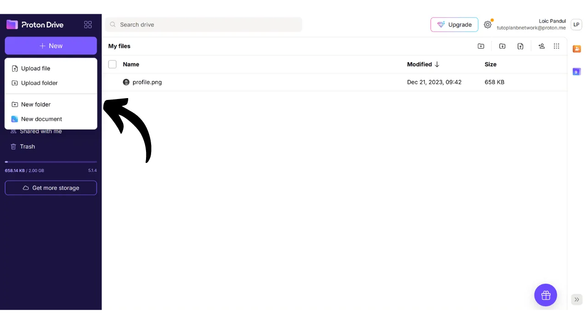
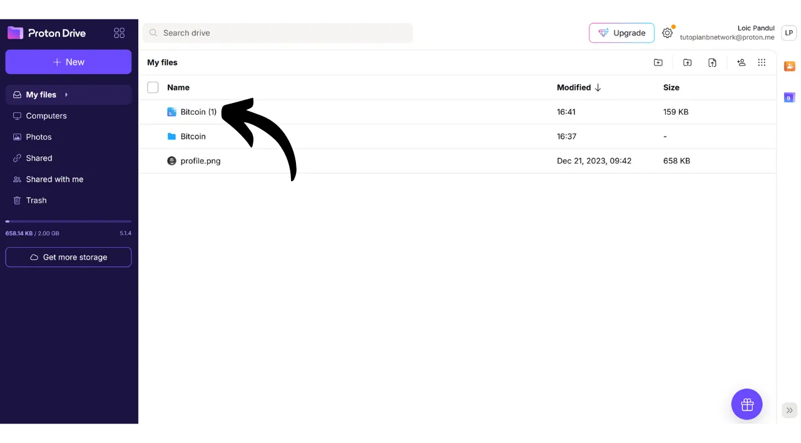

Ngày nay, việc thiết lập một chiến lược để đảm bảo khả năng truy cập, an ninh và sao lưu các tệp cá nhân của bạn, như tài liệu cá nhân, ảnh hoặc các dự án quan trọng, là rất quan trọng. Việc mất mát những dữ liệu này có thể gây ra hậu quả thảm khốc.

Để ngăn chặn những vấn đề này, tôi khuyên bạn nên duy trì nhiều bản sao lưu của các tệp trên các phương tiện khác nhau. Một chiến lược thường được sử dụng trong lĩnh vực máy tính là chiến lược sao lưu "3-2-1", đảm bảo bảo vệ các tệp của bạn:
- **3** bản sao của các tệp;
- Được lưu trữ trên ít nhất **2** loại phương tiện khác nhau;
- Với ít nhất **1** bản sao được giữ ở nơi khác.

Nói cách khác, bạn nên lưu trữ các tệp của mình ở 3 vị trí khác nhau, sử dụng các loại phương tiện khác nhau, như máy tính của bạn, ổ cứng ngoài, USB, hoặc dịch vụ lưu trữ trực tuyến. Và cuối cùng, việc có một bản sao ở nơi khác nghĩa là bạn nên có một bản sao lưu được lưu trữ ngoài nhà hoặc doanh nghiệp của bạn. Điểm này giúp tránh mất hoàn toàn các tệp của bạn trong trường hợp thảm họa địa phương như hỏa hoạn hoặc lũ lụt. Một bản sao ngoại vi, cách xa nhà hoặc doanh nghiệp của bạn, đảm bảo rằng dữ liệu của bạn sẽ tồn tại bất chấp các rủi ro địa phương.

Để thuận tiện cho việc triển khai chiến lược sao lưu 3-2-1, bạn có thể sử dụng dịch vụ lưu trữ trực tuyến. Những giải pháp này, thường được gọi là "đám mây", cung cấp cho bạn sự bảo vệ bổ sung bằng cách lưu trữ dữ liệu của bạn trên các máy chủ an toàn có thể truy cập từ bất kỳ thiết bị nào. Thuật ngữ "đám mây" đơn giản chỉ việc lưu trữ dữ liệu trên các máy chủ bên ngoài.

Nhiều người sử dụng các giải pháp lưu trữ của các công ty kỹ thuật số lớn: Google Drive, Microsoft OneDrive, hoặc Apple iCloud.

Những giải pháp này thuận tiện cho việc sử dụng hàng ngày và đảm bảo khả năng truy cập dữ liệu của bạn, nhưng chúng không đảm bảo tính bảo mật. Trong hướng dẫn này, tôi đề xuất khám phá một giải pháp khác, dễ sử dụng không kém các công cụ lưu trữ của Big Tech, nhưng với các biện pháp bổ sung để bảo vệ quyền riêng tư của bạn. Giải pháp này là Proton Drive, công cụ lưu trữ trực tuyến từ công ty Thụy Sĩ Proton. Chúng ta cũng sẽ xem cách dễ dàng triển khai một chiến lược 3-2-1 phù hợp cho việc sử dụng hàng ngày.

## Giới thiệu về Proton Drive
Proton Drive là một giải pháp lưu trữ trực tuyến thú vị, vì nó kết hợp sự dễ sử dụng với an ninh cho các tệp của bạn. Khác với các dịch vụ đám mây truyền thống từ các gã khổng lồ công nghệ, Proton Drive thực hiện các biện pháp để bảo vệ quyền riêng tư của bạn. Nó đảm bảo mã hóa đầu cuối cho tất cả các tệp của bạn, nghĩa là ngay cả các đội ngũ của Proton cũng không thể truy cập dữ liệu của bạn. Hơn nữa, Proton Drive là mã nguồn mở, cho phép các chuyên gia độc lập tự do kiểm tra mã của phần mềm.

Mô hình kinh doanh của Proton dựa trên hệ thống đăng ký, điều này làm cho người ta yên tâm vì nó chỉ ra rằng công ty được tài trợ mà không nhất thiết khai thác dữ liệu của người dùng. Trong hướng dẫn này, tôi sẽ giải thích cách sử dụng phiên bản miễn phí của Proton Drive, nhưng cũng có nhiều cấp độ đăng ký cung cấp nhiều tính năng hơn. Mô hình kinh doanh này được ưa chuộng hơn so với hệ thống miễn phí theo kiểu Big Tech, có thể dẫn đến lo ngại liệu rằng dữ liệu cá nhân của chúng ta có đang được sử dụng để kiếm lời hay không. Điều này dường như không phải là trường hợp với Proton.

Proton Drive cung cấp nhiều hơn là các tùy chọn lưu trữ đơn giản; nó cũng cho phép chia sẻ, chỉnh sửa và hợp tác trên các tài liệu trực tuyến với các công cụ chỉnh sửa, tương tự như bộ phần mềm của Google.
Về [giá cả](https://proton.me/pricing), phiên bản miễn phí cung cấp tới 5 GB lưu trữ và bao gồm các tính năng cơ bản. Để mở rộng khả năng lên tới 200 GB lưu trữ, một gói đăng ký cụ thể cho Proton Drive có sẵn với giá 4 euro mỗi tháng. Mặt khác, gói Proton Unlimited cung cấp tới 500 GB lưu trữ trên Proton Drive với giá 10 euro mỗi tháng, bên cạnh việc bao gồm tất cả các dịch vụ trả phí của Proton, như VPN và quản lý mật khẩu, cũng như các lợi ích bổ sung trên các công cụ miễn phí (email và lịch).

## Làm thế nào để tạo một tài khoản Proton?

Nếu bạn chưa có tài khoản Proton, bạn sẽ cần tạo một tài khoản. Tôi giới thiệu bạn đọc hướng dẫn Proton Mail của chúng tôi, trong đó chúng tôi giải thích chi tiết cách tạo một tài khoản Proton miễn phí và thiết lập nó:

https://planb.network/tutorials/others/proton-mail

## Làm thế nào để thiết lập Proton Drive?

Sau khi đăng nhập vào Proton mail của bạn, nhấp vào biểu tượng với bốn ô nhỏ ở góc trên bên trái của màn hình.

Sau đó nhấp vào "*Drive*".

Bây giờ bạn đang ở trên Proton Drive của mình.

## Làm thế nào để sử dụng Proton Drive?
Để thêm tệp vào Proton Drive của bạn, nếu bạn chỉ sử dụng phiên bản web (chúng tôi sẽ thảo luận về việc sử dụng phiên bản địa phương sau), bạn chỉ cần kéo và thả tài liệu trực tiếp vào giao diện.

Sau đó, bạn có thể tìm thấy tài liệu của mình trên trang chủ.

Để thêm một mục mới, nhấp vào nút "*New*" ở góc trên bên trái của màn hình.

Chức năng "*Upload file*" mở trình duyệt tệp địa phương của bạn, cho phép bạn chọn và nhập tài liệu mới vào Proton Drive, giống như bạn sẽ làm bằng cách kéo và thả.

"*Upload folder*" cho phép bạn nhập toàn bộ thư mục.

"*New folder*" cho phép bạn tạo một thư mục để tổ chức tốt hơn các tài liệu của mình trên Proton Drive.

Nhấp vào tùy chọn này, đặt tên cho thư mục của bạn.

Sau đó, bạn sẽ tìm thấy nó trực tiếp trên trang chủ của Proton Drive.

Cuối cùng, "*New document*" cho phép bạn tạo một tài liệu văn bản mới trực tiếp trong Proton Drive.

Bằng cách nhấp vào nó, một tài liệu trắng mới mở ra.

Bạn có thể viết và chỉnh sửa trên đó.

Nếu bạn nhấp vào nút "*Share*" ở góc trên bên phải, bạn có thể chia sẻ tài liệu.

Sau đó, bạn chỉ cần nhập email của người đóng góp mà bạn muốn cấp quyền truy cập vào tài liệu, hoặc là chỉ đọc hoặc với quyền chỉnh sửa.

Nếu bạn quay lại Proton Drive của mình, bạn có thể thấy rằng tài liệu đã được lưu.
Trong tab "*Đã chia sẻ*", bạn có thể tìm thấy các tài liệu mà bạn đã chia sẻ với người khác.

Và trong tab "*Được chia sẻ với tôi*", bạn có thể thấy các tài liệu mà người khác đã chia sẻ với bạn.

Cuối cùng, trong tab "*Thùng rác*", bạn có thể tìm thấy các tài liệu của bạn đã bị xóa gần đây.

Hầu hết các cài đặt cho Proton Drive của bạn được tích hợp vào tài khoản Proton của bạn. Để biết hướng dẫn chi tiết về cách thiết lập tài khoản của bạn, tôi mời bạn tham khảo hướng dẫn này:

https://planb.network/tutorials/others/proton-mail

## Làm thế nào để cài đặt phần mềm Proton Drive?
Proton Drive cũng cung cấp phần mềm cho phép đồng bộ hóa các tệp cục bộ của bạn với không gian lưu trữ trực tuyến. Tính năng này giúp dễ dàng và tự động hóa việc triển khai chiến lược sao lưu 3-2-1 của chúng tôi. Với phần mềm Proton Drive, bạn nhận được 2 bản sao đồng bộ của tệp của mình: một trên máy tính của bạn và cái khác trên máy chủ của Proton, do đó đáp ứng tiêu chí của 2 loại phương tiện và sao lưu ngoại tuyến. Bạn chỉ cần tạo một bản sao thứ ba, mà chúng tôi sẽ thiết lập sau.
Để sử dụng phần mềm, nhấp vào tab "*Máy tính*" trên tài khoản Proton Drive của bạn và chọn nút tương ứng với hệ điều hành của bạn để tiến hành tải xuống.

Sau khi cài đặt, bạn sẽ cần đăng nhập để mở khóa tài khoản của mình, sau đó nhấp vào "*Đăng nhập*".

Chọn các tệp cục bộ mà bạn muốn đồng bộ hóa với Proton Drive của mình.

Ví dụ, tôi chỉ đã chọn thư mục "*Proton Backup*". Sau đó nhấp vào nút "*Tiếp tục*".

Bạn sẽ đến giao diện phần mềm, tương tự như ứng dụng web.

Từ bây giờ, bạn sẽ có một thư mục có tiêu đề "*Proton Drive*" cục bộ trên máy tính của mình, nơi sẽ tổng hợp tất cả các tài liệu của bạn được lưu trữ trực tuyến trên Proton. Nếu bạn thêm một tệp vào thư mục này từ máy tính của mình, bạn sẽ tự động tìm thấy nó trên trang chủ của ứng dụng web Proton Drive, và ngược lại. Đối với các thư mục bạn chọn để đồng bộ hóa trong quá trình cài đặt phần mềm, bạn cũng có thể tìm thấy chúng trực tuyến bằng cách vào phần "*Máy tính*" của Proton Drive và sau đó chọn máy tính của bạn.

Như vậy, tất cả các tệp của bạn được sao lưu và đồng bộ hóa cả cục bộ trên máy của bạn và trên máy chủ trực tuyến của Proton Drive.

## Làm thế nào để sao lưu Proton Drive?

Nếu bạn đã thực hiện theo các bước trước, bây giờ bạn đã có 2 vị trí sao lưu riêng biệt cho các tệp quan trọng của mình. Để hoàn thành chiến lược sao lưu 3-2-1 của chúng tôi, chúng ta cần thêm một bản sao thứ ba.
Tôi đề xuất bạn thực hiện sao lưu bổ sung này trên một phương tiện bên ngoài, chẳng hạn như một ổ cứng hoặc một ổ USB, chẳng hạn. Tùy thuộc vào mức độ sử dụng của bạn, thiết lập tần suất cập nhật sao lưu phù hợp (hàng tuần, hàng tháng, nửa năm...). Tại mỗi khoảng thời gian đã chọn, bạn sẽ cần tải xuống toàn bộ Proton Drive của mình để sao lưu dữ liệu trên phương tiện bên ngoài đã chọn. Theo cách này, ngay cả trong trường hợp máy tính của bạn bị trộm và sự hủy diệt đồng thời của máy chủ Proton, bạn vẫn sẽ duy trì quyền truy cập an toàn vào các tệp của mình nhờ vào bản sao trên ổ USB.
Để thực hiện điều này, hãy truy cập vào Proton Drive của bạn.

Chọn tất cả các tệp của bạn.

Sau đó, nhấp vào mũi tên nhỏ để tải chúng về.

Chúng tôi sẽ lặp lại thao tác này với các tệp đã đồng bộ từ máy tính của chúng tôi.

Sau đó, bạn sẽ tìm thấy các tệp .zip trong thư mục tải xuống của mình. Chỉ cần kết nối phương tiện lưu trữ ngoại vi mà bạn chọn vào máy tính, và sau đó chuyển những tệp này vào đó.

Nếu bạn lo lắng rằng chiếc USB này có thể bị đánh cắp, hãy xem xét việc mã hóa nó với phần mềm như VeraCrypt (chúng tôi sẽ sớm tạo một hướng dẫn về phần mềm này).

Xin chúc mừng, bạn giờ đây đã có một chiến lược sao lưu 3-2-1 rất vững chắc, giúp bạn giảm thiểu đáng kể nguy cơ mất quyền truy cập vào các tài liệu cá nhân của mình, dù trong bất kỳ hoàn cảnh nào. Bằng cách chọn Proton Drive cho các bản sao lưu trực tuyến của bạn, bạn cũng được hưởng lợi từ mã hóa đầu cuối, đảm bảo bảo vệ quyền riêng tư của bạn.

Để tìm hiểu thêm về việc bảo mật sự hiện diện trực tuyến của bạn và tránh bị hack, tôi cũng khuyên bạn nên tham khảo hướng dẫn chi tiết của chúng tôi về trình quản lý mật khẩu Bitwarden:

https://planb.network/tutorials/others/bitwarden