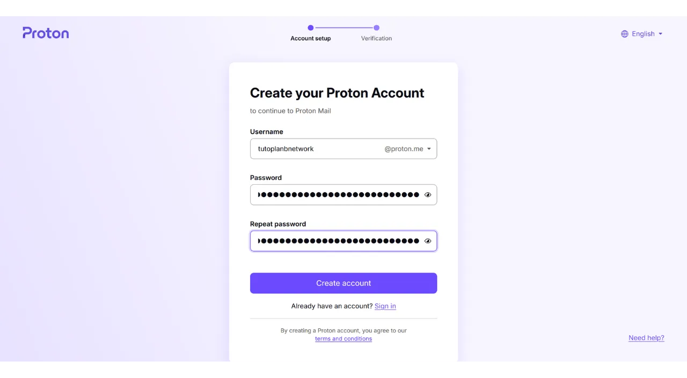

如今，确立一种策略以确保个人文件的可访问性、安全性和备份非常关键，这些个人文件可能包括您的个人文档、照片或重要项目。丢失这些数据可能是灾难性的。

为了预防这些问题，我建议在不同的媒介上保持文件的多重备份。计算中常用的一种策略是“3-2-1”备份策略，它确保了文件的保护：
- **3**份文件的副本；
- 保存在至少**2**种不同类型的媒介上；
- 至少**1**份副本保存在异地。

换句话说，建议将文件存储在3个不同的位置，使用不同类型的媒介，如您的电脑、外部硬盘、USB闪存盘或在线存储服务。最后，拥有一个异地副本意味着您应该在家庭或企业之外存储一个备份。这最后一点有助于避免本地灾害（如火灾或洪水）导致文件的全面丢失。一个远离您的家庭或企业的外部副本，确保您的数据无论本地风险如何都能幸存下来。

为了便于实施3-2-1备份策略，您可以使用在线存储服务。这些解决方案，通常被称为“云”，通过将您的数据存储在可从任何设备访问的安全服务器上，提供额外的保护。术语“云”简单地指的是在外部服务器上存储数据。

许多人使用主要数字公司的存储解决方案：Google Drive、Microsoft OneDrive或Apple iCloud。

这些解决方案便于日常使用，并确保您的数据可访问性，但它们不确保保密性。在本教程中，我提议发现另一种解决方案，它与大科技公司的存储工具一样易于使用，但增加了保护您隐私的额外措施。这个解决方案是Proton Drive，来自瑞士公司Proton的在线存储工具。我们还将看到如何轻松实施适合日常使用的3-2-1策略。

## 介绍Proton Drive
Proton Drive是一个有趣的在线存储解决方案，因为它将易用性与文件安全性结合在一起。与来自科技巨头的传统云服务不同，Proton Drive实施了保护您隐私的措施。它确保了您所有文件的端到端加密，这意味着即使是Proton的团队也无法访问您的数据。此外，Proton Drive是开源的，允许独立专家自由审计软件的代码。

Proton的商业模式基于订阅系统，这是令人安心的，因为它表明公司的资金来源并不一定是利用用户数据。在本教程中，我将解释如何使用Proton Drive的免费版本，但也有提供更多功能的几个订阅级别。这种商业模式比大科技风格的免费系统更可取，后者可能会让人怀疑我们的个人数据是否被用于盈利。Proton似乎并非如此。

Proton Drive提供的不仅仅是简单的存储选项；它还允许在线共享、编辑和协作文档，使用编辑工具，类似于Google的软件套件。
关于[定价](https://proton.me/pricing)，免费版本提供最多5 GB的存储空间，并包括基本功能。为了将能力扩展到200 GB的存储空间，Proton Drive提供了每月4欧元的特定订阅。另一方面，Proton无限套餐每月10欧元提供最多500 GB的Proton Drive存储空间，除了包括Proton的所有付费服务，如VPN和密码管理器，还在免费工具（电子邮件和日历）上提供额外的好处。
## 如何创建Proton账户？

如果您还没有Proton账户，您将需要创建一个。我推荐您参考我们的Proton Mail教程，在其中我们详细解释了如何创建一个免费的Proton账户并设置它：

https://planb.network/tutorials/others/proton-mail

## 如何设置Proton Drive？

登录您的Proton邮件后，点击屏幕左上角有四个小方块的图标。

然后点击“*Drive*”。

您现在在您的Proton Drive上。

## 如何使用Proton Drive？
要将文件添加到您的Proton Drive中，当您专门使用网页版本时（我们稍后将讨论本地版本的使用），您只需将文档直接拖放到界面中。 然后，您可以在首页上找到您的文档。 要添加新项目，请点击屏幕左上角的“*新建*”按钮。 “*上传文件*”功能会打开您的本地文件浏览器，允许您选择并导入新文档到Proton Drive，就像您通过拖放操作一样。 “*上传文件夹*”允许您导入整个文件夹。 “*新建文件夹*”使您能够创建一个文件夹，以便在Proton Drive上更好地组织您的文档。 点击此选项，为您的文件夹指定一个名称。 然后您可以直接在Proton Drive的首页上找到它。 最后，“*新建文档*”允许您直接在Proton Drive中创建一个新的文本文档。 点击它，一个新的空白文档就会打开。 您可以在上面写字并编辑。 如果您点击右上角的“*分享*”按钮，您可以分享该文档。 您只需输入您希望授予文档访问权限的贡献者的电子邮件，无论是以只读模式还是具有编辑权限。 如果您返回到您的Proton Drive，您可以看到文档已经成功保存。 在“*已分享*”标签中，您可以找到您与他人分享的文档。 而在“*与我共享*”标签中，您可以看到其他人与您分享的文档。 最后，在“*垃圾箱*”标签中，您可以找到您最近删除的文档。 您的Proton Drive的大多数设置都集成到您的Proton账户中。有关设置账户的详细说明，请参阅此教程：
https://planb.network/tutorials/others/proton-mail

## 如何安装Proton Drive软件？
Proton Drive还提供了一款软件，使您的本地文件与在线存储空间同步。这个功能便于并自动化了我们的3-2-1备份策略的实施。通过Proton Drive软件，您可以获得两个同步的文件副本：一个在您的电脑上，另一个在Proton的服务器上，从而满足了两种媒介类型和异地备份的标准。您只需创建第三份副本，我们稍后将进行设置。
要使用该软件，请点击您的Proton Drive账户上的“*电脑*”标签，并选择与您的操作系统相对应的按钮，以继续下载。
安装完成后，您需要登录以解锁您的账户，然后点击“*登录*”。

选择您希望与您的Proton Drive同步的本地文件。

例如，我只选择了“*Proton Backup*”文件夹。然后点击“*继续*”按钮。

接下来，您将进入软件界面，该界面与网页应用相似。

从现在起，您的计算机本地将有一个名为“*Proton Drive*”的文件夹，它将收集存储在Proton在线服务上的所有文档。如果您从计算机向这个文件夹添加文件，您将自动在Proton Drive网页应用的首页找到它，反之亦然。对于您选择在软件安装期间同步的文件夹，您也可以通过访问Proton Drive的“*Computers*”部分然后选择您的计算机来在线找到它们。

因此，您的所有文件既在您的机器本地备份和同步，也在Proton Drive的在线服务器上备份和同步。

## 如何备份Proton Drive？

如果您遵循了前面的步骤，您现在有两个不同的备份位置用于您的重要文件。为了完成我们的3-2-1备份策略，我们需要添加第三份副本。
我建议您在外部介质上进行这个额外的备份，例如外部硬盘或USB闪存盘。根据您的使用强度，设置适当的备份更新频率（每周、每月、半年...）。在每个选定的间隔，您需要下载您的Proton Drive的全部内容，以备份数据到选定的外部介质上。这样，即使在您的计算机被盗和Proton服务器同时被摧毁的情况下，您仍然可以通过USB闪存盘上的副本安全访问您的文件。

为此，请前往您的Proton Drive。

选择您的所有文件。

然后点击小箭头下载它们。

我们将重复这个操作，与我们的计算机同步的文件一起。

然后，您将在下载中找到.zip文件。只需将您选择的外部介质连接到您的计算机，然后将这些文件传输到它上面。

如果您担心这个USB闪存盘可能会被盗，考虑使用VeraCrypt之类的软件对其进行加密（我们将很快制作关于这个软件的教程）。

恭喜您，您现在拥有一个非常健壮的3-2-1备份策略，这使您能够大大降低在任何情况下丢失访问个人文档的风险。通过选择Proton Drive进行在线备份，您还受益于端到端加密，这保证了您隐私的保护。

要了解更多关于保护您的在线存在和避免黑客攻击的信息，我还推荐您查阅我们关于Bitwarden密码管理器的详细教程：

https://planb.network/tutorials/others/bitwarden