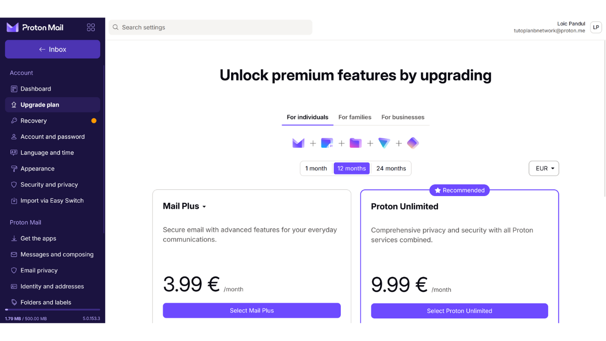
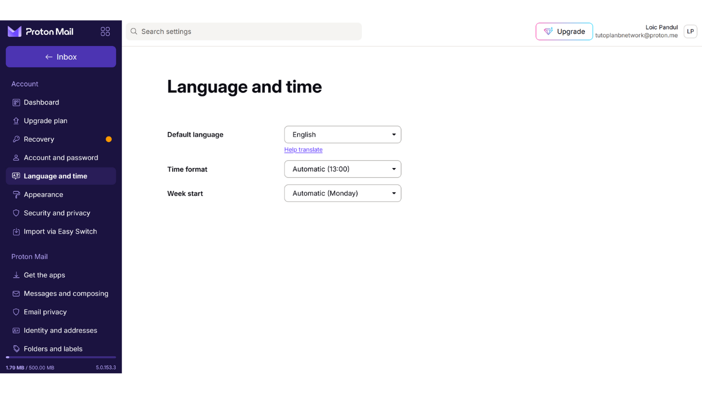
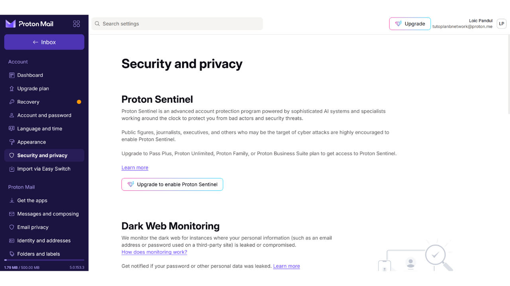

E-mailová schránka je klíčovým prvkem vaší online aktivity a často hraje zásadní roli ve vaší počítačové bezpečnosti. Pokud útočník dokáže kompromitovat vaši e-mailovou schránku, získá snadný přístup k vašim dalším účtům prostřednictvím funkce "*zapomenuté heslo*". To jim může umožnit ovládnout vaše sociální sítě, bankovní účty a další online služby, protože dnes je e-mailová adresa často používána jako unikátní identifikátor vaší online identity. Proto je zabezpečení vaší e-mailové schránky velmi důležité pro ochranu před útoky.

Pro zajištění bezpečnosti vaší e-mailové schránky je důležité přijmout některé jednoduché dobré praktiky, které prozkoumáme v tomto tutoriálu určeném pro začátečníky v počítačové technice. Je také důležité vybrat si bezpečného poskytovatele e-mailu, který nabízí pokročilé možnosti ochrany a robustní politiku ochrany soukromí. Proto v tomto tutoriálu doporučuji objevit ProtonMail. I když dáváte přednost jinému poskytovateli, dobré praktiky prezentované zde lze aplikovat na jakoukoli e-mailovou schránku pro zvýšení její bezpečnosti.

## Proč používat ProtonMail?

ProtonMail je poměrně bezpečné řešení zpráv díky několika funkcím. Za prvé, ProtonMail zajišťuje šifrování zpráv od konce ke konci, což znamená, že jejich obsah mohou číst pouze odesílatel a příjemce. Teoreticky ani ProtonMail nemůže přistupovat k e-mailům svých uživatelů. Toto šifrování je aplikováno automaticky, bez nutnosti jakýchkoli specifických technických dovedností od uživatelů.

Navíc ProtonMail integruje pokročilé technologie pro ochranu vašeho soukromí, včetně blokování určitých sledovacích systémů a maskování vaší IP adresy. Protože je založen ve Švýcarsku, společnost Proton těží z některých zákonů o ochraně dat, které nejsou k nalezení v jiných zemích. Kromě toho je ProtonMail open-source, což umožňuje nezávislým expertům volně auditovat kód softwaru.

Obchodní model Protonu je založen na systému předplatného, což je uklidňující, protože to naznačuje, že společnost je financována bez nutnosti nutně využívat data svých uživatelů. V tomto tutoriálu prozkoumáme, jak používat bezplatnou verzi ProtonMailu, ale jsou k dispozici také různé úrovně předplatného nabízející více funkcí. Tento obchodní model je preferován před zcela bezplatným systémem, který by mohl vyvolávat obavy, zda nejsou naše osobní údaje využívány pro zisk. Naštěstí se to u ProtonMailu zdá být nepravděpodobné.

## Vytvoření účtu Proton

Navštivte oficiální stránku proton: https://proton.me/

Klikněte na tlačítko "*Vytvořit účet*":
Máte možnost vybrat si z různých plánů podle vašich potřeb. Na začátek můžete zvolit bezplatný účet, který vám umožní otestovat základní služby ProtonMailu. Později, pokud si přejete přístup k dalším funkcím a dalšímu softwaru Proton, jako je Kalendář, VPN nebo Správce hesel, můžete zvážit předplatné placeného plánu.

Poté přijdete na stránku pro vytvoření účtu.

Můžete si vybrat preferovanou doménu pro vaši e-mailovou adresu kliknutím na malou šipku. Tento výběr nemá vliv na následující kroky.

Také si vyberte uživatelské jméno pro vaši e-mailovou adresu.

Poté vás bude požádáno o nastavení hesla. Je důležité vybrat na této fázi silné heslo, protože to umožní přístup k vaší schránce. Robustní heslo by mělo být co nejdelší, používat širokou škálu znaků a být vybráno náhodně. V roce 2024 jsou minimální doporučení pro bezpečné heslo 13 znaků včetně čísel, malých a velkých písmen, stejně jako symbolů, za předpokladu, že je heslo skutečně náhodné. Nicméně doporučuji zvolit heslo o délce alespoň 20 znaků, včetně všech možných typů znaků, aby byla jeho bezpečnost zajištěna na delší dobu.
Používání správce hesel je vynikající praxe. Nejenže vám umožní bezpečně ukládat vaše hesla, aniž byste je museli pamatovat, ale také za vás může generovat dlouhá a náhodná hesla. Lidé jsou skutečně velmi špatní v tvorbě náhodných sekvencí a heslo, které není dostatečně náhodné, může být zranitelné vůči útokům hrubou silou. Doporučuji také konzultovat náš kompletní tutoriál o nastavení správce hesel pro více detailů na toto téma:
https://planb.network/tutorials/others/bitwarden

Klikněte na tlačítko "*Vytvořit účet*".

Vyřešte CAPTCHA.

Vyberte si zobrazované jméno. To je jméno, které bude zobrazeno vašemu příjemci, když pošlete email. Vyberte si své skutečné jméno nebo přezdívku.
Proton vám také nabízí možnost nastavit metodu pro obnovu vašeho účtu, buď prostřednictvím vašeho telefonního čísla nebo s alternativní emailovou adresou. Je důležité pochopit, že tato možnost může zvýšit útočnou plochu vaší emailové schránky. Pro vás je to dodatečné bezpečnostní opatření pro znovuzískání přístupu k vašemu účtu v případě, že zapomenete heslo, ale pro hackera je to další příležitost pokusit se dostat do vašeho účtu. Není nutné vybrat tuto možnost obnovy, ale pokud se rozhodnete to neudělat, ujistěte se, že si uchováte bezpečnou kopii vašeho hesla. Bez něj, pokud ztratíte heslo, nebudete moci obnovit přístup k vaší emailové schránce.

## Nastavení vaší Proton Mail schránky

Gratulujeme, vaše Proton mailová schránka je nyní vytvořena! Začněte výběrem barev pro téma vaší schránky.

Pokud chcete, můžete také nastavit přeposílání vašich emailů ze starého účtu Gmail na váš nový účet ProtonMail.

Jakmile se ocitnete na rozhraní vaší schránky, doporučuji se podívat na nastavení a přizpůsobit je. Klikněte na ikonu ozubeného kola v pravém horním rohu.

Poté klikněte na tlačítko "*Všechna nastavení*".

Na záložce "*Dashboard*" najdete informace související s vaším účtem. Při posouvání v této sekci máte možnost vybrat typy emailů, které jste ochotni od Protonu přijímat. Pokud dáváte přednost tomu, abyste nedostávali propagační nebo informační oznámení, můžete si vybrat, že vše odznačíte.

Na záložce "*Upgrade plan*" si můžete vybrat placený plán s novými funkcemi.

Na záložce "*Recovery*" můžete přidat nebo změnit vaše metody obnovy.

Na záložce "*Account and password*" můžete změnit vaše uživatelská jména, stejně jako metody zabezpečení vašeho účtu.

Zatím je vaše schránka zabezpečena pouze heslem. Doporučuji vám alespoň přidat ochranu dvoufaktorové autentizace pomocí aplikace. K tomu klikněte na zaškrtávací políčko.

Potvrďte své heslo.

Poté naskenujte QR kód pomocí vaší aplikace pro 2FA.

Pro více informací doporučuji zkontrolovat náš tutoriál, jak používat aplikaci pro 2FA.
Na záložce "*Language and time*" můžete změnit jazyk rozhraní, stejně jako časovou zónu.

Na kartě "*Vzhled*" můžete upravit barvy vašeho rozhraní.

Na kartě "*Bezpečnost a soukromí*" máte přístup k různým bezpečnostním možnostem. Některé z těchto možností jsou dostupné pouze s placeným plánem. Máte také možnost zakázat sběr vašich dat společností Proton, která tuto informaci využívá pro diagnostiku a řešení chyb.

Na kartě "*Import*" máte možnost spravovat migraci vašich starých emailů do vašeho nového účtu ProtonMail. Pokud dáváte přednost začít s úplně novou schránkou bez importu starých emailů, můžete tuto možnost ignorovat.

Karta "*Stáhnout aplikace*" vám umožňuje stáhnout mobilní aplikace a desktopový software Protonu pro správu vaší schránky na těchto platformách. Pokud preferujete, můžete nadále používat pouze webovou verzi vaší schránky, na které se právě nacházíte, jelikož nabízí stejné funkce.

Na kartě "*Zprávy a psaní*" máte mnoho možností, jak přizpůsobit vaši schránku.

Na kartě "*Soukromí emailu*" můžete vybrat možnosti týkající se soukromí vašich emailů.

Na kartě "*Identita a adresy*" máte možnost přizpůsobit si svůj emailový podpis. Pokud máte placený účet, můžete také vytvořit několik různých emailových adres, které budou všechny spravovány z jednoho účtu. To může být velmi užitečné pro oddělení vašich různých použití.

Na kartě "*Složky a štítky*" můžete vytvářet složky a štítky pro organizaci vaší schránky.

Karta "*Filtry*" vám umožňuje spravovat filtry pro emaily, které přijímáte.

Karta "*Přeposílání a automatické odpovědi*" vám umožňuje spravovat přeposílání a automatické odpovědi pro vaše emaily.

Na kartě "*Doménová jména*" máte možnost nastavit emailovou adresu s využitím vaší vlastní domény, což může být užitečné, pokud vlastníte webovou stránku. Pro osobní použití není nutné tuto funkci využívat.

Karta "*Šifrování a klíče*" vám umožňuje spravovat možnosti šifrování pro vaše emaily. Pro začínající uživatele obvykle není nutné nastavení v této sekci upravovat.

A nakonec, karta "*IMAP/SMTP*" vám nabízí možnost konfigurovat most pro použití ProtonMailu s emailovým softwarem, jako je Outlook nebo Apple Mail.

Pro návrat na domovskou stránku vaší schránky klikněte na tlačítko "*Doručená pošta*" v levém horním rohu.

## Používání vaší schránky Proton Mail

Odeslání emailu je velmi jednoduché, stačí kliknout na tlačítko "*Nová zpráva*" v levém horním rohu.

Do pole "*Komu*" zadejte emailovou adresu příjemce.

Do pole "*Předmět*" zadejte předmět vašeho emailu.

Napište svou zprávu.

Nakonec klikněte na tlačítko "*Odeslat*" pro odeslání vašeho emailu.

Poté najdete vaše odeslané zprávy na záložce "*Odeslané*".

Záložka "*Doručené*" obsahuje emaily, které jste obdrželi.

Své emaily můžete číst kliknutím na ně, a poté je organizovat do různých složek, které jste vytvořili.

## Přihlášení do vaší Proton Mail schránky

Jak bylo zmíněno dříve, máte možnost používat vaši ProtonMail schránku buď přes webovou verzi, stažením desktopového softwaru, nebo prostřednictvím mobilní aplikace. Pro stažení softwaru můžete navštívit oficiální stránku: https://proton.me/mail/download

Pokud dáváte přednost používání pouze webové verze ProtonMail, zvažte přidání stránky do oblíbených ve vašem prohlížeči pro snazší přístup v budoucnu a aby se předešlo pokusům o phishing.

Pro přístup jděte na následující URL: https://account.proton.me/mail

Zadejte své uživatelské jméno a heslo, poté klikněte na tlačítko "*Přihlásit se*". Pokud máte povoleno dvoufaktorové ověření (2FA), budete také vyzváni k zadání 6 dynamických číslic generovaných vaší aplikací.

Dostanete se zpět do vaší ProtonMail doručené pošty.

