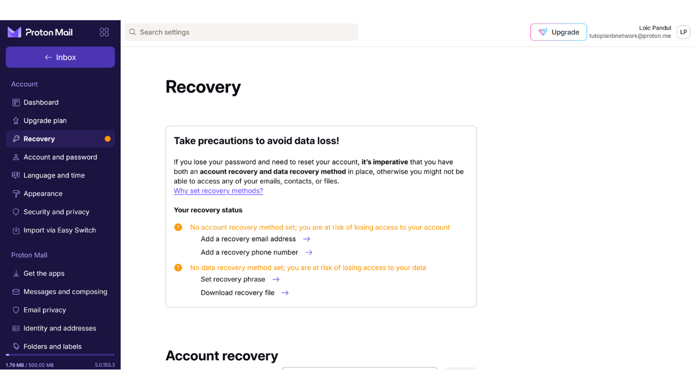
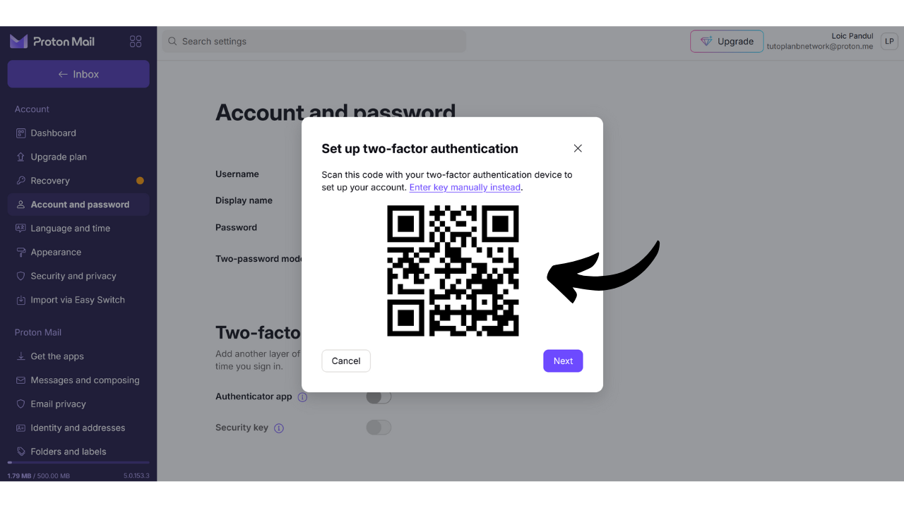
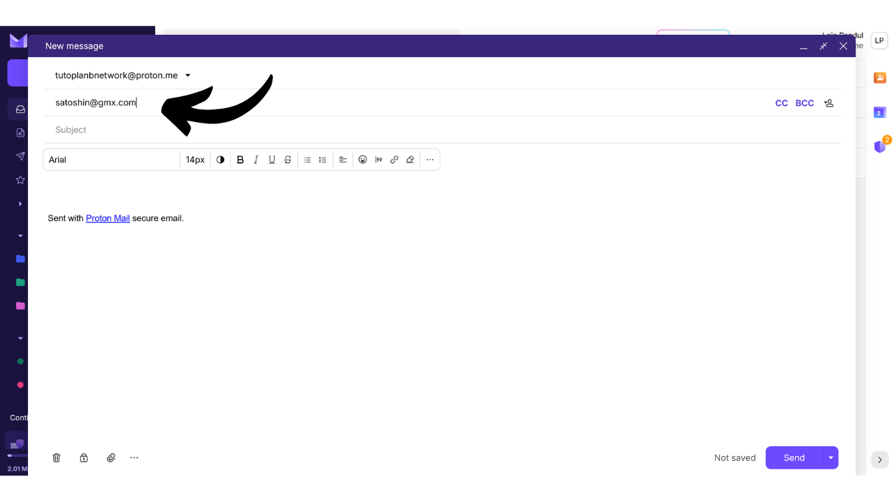

Das E-Mail-Konto ist ein zentrales Element Ihrer Online-Aktivitäten und spielt oft eine entscheidende Rolle für Ihre Computersicherheit. Wenn es einem Angreifer gelingt, Ihr E-Mail-Konto zu kompromittieren, erhält er leicht Zugang zu Ihren anderen Konten über die Funktion "*Passwort vergessen*". Dies kann es ihnen ermöglichen, Ihre sozialen Netzwerke, Ihre Bankkonten und andere Online-Dienste zu kontrollieren, denn heute wird die E-Mail-Adresse oft als einzigartiger Identifikator Ihrer Online-Identität verwendet. Daher ist es sehr wichtig, Ihr E-Mail-Konto zu sichern, um sich vor Angriffen zu schützen.

Um die Sicherheit Ihres E-Mail-Kontos zu gewährleisten, ist es wichtig, einige einfache gute Praktiken zu adoptieren, die wir in diesem Tutorial für Anfänger in der Informatik studieren. Es ist auch wichtig, einen sicheren E-Mail-Anbieter zu wählen, der fortgeschrittene Schutzoptionen und eine robuste Datenschutzrichtlinie bietet. Deshalb empfehle ich in diesem Tutorial, ProtonMail zu entdecken. Selbst wenn Sie sich entscheiden, diesen Anbieter nicht zu nutzen, können die hier vorgestellten guten Praktiken auf jedes E-Mail-Konto angewendet werden, um dessen Sicherheit zu stärken.

## Warum ProtonMail verwenden?

ProtonMail ist eine ziemlich sichere Messaging-Lösung dank mehrerer Funktionen. Erstens gewährleistet ProtonMail die Ende-zu-Ende-Verschlüsselung Ihrer E-Mails, was bedeutet, dass nur der Absender und der Empfänger ihren Inhalt lesen können. Theoretisch kann selbst ProtonMail nicht auf die E-Mails seiner Nutzer zugreifen. Diese Verschlüsselung wird automatisch angewendet, ohne dass die Nutzer spezifische technische Fähigkeiten benötigen.

Darüber hinaus integriert ProtonMail fortschrittliche Technologien zum Schutz Ihrer Privatsphäre, einschließlich der Blockierung bestimmter Tracking-Systeme und der Maskierung Ihrer IP-Adresse. Da es in der Schweiz ansässig ist, profitiert das Unternehmen Proton von einigen Datenschutzgesetzen, die in anderen Ländern nicht zu finden sind. Zusätzlich ist ProtonMail Open-Source, was unabhängigen Experten erlaubt, den Softwarecode frei zu prüfen.

Das Geschäftsmodell von Proton basiert auf einem Abonnement-System, was beruhigend ist, da es darauf hinweist, dass das Unternehmen finanziert wird, ohne notwendigerweise die Daten seiner Nutzer auszubeuten. In diesem Tutorial werden wir untersuchen, wie man die kostenlose Version von ProtonMail verwendet, aber es gibt auch mehrere Abonnementstufen, die mehr Funktionen bieten. Dieses Geschäftsmodell ist einem völlig kostenlosen System vorzuziehen, bei dem Bedenken aufkommen könnten, ob unsere persönlichen Daten zum Profit verwendet werden. Glücklicherweise scheint dies bei ProtonMail nicht der Fall zu sein.

## Ein Proton-Konto erstellen

Besuchen Sie die offizielle Proton-Website: https://proton.me/

Klicken Sie auf den Button "*Konto erstellen*":
Sie haben die Möglichkeit, aus verschiedenen Plänen gemäß Ihren Bedürfnissen zu wählen. Um zu beginnen, können Sie sich für ein kostenloses Konto entscheiden, das es Ihnen ermöglicht, die grundlegenden Dienste von ProtonMail zu testen. Später, wenn Sie auf zusätzliche Funktionen und andere Proton-Software wie Kalender, VPN oder Passwort-Manager zugreifen möchten, können Sie in Erwägung ziehen, ein kostenpflichtiges Abonnement abzuschließen.

Sie gelangen dann auf die Seite zur Kontoerstellung.

Sie können den Domainnamen, den Sie für Ihre E-Mail-Adresse bevorzugen, durch Klicken auf den kleinen Pfeil wählen. Diese Wahl hat keinen Einfluss auf das Folgende.

Wählen Sie auch den Benutzernamen für Ihre E-Mail-Adresse.

Dann werden Sie aufgefordert, ein Passwort festzulegen. Es ist wichtig, an dieser Stelle ein starkes Passwort zu wählen, da es den Zugang zu Ihrem Postfach ermöglicht. Ein robustes Passwort sollte so lang wie möglich sein, eine breite Vielfalt von Zeichen verwenden und zufällig gewählt werden. Im Jahr 2024 sind die Mindestempfehlungen für ein sicheres Passwort 13 Zeichen, einschließlich Zahlen, Klein- und Großbuchstaben sowie Symbole, vorausgesetzt, das Passwort ist wirklich zufällig. Ich empfehle jedoch, ein Passwort von mindestens 20 Zeichen zu wählen, das alle möglichen Arten von Zeichen enthält, um seine Sicherheit für eine längere Zeit zu gewährleisten.
Die Verwendung eines Passwort-Managers ist eine ausgezeichnete Praxis. Er ermöglicht es Ihnen nicht nur, Ihre Passwörter sicher zu speichern, ohne sie sich merken zu müssen, sondern er kann auch lange und zufällige Passwörter für Sie generieren. Menschen sind tatsächlich sehr schlecht darin, zufällige Sequenzen zu erstellen, und ein Passwort, das nicht zufällig genug ist, kann anfällig für Brute-Force-Angriffe sein. Ich empfehle auch, unser vollständiges Tutorial zur Einrichtung eines Passwort-Managers für weitere Details zu diesem Thema zu konsultieren:
https://planb.network/tutorials/others/bitwarden

Klicken Sie auf den Button "*Konto erstellen*".

Lösen Sie das CAPTCHA.

Wählen Sie einen Anzeigenamen. Dies ist der Name, der Ihrem Empfänger angezeigt wird, wenn Sie eine E-Mail senden. Wählen Sie Ihren echten Namen oder einen Spitznamen.
Proton bietet Ihnen auch die Möglichkeit, eine Methode zur Wiederherstellung Ihres Kontos einzurichten, entweder über Ihre Telefonnummer oder mit einer alternativen E-Mail-Adresse. Es ist wichtig zu verstehen, dass diese Option die Angriffsfläche Ihres E-Mail-Postfachs erhöhen kann. Für Sie ist es eine zusätzliche Sicherheitsmaßnahme, um im Falle eines vergessenen Passworts wieder Zugang zu Ihrem Konto zu erhalten, aber für einen Hacker ist es eine zusätzliche Gelegenheit, einen Einbruchsversuch in Ihr Konto zu starten. Sie sind nicht verpflichtet, diese Wiederherstellungsoption zu wählen, aber wenn Sie sich dagegen entscheiden, stellen Sie sicher, dass Sie eine sichere Kopie Ihres Passworts aufbewahren. Ohne dieses, wenn Sie Ihr Passwort verlieren, werden Sie keinen Zugang zu Ihrem E-Mail-Postfach wiederherstellen können.

## Einrichtung Ihres Proton-Postfachs

Herzlichen Glückwunsch, Ihr Proton-Postfach ist jetzt erstellt! Beginnen Sie damit, die Farben für das Thema Ihres Postfachs zu wählen.

Wenn Sie möchten, können Sie auch die Weiterleitung Ihrer E-Mails von Ihrem alten Gmail-Konto auf Ihr neues ProtonMail-Konto einrichten.

Sobald Sie sich in der Oberfläche Ihres Postfachs befinden, rate ich Ihnen, einen Blick in die Einstellungen zu werfen, um diese anzupassen. Klicken Sie auf das Zahnrad-Symbol in der oberen rechten Ecke.

Dann klicken Sie auf den Button "*Alle Einstellungen*".

Im Tab "*Dashboard*" finden Sie Informationen zu Ihrem Konto. Wenn Sie in diesem Abschnitt nach unten scrollen, haben Sie die Möglichkeit, die Arten von E-Mails auszuwählen, die Sie von Proton erhalten möchten. Wenn Sie keine Werbe- oder Informationsbenachrichtigungen erhalten möchten, können Sie wählen, alle abzuwählen.

Im Tab "*Upgrade plan*" können Sie einen kostenpflichtigen Tarif mit neuen Funktionen wählen.

Im Tab "*Recovery*" können Sie Ihre Wiederherstellungsmethoden hinzufügen oder ändern.

Im Tab "*Account and password*" können Sie Ihre Benutzernamen sowie die Methoden zur Sicherung Ihres Kontos ändern.

Bisher ist Ihr Postfach nur mit einem Passwort gesichert. Ich rate Ihnen mindestens, einen Schutz durch Zwei-Faktor-Authentifizierung mit einer Anwendung hinzuzufügen. Dazu klicken Sie auf das Kontrollkästchen.

Bestätigen Sie Ihr Passwort.

Scannen Sie dann den QR-Code mit Ihrer 2FA-Anwendung.

Für weitere Informationen empfehle ich Ihnen, unser Tutorial zur Verwendung einer 2FA-Anwendung zu überprüfen.
Im Tab "*Language and time*" können Sie die Sprache der Oberfläche sowie die Zeitzone ändern.

Im Tab "*Appearance*" können Sie die Farben Ihrer Benutzeroberfläche anpassen.

Im Tab "*Security and privacy*" haben Sie Zugriff auf verschiedene Sicherheitsoptionen. Einige dieser Optionen sind nur mit einem kostenpflichtigen Plan verfügbar. Sie haben auch die Möglichkeit, die Datensammlung durch Proton zu deaktivieren, welche diese Informationen für Diagnosen und Fehlerbehebungen nutzt.

Im Tab "*Import*" haben Sie die Möglichkeit, die Migration Ihrer alten E-Mails auf Ihr neues ProtonMail-Konto zu verwalten. Wenn Sie es vorziehen, mit einem völlig neuen Postfach zu beginnen, ohne Ihre alten E-Mails zu importieren, können Sie diese Option ignorieren.

Der Tab "*Get the apps*" ermöglicht es Ihnen, Protons mobile Anwendungen und Desktop-Software herunterzuladen, um Ihr Postfach auf diesen Plattformen zu verwalten. Wenn Sie möchten, können Sie auch ausschließlich die Webversion Ihres Postfachs nutzen, auf der Sie sich derzeit befinden, da sie die gleichen Funktionalitäten bietet.

Im Tab "*Messages and composing*" haben Sie eine Vielzahl von Anpassungsoptionen für Ihr Postfach.

Im Tab "*Email privacy*" können Sie Optionen bezüglich der Privatsphäre Ihrer E-Mails wählen.

Im Tab "*Identity and addresses*" haben Sie die Möglichkeit, Ihre E-Mail-Signatur anzupassen. Wenn Sie ein kostenpflichtiges Konto haben, können Sie auch mehrere verschiedene E-Mail-Adressen erstellen, die alle von demselben Konto verwaltet werden. Dies kann sehr nützlich sein, um Ihre verschiedenen Verwendungen zu trennen.

Im Tab "*Folders and labels*" können Sie Ordner und Labels erstellen, um Ihr Postfach zu organisieren.

Der Tab "*Filters*" ermöglicht es Ihnen, Filter für die E-Mails, die Sie erhalten, zu verwalten.

Der Tab "*Forward and auto-reply*" ermöglicht es Ihnen, die Weiterleitung und automatische Antworten für Ihre E-Mails zu verwalten.

Im Tab "*Domain names*" haben Sie die Möglichkeit, eine E-Mail-Adresse mit Ihrer eigenen Domain einzurichten, was nützlich sein kann, wenn Sie eine Website besitzen. Für den persönlichen Gebrauch ist es nicht unbedingt notwendig, diese Funktion zu nutzen.

Der Tab "*Encryption and keys*" ermöglicht es Ihnen, die Verschlüsselungsoptionen für Ihre E-Mails zu verwalten. Für Anfänger ist es im Allgemeinen nicht notwendig, die Einstellungen in diesem Abschnitt zu ändern.

Und schließlich bietet Ihnen der Tab "*IMAP/SMTP*" die Möglichkeit, eine Brücke einzurichten, um ProtonMail mit E-Mail-Software wie Outlook oder Apple Mail zu nutzen.

Um zur Startseite Ihres Postfachs zurückzukehren, klicken Sie auf den Button "*Inbox*" oben links.

## Nutzung Ihres Proton-Postfachs

Um eine E-Mail zu senden, ist es ganz einfach, klicken Sie einfach auf den Button "*New Message*" oben links.

Im Feld "*To*" geben Sie die E-Mail-Adresse Ihres Empfängers ein.

Im Feld "*Subject*" geben Sie den Betreff Ihrer E-Mail ein.

Verfassen Sie Ihre Nachricht.

Schließlich klicken Sie auf den "*Senden*" Button, um Ihre E-Mail zu versenden.

Dann finden Sie Ihre gesendeten Nachrichten im "*Gesendet*" Tab.

Der "*Posteingang*" Tab enthält die E-Mails, die Sie erhalten haben.

Sie können Ihre E-Mails lesen, indem Sie darauf klicken und sie dann in die verschiedenen Ordner, die Sie erstellt haben, organisieren.

## Anmelden bei Ihrem Proton Mail-Postfach

Wie bereits erwähnt, haben Sie die Möglichkeit, Ihr ProtonMail-Postfach entweder über die Webversion zu nutzen, die Desktop-Software herunterzuladen oder die mobile App zu verwenden. Um die Software herunterzuladen, können Sie die offizielle Seite besuchen: https://proton.me/mail/download

Wenn Sie nur die Webversion von ProtonMail nutzen möchten, sollten Sie die Seite zu den Favoriten Ihres Browsers hinzufügen, um in Zukunft leichteren Zugang zu haben und Phishing-Versuche zu vermeiden.

Um darauf zuzugreifen, gehen Sie zur folgenden URL: https://account.proton.me/mail

Geben Sie Ihren Benutzernamen und Ihr Passwort ein, dann klicken Sie auf den "*Anmelden*" Button. Wenn Sie die Zwei-Faktor-Authentifizierung (2FA) aktiviert haben, werden Sie auch aufgefordert, die 6 dynamischen Ziffern einzugeben, die von Ihrer App generiert wurden.

Sie gelangen zurück zu Ihrem ProtonMail-Posteingang.

