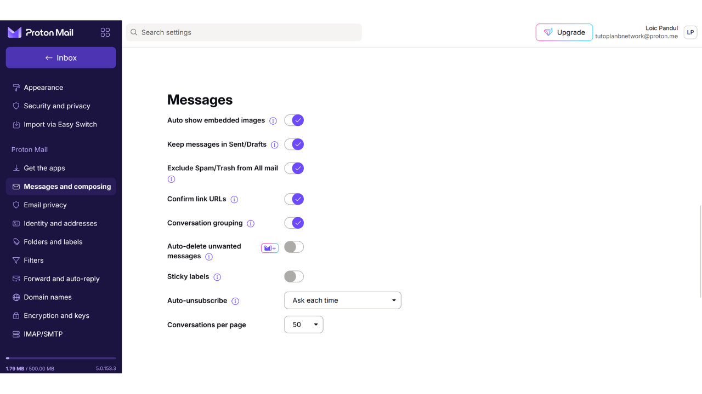
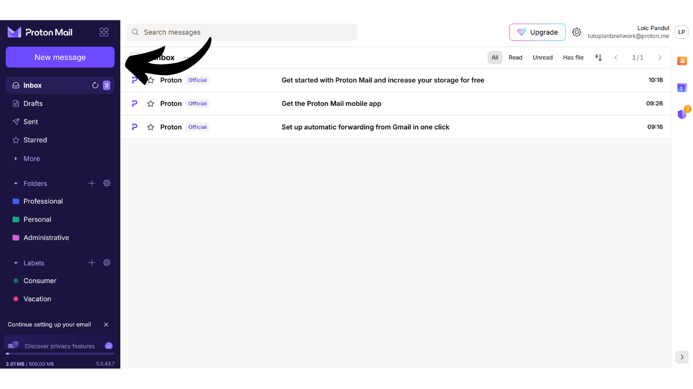
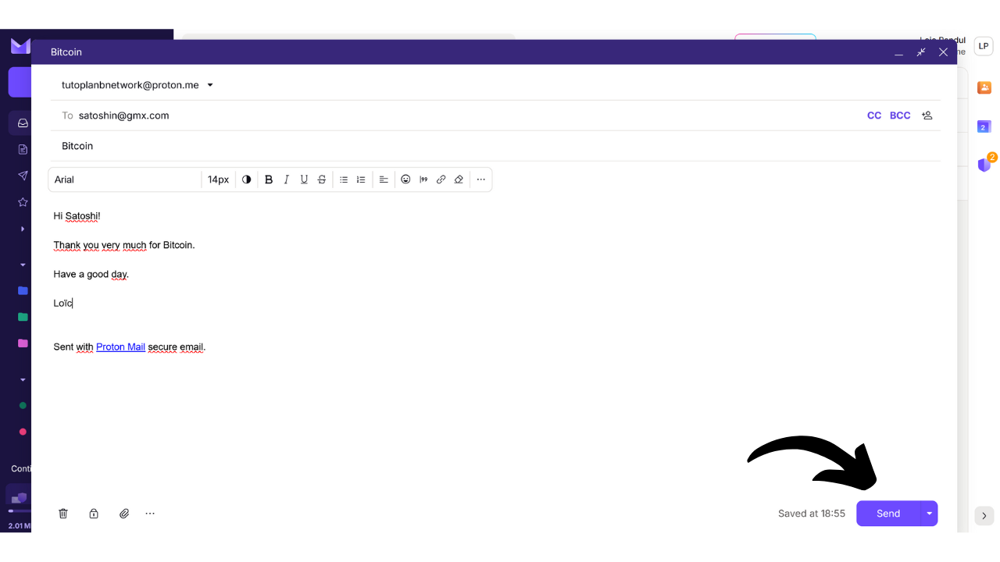
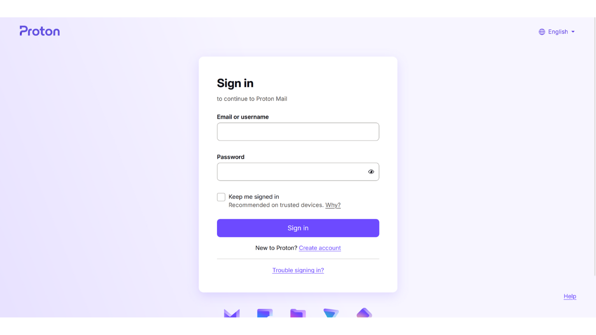

The email box is a central element of your online activity and often plays a crucial role in your computer security. If an attacker manages to compromise your email box, they gain easy access to your other accounts via the "*forgot password*" function. This can allow them to control your social networks, your bank accounts, and other online services, because today, the email address is often used as a unique identifier of your online identity. Therefore, securing your email box is very important to protect yourself from attacks.

To ensure the security of your email box, it is important to adopt some simple good practices that we study in this tutorial aimed at beginners in computing. It is also important to choose a secure email provider offering advanced protection options and a robust privacy protection policy. That's why I recommend in this tutorial to discover ProtonMail. Even if you prefer not to use this provider, the good practices presented here can be applied to any email box to enhance its security.

## Why use ProtonMail?

ProtonMail is a rather secure messaging solution thanks to several features. Firstly, ProtonMail ensures end-to-end encryption of your emails, which means that only the sender and recipient can read their content. In theory, even ProtonMail cannot access its users' emails. This encryption is applied automatically, without requiring any specific technical skills from the users.

Moreover, ProtonMail integrates advanced technologies to protect your privacy, including blocking certain tracking systems and masking your IP address. Being based in Switzerland, the Proton company benefits from some of the data protection laws that are not found in other countries. Additionally, ProtonMail is open-source, which allows independent experts to freely audit the software code.

The business model of Proton is based on a subscription system, which is reassuring since it indicates that the company is financed without necessarily exploiting its users' data. In this tutorial, we will explore how to use the free version of ProtonMail, but there are also several subscription levels offering more features. This business model is preferable to an entirely free system, which could lead to concerns about whether our personal data is being used for profit. Fortunately, this does not seem to be the case with ProtonMail.

## Creating a Proton account

Visit the official proton site: https://proton.me/

Click on the "*Create an account*" button:
You have the option to choose from different plans according to your needs. To start, you can opt for a free account, which will allow you to test the basic services of ProtonMail. Later, if you wish to access additional features and other Proton software such as Calendar, VPN, or Password Manager, you can consider subscribing to a paid plan.

You then arrive at the account creation page.

You can choose the domain name you prefer for your email address by clicking on the small arrow. This choice has no impact on what follows.

Also, choose the username for your email address.

You are then asked to set a password. It is important to choose a strong password at this stage, as it will allow access to your mailbox. A robust password should be as long as possible, use a wide variety of characters, and be chosen randomly. In 2024, the minimum recommendations for a secure password are 13 characters including numbers, lowercase and uppercase letters, as well as symbols, provided that the password is truly random. However, I recommend opting for a password of at least 20 characters, including all possible types of characters, to ensure its security for longer.

The use of a password manager is an excellent practice. Not only does it allow you to store your passwords securely without having to memorize them, but it can also generate long and random passwords for you. Humans are indeed very bad at creating random sequences, and a password that is not random enough can be vulnerable to brute force attacks. I also recommend consulting our complete tutorial on setting up a password manager for more details on this topic:

https://planb.network/tutorials/others/bitwarden

Click on the "*Create Account*" button.

Solve the CAPTCHA.

Choose a display name. This is the name that will be shown to your recipient when you send an email. Choose your real name or a nickname.
Proton also offers you the option to set up a method for recovering your account, either via your phone number or with an alternate email address. It's important to understand that this option can increase the attack surface of your email inbox. For you, it's an additional security measure to regain access to your account in case you forget your password, but for a hacker, it's an extra opportunity to attempt to break into your account. You are not required to choose this recovery option, but if you decide not to, make sure to keep a secure copy of your password. Without it, if you lose your password, you will be unable to recover access to your email inbox.

## Setting Up Your Proton Mailbox

Congratulations, your Proton mailbox is now created! Start by choosing the colors for your mailbox theme.

If you wish, you can also set up forwarding of your emails from your old Gmail account to your new ProtonMail account.

Once on the interface of your mailbox, I advise you to take a look at the settings to customize them. Click on the gear icon in the top right corner.

Then click on the "*All settings*" button.

In the "*Dashboard*" tab, you will find information related to your account. By scrolling down in this section, you have the option to select the types of emails you are willing to receive from Proton. If you prefer not to receive promotional or informative notifications, you can choose to deselect all.

In the "*Upgrade plan*" tab, you can choose a paid plan with new features.

In the "*Recovery*" tab, you can add or modify your recovery methods.

In the "*Account and password*" tab, you can change your usernames, as well as the methods for securing your account.

For now, your mailbox is only secured with a password. I advise you at the very least to add two-factor authentication protection with an app. To do this, click on the checkbox.

Confirm your password.

Then scan the QR code using your 2FA app.

For more information, I advise you to check out our tutorial on how to use a 2FA app.
In the "*Language and time*" tab, you can change the interface language as well as the time zone.

In the "*Appearance*" tab, you can modify the colors of your interface.

In the "*Security and privacy*" tab, you have access to various security options. Some of these options are only available with a paid plan. You also have the option to disable the collection of your data by Proton, which uses this information for diagnostics and bug resolutions.

In the "*Import*" tab, you have the option to manage the migration of your old emails to your new ProtonMail account. If you prefer to start with an entirely new mailbox, without importing your old emails, you can choose to ignore this option.

The "*Get the apps*" tab allows you to download Proton's mobile applications and desktop software to manage your mailbox on these platforms. If you prefer, you can continue to use only the web version of your mailbox, which you are currently on, as it offers the same features.

In the "*Messages and composing*" tab, you have a myriad of customization options for your mailbox.

In the "*Email privacy*" tab, you can choose options regarding the privacy of your emails.

In the "*Identity and addresses*" tab, you have the option to customize your email signature. If you have a paid account, you can also create several different email addresses that will all be managed from the same account. This can be very useful for separating your different uses.

In the "*Folders and labels*" tab, you can create folders and labels to organize your mailbox.

The "*Filters*" tab allows you to manage filters for the emails you receive.

The "*Forward and auto-reply*" tab allows you to manage forwarding and automatic replies for your emails.

In the "*Domain names*" tab, you have the option to set up an email address using your own domain, which can be useful if you own a website. For personal use, it is not necessarily required to use this feature.

The "*Encryption and keys*" tab allows you to manage the encryption options for your emails. For beginner users, it is generally not necessary to modify the settings in this section.

And finally, the "*IMAP/SMTP*" tab offers you the possibility to configure a bridge to use ProtonMail with email software such as Outlook or Apple Mail.

To return to the homepage of your mailbox, click on the "*Inbox*" button at the top left.

## Using your Proton Mailbox

To send an email, it's very simple, just click on the "*New Message*" button at the top left.

In the "*To*" field, enter the email address of your recipient.

In the "*Subject*" field, enter the subject of your email.

Write your message.

Finally, click on the "*Send*" button to send your email.

You can then find your sent messages in the "*Sent*" tab.

The "*Inbox*" tab contains the emails you have received.

You can read your emails by clicking on them, and then organize them into the different folders you have created.

## Logging into your Proton Mailbox

As mentioned earlier, you have the option to use your ProtonMail mailbox either via the web version, by downloading the desktop software, or through the mobile app. To download the software, you can visit the official page: https://proton.me/mail/download

If you prefer to use only the web version of ProtonMail, consider adding the page to your browser's favorites for easier access in the future and to avoid phishing attempts.

To access it, go to the following URL: https://account.proton.me/mail

Enter your username and password, then click on the "*Sign in*" button. If you have enabled two-factor authentication (2FA), you will also be prompted to enter the 6 dynamic digits generated by your app.

You will arrive back at your ProtonMail inbox.

