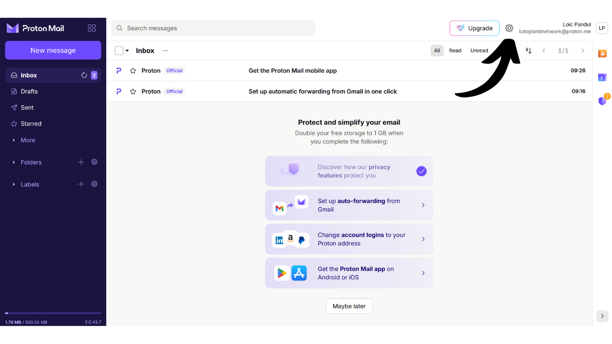
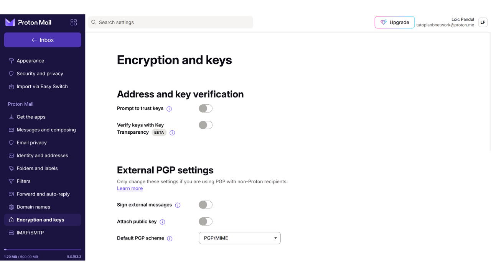
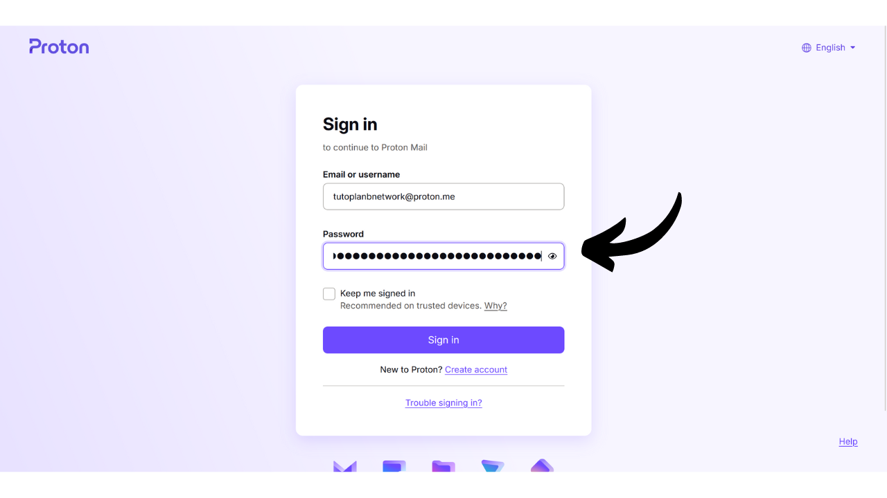

El buzón de correo electrónico es un elemento central de tu actividad en línea y a menudo juega un papel crucial en la seguridad de tu computadora. Si un atacante logra comprometer tu buzón de correo electrónico, pueden obtener fácil acceso a tus otras cuentas a través de la función "*olvidé mi contraseña*". Esto puede permitirles controlar tus redes sociales, tus cuentas bancarias y otros servicios en línea, porque hoy en día, la dirección de correo electrónico se utiliza a menudo como un identificador único de tu identidad en línea. Por lo tanto, asegurar tu buzón de correo electrónico es muy importante para protegerte de ataques.

Para garantizar la seguridad de tu buzón de correo electrónico, es importante adoptar algunas buenas prácticas simples que estudiamos en este tutorial dirigido a principiantes en informática. También es importante elegir un proveedor de correo electrónico seguro que ofrezca opciones de protección avanzadas y una política robusta de protección de la privacidad. Es por eso que recomiendo en este tutorial descubrir ProtonMail. Incluso si prefieres no usar este proveedor, las buenas prácticas presentadas aquí se pueden aplicar a cualquier buzón de correo electrónico para mejorar su seguridad.

## ¿Por qué usar ProtonMail?

ProtonMail es una solución de mensajería bastante segura gracias a varias características. En primer lugar, ProtonMail asegura el cifrado de extremo a extremo de tus correos electrónicos, lo que significa que solo el remitente y el destinatario pueden leer su contenido. En teoría, incluso ProtonMail no puede acceder a los correos electrónicos de sus usuarios. Este cifrado se aplica automáticamente, sin requerir ninguna habilidad técnica específica por parte de los usuarios.

Además, ProtonMail integra tecnologías avanzadas para proteger tu privacidad, incluyendo el bloqueo de ciertos sistemas de seguimiento y el ocultamiento de tu dirección IP. Al estar basada en Suiza, la compañía Proton se beneficia de algunas de las leyes de protección de datos que no se encuentran en otros países. Además, ProtonMail es de código abierto, lo que permite a expertos independientes auditar libremente el código del software.

El modelo de negocio de Proton se basa en un sistema de suscripción, lo cual es tranquilizador ya que indica que la compañía se financia sin necesariamente explotar los datos de sus usuarios. En este tutorial, exploraremos cómo usar la versión gratuita de ProtonMail, pero también hay varios niveles de suscripción que ofrecen más características. Este modelo de negocio es preferible a un sistema completamente gratuito, lo cual podría generar preocupaciones sobre si nuestros datos personales se están utilizando con fines de lucro. Afortunadamente, esto no parece ser el caso con ProtonMail.

## Creando una cuenta en Proton

Visita el sitio oficial de proton: https://proton.me/

Haz clic en el botón "*Crear una cuenta*":
Tienes la opción de elegir entre diferentes planes según tus necesidades. Para empezar, puedes optar por una cuenta gratuita, que te permitirá probar los servicios básicos de ProtonMail. Más tarde, si deseas acceder a características adicionales y otro software de Proton como Calendario, VPN o Gestor de Contraseñas, puedes considerar suscribirte a un plan de pago.

Luego llegas a la página de creación de cuenta.

Puedes elegir el nombre de dominio que prefieras para tu dirección de correo electrónico haciendo clic en la pequeña flecha. Esta elección no tiene impacto en lo que sigue.

También, elige el nombre de usuario para tu dirección de correo electrónico.

Luego se te pide que establezcas una contraseña. Es importante elegir una contraseña fuerte en esta etapa, ya que permitirá el acceso a tu buzón de correo. Una contraseña robusta debe ser lo más larga posible, usar una amplia variedad de caracteres y ser elegida al azar. En 2024, las recomendaciones mínimas para una contraseña segura son 13 caracteres incluyendo números, letras minúsculas y mayúsculas, así como símbolos, siempre que la contraseña sea verdaderamente aleatoria. Sin embargo, recomiendo optar por una contraseña de al menos 20 caracteres, incluyendo todos los tipos posibles de caracteres, para asegurar su seguridad por más tiempo.
El uso de un gestor de contraseñas es una práctica excelente. No solo te permite almacenar tus contraseñas de manera segura sin tener que memorizarlas, sino que también puede generar contraseñas largas y aleatorias para ti. Los humanos son realmente muy malos creando secuencias aleatorias, y una contraseña que no es lo suficientemente aleatoria puede ser vulnerable a ataques de fuerza bruta. También recomiendo consultar nuestro tutorial completo sobre cómo configurar un gestor de contraseñas para más detalles sobre este tema:
https://planb.network/tutorials/others/bitwarden

Haz clic en el botón "*Crear Cuenta*".

Resuelve el CAPTCHA.

Elige un nombre para mostrar. Este es el nombre que se mostrará a tu destinatario cuando envíes un correo electrónico. Elige tu nombre real o un apodo.
Proton también te ofrece la opción de establecer un método para recuperar tu cuenta, ya sea a través de tu número de teléfono o con una dirección de correo electrónico alternativa. Es importante entender que esta opción puede aumentar la superficie de ataque de tu bandeja de entrada de correo electrónico. Para ti, es una medida de seguridad adicional para recuperar el acceso a tu cuenta en caso de que olvides tu contraseña, pero para un hacker, es una oportunidad extra para intentar irrumpir en tu cuenta. No estás obligado a elegir esta opción de recuperación, pero si decides no hacerlo, asegúrate de mantener una copia segura de tu contraseña. Sin ella, si pierdes tu contraseña, serás incapaz de recuperar el acceso a tu bandeja de entrada de correo electrónico.

## Configurando Tu Buzón de Proton Mail

¡Felicidades, tu buzón de Proton ya está creado! Comienza eligiendo los colores para el tema de tu buzón.

Si lo deseas, también puedes configurar el reenvío de tus correos electrónicos desde tu antigua cuenta de Gmail a tu nueva cuenta de ProtonMail.

Una vez en la interfaz de tu buzón, te aconsejo que eches un vistazo a los ajustes para personalizarlos. Haz clic en el icono de engranaje en la esquina superior derecha.

Luego haz clic en el botón "*Todos los ajustes*".

En la pestaña "*Dashboard*", encontrarás información relacionada con tu cuenta. Al desplazarte hacia abajo en esta sección, tienes la opción de seleccionar los tipos de correos electrónicos que estás dispuesto a recibir de Proton. Si prefieres no recibir notificaciones promocionales o informativas, puedes elegir deseleccionar todas.

En la pestaña "*Mejorar plan*", puedes elegir un plan de pago con nuevas características.

En la pestaña "*Recuperación*", puedes añadir o modificar tus métodos de recuperación.

En la pestaña "*Cuenta y contraseña*", puedes cambiar tus nombres de usuario, así como los métodos para asegurar tu cuenta.

Por ahora, tu buzón solo está asegurado con una contraseña. Te aconsejo que, como mínimo, añadas protección de autenticación de dos factores con una app. Para hacerlo, haz clic en la casilla.

Confirma tu contraseña.

Luego escanea el código QR usando tu app de 2FA.

Para más información, te aconsejo que consultes nuestro tutorial sobre cómo usar una app de 2FA.
En la pestaña "*Idioma y hora*", puedes cambiar el idioma de la interfaz así como la zona horaria.

En la pestaña "*Appearance*", puedes modificar los colores de tu interfaz.

En la pestaña "*Security and privacy*", tienes acceso a varias opciones de seguridad. Algunas de estas opciones solo están disponibles con un plan de pago. También tienes la opción de deshabilitar la recopilación de tus datos por parte de Proton, que utiliza esta información para diagnósticos y resolución de errores.

En la pestaña "*Import*", tienes la opción de gestionar la migración de tus correos electrónicos antiguos a tu nueva cuenta de ProtonMail. Si prefieres comenzar con un buzón completamente nuevo, sin importar tus correos antiguos, puedes elegir ignorar esta opción.

La pestaña "*Get the apps*" te permite descargar las aplicaciones móviles y el software de escritorio de Proton para gestionar tu buzón en estas plataformas. Si lo prefieres, puedes continuar usando solo la versión web de tu buzón, en la que te encuentras actualmente, ya que ofrece las mismas características.

En la pestaña "*Messages and composing*", tienes una miríada de opciones de personalización para tu buzón.

En la pestaña "*Email privacy*", puedes elegir opciones respecto a la privacidad de tus correos electrónicos.

En la pestaña "*Identity and addresses*", tienes la opción de personalizar tu firma de correo electrónico. Si tienes una cuenta de pago, también puedes crear varias direcciones de correo electrónico diferentes que serán gestionadas desde la misma cuenta. Esto puede ser muy útil para separar tus diferentes usos.

En la pestaña "*Folders and labels*", puedes crear carpetas y etiquetas para organizar tu buzón.

La pestaña "*Filters*" te permite gestionar filtros para los correos electrónicos que recibes.

La pestaña "*Forward and auto-reply*" te permite gestionar el reenvío y las respuestas automáticas para tus correos electrónicos.

En la pestaña "*Domain names*", tienes la opción de configurar una dirección de correo electrónico usando tu propio dominio, lo cual puede ser útil si posees un sitio web. Para uso personal, no es necesariamente requerido usar esta característica.

La pestaña "*Encryption and keys*" te permite gestionar las opciones de cifrado para tus correos electrónicos. Para usuarios principiantes, generalmente no es necesario modificar los ajustes en esta sección.

Y finalmente, la pestaña "*IMAP/SMTP*" te ofrece la posibilidad de configurar un puente para usar ProtonMail con software de correo electrónico como Outlook o Apple Mail.

Para volver a la página principal de tu buzón, haz clic en el botón "*Inbox*" en la parte superior izquierda.

## Usando tu buzón de Proton Mail

Para enviar un correo electrónico, es muy simple, solo haz clic en el botón "*New Message*" en la parte superior izquierda.

En el campo "*To*", introduce la dirección de correo electrónico de tu destinatario.

En el campo "*Subject*", introduce el asunto de tu correo electrónico.

Escribe tu mensaje.

Finalmente, haz clic en el botón "*Enviar*" para enviar tu correo electrónico.

Luego puedes encontrar tus mensajes enviados en la pestaña "*Enviados*".

La pestaña "*Bandeja de entrada*" contiene los correos electrónicos que has recibido.

Puedes leer tus correos electrónicos haciendo clic en ellos y luego organizarlos en las diferentes carpetas que hayas creado.

## Iniciando sesión en tu buzón de Proton Mail

Como se mencionó anteriormente, tienes la opción de usar tu buzón de ProtonMail ya sea a través de la versión web, descargando el software para escritorio o mediante la aplicación móvil. Para descargar el software, puedes visitar la página oficial: https://proton.me/mail/download

Si prefieres usar solo la versión web de ProtonMail, considera agregar la página a los favoritos de tu navegador para un acceso más fácil en el futuro y para evitar intentos de phishing.

Para acceder, ve a la siguiente URL: https://account.proton.me/mail

Ingresa tu nombre de usuario y contraseña, luego haz clic en el botón "*Iniciar sesión*". Si has habilitado la autenticación de dos factores (2FA), también se te pedirá que ingreses los 6 dígitos dinámicos generados por tu aplicación.

Llegarás de nuevo a tu bandeja de entrada de ProtonMail.

