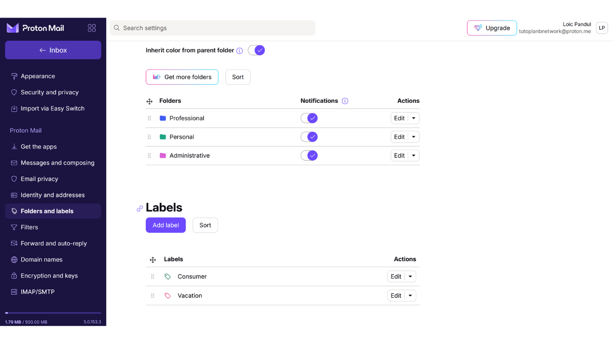

E-posti kast on teie veebitegevuse keskne element ja mängib sageli olulist rolli teie arvuti turvalisuses. Kui ründaja suudab teie e-posti kasti kompromiteerida, saavad nad hõlpsasti juurdepääsu teie teistele kontodele läbi "*unustasin parooli*" funktsiooni. See võib võimaldada neil kontrollida teie sotsiaalvõrgustikke, pangakontosid ja muid veebiteenuseid, sest tänapäeval kasutatakse e-posti aadressi sageli teie veebiidentiteedi ainulaadse identifikaatorina. Seetõttu on oma e-posti kasti turvamine väga oluline enda kaitsmiseks rünnakute eest.

E-posti kasti turvalisuse tagamiseks on oluline omaks võtta mõned lihtsad head tavad, mida me käesolevas arvutialgajatele suunatud õpetuses uurime. Samuti on oluline valida turvaline e-posti teenuse pakkuja, kes pakub arenenud kaitsevõimalusi ja tugevat privaatsuskaitse poliitikat. Seetõttu soovitan selles õpetuses tutvuda ProtonMailiga. Isegi kui eelistate mitte kasutada seda teenusepakkujat, saab siin esitatud häid tavasid rakendada mis tahes e-posti kasti turvalisuse suurendamiseks.

## Miks kasutada ProtonMaili?

ProtonMail on üsna turvaline sõnumside lahendus tänu mitmele omadusele. Esiteks tagab ProtonMail sinu e-kirjade otsast lõpuni krüpteerimise, mis tähendab, et nende sisu saavad lugeda ainult saatja ja saaja. Teoreetiliselt ei pääse isegi ProtonMail oma kasutajate e-kirjadele ligi. See krüpteerimine rakendub automaatselt, ilma et kasutajatelt nõutaks erilisi tehnilisi oskusi.

Lisaks integreerib ProtonMail arenenud tehnoloogiaid sinu privaatsuse kaitsmiseks, sealhulgas teatud jälgimissüsteemide blokeerimine ja sinu IP-aadressi maskeerimine. Kuna Proton on asutatud Šveitsis, saab Protoni ettevõte kasu mõningatest andmekaitse seadustest, mida teistes riikides ei leidu. Lisaks on ProtonMail avatud lähtekoodiga, mis võimaldab sõltumatutel ekspertidel tarkvara koodi vabalt auditeerida.

Protoni ärimudel põhineb tellimussüsteemil, mis on julgustav, kuna see näitab, et ettevõte finantseeritakse ilma tingimata oma kasutajate andmeid ära kasutamata. Selles õpetuses uurime, kuidas kasutada ProtonMaili tasuta versiooni, kuid on olemas ka mitu tellimustaset, mis pakuvad rohkem funktsioone. See ärimudel on eelistatav täiesti tasuta süsteemile, mis võiks tekitada muret selle üle, kas meie isikuandmeid kasutatakse kasumi teenimiseks. Õnneks ei tundu see ProtonMaili puhul olevat nii.

## Protoni konto loomine

Külasta ametlikku Protoni lehte: https://proton.me/

Klõpsa nupul "*Loo konto*":
Sul on võimalus valida erinevate plaanide vahel vastavalt oma vajadustele. Alguseks võid valida tasuta konto, mis võimaldab sul testida ProtonMaili põhiteenuseid. Hiljem, kui soovid juurdepääsu lisafunktsioonidele ja muule Protoni tarkvarale nagu Kalender, VPN või Paroolihaldur, võid kaaluda tasulise plaani tellimist.

Seejärel jõuad konto loomise lehele.

Saad valida eelistatud domeeninime oma e-posti aadressile, klõpsates väikesel noolel. See valik ei mõjuta järgnevat.

Samuti vali oma e-posti aadressile kasutajanimi.

Seejärel palutakse sul seada parool. Selles etapis on oluline valida tugev parool, kuna see võimaldab juurdepääsu sinu postkastile. Tugev parool peaks olema võimalikult pikk, kasutama laia valikut tähemärke ja olema valitud juhuslikult. 2024. aasta minimaalsed soovitused turvalise parooli jaoks on 13 tähemärki, sealhulgas numbrid, väiketähed ja suurtähed ning sümbolid, eeldusel, et parool on tõeliselt juhuslik. Siiski soovitan valida vähemalt 20-tähemärgilise parooli, mis sisaldab kõiki võimalikke tähemärkide tüüpe, et tagada selle turvalisus pikemaks ajaks.
Paroolihalduri kasutamine on suurepärane praktika. See mitte ainult ei võimalda teil oma paroole turvaliselt salvestada, ilma et peaksite neid meelde jätma, vaid see võib teie jaoks genereerida ka pikki ja juhuslikke paroole. Inimesed on tõepoolest väga halvad juhuslike jadade loomisel ja piisavalt juhuslik mitteolev parool võib olla haavatav jõuga murdmise rünnakutele. Soovitan samuti tutvuda meie täieliku juhendiga paroolihalduri seadistamise kohta, et saada sellel teemal rohkem üksikasju:
https://planb.network/tutorials/others/bitwarden

Klõpsake nupul "*Loo konto*".

Lahendage CAPTCHA.

Valige kuvatav nimi. See on nimi, mis kuvatakse teie saajale, kui saadate e-kirja. Valige oma pärisnimi või hüüdnimi.
Proton pakub teile ka võimalust seadistada meetod oma konto taastamiseks, kasutades selleks kas oma telefoninumbrit või alternatiivset e-posti aadressi. On oluline mõista, et see võimalus võib suurendada teie e-posti sisendkausta ründepinda. Teie jaoks on see lisaturvameede, et taastada juurdepääs oma kontole, kui unustate oma parooli, kuid häkkeri jaoks on see lisavõimalus proovida teie kontole sisse murda. Te ei ole kohustatud seda taastamisvõimalust valima, kuid kui otsustate seda mitte teha, veenduge, et hoiaksite oma paroolist turvalist koopiat. Ilma selleta, kui kaotate oma parooli, ei saa te taastada juurdepääsu oma e-posti sisendkaustale.

## Teie Protoni postkasti seadistamine

Palju õnne, teie Protoni postkast on nüüd loodud! Alustage oma postkasti teema värvide valimisega.

Soovi korral võite seadistada ka oma vanast Gmaili kontost uude ProtonMaili kontosse e-kirjade edasisuunamise.

Kui olete oma postkasti liidesel, soovitan teil vaadata seadeid, et neid kohandada. Klõpsake paremas ülanurgas asuval hammasrattaikoonil.

Seejärel klõpsake nupul "*Kõik seaded*".

Vahekaardil "*Töölaud*" leiate oma konto kohta käivat teavet. Selle jaotise all kerides on teil võimalus valida, millist tüüpi e-kirju soovite Protonilt saada. Kui eelistate mitte saada reklaami- või informatiivseid teateid, võite kõik valikud tühistada.

Vahekaardil "*Uuenda plaani*" saate valida tasulise plaani uute funktsioonidega.

Vahekaardil "*Taastamine*" saate lisada või muuta oma taastamismeetodeid.

Vahekaardil "*Konto ja parool*" saate muuta oma kasutajanimesid, samuti meetodeid oma konto turvamiseks.

Praegu on teie postkast turvatud ainult parooliga. Soovitan teil vähemalt lisada kahefaktoriline autentimine kaitse rakendusega. Selleks klõpsake märkeruudul.

Kinnitage oma parool.

Seejärel skannige QR-koodi, kasutades oma 2FA rakendust.

Rohkem informatsiooni saamiseks soovitan teil tutvuda meie juhendiga, kuidas kasutada 2FA rakendust.
Vahekaardil "*Keel ja aeg*" saate muuta liidese keelt ning ajavööndit.

"*Appearance*" vahekaardil saate muuta oma liidese värve.

"*Security and privacy*" vahekaardil on teil juurdepääs erinevatele turvavalikutele. Mõned neist valikutest on saadaval ainult tasulise plaani korral. Teil on ka võimalus keelata Protonil oma andmete kogumine, mida kasutatakse diagnostika ja vigade lahendamise eesmärgil.

"*Import*" vahekaardil on teil võimalus hallata oma vanade e-kirjade migreerimist uude ProtonMaili kontosse. Kui eelistate alustada täiesti uue postkastiga ilma vanu e-kirju importimata, võite selle valiku tähelepanuta jätta.

"*Get the apps*" vahekaart võimaldab teil alla laadida Protoni mobiilirakendused ja lauaarvutitarkvara, et hallata oma postkasti nendel platvormidel. Kui eelistate, võite jätkata ainult veebiversiooni kasutamist oma postkastist, millel on samad funktsioonid ja mida te praegu kasutate.

"*Messages and composing*" vahekaardil on teil hulgaliselt kohandamisvõimalusi oma postkasti jaoks.

"*Email privacy*" vahekaardil saate valida e-kirjade privaatsusega seotud valikuid.

"*Identity and addresses*" vahekaardil on teil võimalus kohandada oma e-kirja allkirja. Kui teil on tasuline konto, saate luua ka mitu erinevat e-posti aadressi, mida kõiki hallatakse samast kontost. See võib olla väga kasulik oma erinevate kasutusviiside eraldamiseks.

"*Folders and labels*" vahekaardil saate luua kaustu ja silte oma postkasti korraldamiseks.

"*Filters*" vahekaart võimaldab teil hallata e-kirjadele rakendatavaid filtreid.

"*Forward and auto-reply*" vahekaart võimaldab teil hallata oma e-kirjade edasisaatmist ja automaatvastuseid.

"*Domain names*" vahekaardil on teil võimalus seadistada e-posti aadress oma domeeni kasutades, mis võib olla kasulik, kui omate veebisaiti. Isiklikuks kasutamiseks ei pruugi selle funktsiooni kasutamine olla vajalik.

"*Encryption and keys*" vahekaart võimaldab teil hallata oma e-kirjade krüpteerimisvalikuid. Algajatele kasutajatele ei ole tavaliselt vajalik selles jaotises seadeid muuta.

Lõpuks, "*IMAP/SMTP*" vahekaart pakub teile võimalust seadistada sild, et kasutada ProtonMaili e-posti tarkvaraga nagu Outlook või Apple Mail.

Et naasta oma postkasti avalehele, klõpsake vasakus ülanurgas asuval "*Inbox*" nupul.

## Oma Proton Maili postkasti kasutamine

E-kirja saatmiseks on see väga lihtne, lihtsalt klõpsake vasakus ülanurgas asuval "*New Message*" nupul.

"*To*" väljale sisestage saaja e-posti aadress.

"*Subject*" väljale sisestage oma e-kirja teema.

Kirjutage oma sõnum.

Lõpuks vajutage "*Saada*" nupule, et saata oma e-kiri.

Seejärel leiate oma saadetud sõnumid "*Saadetud*" kaustast.

"*Postkast*" kaust sisaldab teile saabunud e-kirju.

E-kirjade lugemiseks klõpsake neil ning seejärel saate neid organiseerida loodud kaustadesse.

## ProtonMaili postkasti sisselogimine

Nagu varem mainitud, on teil võimalus kasutada oma ProtonMaili postkasti kas veebiversiooni kaudu, laadides alla lauaarvuti tarkvara või kasutades mobiilirakendust. Tarkvara allalaadimiseks külastage ametlikku lehte: https://proton.me/mail/download

Kui eelistate kasutada ainult ProtonMaili veebiversiooni, kaaluge lehe lisamist oma brauseri järjehoidjatesse, et tulevikus oleks lihtsam ligi pääseda ja vältida õngitsuskatseid.

Sellele juurdepääsemiseks minge järgmisele URLile: https://account.proton.me/mail

Sisestage oma kasutajanimi ja parool, seejärel klõpsake "*Logi sisse*" nuppu. Kui olete lubanud kahefaktorilise autentimise (2FA), palutakse teil sisestada ka teie rakenduse poolt genereeritud 6 dünaamilist numbrit.

Seejärel jõuate tagasi oma ProtonMaili postkasti.

