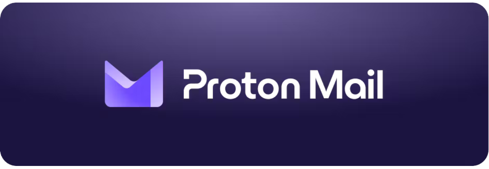
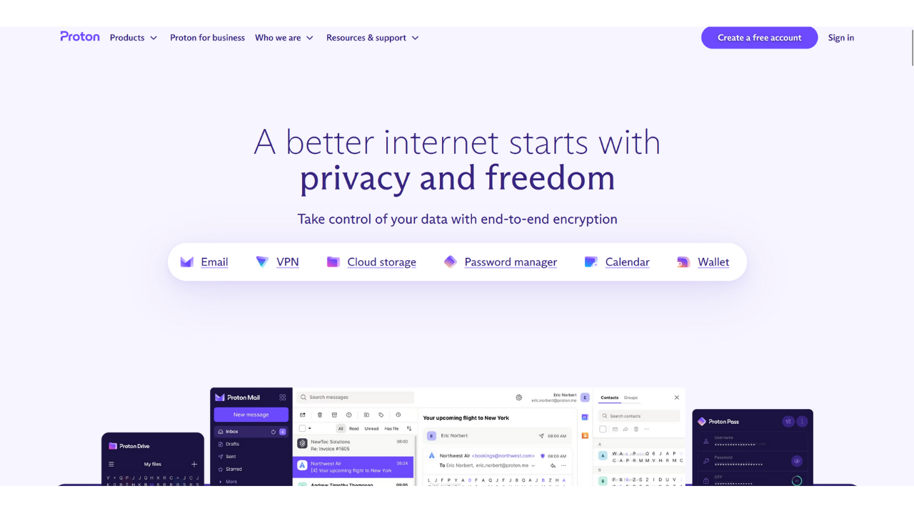
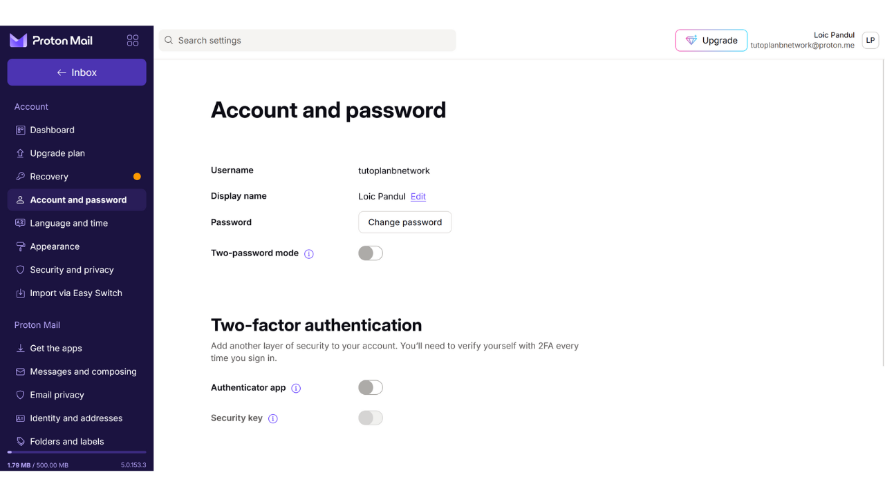

Sähköpostilaatikko on keskeinen osa verkkotoimintaasi ja sillä on usein ratkaiseva rooli tietokoneturvallisuudessasi. Jos hyökkääjä onnistuu murtamaan sähköpostilaatikkosi, hän saa helposti pääsyn muihin tileihisi "*unohdin salasanan*" -toiminnon kautta. Tämä voi antaa heille mahdollisuuden hallita sosiaalisen median tilejäsi, pankkitilejäsi ja muita verkkopalveluitasi, koska nykyään sähköpostiosoite käytetään usein verkkoidentiteettisi yksilöllisenä tunnisteena. Siksi sähköpostilaatikkosi turvaaminen on erittäin tärkeää suojautuaksesi hyökkäyksiltä.

Sähköpostilaatikkosi turvallisuuden varmistamiseksi on tärkeää omaksua joitakin yksinkertaisia hyviä käytäntöjä, joita käsittelemme tässä tietotekniikan aloittelijoille suunnatussa oppaassa. On myös tärkeää valita turvallinen sähköpostipalveluntarjoaja, joka tarjoaa edistyneitä suojatoimintoja ja vankan yksityisyydensuojapolitiikan. Siksi suosittelen tässä oppaassa tutustumaan ProtonMailiin. Vaikka et haluaisikaan käyttää tätä palveluntarjoajaa, tässä esitellyt hyvät käytännöt voidaan soveltaa mihin tahansa sähköpostilaatikkoon sen turvallisuuden parantamiseksi.

## Miksi käyttää ProtonMailia?

ProtonMail on melko turvallinen viestintäratkaisu useiden ominaisuuksien ansiosta. Ensinnäkin ProtonMail varmistaa sähköpostiesi päästä päähän -salauksen, mikä tarkoittaa, että vain lähettäjä ja vastaanottaja voivat lukea niiden sisällön. Teoriassa edes ProtonMail ei pääse käsiksi käyttäjiensä sähköposteihin. Tämä salaus tapahtuu automaattisesti, ilman että käyttäjiltä vaaditaan erityisiä teknisiä taitoja.

Lisäksi ProtonMail integroi edistyneitä teknologioita yksityisyytesi suojaamiseksi, mukaan lukien tietyt seurantajärjestelmät ja IP-osoitteesi peittäminen. Sijaitessaan Sveitsissä Proton-yhtiö hyötyy joistakin tietosuojalaeista, joita ei löydy muista maista. Lisäksi ProtonMail on avoimen lähdekoodin, mikä mahdollistaa riippumattomien asiantuntijoiden vapaan ohjelmakoodin tarkastelun.

Protonin liiketoimintamalli perustuu tilausjärjestelmään, mikä on rauhoittavaa, sillä se osoittaa, että yhtiö rahoitetaan ilman, että sen tarvitsee välttämättä hyödyntää käyttäjiensä tietoja. Tässä oppaassa tutustumme ProtonMailin ilmaisen version käyttöön, mutta tarjolla on myös useita tilaustasoja, jotka tarjoavat lisää ominaisuuksia. Tämä liiketoimintamalli on suositeltavampi kuin täysin ilmainen järjestelmä, joka voisi herättää huolta siitä, käytetäänkö henkilökohtaisia tietojamme voiton tavoitteluun. Onneksi näin ei vaikuta olevan ProtonMailin tapauksessa.

## Proton-tilin luominen

Vieraile virallisella Proton-sivustolla: https://proton.me/

Napsauta "*Luo tili*" -painiketta:
Sinulla on mahdollisuus valita eri suunnitelmista tarpeidesi mukaan. Aluksi voit valita ilmaisen tilin, joka antaa sinulle mahdollisuuden testata ProtonMailin peruspalveluita. Myöhemmin, jos haluat käyttää lisäominaisuuksia ja muita Proton-ohjelmistoja, kuten Kalenteri, VPN tai Salasananhallinta, voit harkita maksullisen suunnitelman tilaamista.

Tämän jälkeen saavut tilinluontisivulle.

Voit valita haluamasi verkkotunnuksen sähköpostiosoitteellesi napsauttamalla pientä nuolta. Tällä valinnalla ei ole vaikutusta seuraavaan.

Valitse myös käyttäjänimi sähköpostiosoitteellesi.

Sinua pyydetään sen jälkeen asettamaan salasana. On tärkeää valita vahva salasana tässä vaiheessa, sillä se mahdollistaa pääsyn postilaatikkoosi. Vahvan salasanan tulisi olla mahdollisimman pitkä, käyttää laajaa valikoimaa merkkejä ja olla valittu satunnaisesti. Vuonna 2024 turvallisen salasanan vähimmäissuositukset ovat 13 merkkiä, mukaan lukien numerot, pienet ja suuret kirjaimet sekä symbolit, edellyttäen, että salasana on todella satunnainen. Suosittelen kuitenkin valitsemaan vähintään 20 merkin pituisen salasanan, joka sisältää kaikki mahdolliset merkkityypit, jotta sen turvallisuus säilyisi pidempään.
Salasananhallintaohjelman käyttö on erinomainen käytäntö. Se ei ainoastaan mahdollista salasanojesi turvallista tallentamista ilman niiden muistamisen tarvetta, vaan se voi myös luoda sinulle pitkiä ja satunnaisia salasanoja. Ihmiset ovat todella huonoja luomaan satunnaisia jonoja, ja riittämättömän satunnainen salasana voi olla haavoittuvainen voimakkaan luvun hyökkäyksille. Suosittelen myös tutustumaan kattavaan oppaaseemme salasananhallintaohjelman asettamisesta lisätietoja varten tästä aiheesta:
https://planb.network/tutorials/others/bitwarden

Klikkaa "*Luo tili*" -painiketta.

Ratkaise CAPTCHA.

Valitse näyttönimi. Tämä on nimi, joka näytetään vastaanottajallesi, kun lähetät sähköpostia. Valitse oikea nimesi tai lempinimi.
Proton tarjoaa myös mahdollisuuden asettaa menetelmän tilisi palauttamiseksi, joko puhelinnumerosi tai vaihtoehtoisen sähköpostiosoitteesi kautta. On tärkeää ymmärtää, että tämä vaihtoehto voi lisätä sähköpostilaatikkosi hyökkäyspintaa. Sinulle se on lisäturvatoimenpide pääsyn palauttamiseksi tilillesi, jos unohdat salasanasi, mutta hakkerille se on ylimääräinen mahdollisuus yrittää murtautua tilillesi. Sinun ei tarvitse valita tätä palautusvaihtoehtoa, mutta jos päätät olla valitsematta, varmista, että pidät salasanastasi turvallisen kopion. Ilman sitä, jos menetät salasanasi, et pysty palauttamaan pääsyä sähköpostilaatikkoosi.

## Proton-sähköpostilaatikkosi asettaminen

Onnittelut, Proton-sähköpostilaatikkosi on nyt luotu! Aloita valitsemalla värit postilaatikkosi teemalle.

Jos haluat, voit myös asettaa vanhan Gmail-tilisi sähköpostien edelleenlähetyksen uuteen ProtonMail-tiliisi.

Kun olet postilaatikkosi käyttöliittymässä, neuvon sinua tutustumaan asetuksiin ja mukauttamaan niitä. Klikkaa hammasrattaan kuvaketta oikeassa yläkulmassa.

Klikkaa sitten "*Kaikki asetukset*" -painiketta.

"*Kojelauta*" -välilehdessä löydät tietoja tilistäsi. Tässä osiossa alaspäin vierittämällä sinulla on mahdollisuus valita, millaisia sähköposteja olet valmis vastaanottamaan Protonilta. Jos et halua vastaanottaa mainos- tai informatiivisia ilmoituksia, voit valita poistaa kaikki valinnat.

"*Päivitä suunnitelma*" -välilehdessä voit valita maksullisen suunnitelman uusilla ominaisuuksilla.

"*Palautus*" -välilehdessä voit lisätä tai muuttaa palautusmenetelmiäsi.

"*Tili ja salasana*" -välilehdessä voit vaihtaa käyttäjänimesi sekä tilisi turvaamisen menetelmiä.

Toistaiseksi postilaatikkosi on suojattu vain salasanalla. Neuvon sinua lisäämään vähintään kaksivaiheisen todennuksen suojauksen sovelluksen avulla. Tee tämä klikkaamalla valintaruutua.

Vahvista salasanasi.

Skannaa sitten QR-koodi käyttäen 2FA-sovellustasi.

Lisätietoja varten suosittelen tutustumaan oppaaseemme 2FA-sovelluksen käytöstä.
"*Kieli ja aika*" -välilehdessä voit vaihtaa käyttöliittymän kieltä sekä aikavyöhykettä.

"*Ulkoasu*" -välilehdessä voit muokata käyttöliittymäsi värejä.

"*Turvallisuus ja yksityisyys*" -välilehdessä sinulla on pääsy erilaisiin turvallisuusasetuksiin. Jotkut näistä asetuksista ovat saatavilla vain maksullisessa suunnitelmassa. Sinulla on myös mahdollisuus estää Protonia keräämästä tietojasi, joita se käyttää diagnostiikkaan ja vikojen selvittämiseen.

"*Tuo*" -välilehdessä voit hallita vanhojen sähköpostiesi siirtämistä uuteen ProtonMail-tiliisi. Jos haluat aloittaa täysin uudella postilaatikolla tuomatta vanhoja sähköpostejasi, voit jättää tämän vaihtoehdon huomiotta.

"*Hanki sovellukset*" -välilehti mahdollistaa Protonin mobiilisovellusten ja työpöytäohjelmiston lataamisen postilaatikkosi hallintaan näillä alustoilla. Jos haluat, voit jatkaa vain web-version käyttämistä postilaatikostasi, jolla olet tällä hetkellä, sillä se tarjoaa samat ominaisuudet.

"*Viestit ja kirjoittaminen*" -välilehdessä sinulla on lukuisia mukautusvaihtoehtoja postilaatikollesi.

"*Sähköpostin yksityisyys*" -välilehdessä voit valita vaihtoehtoja sähköpostiesi yksityisyyden suhteen.

"*Identiteetti ja osoitteet*" -välilehdessä voit mukauttaa sähköpostiallekirjoitustasi. Jos sinulla on maksullinen tili, voit myös luoda useita erilaisia sähköpostiosoitteita, joita kaikkia hallinnoidaan samasta tilistä. Tämä voi olla erittäin hyödyllistä eri käyttötarkoitustesi erottamiseen.

"*Kansiot ja tunnisteet*" -välilehdessä voit luoda kansioita ja tunnisteita postilaatikkosi järjestämiseksi.

"*Suodattimet*" -välilehti mahdollistaa sähköposteihisi saapuvien viestien suodattimien hallinnan.

"*Edelleenlähetys ja automaattiset vastaukset*" -välilehti mahdollistaa sähköpostiesi edelleenlähetys- ja automaattisten vastausten hallinnan.

"*Verkkotunnukset*" -välilehdessä sinulla on mahdollisuus asettaa sähköpostiosoite käyttäen omaa verkkotunnustasi, mikä voi olla hyödyllistä, jos omistat verkkosivuston. Henkilökohtaiseen käyttöön tämän ominaisuuden käyttö ei ole välttämättä tarpeellista.

"*Salaus ja avaimet*" -välilehti mahdollistaa sähköpostiesi salausten hallinnan. Aloittelijoille ei yleensä ole tarpeen muokata tämän osion asetuksia.

Lopuksi, "*IMAP/SMTP*" -välilehti tarjoaa sinulle mahdollisuuden konfiguroida sillan käyttääksesi ProtonMailia sähköpostiohjelmistojen, kuten Outlookin tai Apple Mailin kanssa.

Palataksesi postilaatikkosi kotisivulle, klikkaa vasemmassa yläkulmassa olevaa "*Saapuneet*" -painiketta.

## Proton Mail -postilaatikkosi käyttäminen

Sähköpostin lähettäminen on hyvin yksinkertaista, klikkaa vain vasemmassa yläkulmassa olevaa "*Uusi viesti*" -painiketta.

"*Vastaanottaja*" -kenttään, syötä vastaanottajan sähköpostiosoite.

"*Aihe*" -kenttään, kirjoita sähköpostisi aihe.

Kirjoita viestisi.

Lopuksi klikkaa "*Lähetä*" -painiketta lähettääksesi sähköpostisi.

Voit sen jälkeen löytää lähetetyt viestisi "*Lähetetyt*" -välilehdeltä.

"*Saapuneet*" -välilehti sisältää vastaanottamasi sähköpostit.

Voit lukea sähköpostisi klikkaamalla niitä, ja sen jälkeen järjestellä ne luomiisi kansioihin.

## Kirjautuminen ProtonMail -postilaatikkoosi

Kuten aiemmin mainittiin, voit käyttää ProtonMail -postilaatikkoasi joko verkkoversiona, lataamalla työpöytäohjelmiston tai mobiilisovelluksen kautta. Ohjelmiston lataamiseksi voit vierailla virallisella sivulla: https://proton.me/mail/download

Jos haluat käyttää vain ProtonMailin verkkoversiota, harkitse sivun lisäämistä selaimen suosikkeihin helpomman pääsyn varmistamiseksi tulevaisuudessa ja välttääksesi phishing-yritykset.

Päästäksesi siihen, mene seuraavaan URL-osoitteeseen: https://account.proton.me/mail

Syötä käyttäjänimesi ja salasanasi, sitten klikkaa "*Kirjaudu sisään*" -painiketta. Jos olet ottanut käyttöön kaksivaiheisen tunnistautumisen (2FA), sinua pyydetään myös syöttämään sovelluksesi generoimat 6 dynaamista numeroa.

Palaat takaisin ProtonMail -saapuneet-kansioosi.

