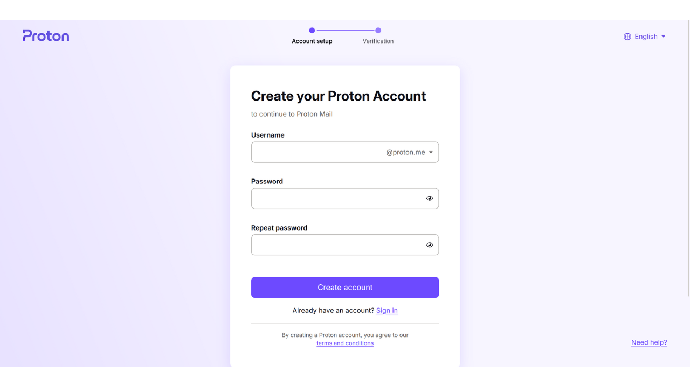
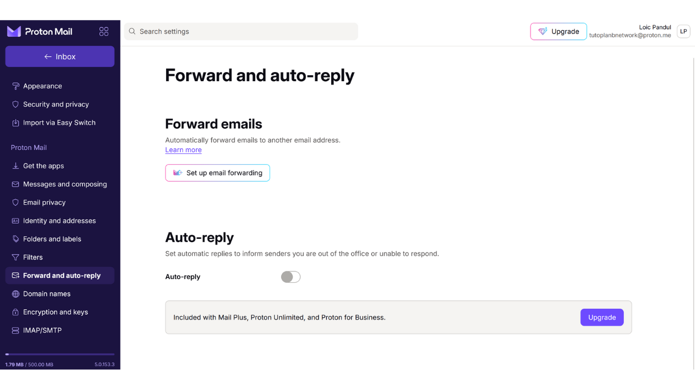
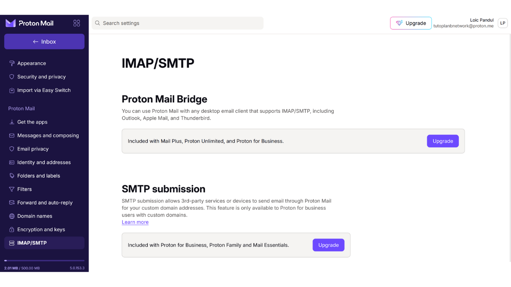
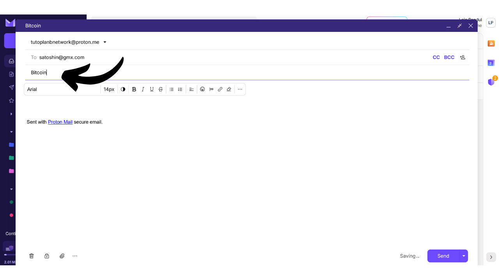

La boîte mail est un élément central de votre activité en ligne et joue souvent un rôle crucial dans votre sécurité informatique. Si un attaquant réussit à compromettre votre boîte mail, il obtient un accès facilité à vos autres comptes via la fonction "*mot de passe oublié*". Cela peut lui permettre de contrôler vos réseaux sociaux, vos comptes bancaires, et d'autres services en ligne, car aujourd'hui, l'adresse email est souvent utilisée comme un identifiant unique de votre identité en ligne. Par conséquent, sécuriser votre boîte mail est très important pour vous protéger des attaques.

Pour garantir la sécurité de votre boîte mail, il est important d'adopter quelques bonnes pratiques simples que nous étudions dans ce tutoriel destiné aux débutants en informatique. Il est également important de choisir un fournisseur de messagerie sécurisé offrant des options de protection avancées et une politique robuste de protection de la vie privée. C'est pourquoi je recommande dans ce tutoriel de découvrir ProtonMail. Même si vous préférez ne pas utiliser ce fournisseur, les bonnes pratiques présentées ici peuvent être appliquées à toute boîte mail pour renforcer sa sécurité.

## Pourquoi utiliser ProtonMail ?

ProtonMail est une solution de messagerie plutôt sécurisée grâce à plusieurs caractéristiques. Premièrement, ProtonMail assure un chiffrement de bout en bout de vos emails, ce qui signifie que seuls l'expéditeur et le destinataire peuvent lire leur contenu. En théorie, même ProtonMail ne peut pas accéder aux emails de ses utilisateurs. Ce chiffrement est appliqué automatiquement, sans nécessiter de compétences techniques spécifiques de la part des utilisateurs.

De plus, ProtonMail intègre des technologies avancées pour protéger votre vie privée, notamment en bloquant certains systèmes de suivi et en masquant votre adresse IP. En étant basé en Suisse, l'entreprise Proton bénéficie de certaines des lois de protection des données que l'on ne retrouve pas dans d'autres pays. De plus, ProtonMail est open-source, ce qui permet à des experts indépendants d'auditer librement le code du logiciel.

Le modèle économique de Proton repose sur un système d'abonnement, ce qui est rassurant puisqu'il indique que l'entreprise se finance sans forcément exploiter les données de ses utilisateurs. Dans ce tutoriel, nous explorerons comment utiliser la version gratuite de ProtonMail, mais il existe également plusieurs niveaux d'abonnement offrant plus de fonctionnalités. Ce modèle d'affaires est préférable à un système entièrement gratuit, qui pourrait amener à se demander si nos données personnelles sont utilisées à des fins lucratives. Heureusement, cela ne semble pas être le cas avec ProtonMail.

## Créer un compte Proton

Rendez-vous sur le site officiel de proton : https://proton.me/

Cliquez sur le bouton "*Créer un compte*" :

Vous avez la possibilité de choisir parmi différents forfaits selon vos besoins. Pour débuter, vous pouvez opter pour un compte gratuit, ce qui vous permettra de tester les services de base de ProtonMail. Par la suite, si vous souhaitez accéder à des fonctionnalités supplémentaires et à d'autres logiciels Proton tels que le Calendrier, le VPN, ou le Gestionnaire de mots de passe, vous pourrez envisager de souscrire à un forfait payant.

Vous arrivez ensuite sur la page de création de votre compte.

Vous pouvez choisir le nom de domaine que vous préférez avoir sur votre adresse mail en cliquant sur la petite flèche. Ce choix n'a aucune incidence sur la suite.

Choisissez également l'identifiant de votre adresse email.

On vous demande ensuite de définir un mot de passe. Il est important de choisir un mot de passe fort à cette étape, car il permettra l'accès à votre boîte mail. Un mot de passe robuste doit être le plus long possible, utiliser une grande diversité de caractères, et être choisi de manière aléatoire. En 2024, les recommandations minimales pour un mot de passe sécurisé sont de 13 caractères en incluant des chiffres, des lettres minuscules et majuscules, ainsi que des symboles, à condition que le mot de passe soit réellement aléatoire. Toutefois, je recommande d'opter pour un mot de passe d'au moins 20 caractères, comprenant tous types de caractères possibles, pour garantir sa sécurité plus longtemps.

L'utilisation d'un gestionnaire de mots de passe est une excellente pratique. Non seulement il vous permet de stocker vos mots de passe de manière sécurisée sans avoir à les mémoriser, mais il peut également générer pour vous des mots de passe longs et aléatoires. Les êtres humains sont en effet très mauvais pour créer des séquences aléatoires, et un mot de passe insuffisamment aléatoire peut être vulnérable à des attaques par brute force. Je vous recommande également de consulter notre tutoriel complet sur la mise en place d'un gestionnaire de mots de passe pour plus de détails sur ce sujet :

https://planb.network/tutorials/others/install-bitwarden

Cliquez sur le bouton "*Créer le compte*".

Résolvez le CAPTCHA.

Choisissez un nom d'affichage. C'est le nom qui sera indiqué à votre destinataire lorsque vous envoyez un email. Choisissez votre vrai nom ou bien un pseudo.

Proton vous propose également de mettre en place une méthode de récupération de votre compte, soit via votre numéro de téléphone, soit avec une autre adresse email. Il est important de comprendre que cette option peut augmenter la surface d'attaque de votre boîte mail. Pour vous, c'est une sécurité supplémentaire pour récupérer l'accès à votre compte en cas d'oubli de votre mot de passe, mais pour un pirate, c'est une opportunité supplémentaire de tenter de s'introduire dans votre compte. Vous n'êtes pas obligé de choisir cette option de récupération, mais si vous décidez de ne pas le faire, assurez-vous de conserver une copie sécurisée de votre mot de passe. Sans cela, en cas de perte du mot de passe, il vous sera impossible de récupérer l'accès à votre boîte mail.

## Configurer sa boite mail Proton

Félicitations, votre boite mail Proton est désormais créée ! Commencez par choisir les couleurs du thème de votre boite mail.

Si vous le souhaitez, vous pouvez également mettre en place un renvoi de vos emails depuis votre ancienne boite mail Gmail, jusqu'à votre nouvelle boite ProtonMail.

Une fois sur l'interface de votre boite mail, je vous conseille d'aller faire un tour dans les paramètres pour les personnaliser. Cliquez sur l'icône de roue crantée en haut à droite.

Puis cliquez sur le bouton "*All settings*".

Dans l'onglet "*Dashboard*", vous trouvez les informations relatives à votre compte. En naviguant plus bas dans cette section, vous avez la possibilité de sélectionner les types d'emails que vous acceptez de recevoir de la part de Proton. Si vous préférez ne pas recevoir de notifications promotionnelles ou informatives, vous pouvez choisir de tout décocher.

Dans l'onglet "*Upgrade plan*" vous pouvez choisir un forfait payant avec de nouvelles fonctionnalités.

Dans l'onglet "*Recovery*", vous pouvez ajouter ou modifier vos méthodes de récupérations.

Dans l'onglet "*Account and password*", vous pouvez modifier vos noms d'utilisateur, ainsi que les méthodes de sécurisation de votre compte.

Pour le moment, votre boite mail est seulement sécurisée par un mot de passe. Je vous conseille au minimum d'ajouter une protection à deux facteurs d'authentification avec une application. Pour ce faire cliquez sur la coche.

Confirmez votre mot de passe.

Puis scannez le QR code à l'aide de votre application de 2FA.

Pour plus d'informations, je vous conseille de découvrir notre tutoriel sur comment utiliser une application de 2FA.

https://planb.network/tutorials/others/authy

Dans l'onglet "*Language and time*" vous pouvez changer la langue de l'interface ainsi que le fuseau horaire.

Dans l'onglet "*Appearance*" vous pouvez modifier les couleurs de votre interface.

Dans l'onglet "*Security and privacy*", vous avez accès à différentes options de sécurité. Certaines de ces options ne sont disponibles qu'avec un forfait payant. Vous avez également la possibilité de désactiver la collecte de vos données par l'entreprise Proton, qui utilise ces informations pour des diagnostics et des résolutions de bugs.

Dans l'onglet "*Import*", vous avez la possibilité de gérer la migration de vos anciens emails vers votre nouvelle boîte ProtonMail. Si vous préférez commencer avec une boîte mail entièrement nouvelle, sans importer vos anciens emails, vous pouvez choisir d'ignorer cette option.

L'onglet "*Get the apps*" vous permet de télécharger les applications mobiles et les logiciels de bureau de Proton pour gérer votre boîte mail sur ces plateformes. Si vous préférez, vous pouvez continuer d'utiliser uniquement la version web de votre boîte mail, sur laquelle vous êtes actuellement, car elle offre les mêmes fonctionnalités.

Dans l'onglet "*Messages and composing*", vous avez une myriade d'options de personnalisation pour votre boite mail.

Dans l'onglet "*Email privacy*", vous pouvez choisir des options sur la confidentialité de vos emails.

Dans l'onglet "*Identity and addresses*", vous avez la possibilité de personnaliser votre signature d'email. Si vous disposez d'un compte payant, vous pouvez aussi créer plusieurs adresses email différentes qui seront toutes gérées depuis le même compte. Cela peut être très utile pour séparer vos différents usages.

Dans l'onglet "*Folders and labels*", vous pouvez créer des dossiers et des étiquettes afin d'organiser votre boite mail.

L'onglet "*Filters*" vous permet de gérer les filtres pour les emails que vous recevez.

L'onglet "*Forward and auto-reply*" vous permet de gérer les renvois et les transferts atuomatiques pour vos emails. 

Dans l'onglet "*Domain names*", vous avez l'option de configurer une adresse email utilisant votre propre domaine, ce qui peut être utile si vous possédez un site web. Pour un usage personnel, il n'est pas forcément nécessaire d'utiliser cette fonctionnalité.

L'onglet "*Encryption and keys*" vous permet de gérer les options de chiffrement de vos emails. Pour les utilisateurs débutants, il n'est généralement pas nécessaire de modifier les paramètres dans cette section.

Et enfin, l'onglet "*IMAP/SMTP*" vous offre la possibilité de configurer un pont pour utiliser ProtonMail avec des logiciels de messagerie tels qu'Outlook ou Apple Mail.

Pour retourner sur la page d'accueil de votre boite mail, cliquez sur le bouton "*Inbox*" en haut à gauche.

## Utiliser sa boite mail Proton

Pour envoyer un email, c'est très simple, il suffit de cliquer en haut à gauche sur le bouton "*New Message*".

Dans la case "*To*", entrez l'adresse email de votre destinataire.

Dans la case "*Subject*", renseignez l'objet de votre email.

Rédigez votre message.

Enfin, cliquez sur le bouton "*Send*" pour envoyer votre email.

Vous pouvez ensuite retrouver vos messages envoyés dans l'onglet "*Sent*".

L'onglet "*Inbox*" contient les emails que vous avez reçus.

Vous pouvez lire vos emails en cliquant dessus, puis les ranger dans les différents dossiers que vous avez créés.

## Se connecter à sa boite mail Proton

Comme mentionné précédemment, vous avez la possibilité d'utiliser votre boîte mail ProtonMail soit via la version web, soit en téléchargeant le logiciel pour desktop, ou encore via l'application mobile. Pour télécharger le logiciel, vous pouvez vous rendre sur la page officielle : https://proton.me/mail/download

Si vous préférez utiliser uniquement la version web de ProtonMail, pensez à ajouter la page à vos favoris dans votre navigateur pour y accéder plus facilement à l'avenir et éviter les tentatives de phishing.

Pour y accéder, rendez-vous sur l'URL suivante : https://account.proton.me/mail

Entrez votre identifiant et votre mot de passe, puis cliquez sur le bouton "*Sign in*". Si vous avez activé l'authentification à deux facteurs (2FA), vous serez également invité à saisir les 6 chiffres dynamiques générés par votre application.

Vous arriverez de nouveau sur votre boite de réception ProtonMail.

