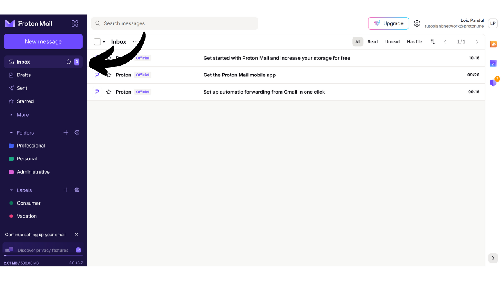
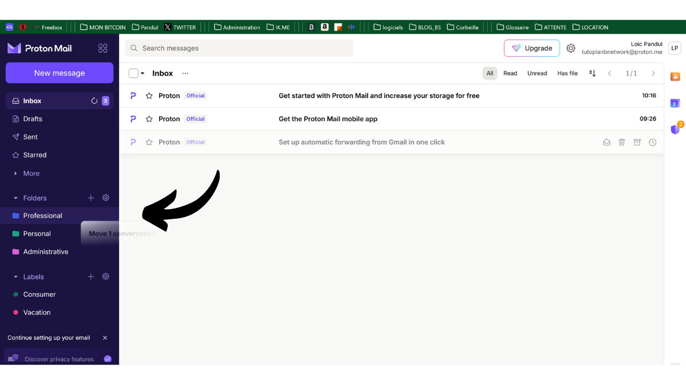

Kotak email merupakan elemen sentral dari aktivitas online Anda dan sering memainkan peran penting dalam keamanan komputer Anda. Jika seorang penyerang berhasil mengkompromikan kotak email Anda, mereka mendapatkan akses mudah ke akun lain Anda melalui fungsi "*lupa password*". Ini dapat memungkinkan mereka untuk mengontrol jaringan sosial Anda, akun bank Anda, dan layanan online lainnya, karena saat ini, alamat email sering digunakan sebagai pengenal unik identitas online Anda. Oleh karena itu, mengamankan kotak email Anda sangat penting untuk melindungi diri dari serangan.

Untuk memastikan keamanan kotak email Anda, penting untuk mengadopsi beberapa praktik baik sederhana yang kami pelajari dalam tutorial ini yang ditujukan untuk pemula dalam komputasi. Juga penting untuk memilih penyedia email yang aman yang menawarkan opsi perlindungan lanjutan dan kebijakan perlindungan privasi yang kuat. Itulah mengapa saya merekomendasikan dalam tutorial ini untuk menemukan ProtonMail. Meskipun Anda lebih memilih untuk tidak menggunakan penyedia ini, praktik baik yang disajikan di sini dapat diterapkan pada kotak email apa pun untuk meningkatkan keamanannya.

## Mengapa menggunakan ProtonMail?

ProtonMail adalah solusi perpesanan yang cukup aman berkat beberapa fitur. Pertama-tama, ProtonMail memastikan enkripsi ujung-ke-ujung pada email Anda, yang berarti hanya pengirim dan penerima yang dapat membaca isinya. Secara teori, bahkan ProtonMail tidak dapat mengakses email penggunanya. Enkripsi ini diterapkan secara otomatis, tanpa memerlukan keterampilan teknis khusus dari pengguna.

Selain itu, ProtonMail mengintegrasikan teknologi canggih untuk melindungi privasi Anda, termasuk memblokir sistem pelacakan tertentu dan menyembunyikan alamat IP Anda. Berbasis di Swiss, perusahaan Proton mendapat manfaat dari beberapa undang-undang perlindungan data yang tidak ditemukan di negara lain. Selain itu, ProtonMail bersifat open-source, yang memungkinkan para ahli independen untuk secara bebas mengaudit kode perangkat lunak.

Model bisnis Proton didasarkan pada sistem berlangganan, yang menenangkan karena menunjukkan bahwa perusahaan dibiayai tanpa harus mengeksploitasi data penggunanya. Dalam tutorial ini, kita akan menjelajahi cara menggunakan versi gratis dari ProtonMail, tetapi ada juga beberapa tingkat langganan yang menawarkan lebih banyak fitur. Model bisnis ini lebih disukai daripada sistem yang sepenuhnya gratis, yang dapat menimbulkan kekhawatiran tentang apakah data pribadi kita digunakan untuk keuntungan. Untungnya, ini tampaknya tidak terjadi dengan ProtonMail.

## Membuat akun Proton

Kunjungi situs resmi proton: https://proton.me/

Klik tombol "*Create an account*":
Anda memiliki opsi untuk memilih dari berbagai rencana sesuai dengan kebutuhan Anda. Untuk memulai, Anda dapat memilih akun gratis, yang akan memungkinkan Anda untuk menguji layanan dasar dari ProtonMail. Nanti, jika Anda ingin mengakses fitur tambahan dan perangkat lunak Proton lainnya seperti Kalender, VPN, atau Pengelola Kata Sandi, Anda dapat mempertimbangkan untuk berlangganan rencana berbayar.

Anda kemudian tiba di halaman pembuatan akun.

Anda dapat memilih nama domain yang Anda sukai untuk alamat email Anda dengan mengklik panah kecil. Pilihan ini tidak berdampak pada apa yang mengikuti.

Juga, pilih nama pengguna untuk alamat email Anda.

Anda kemudian diminta untuk menetapkan kata sandi. Penting untuk memilih kata sandi yang kuat pada tahap ini, karena itu akan memungkinkan akses ke kotak surat Anda. Kata sandi yang kuat harus sepanjang mungkin, menggunakan berbagai karakter yang luas, dan dipilih secara acak. Pada tahun 2024, rekomendasi minimum untuk kata sandi yang aman adalah 13 karakter termasuk angka, huruf kecil dan huruf besar, serta simbol, asalkan kata sandi tersebut benar-benar acak. Namun, saya merekomendasikan untuk memilih kata sandi setidaknya 20 karakter, termasuk semua jenis karakter yang mungkin, untuk memastikan keamanannya lebih lama.
Penggunaan manajer kata sandi adalah praktik yang sangat baik. Ini tidak hanya memungkinkan Anda untuk menyimpan kata sandi Anda secara aman tanpa harus mengingatnya, tetapi juga dapat menghasilkan kata sandi yang panjang dan acak untuk Anda. Memang benar manusia sangat buruk dalam menciptakan urutan acak, dan kata sandi yang tidak cukup acak dapat rentan terhadap serangan brute force. Saya juga merekomendasikan untuk berkonsultasi dengan tutorial lengkap kami tentang pengaturan manajer kata sandi untuk lebih detail mengenai topik ini:
https://planb.network/tutorials/others/bitwarden

Klik tombol "*Create Account*".

Selesaikan CAPTCHA.

Pilih nama tampilan. Ini adalah nama yang akan ditampilkan kepada penerima Anda ketika Anda mengirim email. Pilih nama asli Anda atau nama panggilan.
Proton juga menawarkan Anda opsi untuk menetapkan metode pemulihan akun Anda, baik melalui nomor telepon Anda atau dengan alamat email alternatif. Penting untuk dipahami bahwa opsi ini dapat meningkatkan permukaan serangan pada kotak masuk email Anda. Bagi Anda, ini adalah langkah keamanan tambahan untuk mendapatkan kembali akses ke akun Anda jika Anda lupa kata sandi, tetapi bagi peretas, ini adalah kesempatan ekstra untuk mencoba membobol akun Anda. Anda tidak diwajibkan untuk memilih opsi pemulihan ini, tetapi jika Anda memutuskan untuk tidak melakukannya, pastikan untuk menyimpan salinan kata sandi Anda yang aman. Tanpanya, jika Anda kehilangan kata sandi, Anda akan tidak dapat memulihkan akses ke kotak masuk email Anda.

## Mengatur Kotak Surat Proton Anda

Selamat, kotak surat Proton Anda sekarang telah dibuat! Mulailah dengan memilih warna untuk tema kotak surat Anda.

Jika Anda mau, Anda juga dapat mengatur penerusan email Anda dari akun Gmail lama ke akun ProtonMail baru Anda.

Setelah berada di antarmuka kotak surat Anda, saya menyarankan Anda untuk melihat pengaturan untuk menyesuaikannya. Klik pada ikon roda gigi di sudut kanan atas.

Kemudian klik tombol "*All settings*".

Di tab "*Dashboard*", Anda akan menemukan informasi terkait akun Anda. Dengan menggulir ke bawah di bagian ini, Anda memiliki opsi untuk memilih jenis email yang bersedia Anda terima dari Proton. Jika Anda lebih memilih untuk tidak menerima notifikasi promosi atau informatif, Anda dapat memilih untuk tidak memilih semua.

Di tab "*Upgrade plan*", Anda dapat memilih rencana berbayar dengan fitur baru.

Di tab "*Recovery*", Anda dapat menambah atau mengubah metode pemulihan Anda.

Di tab "*Account and password*", Anda dapat mengubah nama pengguna Anda, serta metode untuk mengamankan akun Anda.

Untuk saat ini, kotak surat Anda hanya diamankan dengan kata sandi. Saya menyarankan Anda setidaknya untuk menambahkan perlindungan otentikasi dua faktor dengan aplikasi. Untuk melakukan ini, klik pada kotak centang.

Konfirmasi kata sandi Anda.

Kemudian pindai kode QR menggunakan aplikasi 2FA Anda.

Untuk informasi lebih lanjut, saya menyarankan Anda untuk melihat tutorial kami tentang cara menggunakan aplikasi 2FA.
Di tab "*Language and time*", Anda dapat mengubah bahasa antarmuka serta zona waktu.
Di tab "*Appearance*", Anda dapat mengubah warna antarmuka Anda.

Di tab "*Security and privacy*", Anda memiliki akses ke berbagai opsi keamanan. Beberapa opsi ini hanya tersedia dengan rencana berbayar. Anda juga memiliki opsi untuk menonaktifkan pengumpulan data Anda oleh Proton, yang menggunakan informasi ini untuk diagnostik dan resolusi bug.

Di tab "*Import*", Anda memiliki opsi untuk mengelola migrasi email lama Anda ke akun ProtonMail baru Anda. Jika Anda lebih memilih untuk memulai dengan kotak surat yang sepenuhnya baru, tanpa mengimpor email lama Anda, Anda dapat memilih untuk mengabaikan opsi ini.

Tab "*Get the apps*" memungkinkan Anda untuk mengunduh aplikasi seluler Proton dan perangkat lunak desktop untuk mengelola kotak surat Anda di platform tersebut. Jika Anda mau, Anda dapat terus menggunakan hanya versi web dari kotak surat Anda, yang saat ini Anda gunakan, karena menawarkan fitur yang sama.

Di tab "*Messages and composing*", Anda memiliki berbagai opsi kustomisasi untuk kotak surat Anda.

Di tab "*Email privacy*", Anda dapat memilih opsi mengenai privasi email Anda.

Di tab "*Identity and addresses*", Anda memiliki opsi untuk menyesuaikan tanda tangan email Anda. Jika Anda memiliki akun berbayar, Anda juga dapat membuat beberapa alamat email yang berbeda yang semuanya akan dikelola dari akun yang sama. Ini bisa sangat berguna untuk memisahkan penggunaan Anda yang berbeda.

Di tab "*Folders and labels*", Anda dapat membuat folder dan label untuk mengorganisir kotak surat Anda.

Tab "*Filters*" memungkinkan Anda untuk mengelola filter untuk email yang Anda terima.

Tab "*Forward and auto-reply*" memungkinkan Anda untuk mengelola penerusan dan balasan otomatis untuk email Anda.

Di tab "*Domain names*", Anda memiliki opsi untuk menyiapkan alamat email menggunakan domain Anda sendiri, yang bisa berguna jika Anda memiliki situs web. Untuk penggunaan pribadi, tidak selalu diperlukan untuk menggunakan fitur ini.

Tab "*Encryption and keys*" memungkinkan Anda untuk mengelola opsi enkripsi untuk email Anda. Untuk pengguna pemula, umumnya tidak perlu untuk memodifikasi pengaturan di bagian ini.

Dan akhirnya, tab "*IMAP/SMTP*" menawarkan Anda kemungkinan untuk mengonfigurasi jembatan untuk menggunakan ProtonMail dengan perangkat lunak email seperti Outlook atau Apple Mail.

Untuk kembali ke halaman utama kotak surat Anda, klik tombol "*Inbox*" di kiri atas.

## Menggunakan Kotak Surat ProtonMail Anda

Untuk mengirim email, sangatlah mudah, cukup klik tombol "*New Message*" di kiri atas.

Di bidang "*To*", masukkan alamat email penerima Anda.

Di bidang "*Subject*", masukkan subjek email Anda.

Tulis pesan Anda.

Akhirnya, klik tombol "*Kirim*" untuk mengirim email Anda.

Anda kemudian dapat menemukan pesan yang telah Anda kirim di tab "*Terkirim*".

Tab "*Kotak Masuk*" berisi email yang telah Anda terima.

Anda dapat membaca email Anda dengan mengkliknya, dan kemudian mengorganisirnya ke dalam folder yang telah Anda buat.

## Masuk ke Kotak Surat ProtonMail Anda

Seperti yang telah disebutkan sebelumnya, Anda memiliki opsi untuk menggunakan kotak surat ProtonMail Anda baik melalui versi web, dengan mengunduh perangkat lunak desktop, atau melalui aplikasi seluler. Untuk mengunduh perangkat lunaknya, Anda dapat mengunjungi halaman resmi: https://proton.me/mail/download

Jika Anda lebih memilih untuk hanya menggunakan versi web dari ProtonMail, pertimbangkan untuk menambahkan halaman tersebut ke favorit browser Anda untuk akses yang lebih mudah di masa depan dan untuk menghindari upaya phishing.

Untuk mengaksesnya, kunjungi URL berikut: https://account.proton.me/mail

Masukkan nama pengguna dan kata sandi Anda, kemudian klik tombol "*Masuk*". Jika Anda telah mengaktifkan autentikasi dua faktor (2FA), Anda juga akan diminta untuk memasukkan 6 digit dinamis yang dihasilkan oleh aplikasi Anda.

Anda akan kembali ke kotak masuk ProtonMail Anda.

