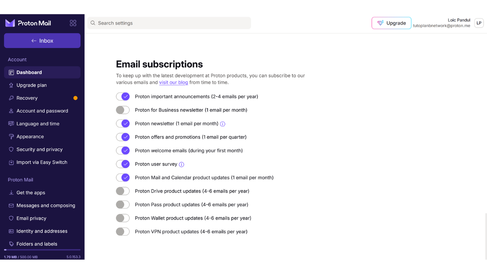

La casella email è un elemento centrale della tua attività online e spesso gioca un ruolo cruciale nella tua sicurezza informatica. Se un attaccante riesce a compromettere la tua casella email, può facilmente accedere ai tuoi altri account tramite la funzione "*hai dimenticato la password*". Questo può permettergli di controllare i tuoi social network, i tuoi conti bancari e altri servizi online, perché oggi, l'indirizzo email è spesso usato come un identificatore unico della tua identità online. Pertanto, proteggere la tua casella email è molto importante per difenderti dagli attacchi.

Per garantire la sicurezza della tua casella email, è importante adottare alcune semplici buone pratiche che studieremo in questo tutorial rivolto ai principianti in informatica. È anche importante scegliere un fornitore di email sicuro che offra opzioni di protezione avanzate e una solida politica di protezione della privacy. Ecco perché in questo tutorial raccomando di scoprire ProtonMail. Anche se preferisci non utilizzare questo fornitore, le buone pratiche presentate qui possono essere applicate a qualsiasi casella email per migliorarne la sicurezza.

## Perché usare ProtonMail?

ProtonMail è una soluzione di messaggistica piuttosto sicura grazie a diverse caratteristiche. In primo luogo, ProtonMail garantisce la crittografia end-to-end delle tue email, il che significa che solo il mittente e il destinatario possono leggerne il contenuto. In teoria, nemmeno ProtonMail può accedere alle email dei suoi utenti. Questa crittografia viene applicata automaticamente, senza richiedere alcuna competenza tecnica specifica da parte degli utenti.

Inoltre, ProtonMail integra tecnologie avanzate per proteggere la tua privacy, inclusa la possibilità di bloccare determinati sistemi di tracciamento e mascherare il tuo indirizzo IP. Essendo basata in Svizzera, la compagnia Proton beneficia di alcune delle leggi sulla protezione dei dati che non si trovano in altri paesi. Inoltre, ProtonMail è open-source, il che permette a esperti indipendenti di esaminare liberamente il codice del software.

Il modello di business di Proton si basa su un sistema di abbonamento, il che è rassicurante poiché indica che la compagnia è finanziata senza necessariamente sfruttare i dati dei suoi utenti. In questo tutorial, esploreremo come utilizzare la versione gratuita di ProtonMail, ma ci sono anche diversi livelli di abbonamento che offrono più funzionalità. Questo modello di business è preferibile a un sistema completamente gratuito, che potrebbe sollevare preoccupazioni su come i nostri dati personali vengano utilizzati a scopo di lucro. Fortunatamente, questo non sembra essere il caso di ProtonMail.

## Creare un account Proton

Visita il sito ufficiale di Proton: https://proton.me/

Clicca sul pulsante "*Crea un account*":
Hai l'opzione di scegliere tra diversi piani in base alle tue esigenze. Per iniziare, puoi optare per un account gratuito, che ti permetterà di testare i servizi di base di ProtonMail. Più tardi, se desideri accedere a funzionalità aggiuntive e ad altri software Proton come il Calendario, la VPN o il Gestore di Password, puoi considerare di sottoscrivere un piano a pagamento.

Arriverai quindi alla pagina di creazione dell'account.

Puoi scegliere il nome di dominio che preferisci per il tuo indirizzo email cliccando sulla piccola freccia. Questa scelta non ha impatto su ciò che segue.

Scegli anche il nome utente per il tuo indirizzo email.

Ti verrà poi chiesto di impostare una password. È importante scegliere una password forte in questa fase, poiché permetterà l'accesso alla tua casella di posta. Una password robusta dovrebbe essere il più lunga possibile, utilizzare una vasta varietà di caratteri e essere scelta in modo casuale. Nel 2024, le raccomandazioni minime per una password sicura sono 13 caratteri includendo numeri, lettere minuscole e maiuscole, così come simboli, a condizione che la password sia veramente casuale. Tuttavia, raccomando di optare per una password di almeno 20 caratteri, includendo tutti i tipi possibili di caratteri, per garantirne la sicurezza più a lungo.
L'uso di un gestore di password è un'eccellente pratica. Non solo ti permette di memorizzare le tue password in modo sicuro senza doverle ricordare, ma può anche generare password lunghe e casuali per te. Gli esseri umani sono infatti molto cattivi nel creare sequenze casuali, e una password che non è abbastanza casuale può essere vulnerabile agli attacchi di forza bruta. Raccomando anche di consultare il nostro tutorial completo su come configurare un gestore di password per maggiori dettagli su questo argomento:
https://planb.network/tutorials/others/bitwarden

Clicca sul pulsante "*Crea Account*".

Risolvi il CAPTCHA.

Scegli un nome visualizzato. Questo è il nome che verrà mostrato al tuo destinatario quando invii un'email. Scegli il tuo vero nome o un soprannome.
Proton ti offre anche l'opzione di impostare un metodo per recuperare il tuo account, sia tramite il tuo numero di telefono che con un indirizzo email alternativo. È importante capire che questa opzione può aumentare la superficie di attacco della tua casella di posta elettronica. Per te, è una misura di sicurezza aggiuntiva per riaccedere al tuo account nel caso in cui dimentichi la tua password, ma per un hacker, è un'opportunità in più per tentare di violare il tuo account. Non sei obbligato a scegliere questa opzione di recupero, ma se decidi di non farlo, assicurati di conservare una copia sicura della tua password. Senza di essa, se perdi la tua password, non sarai in grado di recuperare l'accesso alla tua casella di posta elettronica.

## Configurazione della tua casella di posta Proton

Congratulazioni, la tua casella di posta Proton è ora creata! Inizia scegliendo i colori per il tema della tua casella di posta.

Se lo desideri, puoi anche impostare l'inoltro delle tue email dal tuo vecchio account Gmail al tuo nuovo account ProtonMail.

Una volta nell'interfaccia della tua casella di posta, ti consiglio di dare un'occhiata alle impostazioni per personalizzarle. Clicca sull'icona dell'ingranaggio nell'angolo in alto a destra.

Poi clicca sul pulsante "*Tutte le impostazioni*".

Nella scheda "*Dashboard*", troverai informazioni relative al tuo account. Scorrendo in questa sezione, hai l'opzione di selezionare i tipi di email che sei disposto a ricevere da Proton. Se preferisci non ricevere notifiche promozionali o informative, puoi scegliere di deselezionare tutto.

Nella scheda "*Piano di aggiornamento*", puoi scegliere un piano a pagamento con nuove funzionalità.

Nella scheda "*Recupero*", puoi aggiungere o modificare i tuoi metodi di recupero.

Nella scheda "*Account e password*", puoi cambiare i tuoi nomi utente, così come i metodi per proteggere il tuo account.

Per ora, la tua casella di posta è protetta solo con una password. Ti consiglio almeno di aggiungere la protezione con autenticazione a due fattori tramite un'app. Per fare ciò, clicca sulla casella di controllo.

Conferma la tua password.

Poi scansiona il codice QR usando la tua app 2FA.

Per maggiori informazioni, ti consiglio di consultare il nostro tutorial su come usare un'app 2FA.
Nella scheda "*Lingua e ora*", puoi cambiare la lingua dell'interfaccia così come il fuso orario.
Nella scheda "*Appearance*", puoi modificare i colori della tua interfaccia.

Nella scheda "*Security and privacy*", hai accesso a varie opzioni di sicurezza. Alcune di queste opzioni sono disponibili solo con un piano a pagamento. Hai anche l'opzione di disabilitare la raccolta dei tuoi dati da parte di Proton, che utilizza queste informazioni per la diagnostica e la risoluzione dei bug.

Nella scheda "*Import*", hai l'opzione di gestire la migrazione delle tue vecchie email verso il tuo nuovo account ProtonMail. Se preferisci iniziare con una casella di posta completamente nuova, senza importare le tue vecchie email, puoi scegliere di ignorare questa opzione.

La scheda "*Get the apps*" ti permette di scaricare le applicazioni mobili e il software desktop di Proton per gestire la tua casella di posta su queste piattaforme. Se preferisci, puoi continuare ad utilizzare solo la versione web della tua casella di posta, su cui ti trovi attualmente, poiché offre le stesse funzionalità.

Nella scheda "*Messages and composing*", hai una miriade di opzioni di personalizzazione per la tua casella di posta.

Nella scheda "*Email privacy*", puoi scegliere opzioni riguardanti la privacy delle tue email.

Nella scheda "*Identity and addresses*", hai l'opzione di personalizzare la tua firma email. Se hai un account a pagamento, puoi anche creare diversi indirizzi email che saranno tutti gestiti dallo stesso account. Questo può essere molto utile per separare i tuoi diversi usi.

Nella scheda "*Folders and labels*", puoi creare cartelle ed etichette per organizzare la tua casella di posta.

La scheda "*Filters*" ti permette di gestire i filtri per le email che ricevi.

La scheda "*Forward and auto-reply*" ti permette di gestire l'inoltro e le risposte automatiche per le tue email.

Nella scheda "*Domain names*", hai l'opzione di impostare un indirizzo email utilizzando il tuo dominio, il che può essere utile se possiedi un sito web. Per uso personale, non è necessariamente richiesto utilizzare questa funzionalità.

La scheda "*Encryption and keys*" ti permette di gestire le opzioni di crittografia per le tue email. Per gli utenti principianti, generalmente non è necessario modificare le impostazioni in questa sezione.

E infine, la scheda "*IMAP/SMTP*" ti offre la possibilità di configurare un bridge per utilizzare ProtonMail con software di posta elettronica come Outlook o Apple Mail.

Per tornare alla homepage della tua casella di posta, clicca sul pulsante "*Inbox*" in alto a sinistra.

## Utilizzare la tua casella di posta ProtonMail

Per inviare un'email, è molto semplice, basta cliccare sul pulsante "*New Message*" in alto a sinistra.

Nel campo "*To*", inserisci l'indirizzo email del tuo destinatario.

Nel campo "*Subject*", inserisci l'oggetto della tua email.

Scrivi il tuo messaggio.
Infine, clicca sul pulsante "*Invia*" per inviare la tua email.

Puoi poi trovare i tuoi messaggi inviati nella scheda "*Inviati*".

La scheda "*Posta in arrivo*" contiene le email che hai ricevuto.

Puoi leggere le tue email cliccandoci sopra e poi organizzarle nelle diverse cartelle che hai creato.

## Accedere alla tua Casella di Proton Mail

Come menzionato in precedenza, hai l'opzione di usare la tua casella di ProtonMail sia tramite la versione web, scaricando il software per desktop, o attraverso l'app mobile. Per scaricare il software, puoi visitare la pagina ufficiale: https://proton.me/mail/download

Se preferisci usare solo la versione web di ProtonMail, considera di aggiungere la pagina ai tuoi preferiti del browser per un accesso più facile in futuro e per evitare tentativi di phishing.

Per accedervi, vai al seguente URL: https://account.proton.me/mail

Inserisci il tuo nome utente e password, poi clicca sul pulsante "*Accedi*". Se hai abilitato l'autenticazione a due fattori (2FA), ti sarà anche chiesto di inserire i 6 numeri dinamici generati dalla tua app.

Ritornerai alla tua casella di ProtonMail.