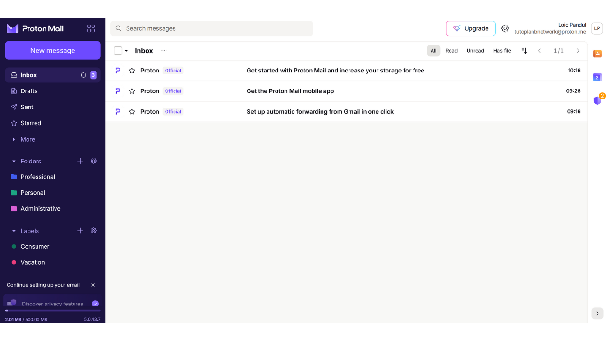

メールボックスは、オンライン活動の中心的な要素であり、コンピューターセキュリティにおいて重要な役割を果たすことがよくあります。攻撃者があなたのメールボックスを侵害することに成功した場合、"*forgot password*"機能を介して他のアカウントへ簡単にアクセスできるようになります。これにより、攻撃者はあなたのソーシャルネットワーク、銀行口座、その他のオンラインサービスを制御できるようになります。なぜなら、今日ではメールアドレスがオンラインアイデンティティのユニークな識別子としてよく使用されるからです。したがって、メールボックスを保護することは、攻撃から自分自身を守るために非常に重要です。

メールボックスのセキュリティを確保するためには、このチュートリアルで学ぶいくつかの簡単な良い習慣を採用することが重要です。このチュートリアルは、コンピューティング初心者を対象としています。また、高度な保護オプションと堅牢なプライバシー保護ポリシーを提供するセキュアなメールプロバイダーを選択することも重要です。そのため、このチュートリアルではProtonMailの発見をお勧めします。このプロバイダーを使用したくない場合でも、ここで紹介される良い習慣は、セキュリティを強化するために任意のメールボックスに適用できます。

## なぜProtonMailを使用するのか？

ProtonMailは、いくつかの特徴のおかげで比較的安全なメッセージングソリューションです。まず、ProtonMailはメールのエンドツーエンド暗号化を保証します。これは、送信者と受信者のみがその内容を読むことができることを意味します。理論的には、ProtonMailでさえもユーザーのメールにアクセスすることはできません。この暗号化は自動的に適用され、ユーザーから特定の技術スキルを要求しません。

さらに、ProtonMailは特定の追跡システムのブロックやIPアドレスのマスキングなど、プライバシーを保護するための先進技術を統合しています。スイスに拠点を置くProton社は、他の国々にはないデータ保護法の恩恵を受けています。加えて、ProtonMailはオープンソースであり、独立した専門家がソフトウェアコードを自由に監査できます。

Protonのビジネスモデルは、サブスクリプションシステムに基づいており、これは会社が必ずしもユーザーのデータを搾取することなく資金を調達していることを示しているため、安心できます。このチュートリアルでは、ProtonMailの無料バージョンの使用方法を探りますが、より多くの機能を提供するいくつかのサブスクリプションレベルもあります。このビジネスモデルは、個人データが利益のために使用されているかどうかに関する懸念を引き起こす可能性のある完全に無料のシステムよりも好ましいです。幸いなことに、ProtonMailの場合、そのようなことはないようです。

## Protonアカウントの作成

公式のprotonサイトを訪れてください: https://proton.me/

"*Create an account*" ボタンをクリックします：
あなたのニーズに応じて異なるプランから選択するオプションがあります。始めるために、基本サービスをテストできる無料アカウントを選択できます。後で、追加機能や他のProtonソフトウェア（カレンダー、VPN、パスワードマネージャーなど）にアクセスしたい場合は、有料プランのサブスクリプションを検討できます。

次に、アカウント作成ページに到着します。

小さな矢印をクリックして、好みのドメイン名をメールアドレスに選択できます。この選択は、その後に影響を与えません。

また、メールアドレスのユーザー名を選択してください。

次に、パスワードを設定するよう求められます。この段階で強力なパスワードを選択することが重要です。なぜなら、それによってメールボックスへのアクセスが可能になるからです。堅牢なパスワードは、できるだけ長く、さまざまな文字を使用し、ランダムに選ばれるべきです。2024年の安全なパスワードの最小推奨事項は、パスワードが本当にランダムである場合、数字、小文字と大文字の文字、および記号を含む13文字です。しかし、可能な限りすべてのタイプの文字を含む20文字以上のパスワードを選択することをお勧めします。これにより、そのセキュリティがより長く保証されます。
パスワードマネージャーの使用は、非常に優れた習慣です。これにより、パスワードを記憶することなく安全に保存できるだけでなく、長くランダムなパスワードも生成してくれます。人間はランダムなシーケンスを作り出すのが非常に苦手であり、十分にランダムでないパスワードはブルートフォース攻撃に脆弱になり得ます。このトピックについての詳細は、パスワードマネージャーの設定に関する完全なチュートリアルを参照することをお勧めします：
https://planb.network/tutorials/others/bitwarden

"*Create Account*" ボタンをクリックしてください。

CAPTCHAを解決してください。

表示名を選択してください。これは、メールを送信する際に受信者に表示される名前です。本名またはニックネームを選択してください。
Protonでは、電話番号または代替のメールアドレスを使用してアカウントの回復方法を設定するオプションも提供しています。このオプションがメール受信箱の攻撃対象を増やす可能性があることを理解することが重要です。あなたにとっては、パスワードを忘れた場合にアカウントへのアクセスを回復するための追加のセキュリティ対策ですが、ハッカーにとってはアカウントに侵入しようとする追加の機会です。この回復オプションを選択する必要はありませんが、選択しない場合は、パスワードの安全なコピーを保持してください。それがなければ、パスワードを失った場合、メール受信箱へのアクセスを回復することはできません。

## Proton メールボックスの設定

おめでとうございます、あなたのProtonメールボックスは今作成されました！まず、メールボックスのテーマの色を選択してください。

希望があれば、古いGmailアカウントから新しいProtonMailアカウントへのメールの転送も設定できます。

メールボックスのインターフェースに一度行ったら、設定をカスタマイズするために設定を確認することをお勧めします。右上隅にある歯車アイコンをクリックしてください。

次に、"*All settings*" ボタンをクリックしてください。

"*Dashboard*" タブでは、アカウントに関連する情報を見つけることができます。このセクションを下にスクロールすると、Protonから受け取るメールの種類を選択するオプションがあります。プロモーションや情報通知を受け取りたくない場合は、すべての選択を解除することを選択できます。

"*Upgrade plan*" タブでは、新しい機能を備えた有料プランを選択できます。

"*Recovery*" タブでは、回復方法を追加または変更できます。

"*Account and password*" タブでは、ユーザーネームを変更したり、アカウントを保護する方法を変更したりできます。

現在、あなたのメールボックスはパスワードでのみ保護されています。少なくともアプリを使用した二要素認証保護を追加することをお勧めします。これを行うには、チェックボックスをクリックしてください。

パスワードを確認してください。

その後、2FAアプリを使用してQRコードをスキャンしてください。

さらに情報が必要な場合は、2FAアプリの使用方法に関するチュートリアルをチェックすることをお勧めします。
"*Language and time*" タブでは、インターフェースの言語やタイムゾーンを変更できます。
"*外観*" タブでは、インターフェースの色を変更できます。

"*セキュリティとプライバシー*" タブでは、さまざまなセキュリティオプションにアクセスできます。これらのオプションの一部は有料プランでのみ利用可能です。また、Protonが診断とバグ解決のためにこの情報を使用するのを防ぐために、データの収集を無効にするオプションもあります。

"*インポート*" タブでは、古いメールを新しいProtonMailアカウントに移行する管理ができます。古いメールをインポートせずに、まったく新しいメールボックスから始めたい場合は、このオプションを無視することを選択できます。

"*アプリを入手する*" タブでは、Protonのモバイルアプリケーションとデスクトップソフトウェアをダウンロードして、これらのプラットフォームでメールボックスを管理できます。好みに応じて、現在使用しているウェブバージョンのメールボックスのみを引き続き使用することもできます。ウェブバージョンでは同じ機能が提供されます。

"*メッセージと作成*" タブでは、メールボックスのカスタマイズオプションが豊富にあります。

"*メールのプライバシー*" タブでは、メールのプライバシーに関するオプションを選択できます。

"*アイデンティティとアドレス*" タブでは、メールの署名をカスタマイズするオプションがあります。有料アカウントを持っている場合は、複数の異なるメールアドレスを作成し、同じアカウントから管理することもできます。これは、異なる用途を分けるのに非常に便利です。

"*フォルダとラベル*" タブでは、メールボックスを整理するためのフォルダとラベルを作成できます。

"*フィルター*" タブでは、受信するメールのフィルターを管理できます。

"*転送と自動返信*" タブでは、メールの転送と自動返信を管理できます。

"*ドメイン名*" タブでは、自分のドメインを使用してメールアドレスを設定するオプションがあります。これは、ウェブサイトを所有している場合に便利です。個人使用では、この機能を使用する必要は必ずしもありません。

"*暗号化と鍵*" タブでは、メールの暗号化オプションを管理できます。初心者ユーザーにとっては、このセクションの設定を変更する必要は一般的にありません。

最後に、"*IMAP/SMTP*" タブでは、OutlookやApple MailなどのメールソフトウェアでProtonMailを使用するためのブリッジを設定する可能性があります。

メールボックスのホームページに戻るには、左上の"*受信箱*" ボタンをクリックします。

## Proton Mailboxの使用方法

メールを送信するには非常に簡単で、左上の "*新規メッセージ*" ボタンをクリックするだけです。

"*宛先*" フィールドに、受信者のメールアドレスを入力します。

"*件名*" フィールドに、メールの件名を入力します。

メッセージを書きます。
メールを送信するには、"*送信*" ボタンをクリックしてください。

そうすると、"*送信済み*" タブで送信したメッセージを見つけることができます。

"*受信箱*" タブには、受信したメールが含まれています。

メールをクリックすると読むことができ、作成した異なるフォルダに整理することもできます。

## Proton メールボックスへのログイン

前述のように、ProtonMail メールボックスは、ウェブ版を使用するか、デスクトップソフトウェアをダウンロードするか、モバイルアプリを通じて使用するオプションがあります。ソフトウェアをダウンロードするには、公式ページを訪れてください: https://proton.me/mail/download

ProtonMail のウェブ版のみを使用する場合は、将来的にアクセスしやすくするため、およびフィッシング試みを避けるために、ブラウザのお気に入りにページを追加することを検討してください。

アクセスするには、次の URL に移動してください: https://account.proton.me/mail

ユーザー名とパスワードを入力し、"*サインイン*" ボタンをクリックしてください。2要素認証 (2FA) を有効にしている場合は、アプリによって生成された 6 桁の動的数字も入力するよう求められます。

そうすると、ProtonMail の受信箱に戻ります。

