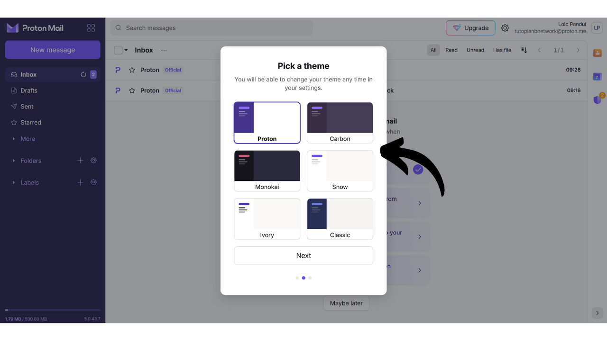
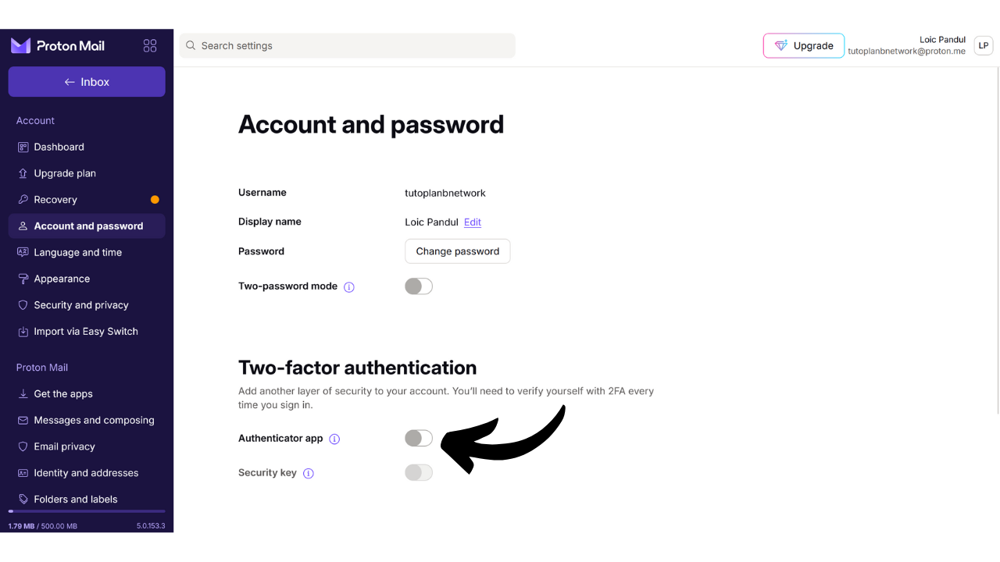

A caixa de email é um elemento central da sua atividade online e muitas vezes desempenha um papel crucial na segurança do seu computador. Se um atacante conseguir comprometer sua caixa de email, ele ganha fácil acesso às suas outras contas por meio da função "*esqueci a senha*". Isso pode permitir que eles controlem suas redes sociais, suas contas bancárias e outros serviços online, porque hoje, o endereço de email é frequentemente usado como um identificador único da sua identidade online. Portanto, garantir a segurança da sua caixa de email é muito importante para se proteger de ataques.

Para garantir a segurança da sua caixa de email, é importante adotar algumas boas práticas simples que estudamos neste tutorial voltado para iniciantes em computação. Também é importante escolher um provedor de email seguro que ofereça opções avançadas de proteção e uma política robusta de proteção de privacidade. É por isso que recomendo neste tutorial descobrir o ProtonMail. Mesmo que prefira não usar este provedor, as boas práticas apresentadas aqui podem ser aplicadas a qualquer caixa de email para aumentar sua segurança.

## Por que usar o ProtonMail?

O ProtonMail é uma solução de mensagens bastante segura graças a várias características. Primeiramente, o ProtonMail garante a criptografia de ponta a ponta dos seus emails, o que significa que apenas o remetente e o destinatário podem ler seu conteúdo. Em teoria, até mesmo o ProtonMail não pode acessar os emails de seus usuários. Esta criptografia é aplicada automaticamente, sem exigir habilidades técnicas específicas dos usuários.

Além disso, o ProtonMail integra tecnologias avançadas para proteger sua privacidade, incluindo o bloqueio de certos sistemas de rastreamento e a ocultação do seu endereço IP. Sendo baseada na Suíça, a empresa Proton se beneficia de algumas das leis de proteção de dados que não são encontradas em outros países. Adicionalmente, o ProtonMail é de código aberto, o que permite que especialistas independentes auditem livremente o código do software.

O modelo de negócios da Proton é baseado em um sistema de assinatura, o que é tranquilizador, pois indica que a empresa é financiada sem necessariamente explorar os dados de seus usuários. Neste tutorial, exploraremos como usar a versão gratuita do ProtonMail, mas também existem vários níveis de assinatura oferecendo mais recursos. Este modelo de negócios é preferível a um sistema totalmente gratuito, o que poderia levantar preocupações sobre se nossos dados pessoais estão sendo usados para lucro. Felizmente, isso não parece ser o caso com o ProtonMail.

## Criando uma conta Proton

Visite o site oficial do proton: https://proton.me/

Clique no botão "*Criar uma conta*":
Você tem a opção de escolher entre diferentes planos de acordo com suas necessidades. Para começar, você pode optar por uma conta gratuita, que permitirá testar os serviços básicos do ProtonMail. Mais tarde, se desejar acessar recursos adicionais e outros softwares da Proton, como Calendário, VPN ou Gerenciador de Senhas, você pode considerar assinar um plano pago.

Você então chega à página de criação de conta.

Você pode escolher o nome de domínio que preferir para o seu endereço de email clicando na pequena seta. Esta escolha não tem impacto no que segue.

Também, escolha o nome de usuário para o seu endereço de email.

Você é então solicitado a definir uma senha. É importante escolher uma senha forte nesta etapa, pois ela permitirá acesso à sua caixa de correio. Uma senha robusta deve ser o mais longa possível, usar uma grande variedade de caracteres e ser escolhida aleatoriamente. Em 2024, as recomendações mínimas para uma senha segura são 13 caracteres incluindo números, letras minúsculas e maiúsculas, bem como símbolos, desde que a senha seja verdadeiramente aleatória. No entanto, recomendo optar por uma senha de pelo menos 20 caracteres, incluindo todos os tipos possíveis de caracteres, para garantir sua segurança por mais tempo.
O uso de um gerenciador de senhas é uma excelente prática. Ele não apenas permite que você armazene suas senhas de forma segura sem ter que memorizá-las, mas também pode gerar senhas longas e aleatórias para você. De fato, os humanos são muito ruins em criar sequências aleatórias, e uma senha que não é suficientemente aleatória pode ser vulnerável a ataques de força bruta. Eu também recomendo consultar nosso tutorial completo sobre a configuração de um gerenciador de senhas para mais detalhes sobre este tópico:
https://planb.network/tutorials/others/bitwarden

Clique no botão "*Criar Conta*".

Resolva o CAPTCHA.

Escolha um nome de exibição. Este é o nome que será mostrado ao seu destinatário quando você enviar um email. Escolha seu nome real ou um apelido.
O Proton também oferece a opção de configurar um método para recuperar sua conta, seja através do seu número de telefone ou com um endereço de email alternativo. É importante entender que esta opção pode aumentar a superfície de ataque da sua caixa de entrada de email. Para você, é uma medida de segurança adicional para recuperar o acesso à sua conta caso esqueça sua senha, mas para um hacker, é uma oportunidade extra para tentar invadir sua conta. Você não é obrigado a escolher esta opção de recuperação, mas se decidir não fazê-lo, certifique-se de manter uma cópia segura de sua senha. Sem ela, se você perder sua senha, será incapaz de recuperar o acesso à sua caixa de entrada de email.

## Configurando Sua Caixa de Correio Proton

Parabéns, sua caixa de correio Proton agora está criada! Comece escolhendo as cores para o tema da sua caixa de correio.

Se desejar, você também pode configurar o encaminhamento de seus emails da sua antiga conta do Gmail para sua nova conta ProtonMail.

Uma vez na interface da sua caixa de correio, aconselho que dê uma olhada nas configurações para personalizá-las. Clique no ícone de engrenagem no canto superior direito.

Em seguida, clique no botão "*Todas as configurações*".

Na aba "*Painel de Controle*", você encontrará informações relacionadas à sua conta. Ao rolar para baixo nesta seção, você tem a opção de selecionar os tipos de emails que está disposto a receber do Proton. Se preferir não receber notificações promocionais ou informativas, você pode optar por desmarcar todas.

Na aba "*Plano de Upgrade*", você pode escolher um plano pago com novos recursos.

Na aba "*Recuperação*", você pode adicionar ou modificar seus métodos de recuperação.

Na aba "*Conta e senha*", você pode alterar seus nomes de usuário, bem como os métodos para proteger sua conta.

Por enquanto, sua caixa de correio está protegida apenas com uma senha. Aconselho que, no mínimo, adicione proteção de autenticação de dois fatores com um aplicativo. Para fazer isso, clique na caixa de seleção.

Confirme sua senha.

Em seguida, escaneie o código QR usando seu aplicativo de 2FA.

Para mais informações, aconselho que confira nosso tutorial sobre como usar um aplicativo de 2FA.
Na aba "*Idioma e hora*", você pode alterar o idioma da interface, bem como o fuso horário.
Na aba "*Appearance*", você pode modificar as cores da sua interface.

Na aba "*Security and privacy*", você tem acesso a várias opções de segurança. Algumas dessas opções estão disponíveis apenas com um plano pago. Você também tem a opção de desabilitar a coleta dos seus dados pelo Proton, que usa essas informações para diagnósticos e resolução de bugs.

Na aba "*Import*", você tem a opção de gerenciar a migração dos seus e-mails antigos para a sua nova conta ProtonMail. Se preferir começar com uma caixa de entrada totalmente nova, sem importar seus e-mails antigos, você pode optar por ignorar essa opção.

A aba "*Get the apps*" permite que você baixe os aplicativos móveis e o software de desktop do Proton para gerenciar sua caixa de entrada nessas plataformas. Se preferir, você pode continuar usando apenas a versão web da sua caixa de entrada, na qual você está atualmente, já que ela oferece as mesmas funcionalidades.

Na aba "*Messages and composing*", você tem uma miríade de opções de personalização para a sua caixa de entrada.

Na aba "*Email privacy*", você pode escolher opções relacionadas à privacidade dos seus e-mails.

Na aba "*Identity and addresses*", você tem a opção de personalizar sua assinatura de e-mail. Se você tem uma conta paga, também pode criar vários endereços de e-mail diferentes que serão todos gerenciados a partir da mesma conta. Isso pode ser muito útil para separar seus diferentes usos.

Na aba "*Folders and labels*", você pode criar pastas e etiquetas para organizar sua caixa de entrada.

A aba "*Filters*" permite que você gerencie filtros para os e-mails que você recebe.

A aba "*Forward and auto-reply*" permite que você gerencie o encaminhamento e respostas automáticas para seus e-mails.

Na aba "*Domain names*", você tem a opção de configurar um endereço de e-mail usando seu próprio domínio, o que pode ser útil se você possui um site. Para uso pessoal, não é necessariamente obrigatório usar esse recurso.

A aba "*Encryption and keys*" permite que você gerencie as opções de criptografia para seus e-mails. Para usuários iniciantes, geralmente não é necessário modificar as configurações nesta seção.

E, finalmente, a aba "*IMAP/SMTP*" oferece a possibilidade de configurar uma ponte para usar o ProtonMail com softwares de e-mail como Outlook ou Apple Mail.

Para retornar à página inicial da sua caixa de entrada, clique no botão "*Inbox*" no canto superior esquerdo.

## Usando sua Caixa de Entrada ProtonMail

Para enviar um e-mail, é muito simples, basta clicar no botão "*New Message*" no canto superior esquerdo.

No campo "*To*", insira o endereço de e-mail do seu destinatário.

No campo "*Subject*", insira o assunto do seu e-mail.

Escreva sua mensagem.
Finalmente, clique no botão "*Enviar*" para enviar seu e-mail.

Você pode então encontrar suas mensagens enviadas na aba "*Enviados*".

A aba "*Caixa de Entrada*" contém os e-mails que você recebeu.

Você pode ler seus e-mails clicando neles e, em seguida, organizá-los nas diferentes pastas que você criou.

## Acessando sua Caixa de Correio ProtonMail

Como mencionado anteriormente, você tem a opção de usar sua caixa de correio ProtonMail tanto via versão web, baixando o software para desktop, quanto através do aplicativo móvel. Para baixar o software, você pode visitar a página oficial: https://proton.me/mail/download

Se preferir usar apenas a versão web do ProtonMail, considere adicionar a página aos favoritos do seu navegador para facilitar o acesso no futuro e evitar tentativas de phishing.

Para acessá-la, vá para o seguinte URL: https://account.proton.me/mail

Digite seu nome de usuário e senha, depois clique no botão "*Entrar*". Se você ativou a autenticação de dois fatores (2FA), também será solicitado a inserir os 6 dígitos dinâmicos gerados pelo seu aplicativo.

Você retornará à sua caixa de entrada do ProtonMail.