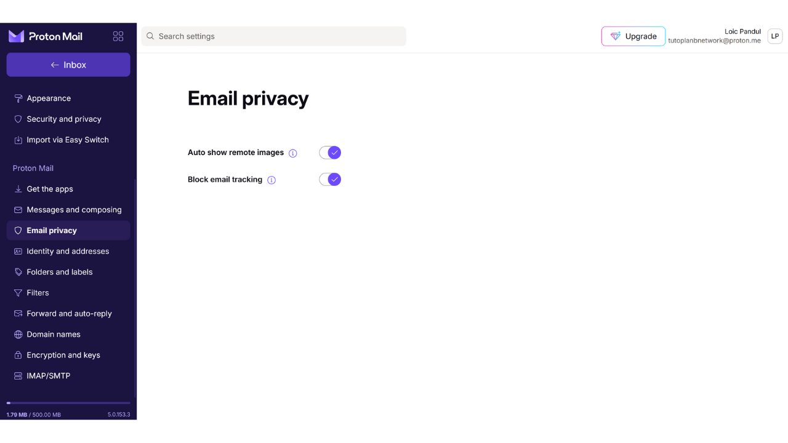
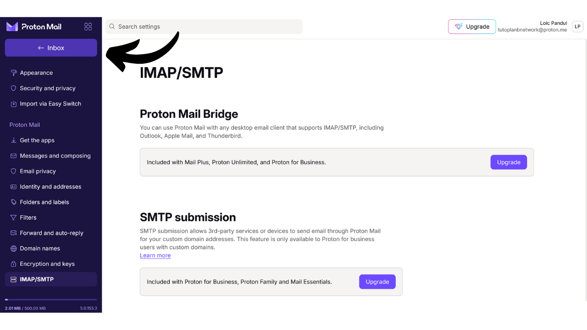
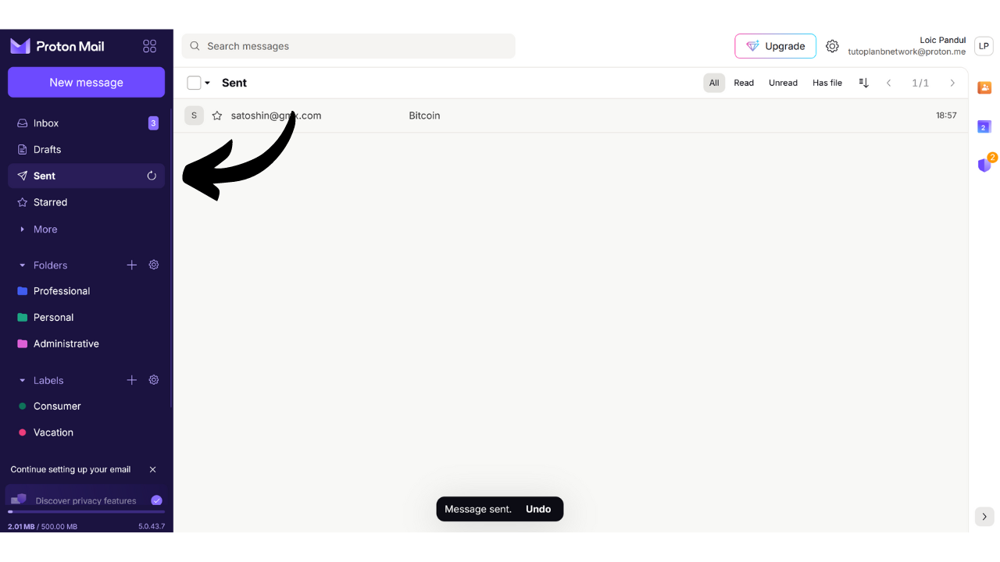

Tài khoản email là một yếu tố trung tâm của hoạt động trực tuyến của bạn và thường đóng một vai trò quan trọng trong bảo mật máy tính của bạn. Nếu một kẻ tấn công quản lý để xâm nhập vào tài khoản email của bạn, họ có thể dễ dàng truy cập vào các tài khoản khác của bạn thông qua chức năng "*quên mật khẩu*". Điều này có thể cho phép họ kiểm soát các mạng xã hội, tài khoản ngân hàng, và các dịch vụ trực tuyến khác của bạn, bởi vì ngày nay, địa chỉ email thường được sử dụng như một bộ nhận dạng duy nhất của danh tính trực tuyến của bạn. Do đó, việc bảo vệ tài khoản email của bạn là rất quan trọng để bảo vệ bản thân khỏi các cuộc tấn công.

Để đảm bảo an ninh cho tài khoản email của bạn, việc áp dụng một số thực hành tốt đơn giản mà chúng tôi nghiên cứu trong hướng dẫn này dành cho người mới bắt đầu về máy tính là rất quan trọng. Cũng rất quan trọng khi chọn một nhà cung cấp email an toàn, cung cấp các tùy chọn bảo vệ nâng cao và một chính sách bảo vệ quyền riêng tư mạnh mẽ. Đó là lý do tại sao tôi khuyên trong hướng dẫn này khám phá ProtonMail. Ngay cả khi bạn không muốn sử dụng nhà cung cấp này, các thực hành tốt được trình bày ở đây có thể được áp dụng cho bất kỳ tài khoản email nào để tăng cường bảo mật của nó.

## Tại sao sử dụng ProtonMail?

ProtonMail là một giải pháp nhắn tin khá an toàn nhờ vào một số tính năng. Đầu tiên, ProtonMail đảm bảo mã hóa từ đầu đến cuối cho email của bạn, điều này có nghĩa là chỉ có người gửi và người nhận mới có thể đọc nội dung của chúng. Theo lý thuyết, ngay cả ProtonMail cũng không thể truy cập email của người dùng. Việc mã hóa này được áp dụng tự động, không yêu cầu bất kỳ kỹ năng kỹ thuật cụ thể nào từ người dùng.

Hơn nữa, ProtonMail tích hợp các công nghệ tiên tiến để bảo vệ quyền riêng tư của bạn, bao gồm chặn một số hệ thống theo dõi và che giấu địa chỉ IP của bạn. Được đặt tại Thụy Sĩ, công ty Proton hưởng lợi từ một số luật bảo vệ dữ liệu không có ở các quốc gia khác. Ngoài ra, ProtonMail là mã nguồn mở, cho phép các chuyên gia độc lập tự do kiểm tra mã phần mềm.

Mô hình kinh doanh của Proton dựa trên hệ thống đăng ký, điều này làm cho người ta yên tâm vì nó chỉ ra rằng công ty được tài trợ mà không nhất thiết khai thác dữ liệu của người dùng. Trong hướng dẫn này, chúng tôi sẽ khám phá cách sử dụng phiên bản miễn phí của ProtonMail, nhưng cũng có một số cấp độ đăng ký cung cấp nhiều tính năng hơn. Mô hình kinh doanh này được ưa chuộng hơn là một hệ thống hoàn toàn miễn phí, có thể dẫn đến lo ngại liệu dữ liệu cá nhân của chúng ta có được sử dụng để kiếm lợi nhuận hay không. May mắn thay, điều này dường như không phải là trường hợp với ProtonMail.

## Tạo một tài khoản Proton

Truy cập trang chính thức của proton: https://proton.me/

Nhấp vào nút "*Tạo một tài khoản*":
Bạn có tùy chọn chọn từ các gói dịch vụ khác nhau tùy theo nhu cầu của bạn. Để bắt đầu, bạn có thể chọn một tài khoản miễn phí, điều này sẽ cho phép bạn thử nghiệm các dịch vụ cơ bản của ProtonMail. Sau này, nếu bạn muốn truy cập thêm tính năng và phần mềm Proton khác như Lịch, VPN, hoặc Quản lý Mật khẩu, bạn có thể xem xét việc đăng ký một gói có phí.

Bạn sau đó đến trang tạo tài khoản.

Bạn có thể chọn tên miền bạn ưa thích cho địa chỉ email của mình bằng cách nhấp vào mũi tên nhỏ. Lựa chọn này không ảnh hưởng đến những gì tiếp theo.

Cũng chọn tên người dùng cho địa chỉ email của bạn.

Sau đó, bạn được yêu cầu thiết lập một mật khẩu. Việc chọn một mật khẩu mạnh ở giai đoạn này là rất quan trọng, vì nó sẽ cho phép truy cập vào hộp thư của bạn. Một mật khẩu mạnh nên dài nhất có thể, sử dụng đa dạng các ký tự, và được chọn một cách ngẫu nhiên. Trong năm 2024, các khuyến nghị tối thiểu cho một mật khẩu an toàn là 13 ký tự bao gồm số, chữ thường và chữ hoa, cũng như biểu tượng, miễn là mật khẩu thực sự ngẫu nhiên. Tuy nhiên, tôi khuyên bạn nên chọn một mật khẩu ít nhất 20 ký tự, bao gồm tất cả các loại ký tự có thể, để đảm bảo an ninh của nó trong thời gian dài hơn.
Sử dụng một trình quản lý mật khẩu là một thực hành xuất sắc. Không chỉ giúp bạn lưu trữ mật khẩu một cách an toàn mà không cần phải nhớ chúng, mà nó còn có thể tạo ra những mật khẩu dài và ngẫu nhiên cho bạn. Con người thực sự rất kém trong việc tạo ra các chuỗi ngẫu nhiên, và một mật khẩu không đủ ngẫu nhiên có thể bị dễ dàng tấn công bằng phương pháp brute force. Tôi cũng khuyên bạn nên tham khảo hướng dẫn đầy đủ của chúng tôi về việc thiết lập trình quản lý mật khẩu để biết thêm chi tiết về chủ đề này:
https://planb.network/tutorials/others/bitwarden

Nhấp vào nút "*Tạo Tài Khoản*".

Giải quyết CAPTCHA.

Chọn một tên hiển thị. Đây là tên sẽ được hiển thị cho người nhận của bạn khi bạn gửi email. Chọn tên thật của bạn hoặc một biệt danh.
Proton cũng cung cấp cho bạn tùy chọn thiết lập phương pháp khôi phục tài khoản của bạn, thông qua số điện thoại hoặc với một địa chỉ email khác. Điều quan trọng là phải hiểu rằng tùy chọn này có thể tăng diện tích tấn công vào hộp thư đến của bạn. Đối với bạn, đây là một biện pháp bảo mật bổ sung để lấy lại quyền truy cập vào tài khoản của mình trong trường hợp bạn quên mật khẩu, nhưng đối với một hacker, đây là một cơ hội bổ sung để cố gắng xâm nhập vào tài khoản của bạn. Bạn không bắt buộc phải chọn tùy chọn khôi phục này, nhưng nếu bạn quyết định không chọn, hãy chắc chắn giữ một bản sao mật khẩu an toàn. Nếu không, nếu bạn mất mật khẩu, bạn sẽ không thể khôi phục quyền truy cập vào hộp thư đến của mình.

## Thiết Lập Hộp Thư Proton của Bạn

Xin chúc mừng, hộp thư Proton của bạn đã được tạo! Bắt đầu bằng cách chọn màu sắc cho chủ đề hộp thư của bạn.

Nếu bạn muốn, bạn cũng có thể thiết lập chuyển tiếp email từ tài khoản Gmail cũ của mình sang tài khoản ProtonMail mới.

Một khi đã vào giao diện hộp thư của bạn, tôi khuyên bạn nên xem qua các cài đặt để tùy chỉnh chúng. Nhấp vào biểu tượng bánh răng ở góc trên bên phải.

Sau đó nhấp vào nút "*Tất cả cài đặt*".

Trong tab "*Bảng điều khiển*", bạn sẽ tìm thấy thông tin liên quan đến tài khoản của mình. Kéo xuống trong phần này, bạn có tùy chọn chọn loại email bạn đồng ý nhận từ Proton. Nếu bạn muốn không nhận thông báo quảng cáo hoặc thông tin, bạn có thể chọn bỏ chọn tất cả.

Trong tab "*Nâng cấp kế hoạch*", bạn có thể chọn một kế hoạch trả phí với các tính năng mới.

Trong tab "*Khôi phục*", bạn có thể thêm hoặc thay đổi phương pháp khôi phục của mình.

Trong tab "*Tài khoản và mật khẩu*", bạn có thể thay đổi tên người dùng của mình, cũng như các phương pháp bảo mật tài khoản của mình.

Hiện tại, hộp thư của bạn chỉ được bảo vệ bằng mật khẩu. Tôi khuyên bạn nên thêm bảo vệ xác thực hai yếu tố tối thiểu với một ứng dụng. Để làm điều này, nhấp vào hộp kiểm.

Xác nhận mật khẩu của bạn.

Sau đó quét mã QR sử dụng ứng dụng 2FA của bạn.

Để biết thêm thông tin, tôi khuyên bạn nên xem hướng dẫn của chúng tôi về cách sử dụng ứng dụng 2FA.
Trong tab "*Ngôn ngữ và thời gian*", bạn có thể thay đổi ngôn ngữ giao diện cũng như múi giờ.

Trong tab "*Appearance*", bạn có thể thay đổi màu sắc của giao diện.

Trong tab "*Security and privacy*", bạn có quyền truy cập vào các tùy chọn bảo mật khác nhau. Một số tùy chọn này chỉ có sẵn với gói dịch vụ trả phí. Bạn cũng có tùy chọn vô hiệu hóa việc thu thập dữ liệu của bạn bởi Proton, thông tin này được sử dụng cho việc chẩn đoán và giải quyết lỗi.

Trong tab "*Import*", bạn có tùy chọn quản lý việc chuyển giao email cũ của mình sang tài khoản ProtonMail mới. Nếu bạn muốn bắt đầu với một hộp thư hoàn toàn mới, không nhập email cũ, bạn có thể chọn bỏ qua tùy chọn này.

Tab "*Get the apps*" cho phép bạn tải xuống các ứng dụng di động và phần mềm máy tính của Proton để quản lý hộp thư trên các nền tảng này. Nếu bạn muốn, bạn có thể tiếp tục sử dụng chỉ phiên bản web của hộp thư, nơi bạn đang sử dụng, vì nó cung cấp cùng các chức năng.

Trong tab "*Messages and composing*", bạn có một loạt các tùy chọn tùy chỉnh cho hộp thư của mình.

Trong tab "*Email privacy*", bạn có thể chọn các tùy chọn liên quan đến quyền riêng tư của email.

Trong tab "*Identity and addresses*", bạn có tùy chọn tùy chỉnh chữ ký email của mình. Nếu bạn có tài khoản trả phí, bạn cũng có thể tạo nhiều địa chỉ email khác nhau, tất cả sẽ được quản lý từ cùng một tài khoản. Điều này có thể rất hữu ích để phân loại các mục đích sử dụng khác nhau.

Trong tab "*Folders and labels*", bạn có thể tạo thư mục và nhãn để tổ chức hộp thư của mình.

Tab "*Filters*" cho phép bạn quản lý bộ lọc cho các email bạn nhận được.

Tab "*Forward and auto-reply*" cho phép bạn quản lý chuyển tiếp và trả lời tự động cho email của mình.

Trong tab "*Domain names*", bạn có tùy chọn thiết lập địa chỉ email sử dụng tên miền của riêng mình, điều này có thể hữu ích nếu bạn sở hữu một trang web. Đối với mục đích cá nhân, không nhất thiết phải sử dụng tính năng này.

Tab "*Encryption and keys*" cho phép bạn quản lý các tùy chọn mã hóa cho email của mình. Đối với người dùng mới, thông thường không cần thiết phải chỉnh sửa các cài đặt trong phần này.

Và cuối cùng, tab "*IMAP/SMTP*" cung cấp cho bạn khả năng thiết lập cầu nối để sử dụng ProtonMail với phần mềm email như Outlook hoặc Apple Mail.

Để quay lại trang chủ của hộp thư, nhấp vào nút "*Inbox*" ở góc trên bên trái.

## Sử dụng hộp thư Proton Mail của bạn

Để gửi một email, rất đơn giản, chỉ cần nhấp vào nút "*New Message*" ở góc trên bên trái.

Trong trường "*To*", nhập địa chỉ email của người nhận.

Trong trường "*Subject*", nhập chủ đề của email.

Soạn nội dung tin nhắn của bạn.

Cuối cùng, nhấn vào nút "*Gửi*" để gửi email của bạn.

Sau đó, bạn có thể tìm thấy các tin nhắn đã gửi trong tab "*Đã gửi*".

Tab "*Hộp thư đến*" chứa các email bạn đã nhận.

Bạn có thể đọc email của mình bằng cách nhấp vào chúng, sau đó sắp xếp chúng vào các thư mục khác nhau mà bạn đã tạo.

## Đăng nhập vào Hộp thư Proton Mail của bạn

Như đã đề cập trước đó, bạn có tùy chọn sử dụng hộp thư ProtonMail của mình thông qua phiên bản web, tải phần mềm cho máy tính để bàn, hoặc thông qua ứng dụng di động. Để tải phần mềm, bạn có thể truy cập trang chính thức: https://proton.me/mail/download

Nếu bạn chỉ muốn sử dụng phiên bản web của ProtonMail, hãy xem xét thêm trang vào danh sách yêu thích của trình duyệt để truy cập dễ dàng hơn trong tương lai và tránh các nỗ lực lừa đảo.

Để truy cập, hãy đi đến URL sau: https://account.proton.me/mail

Nhập tên người dùng và mật khẩu của bạn, sau đó nhấn vào nút "*Đăng nhập*". Nếu bạn đã kích hoạt xác thực hai yếu tố (2FA), bạn cũng sẽ được yêu cầu nhập 6 chữ số động được tạo bởi ứng dụng của bạn.

Bạn sẽ quay trở lại hộp thư đến ProtonMail của mình.

