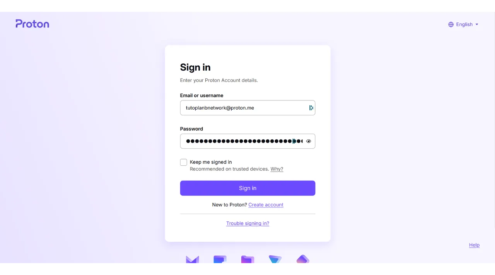

V dnešní době se dvoufaktorová autentizace (2FA) stala nezbytnou pro zvýšení bezpečnosti online účtů proti neoprávněnému přístupu. S nárůstem kybernetických útoků je někdy nedostatečné spoléhat pouze na heslo k zabezpečení vašich účtů.

2FA představuje další vrstvu zabezpečení tím, že vyžaduje druhý formát autentizace kromě tradičního hesla. Tato ověření mohou mít různé formy, jako je kód poslaný přes SMS, dynamický kód generovaný dedikovanou aplikací, nebo použití fyzického bezpečnostního klíče. Použití 2FA výrazně snižuje rizika kompromitace vašich účtů, dokonce i v případě, že by vaše heslo bylo ukradeno.

V jiném tutoriálu jsem vysvětlil, jak nastavit a používat aplikaci TOTP 2FA:

https://planb.network/tutorials/others/authy

Zde se podíváme, jak používat fyzický bezpečnostní klíč jako druhý faktor autentizace pro všechny vaše účty.

## Co je fyzický bezpečnostní klíč?

Fyzický bezpečnostní klíč je zařízení používané k zvýšení bezpečnosti vašich online účtů prostřednictvím dvoufaktorové autentizace (2FA). Tyto zařízení často připomínají malé USB klíče, které musí být vloženy do portu počítače, aby ověřily, že se skutečně jedná o legitimního uživatele, který se snaží připojit.

Když se přihlásíte k účtu chráněnému 2FA a použijete fyzický bezpečnostní klíč, musíte nejen zadat své obvyklé heslo, ale také vložit fyzický bezpečnostní klíč do počítače a stisknout tlačítko k ověření autentizace. Tato metoda tedy přidává další vrstvu zabezpečení, protože i kdyby někdo získal vaše heslo, nebude moci přistupovat k vašemu účtu bez fyzického vlastnění klíče.

Fyzický bezpečnostní klíč je zvláště účinný, protože kombinuje dva různé typy autentizačních faktorů: důkaz znalosti (heslo) a důkaz vlastnictví (fyzický klíč).

Nicméně, tato metoda 2FA má také nevýhody. Zaprvé, musíte mít bezpečnostní klíč vždy k dispozici, pokud chcete přistupovat k vašim účtům. Možná budete muset přidat klíč na svůj klíčenku. Za druhé, na rozdíl od jiných metod 2FA, použití fyzického bezpečnostního klíče zahrnuje počáteční náklady, protože musíte malé zařízení zakoupit. Cena bezpečnostních klíčů se obvykle pohybuje mezi 30 a 100 € v závislosti na vybraných funkcích.

## Který fyzický bezpečnostní klíč si vybrat?

Při výběru bezpečnostního klíče je třeba vzít v úvahu několik kritérií.
Především je třeba zkontrolovat protokoly podporované zařízením. Jako minimum doporučuji vybrat klíč, který podporuje OTP, FIDO2 a U2F. Tyto detaily jsou obvykle výrobci zdůrazněni v popisech produktů. Pro ověření kompatibility každého klíče můžete také navštívit [dongleauth.com](https://www.dongleauth.com/dongles/).
Také se ujistěte, že klíč je kompatibilní s vaším operačním systémem, i když známé značky jako Yubikey obvykle podporují všechny široce používané systémy.

Měli byste také vybrat klíč na základě typu portů dostupných na vašem počítači nebo smartphonu. Například, pokud váš počítač má pouze porty USB-C, vyberte klíč s konektorem USB-C. Některé klíče také nabízejí možnosti připojení přes Bluetooth nebo NFC.

Můžete také porovnávat zařízení na základě jejich dalších funkcí, jako je odolnost vůči vodě a prachu, stejně jako tvar a velikost klíče.
Pokud jde o značky bezpečnostních klíčů, Yubico je nejznámější díky svým zařízením [YubiKey](https://www.yubico.com/), které osobně používám a doporučuji. Google také nabízí zařízení [Titan Security Key](https://store.google.com/fr/product/titan_security_key). Pro open-source alternativy jsou zajímavé možnosti [SoloKeys](https://solokeys.com/) (ne OTP) a [NitroKey](https://www.nitrokey.com/products/nitrokeys), ale nikdy jsem neměl příležitost je vyzkoušet.
## Jak používat fyzický bezpečnostní klíč?

Jakmile obdržíte svůj bezpečnostní klíč, není vyžadováno žádné specifické nastavení. Klíč je obvykle připraven k použití ihned po přijetí. Můžete ho okamžitě použít k zabezpečení vašich online účtů, které podporují tento typ autentizace. Například vám ukážu, jak zabezpečit můj účet Proton mail s tímto fyzickým bezpečnostním klíčem.

Možnost aktivace 2FA najdete ve vašem nastavení účtu, často pod sekci "*Heslo*" nebo "*Bezpečnost*". Klikněte na zaškrtávací políčko nebo tlačítko, které umožňuje aktivaci 2FA s fyzickým klíčem.

Připojte svůj klíč k počítači.

Dotkněte se tlačítka na vašem bezpečnostním klíči pro validaci.

Zadejte název, abyste si pamatovali, který klíč jste použili.

A to je vše, váš bezpečnostní klíč byl úspěšně přidán pro autentizaci 2FA vašeho účtu.

V mém příkladu, pokud se pokusím znovu připojit k mému účtu Proton mail, budu nejprve požádán, abych zadal své heslo spolu s uživatelským jménem. To je první faktor autentizace.

Poté mi bude řečeno, abych připojil svůj bezpečnostní klíč jako druhý faktor autentizace.

Dále musím dotknout tlačítka na fyzickém klíči pro validaci autentizace, a jsem znovu připojen k mému účtu Proton mail.

Tuto operaci opakujte pro všechny online účty, které si přejete tímto způsobem zabezpečit, zejména pro kritické účty, jako jsou vaše e-mailové účty, správci hesel, vaše cloudové a online úložné služby nebo vaše finanční účty.