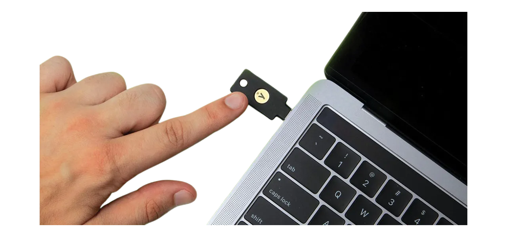
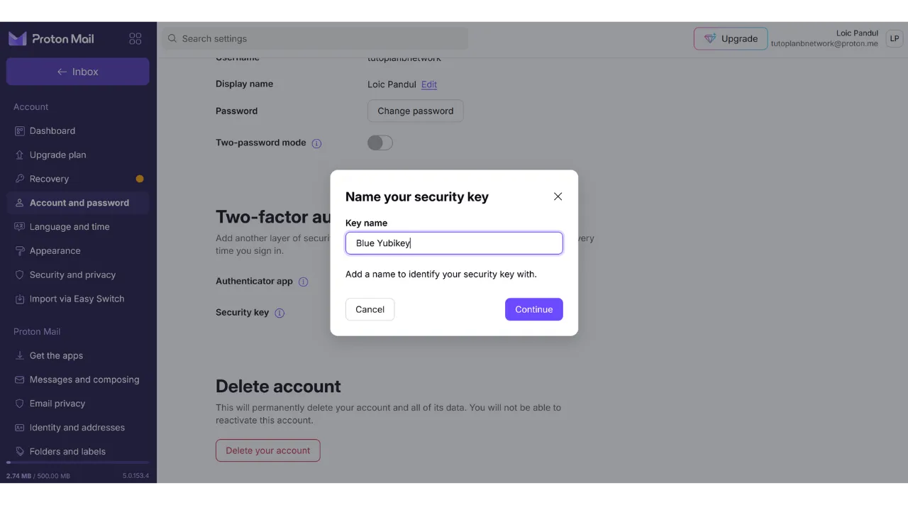
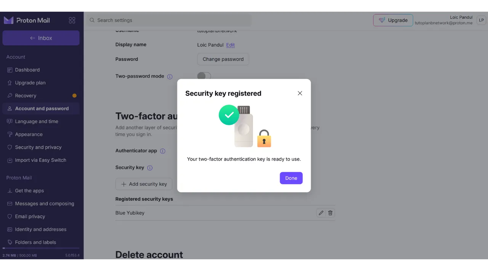
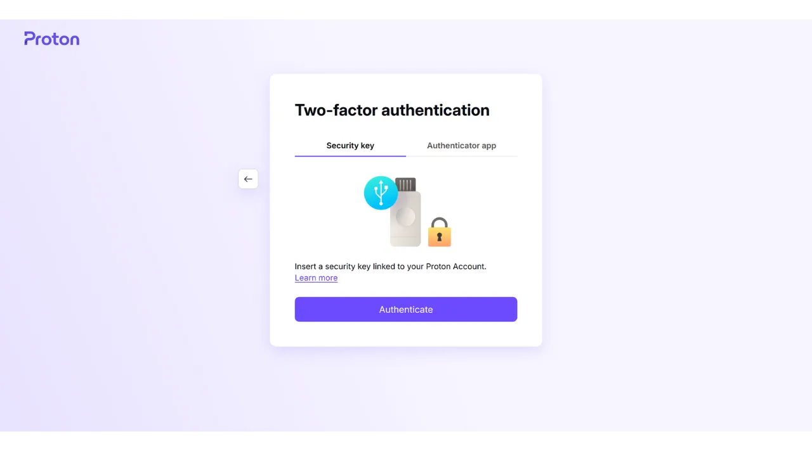

Heutzutage ist die Zwei-Faktor-Authentifizierung (2FA) unerlässlich geworden, um die Sicherheit von Online-Konten gegen unbefugten Zugriff zu erhöhen. Mit dem Anstieg von Cyberangriffen reicht es manchmal nicht aus, sich allein auf ein Passwort zum Schutz Ihrer Konten zu verlassen.

2FA führt eine zusätzliche Sicherheitsebene ein, indem neben dem traditionellen Passwort eine zweite Form der Authentifizierung erforderlich ist. Diese Verifizierung kann verschiedene Formen annehmen, wie beispielsweise einen Code, der per SMS gesendet wird, einen dynamischen Code, der von einer speziellen App generiert wird, oder die Verwendung eines physischen Sicherheitsschlüssels. Die Verwendung von 2FA reduziert deutlich das Risiko, dass Ihre Konten kompromittiert werden, selbst im Falle eines Diebstahls Ihres Passworts.

In einem anderen Tutorial habe ich erklärt, wie man eine TOTP 2FA-Anwendung einrichtet und verwendet:

https://planb.network/tutorials/others/authy

Hier werden wir sehen, wie man einen physischen Sicherheitsschlüssel als zweiten Faktor der Authentifizierung für alle Ihre Konten verwendet.

## Was ist ein physischer Sicherheitsschlüssel?

Ein physischer Sicherheitsschlüssel ist ein Gerät, das dazu dient, die Sicherheit Ihrer Online-Konten durch Zwei-Faktor-Authentifizierung (2FA) zu erhöhen. Diese Geräte ähneln oft kleinen USB-Schlüsseln, die in einen Port des Computers eingesteckt werden müssen, um zu verifizieren, dass es tatsächlich der legitime Benutzer ist, der versucht, sich zu verbinden.

Wenn Sie sich bei einem durch 2FA geschützten Konto anmelden und einen physischen Sicherheitsschlüssel verwenden, müssen Sie nicht nur Ihr übliches Passwort eingeben, sondern auch den physischen Sicherheitsschlüssel in Ihren Computer einstecken und einen Knopf drücken, um die Authentifizierung zu validieren. Diese Methode fügt also eine zusätzliche Sicherheitsebene hinzu, denn selbst wenn jemand Ihr Passwort in die Hände bekommt, kann er ohne den physischen Besitz des Schlüssels nicht auf Ihr Konto zugreifen.

Der physische Sicherheitsschlüssel ist besonders effektiv, weil er zwei verschiedene Arten von Authentifizierungsfaktoren kombiniert: den Nachweis des Wissens (das Passwort) und den Nachweis des Besitzes (den physischen Schlüssel).

Diese 2FA-Methode hat jedoch auch Nachteile. Erstens müssen Sie den Sicherheitsschlüssel immer verfügbar haben, wenn Sie auf Ihre Konten zugreifen möchten. Möglicherweise müssen Sie ihn an Ihren Schlüsselbund anhängen. Zweitens, im Gegensatz zu anderen 2FA-Methoden, beinhaltet die Verwendung eines physischen Sicherheitsschlüssels anfängliche Kosten, da Sie das kleine Gerät kaufen müssen. Der Preis von Sicherheitsschlüsseln variiert in der Regel zwischen 30 € und 100 €, abhängig von den gewählten Funktionen.

## Welchen physischen Sicherheitsschlüssel wählen?

Um Ihren Sicherheitsschlüssel auszuwählen, müssen mehrere Kriterien berücksichtigt werden.
Zuallererst müssen Sie die vom Gerät unterstützten Protokolle überprüfen. Mindestens rate ich dazu, einen Schlüssel zu wählen, der OTP, FIDO2 und U2F unterstützt. Diese Details werden üblicherweise von den Herstellern in den Produktbeschreibungen hervorgehoben. Um die Kompatibilität jedes Schlüssels zu überprüfen, können Sie auch [dongleauth.com](https://www.dongleauth.com/dongles/) besuchen.
Stellen Sie außerdem sicher, dass der Schlüssel mit Ihrem Betriebssystem kompatibel ist, auch wenn bekannte Marken wie Yubikey in der Regel alle weit verbreiteten Systeme unterstützen.

Sie sollten den Schlüssel auch basierend auf der Art der Ports auswählen, die auf Ihrem Computer oder Smartphone verfügbar sind. Wenn Ihr Computer beispielsweise nur USB-C-Ports hat, wählen Sie einen Schlüssel mit einem USB-C-Anschluss. Einige Schlüssel bieten auch Verbindungsoptionen über Bluetooth oder NFC.

Sie können die Geräte auch anhand ihrer zusätzlichen Funktionen wie Wasser- und Staubresistenz sowie der Form und Größe des Schlüssels vergleichen.
Bezüglich Sicherheitsschlüssel-Marken ist Yubico mit seinen [YubiKey-Geräten](https://www.yubico.com/) am bekanntesten, die ich persönlich nutze und empfehle. Google bietet ebenfalls ein Gerät mit dem [Titan Security Key](https://store.google.com/fr/product/titan_security_key) an. Für Open-Source-Alternativen sind [SoloKeys](https://solokeys.com/) (nicht OTP) und [NitroKey](https://www.nitrokey.com/products/nitrokeys) interessante Optionen, aber ich hatte nie die Chance, sie zu testen.
## Wie verwendet man einen physischen Sicherheitsschlüssel?

Sobald Sie Ihren Sicherheitsschlüssel erhalten haben, ist keine spezifische Einrichtung erforderlich. Der Schlüssel ist normalerweise sofort einsatzbereit. Sie können ihn sofort verwenden, um Ihre Online-Konten zu sichern, die diese Art der Authentifizierung unterstützen. Zum Beispiel werde ich Ihnen zeigen, wie ich mein Proton-Mail-Konto mit diesem physischen Sicherheitsschlüssel sichere.

Sie finden die Option zur Aktivierung der 2FA in Ihren Kontoeinstellungen, oft unter dem Abschnitt "*Passwort*" oder "*Sicherheit*". Klicken Sie auf das Kontrollkästchen oder den Button, der es Ihnen erlaubt, 2FA mit einem physischen Schlüssel zu aktivieren.

Stecken Sie Ihren Schlüssel in Ihren Computer.

Berühren Sie den Knopf auf Ihrem Sicherheitsschlüssel zur Bestätigung.

Geben Sie einen Namen ein, um sich zu erinnern, welchen Schlüssel Sie verwendet haben.

Und voilà, Ihr Sicherheitsschlüssel wurde erfolgreich für die 2FA-Authentifizierung Ihres Kontos hinzugefügt.

In meinem Beispiel, wenn ich versuche, mich erneut in mein Proton-Mail-Konto einzuloggen, werde ich zuerst aufgefordert, mein Passwort zusammen mit meinem Benutzernamen einzugeben. Dies ist der erste Faktor der Authentifizierung.

Dann werde ich aufgefordert, meinen Sicherheitsschlüssel für den zweiten Faktor der Authentifizierung einzustecken.

Als Nächstes muss ich den Knopf auf dem physischen Schlüssel berühren, um die Authentifizierung zu bestätigen, und ich bin wieder mit meinem Proton-Mail-Konto verbunden.

Wiederholen Sie diesen Vorgang für alle Online-Konten, die Sie auf diese Weise sichern möchten, insbesondere für kritische Konten wie Ihre E-Mail-Konten, Ihre Passwort-Manager, Ihre Cloud- und Online-Speicherdienste oder Ihre Finanzkonten.