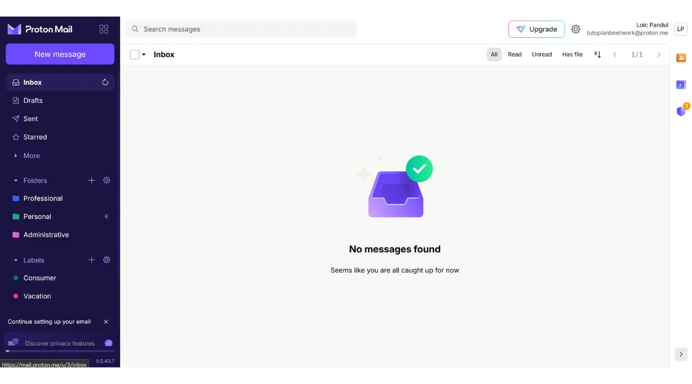
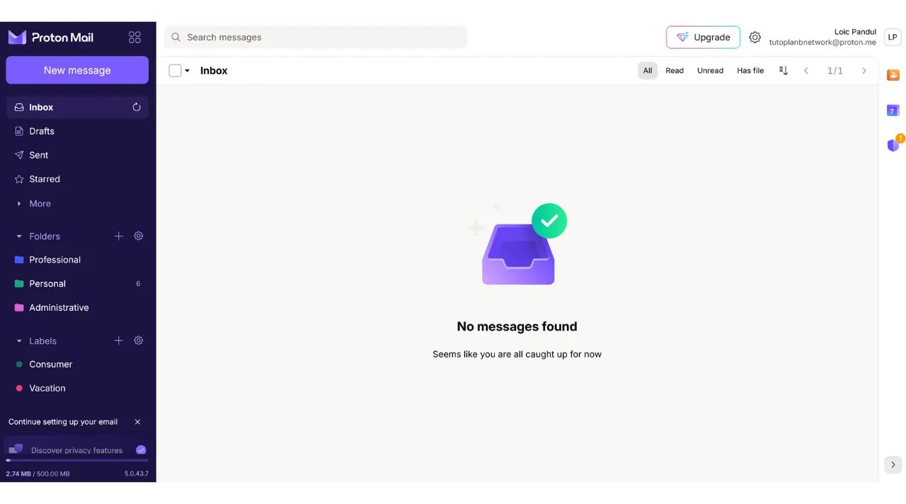

Nowadays, two-factor authentication (2FA) has become essential for enhancing the security of online accounts against unauthorized access. With the rise in cyber attacks, relying solely on a password to secure your accounts is sometimes insufficient.

2FA introduces an additional layer of security by requiring a second form of authentication in addition to the traditional password. This verification can take various forms, such as a code sent via SMS, a dynamic code generated by a dedicated app, or the use of a physical security key. The use of 2FA significantly reduces the risks of your accounts being compromised, even in the event of your password being stolen.

In another tutorial, I explained how to set up and use a TOTP 2FA application:

https://planb.network/tutorials/others/authy

Here, we will see how to use a physical security key as a second factor of authentication for all your accounts.

## What is a physical security key?

A physical security key is a device used to enhance the security of your online accounts through two-factor authentication (2FA). These devices often resemble small USB keys that must be inserted into a computer's port to verify that it is indeed the legitimate user attempting to connect.

When you log into an account protected by 2FA and use a physical security key, you must not only enter your usual password but also insert the physical security key into your computer and press a button to validate the authentication. This method thus adds an additional layer of security, because even if someone manages to obtain your password, they will not be able to access your account without physically possessing the key.

The physical security key is particularly effective because it combines two different types of authentication factors: the proof of knowledge (the password) and the proof of possession (the physical key).

However, this 2FA method also has disadvantages. Firstly, you must always have the security key available if you wish to access your accounts. You might need to add it to your keychain. Secondly, unlike other 2FA methods, using a physical security key involves an initial cost since you have to purchase the small device. The price of security keys generally varies between €30 and €100 depending on the chosen features.

## Which physical security key to choose?

To choose your security key, several criteria must be taken into account.
First and foremost, you need to check the protocols supported by the device. At a minimum, I advise choosing a key that supports OTP, FIDO2, and U2F. These details are usually highlighted by manufacturers in product descriptions. To verify the compatibility of each key, you can also visit [dongleauth.com](https://www.dongleauth.com/dongles/).
Also, ensure that the key is compatible with your operating system, even though well-known brands like Yubikey generally support all widely used systems.

You should also select the key based on the type of ports available on your computer or smartphone. For example, if your computer only has USB-C ports, choose a key with a USB-C connector. Some keys also offer connection options via Bluetooth or NFC.

You can also compare devices based on their additional features such as water and dust resistance, as well as the shape and size of the key.

Regarding security key brands, Yubico is the most well-known with its [YubiKey devices](https://www.yubico.com/), which I personally use and recommend. Google also offers a device with the [Titan Security Key](https://store.google.com/fr/product/titan_security_key). For open-source alternatives, [SoloKeys](https://solokeys.com/) (non OTP) and [NitroKey](https://www.nitrokey.com/products/nitrokeys) are interesting options, but I have never had the chance to test them.

## How to use a physical security key?

Once you have received your security key, no specific setup is required. The key is normally ready to use upon receipt. You can immediately use it to secure your online accounts that support this type of authentication. For example, I will show you how to secure my Proton mail account with this physical security key.

You will find the option to activate 2FA in your account settings, often under the "*Password*" or "*Security*" section. Click on the checkbox or button that allows you to activate 2FA with a physical key.

Plug your key into your computer.

Touch the button on your security key to validate.

Enter a name to remember which key you used.

And there you have it, your security key has been successfully added for the 2FA authentication of your account.

In my example, if I try to reconnect to my Proton mail account, I will first be asked to enter my password along with my username. This is the first factor of authentication.

Then, I am asked to plug in my security key for the second factor of authentication.

Next, I need to touch the button on the physical key to validate the authentication, and I am reconnected to my Proton mail account.

Repeat this operation for all the online accounts you wish to secure in this manner, especially for critical accounts such as your email accounts, your password managers, your cloud and online storage services, or your financial accounts.