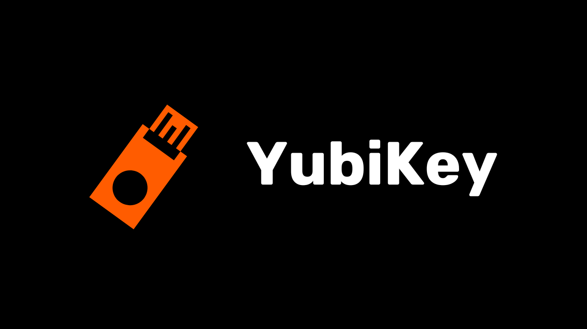

Hoy en día, la autenticación de dos factores (2FA) se ha vuelto esencial para mejorar la seguridad de las cuentas en línea contra el acceso no autorizado. Con el aumento de los ataques cibernéticos, confiar únicamente en una contraseña para proteger tus cuentas a veces es insuficiente.

2FA introduce una capa adicional de seguridad al requerir una segunda forma de autenticación además de la contraseña tradicional. Esta verificación puede tomar varias formas, como un código enviado vía SMS, un código dinámico generado por una aplicación dedicada, o el uso de una llave de seguridad física. El uso de 2FA reduce significativamente los riesgos de que tus cuentas sean comprometidas, incluso en el caso de que tu contraseña sea robada.

En otro tutorial, expliqué cómo configurar y usar una aplicación 2FA TOTP:

https://planb.network/tutorials/others/authy

Aquí, veremos cómo usar una llave de seguridad física como un segundo factor de autenticación para todas tus cuentas.

## ¿Qué es una llave de seguridad física?

Una llave de seguridad física es un dispositivo utilizado para mejorar la seguridad de tus cuentas en línea a través de la autenticación de dos factores (2FA). Estos dispositivos a menudo se asemejan a pequeñas llaves USB que deben ser insertadas en el puerto de una computadora para verificar que es, de hecho, el usuario legítimo el que intenta conectarse.

Cuando inicias sesión en una cuenta protegida por 2FA y usas una llave de seguridad física, no solo debes ingresar tu contraseña habitual, sino también insertar la llave de seguridad física en tu computadora y presionar un botón para validar la autenticación. Este método añade así una capa adicional de seguridad, porque incluso si alguien logra obtener tu contraseña, no podrá acceder a tu cuenta sin poseer físicamente la llave.

La llave de seguridad física es particularmente efectiva porque combina dos tipos diferentes de factores de autenticación: la prueba de conocimiento (la contraseña) y la prueba de posesión (la llave física).

Sin embargo, este método 2FA también tiene desventajas. En primer lugar, siempre debes tener disponible la llave de seguridad si deseas acceder a tus cuentas. Podrías necesitar añadirla a tu llavero. En segundo lugar, a diferencia de otros métodos 2FA, usar una llave de seguridad física implica un costo inicial ya que tienes que comprar el pequeño dispositivo. El precio de las llaves de seguridad generalmente varía entre €30 y €100 dependiendo de las características elegidas.

## ¿Qué llave de seguridad física elegir?

Para elegir tu llave de seguridad, se deben tener en cuenta varios criterios.
En primer lugar, necesitas verificar los protocolos que el dispositivo soporta. Como mínimo, te aconsejo elegir una llave que soporte OTP, FIDO2 y U2F. Estos detalles suelen ser destacados por los fabricantes en las descripciones de los productos. Para verificar la compatibilidad de cada llave, también puedes visitar [dongleauth.com](https://www.dongleauth.com/dongles/).
Además, asegúrate de que la llave sea compatible con tu sistema operativo, aunque marcas bien conocidas como Yubikey generalmente soportan todos los sistemas ampliamente utilizados.

También deberías seleccionar la llave basándote en el tipo de puertos disponibles en tu computadora o smartphone. Por ejemplo, si tu computadora solo tiene puertos USB-C, elige una llave con conector USB-C. Algunas llaves también ofrecen opciones de conexión vía Bluetooth o NFC.
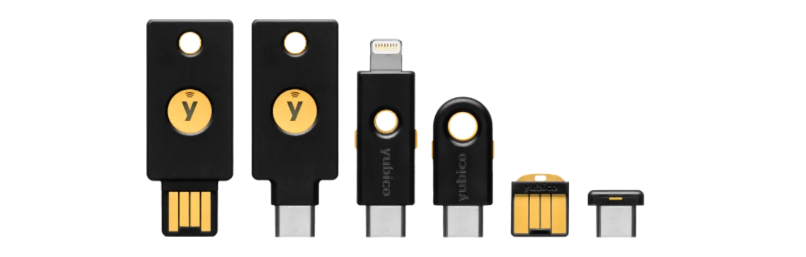
También puedes comparar dispositivos basándote en sus características adicionales como resistencia al agua y al polvo, así como la forma y tamaño de la llave.
En cuanto a marcas de llaves de seguridad, Yubico es la más conocida con sus [dispositivos YubiKey](https://www.yubico.com/), los cuales uso personalmente y recomiendo. Google también ofrece un dispositivo con la [Titan Security Key](https://store.google.com/fr/product/titan_security_key). Para alternativas de código abierto, [SoloKeys](https://solokeys.com/) (no OTP) y [NitroKey](https://www.nitrokey.com/products/nitrokeys) son opciones interesantes, pero nunca he tenido la oportunidad de probarlas.
## ¿Cómo usar una llave de seguridad física?

Una vez que hayas recibido tu llave de seguridad, no se requiere ninguna configuración específica. La llave normalmente está lista para usar al recibirla. Puedes usarla inmediatamente para asegurar tus cuentas en línea que soportan este tipo de autenticación. Por ejemplo, te mostraré cómo asegurar mi cuenta de Proton mail con esta llave de seguridad física.
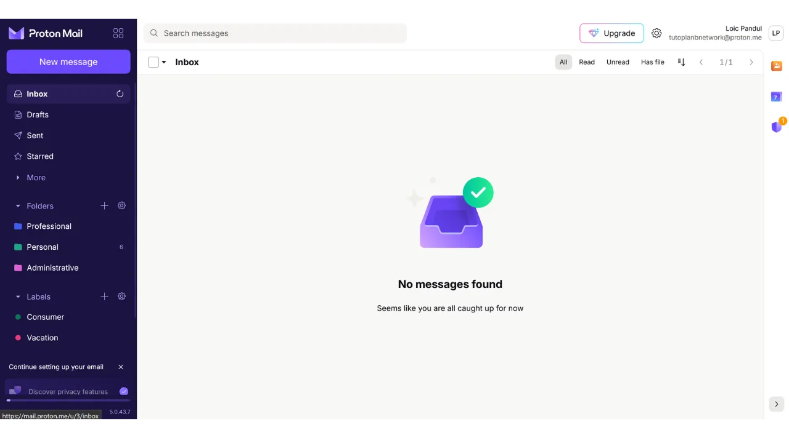
Encontrarás la opción para activar 2FA en la configuración de tu cuenta, a menudo bajo la sección "*Contraseña*" o "*Seguridad*". Haz clic en la casilla o botón que te permite activar 2FA con una llave física.
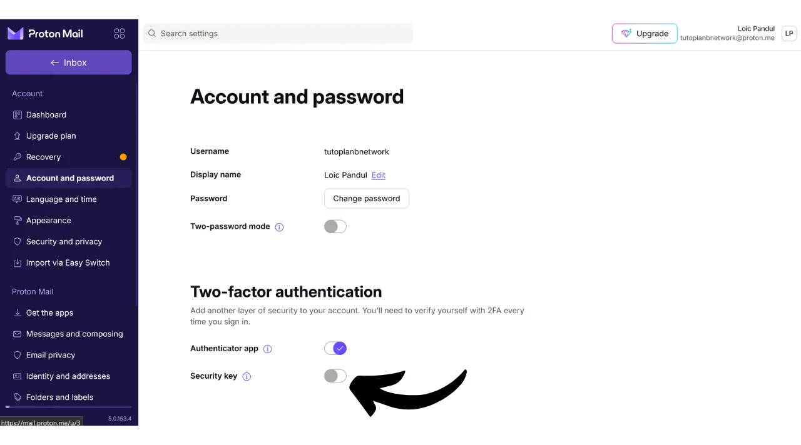
Conecta tu llave a tu computadora.
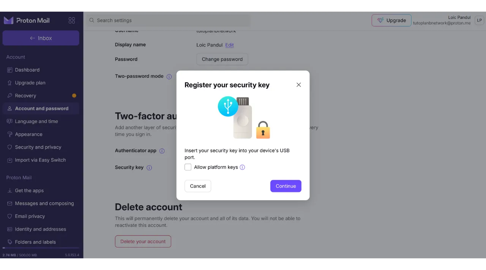
Toca el botón en tu llave de seguridad para validar.
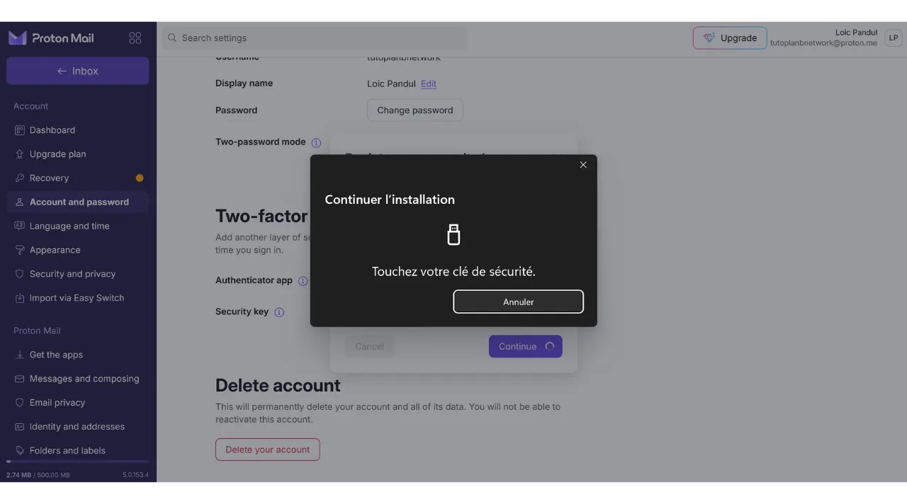
Ingresa un nombre para recordar qué llave usaste.
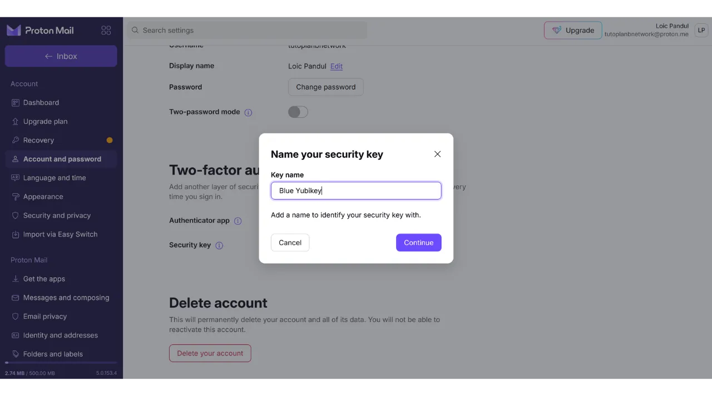
Y ahí lo tienes, tu llave de seguridad ha sido agregada exitosamente para la autenticación 2FA de tu cuenta.
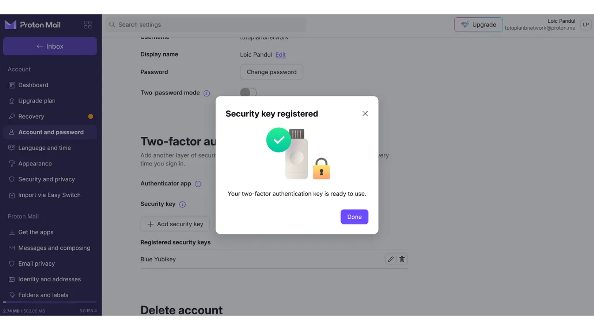
En mi ejemplo, si intento reconectar a mi cuenta de Proton mail, primero se me pedirá que ingrese mi contraseña junto con mi nombre de usuario. Este es el primer factor de autenticación.
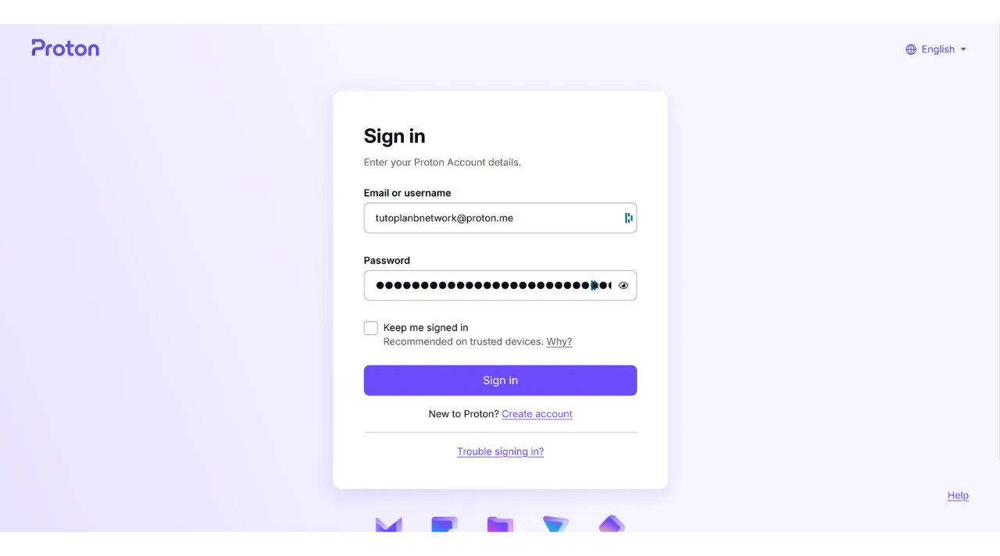
Luego, se me pide que conecte mi llave de seguridad para el segundo factor de autenticación.
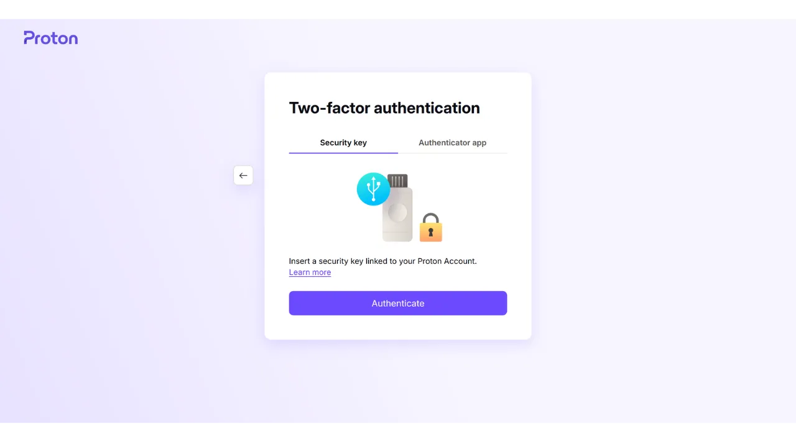
A continuación, necesito tocar el botón en la llave física para validar la autenticación, y me reconecto a mi cuenta de Proton mail.
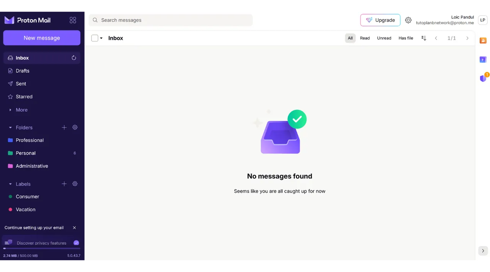
Repite esta operación para todas las cuentas en línea que desees asegurar de esta manera, especialmente para cuentas críticas como tus cuentas de correo electrónico, tus gestores de contraseñas, tus servicios de almacenamiento en la nube y en línea, o tus cuentas financieras.