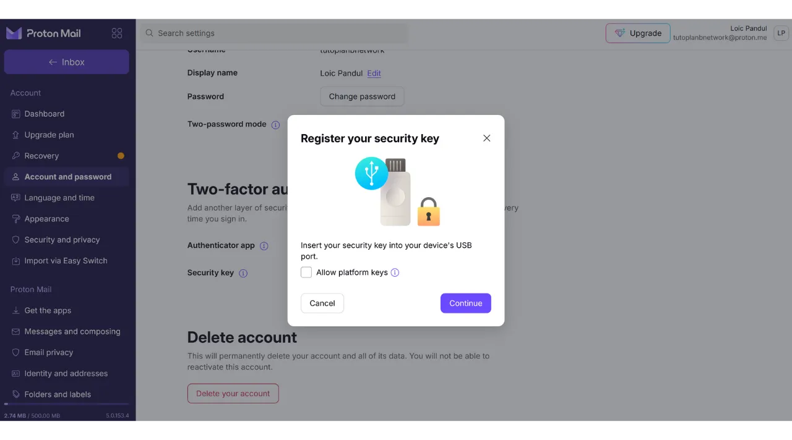

Nykyään kaksivaiheinen tunnistautuminen (2FA) on muodostunut olennaiseksi osaksi online-tilien suojaamista luvattomalta pääsyltä. Kyberhyökkäysten lisääntyessä pelkkään salasanaan luottaminen tilien suojaamisessa on joskus riittämätöntä.

2FA tuo lisäkerroksen turvallisuuteen vaatimalla toisen tunnistautumismuodon perinteisen salasanan lisäksi. Tämä varmennus voi ottaa eri muotoja, kuten koodin, joka lähetetään SMS-viestillä, dynaamisen koodin, jonka luo erityissovellus, tai fyysisen turva-avaimen käytön. 2FA:n käyttö vähentää merkittävästi tilien kompromettoitumisen riskejä, jopa silloin, kun salasanasi on varastettu.

Toisessa oppaassa selitin, kuinka asettaa ja käyttää TOTP 2FA -sovellusta:

https://planb.network/tutorials/others/authy

Tässä näemme, kuinka käyttää fyysistä turva-avainta toisena tunnistautumistekijänä kaikille tileillesi.

## Mikä on fyysinen turva-avain?

Fyysinen turva-avain on laite, jota käytetään online-tilien turvallisuuden parantamiseen kaksivaiheisen tunnistautumisen (2FA) kautta. Nämä laitteet muistuttavat usein pieniä USB-avaimia, jotka on liitettävä tietokoneen porttiin varmistaakseen, että yhteyttä yrittävä henkilö on todellakin laillinen käyttäjä.

Kun kirjaudut 2FA:lla suojattuun tiliin ja käytät fyysistä turva-avainta, sinun on syötettävä tavallinen salasanasi, mutta myös liitettävä fyysinen turva-avain tietokoneeseesi ja painettava nappia varmennuksen vahvistamiseksi. Tämä menetelmä lisää siis ylimääräisen turvallisuuskerroksen, sillä vaikka joku onnistuisikin saamaan salasanasi, he eivät pystyisi pääsemään tilillesi ilman fyysisen avaimen hallussapitoa.

Fyysinen turva-avain on erityisen tehokas, koska se yhdistää kaksi erilaista tunnistautumistekijää: tiedon todisteen (salasana) ja hallussapidon todisteen (fyysinen avain).

Tällä 2FA-menetelmällä on kuitenkin myös haittoja. Ensinnäkin, sinun on aina oltava turva-avain saatavilla, jos haluat päästä tileillesi. Saatat tarvita lisätä sen avainnippuusi. Toiseksi, toisin kuin muissa 2FA-menetelmissä, fyysisen turva-avaimen käyttöön liittyy alkuinvestointi, koska sinun on ostettava pieni laite. Turva-avainten hinnat vaihtelevat yleensä 30 ja 100 euron välillä valittujen ominaisuuksien mukaan.

## Minkä fyysisen turva-avaimen valita?

Turva-avainta valitessasi useita kriteerejä on otettava huomioon.
Ennen kaikkea, sinun on tarkistettava laitteen tukemat protokollat. Minimissään suosittelen valitsemaan avaimen, joka tukee OTP:tä, FIDO2:ta ja U2F:ää. Nämä tiedot korostetaan yleensä valmistajien tuotekuvauksissa. Voit myös tarkistaa kunkin avaimen yhteensopivuuden vierailemalla [dongleauth.com](https://www.dongleauth.com/dongles/) -sivustolla.
Lisäksi varmista, että avain on yhteensopiva käyttöjärjestelmäsi kanssa, vaikka tunnetut merkit kuten Yubikey yleensä tukevat kaikkia laajalti käytettyjä järjestelmiä.

Sinun tulisi myös valita avain tietokoneesi tai älypuhelimesi saatavilla olevien porttien tyypin perusteella. Esimerkiksi, jos tietokoneessasi on vain USB-C -portteja, valitse avain, jossa on USB-C-liitin. Jotkut avaimet tarjoavat myös yhteysvaihtoehtoja Bluetoothin tai NFC:n kautta.

Voit myös vertailla laitteita niiden lisäominaisuuksien, kuten veden- ja pölynkestävyyden, sekä avaimen muodon ja koon perusteella.
Turvallisuusavainmerkeistä Yubico on tunnetuin [YubiKey-laitteillaan](https://www.yubico.com/), joita itse käytän ja suosittelen. Google tarjoaa myös laitteen nimeltä [Titan Security Key](https://store.google.com/fr/product/titan_security_key). Avointen lähdekoodien vaihtoehdoista [SoloKeys](https://solokeys.com/) (ei OTP) ja [NitroKey](https://www.nitrokey.com/products/nitrokeys) ovat mielenkiintoisia vaihtoehtoja, mutta minulla ei ole koskaan ollut tilaisuutta testata niitä.
## Kuinka käyttää fyysistä turvallisuusavainta?

Kun olet saanut turvallisuusavaimen, erityistä asetusta ei vaadita. Avain on yleensä käyttövalmis vastaanotettaessa. Voit heti käyttää sitä turvaamaan online-tilisi, jotka tukevat tätä autentikointityyppiä. Esimerkiksi näytän, kuinka turvaan Proton-sähköpostitilini tällä fyysisellä turvallisuusavaimella.

Löydät vaihtoehdon aktivoida 2FA tilisi asetuksista, usein "*Salasana*" tai "*Turvallisuus*" -osion alla. Klikkaa valintaruutua tai painiketta, joka mahdollistaa 2FA:n aktivoimisen fyysisellä avaimella.

Kytke avain tietokoneeseesi.

Kosketa turvallisuusavaimen painiketta vahvistaaksesi.

Anna nimi, jotta muistat, mitä avainta käytit.

Ja siinä se on, turvallisuusavain on onnistuneesti lisätty tilisi 2FA-autentikointiin.

Esimerkissäni, jos yritän uudelleen yhdistää Proton-sähköpostitiliini, minua pyydetään ensin syöttämään salasanani yhdessä käyttäjänimeni kanssa. Tämä on ensimmäinen autentikointitekijä.

Sen jälkeen minua pyydetään kytkemään turvallisuusavaimeni toista autentikointitekijää varten.

Seuraavaksi minun on kosketettava fyysisen avaimen painiketta vahvistaakseni autentikoinnin, ja olen uudelleen yhdistetty Proton-sähköpostitiliini.

Toista tämä toimenpide kaikille online-tileillesi, joita haluat suojata tällä tavalla, erityisesti kriittisille tileille, kuten sähköpostitileillesi, salasananhallintaohjelmillesi, pilvi- ja online-tallennuspalveluillesi tai rahoitustileillesi.