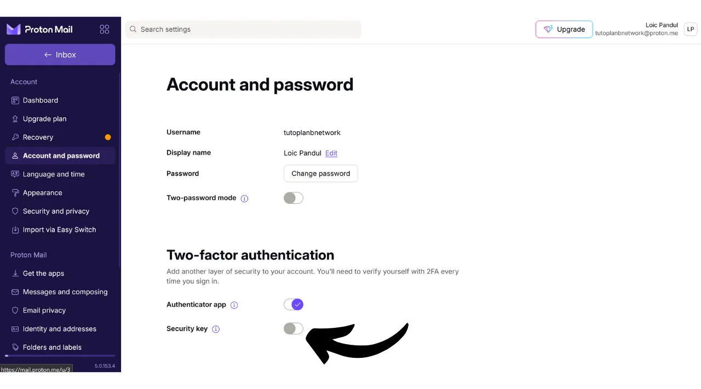

Hoje em dia, a autenticação de dois fatores (2FA) tornou-se essencial para aumentar a segurança de contas online contra acessos não autorizados. Com o aumento dos ataques cibernéticos, confiar apenas em uma senha para proteger suas contas é, às vezes, insuficiente.

A 2FA introduz uma camada adicional de segurança ao exigir uma segunda forma de autenticação além da senha tradicional. Essa verificação pode assumir várias formas, como um código enviado via SMS, um código dinâmico gerado por um aplicativo dedicado ou o uso de uma chave de segurança física. O uso da 2FA reduz significativamente os riscos de suas contas serem comprometidas, mesmo no caso de sua senha ser roubada.

Em outro tutorial, expliquei como configurar e usar um aplicativo de 2FA TOTP:

https://planb.network/tutorials/others/authy

Aqui, veremos como usar uma chave de segurança física como um segundo fator de autenticação para todas as suas contas.

## O que é uma chave de segurança física?

Uma chave de segurança física é um dispositivo usado para aumentar a segurança de suas contas online por meio da autenticação de dois fatores (2FA). Esses dispositivos geralmente se assemelham a pequenas chaves USB que devem ser inseridas na porta de um computador para verificar se é realmente o usuário legítimo tentando se conectar.

Quando você faz login em uma conta protegida por 2FA e usa uma chave de segurança física, você deve não apenas inserir sua senha usual, mas também inserir a chave de segurança física em seu computador e pressionar um botão para validar a autenticação. Este método, portanto, adiciona uma camada adicional de segurança, porque mesmo que alguém consiga obter sua senha, não será capaz de acessar sua conta sem possuir fisicamente a chave.

A chave de segurança física é particularmente eficaz porque combina dois tipos diferentes de fatores de autenticação: a prova de conhecimento (a senha) e a prova de posse (a chave física).

No entanto, este método de 2FA também tem desvantagens. Primeiramente, você deve sempre ter a chave de segurança disponível se desejar acessar suas contas. Você pode precisar adicioná-la ao seu chaveiro. Em segundo lugar, ao contrário de outros métodos de 2FA, usar uma chave de segurança física envolve um custo inicial, já que você tem que comprar o pequeno dispositivo. O preço das chaves de segurança geralmente varia entre €30 e €100, dependendo das características escolhidas.

## Qual chave de segurança física escolher?

Para escolher sua chave de segurança, vários critérios devem ser levados em conta.
Antes de mais nada, você precisa verificar os protocolos suportados pelo dispositivo. No mínimo, aconselho escolher uma chave que suporte OTP, FIDO2 e U2F. Esses detalhes geralmente são destacados pelos fabricantes nas descrições dos produtos. Para verificar a compatibilidade de cada chave, você também pode visitar [dongleauth.com](https://www.dongleauth.com/dongles/).
Além disso, certifique-se de que a chave é compatível com seu sistema operacional, embora marcas conhecidas como Yubikey geralmente suportem todos os sistemas amplamente utilizados.

Você também deve selecionar a chave com base no tipo de portas disponíveis em seu computador ou smartphone. Por exemplo, se seu computador só tem portas USB-C, escolha uma chave com um conector USB-C. Algumas chaves também oferecem opções de conexão via Bluetooth ou NFC.

Você também pode comparar dispositivos com base em seus recursos adicionais, como resistência à água e poeira, bem como o formato e tamanho da chave.
No que diz respeito a marcas de chaves de segurança, a Yubico é a mais conhecida com seus [dispositivos YubiKey](https://www.yubico.com/), que eu pessoalmente uso e recomendo. A Google também oferece um dispositivo com a [Titan Security Key](https://store.google.com/fr/product/titan_security_key). Para alternativas de código aberto, [SoloKeys](https://solokeys.com/) (não OTP) e [NitroKey](https://www.nitrokey.com/products/nitrokeys) são opções interessantes, mas nunca tive a chance de testá-las.
## Como usar uma chave de segurança física?

Uma vez que você tenha recebido sua chave de segurança, nenhum setup específico é necessário. A chave normalmente está pronta para uso assim que recebida. Você pode imediatamente usá-la para proteger suas contas online que suportam esse tipo de autenticação. Por exemplo, vou mostrar como proteger minha conta Proton mail com essa chave de segurança física.

Você encontrará a opção de ativar o 2FA nas configurações da sua conta, frequentemente sob a seção "*Senha*" ou "*Segurança*". Clique na caixa de seleção ou botão que permite ativar o 2FA com uma chave física.

Conecte sua chave ao seu computador.

Toque no botão da sua chave de segurança para validar.

Digite um nome para lembrar qual chave você usou.

E pronto, sua chave de segurança foi adicionada com sucesso para a autenticação 2FA da sua conta.

No meu exemplo, se eu tentar reconectar à minha conta Proton mail, primeiro me será pedido para inserir minha senha junto com meu nome de usuário. Este é o primeiro fator de autenticação.

Depois, me é pedido para conectar minha chave de segurança para o segundo fator de autenticação.

Em seguida, preciso tocar no botão da chave física para validar a autenticação, e sou reconectado à minha conta Proton mail.

Repita essa operação para todas as contas online que deseja proteger dessa maneira, especialmente para contas críticas como suas contas de e-mail, seus gerenciadores de senha, seus serviços de armazenamento na nuvem e online, ou suas contas financeiras.