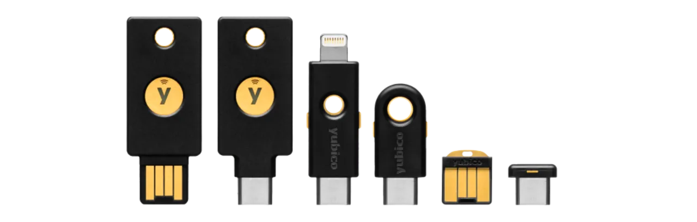

Ngày nay, xác thực hai yếu tố (2FA) đã trở nên thiết yếu để tăng cường bảo mật cho các tài khoản trực tuyến chống lại việc truy cập không được phép. Với sự gia tăng của các cuộc tấn công mạng, việc chỉ dựa vào mật khẩu để bảo vệ tài khoản của bạn đôi khi là không đủ.

2FA giới thiệu một lớp bảo mật bổ sung bằng cách yêu cầu một hình thức xác thực thứ hai ngoài mật khẩu truyền thống. Việc xác thực này có thể nhận nhiều hình thức khác nhau, như một mã được gửi qua SMS, một mã động được tạo bởi một ứng dụng chuyên dụng, hoặc việc sử dụng một khóa bảo mật vật lý. Việc sử dụng 2FA đáng kể giảm thiểu rủi ro tài khoản của bạn bị xâm phạm, ngay cả trong trường hợp mật khẩu của bạn bị đánh cắp.

Trong một hướng dẫn khác, tôi đã giải thích cách thiết lập và sử dụng một ứng dụng 2FA TOTP:

https://planb.network/tutorials/others/authy

Ở đây, chúng ta sẽ xem cách sử dụng một khóa bảo mật vật lý làm yếu tố xác thực thứ hai cho tất cả tài khoản của bạn.

## Khóa bảo mật vật lý là gì?

Một khóa bảo mật vật lý là một thiết bị được sử dụng để tăng cường bảo mật cho các tài khoản trực tuyến của bạn thông qua xác thực hai yếu tố (2FA). Những thiết bị này thường giống như những chiếc khóa USB nhỏ phải được cắm vào cổng của máy tính để xác minh rằng đó thực sự là người dùng hợp pháp đang cố gắng kết nối.

Khi bạn đăng nhập vào một tài khoản được bảo vệ bởi 2FA và sử dụng một khóa bảo mật vật lý, bạn không chỉ cần nhập mật khẩu thông thường của mình mà còn phải cắm khóa bảo mật vật lý vào máy tính và nhấn một nút để xác thực. Phương pháp này do đó thêm một lớp bảo mật bổ sung, bởi vì ngay cả khi ai đó quản lý để lấy được mật khẩu của bạn, họ sẽ không thể truy cập vào tài khoản của bạn mà không có khóa vật lý.

Khóa bảo mật vật lý đặc biệt hiệu quả vì nó kết hợp hai loại yếu tố xác thực khác nhau: bằng chứng về kiến thức (mật khẩu) và bằng chứng về sở hữu (khóa vật lý).

Tuy nhiên, phương pháp 2FA này cũng có nhược điểm. Đầu tiên, bạn phải luôn có khóa bảo mật sẵn sàng nếu bạn muốn truy cập vào tài khoản của mình. Bạn có thể cần thêm nó vào móc khóa của mình. Thứ hai, không giống như các phương pháp 2FA khác, việc sử dụng một khóa bảo mật vật lý liên quan đến một chi phí ban đầu vì bạn phải mua thiết bị nhỏ này. Giá của các khóa bảo mật thường dao động từ €30 đến €100 tùy thuộc vào các tính năng được chọn.

## Chọn khóa bảo mật vật lý nào?

Để chọn khóa bảo mật của bạn, cần phải xem xét một số tiêu chí.
Trước hết và quan trọng nhất, bạn cần kiểm tra các giao thức được thiết bị hỗ trợ. Ít nhất, tôi khuyên bạn nên chọn một khóa hỗ trợ OTP, FIDO2, và U2F. Những chi tiết này thường được các nhà sản xuất nêu bật trong mô tả sản phẩm. Để xác minh tính tương thích của từng khóa, bạn cũng có thể truy cập [dongleauth.com](https://www.dongleauth.com/dongles/).
Ngoài ra, đảm bảo rằng khóa tương thích với hệ điều hành của bạn, mặc dù các thương hiệu nổi tiếng như Yubikey thường hỗ trợ tất cả các hệ thống được sử dụng rộng rãi.

Bạn cũng nên chọn khóa dựa trên loại cổng có sẵn trên máy tính hoặc điện thoại thông minh của bạn. Ví dụ, nếu máy tính của bạn chỉ có cổng USB-C, hãy chọn một khóa với đầu nối USB-C. Một số khóa cũng cung cấp các tùy chọn kết nối qua Bluetooth hoặc NFC.

Bạn cũng có thể so sánh các thiết bị dựa trên các tính năng bổ sung như khả năng chống nước và bụi, cũng như hình dạng và kích thước của khóa.
Về các thương hiệu khóa bảo mật, Yubico là thương hiệu nổi tiếng nhất với [thiết bị YubiKey](https://www.yubico.com/) mà cá nhân tôi sử dụng và khuyên dùng. Google cũng cung cấp một thiết bị với [Titan Security Key](https://store.google.com/fr/product/titan_security_key). Đối với các lựa chọn mã nguồn mở, [SoloKeys](https://solokeys.com/) (không OTP) và [NitroKey](https://www.nitrokey.com/products/nitrokeys) là những lựa chọn thú vị, nhưng tôi chưa bao giờ có cơ hội thử nghiệm chúng.
## Cách sử dụng khóa bảo mật vật lý?

Khi bạn đã nhận được khóa bảo mật của mình, không cần thiết lập cụ thể nào. Khóa thường sẵn sàng sử dụng ngay khi nhận. Bạn có thể ngay lập tức sử dụng nó để bảo vệ các tài khoản trực tuyến của mình hỗ trợ loại xác thực này. Ví dụ, tôi sẽ hướng dẫn bạn cách bảo vệ tài khoản Proton mail của mình với khóa bảo mật vật lý này.

Bạn sẽ tìm thấy tùy chọn kích hoạt 2FA trong cài đặt tài khoản của mình, thường nằm dưới mục "*Mật khẩu*" hoặc "*Bảo mật*". Nhấp vào hộp kiểm hoặc nút cho phép bạn kích hoạt 2FA với khóa vật lý.

Cắm khóa của bạn vào máy tính.

Chạm vào nút trên khóa bảo mật của bạn để xác nhận.

Nhập tên để nhớ khóa bạn đã sử dụng.

Và đó là, khóa bảo mật của bạn đã được thêm thành công cho xác thực 2FA của tài khoản.

Trong ví dụ của tôi, nếu tôi cố gắng kết nối lại với tài khoản Proton mail của mình, trước tiên tôi sẽ được yêu cầu nhập mật khẩu cùng với tên người dùng của mình. Đây là yếu tố xác thực đầu tiên.

Sau đó, tôi được yêu cầu cắm khóa bảo mật của mình cho yếu tố xác thực thứ hai.

Tiếp theo, tôi cần chạm vào nút trên khóa vật lý để xác nhận xác thực, và tôi được kết nối lại với tài khoản Proton mail của mình.

Lặp lại thao tác này cho tất cả các tài khoản trực tuyến mà bạn muốn bảo vệ theo cách này, đặc biệt là cho các tài khoản quan trọng như tài khoản email của bạn, quản lý mật khẩu của bạn, dịch vụ lưu trữ đám mây và trực tuyến của bạn, hoặc tài khoản tài chính của bạn.