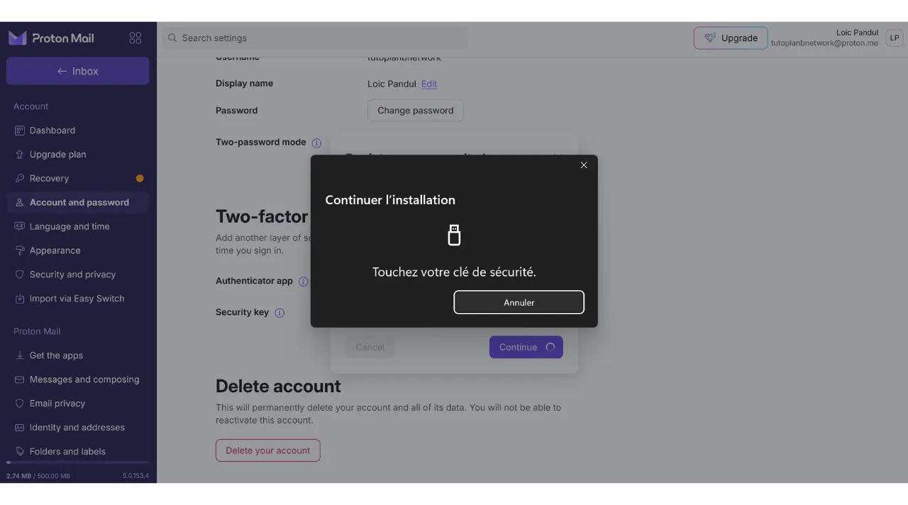

如今，两因素认证（2FA）已成为增强在线账户安全性、防止未经授权访问的必要手段。随着网络攻击的增加，仅依靠密码来保护您的账户有时是不够的。

2FA通过要求除传统密码外的第二种形式的认证，引入了一个额外的安全层。这种验证可以采取多种形式，例如通过短信发送的代码、专用应用生成的动态代码，或使用物理安全密钥。使用2FA大大降低了您的账户被盗用的风险，即使在您的密码被盗的情况下也是如此。

在另一个教程中，我解释了如何设置和使用TOTP 2FA应用程序：

https://planb.network/tutorials/others/authy

在这里，我们将看到如何使用物理安全密钥作为所有账户的第二认证因素。

## 什么是物理安全密钥？

物理安全密钥是一种通过两因素认证（2FA）增强您在线账户安全性的设备。这些设备通常看起来像小型USB密钥，必须插入计算机的端口以验证确实是合法用户试图连接。

当您登录受2FA保护的账户并使用物理安全密钥时，您不仅要输入通常的密码，还要将物理安全密钥插入计算机并按下按钮以验证认证。因此，这种方法增加了一个额外的安全层，因为即使有人设法获得您的密码，他们也无法在没有物理拥有密钥的情况下访问您的账户。

物理安全密钥特别有效，因为它结合了两种不同类型的认证因素：知识证明（密码）和拥有证明（物理密钥）。

然而，这种2FA方法也有缺点。首先，如果您希望访问您的账户，您必须始终携带安全密钥。您可能需要将其添加到您的钥匙链上。其次，与其他2FA方法不同，使用物理安全密钥涉及初始成本，因为您必须购买这个小设备。安全密钥的价格通常在€30到€100之间变化，具体取决于所选的功能。

## 如何选择物理安全密钥？

选择您的安全密钥时，必须考虑几个标准。
首先，您需要检查设备支持的协议。至少，我建议选择支持OTP、FIDO2和U2F的密钥。这些细节通常由制造商在产品描述中强调。要验证每个密钥的兼容性，您也可以访问[dongleauth.com](https://www.dongleauth.com/dongles/)。
此外，确保密钥与您的操作系统兼容，尽管像Yubikey这样的知名品牌通常支持所有广泛使用的系统。

您还应根据计算机或智能手机上可用的端口类型选择密钥。例如，如果您的计算机只有USB-C端口，请选择带有USB-C连接器的密钥。一些密钥还通过蓝牙或NFC提供连接选项。

您还可以根据额外功能（如防水和防尘）、以及密钥的形状和大小比较设备。
关于安全密钥品牌，Yubico是最知名的，它的[YubiKey设备](https://www.yubico.com/)我个人使用并推荐。谷歌也提供了一种设备，名为[Titan Security Key](https://store.google.com/fr/product/titan_security_key)。对于开源替代品，[SoloKeys](https://solokeys.com/)（非OTP）和[NitroKey](https://www.nitrokey.com/products/nitrokeys)是有趣的选择，但我从未有机会测试它们。
## 如何使用物理安全密钥？

一旦你收到了你的安全密钥，不需要特定的设置。密钥通常在收到后就可以使用。你可以立即使用它来保护支持这种认证类型的在线账户。例如，我将向你展示如何用这个物理安全密钥保护我的Proton邮件账户。

你会在账户设置中找到激活2FA的选项，通常在“*密码*”或“*安全*”部分下。点击复选框或按钮以使用物理密钥激活2FA。

将你的密钥插入电脑。

触摸你的安全密钥上的按钮以进行验证。

输入一个名称以记住你使用的是哪把密钥。

就这样，你的安全密钥已成功添加到你账户的2FA认证中。

在我的例子中，如果我尝试重新连接到我的Proton邮件账户，首先会被要求输入我的密码和用户名。这是第一重认证因素。

然后，系统会要求我插入我的安全密钥作为第二重认证因素。

接下来，我需要触摸物理密钥上的按钮以验证认证，然后我就重新连接到我的Proton邮件账户了。

重复此操作以用这种方式保护你希望的所有在线账户，特别是对于关键账户，如你的电子邮件账户、密码管理器、云和在线存储服务或你的金融账户。