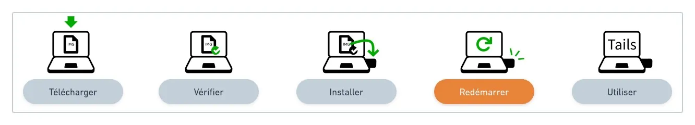
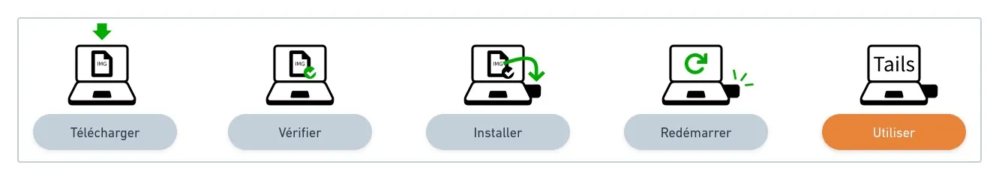
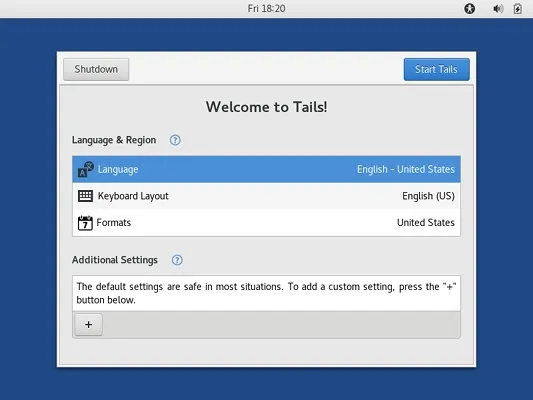
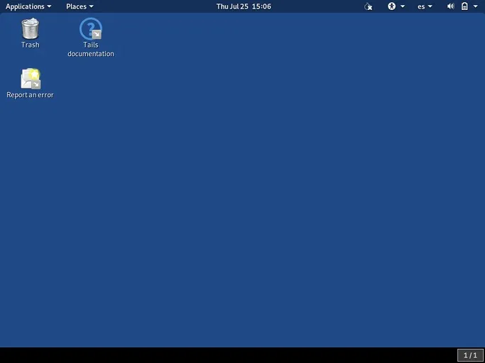
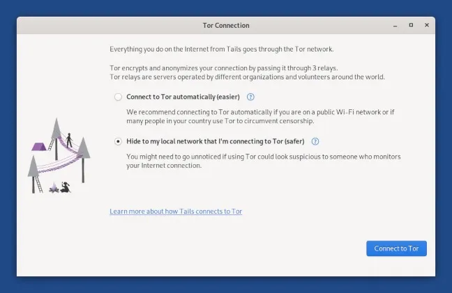

監視や検閲からあなたを守る、携帯可能でアムネジア（記憶喪失）機能を持つオペレーティングシステム。

## なぜTailsをインストールしたUSBキーを持つべきか？

Tails (https://tails.boum.org/) は、いつでも利用可能なセキュアなコンピュータを持つ最も簡単な方法であり、それを使用するコンピュータに何の痕跡も残しません。

Tailsを使用するには、アクセスできるコンピュータ（両親の家で、友人の家で、インターネットカフェで...）をオフにし、Windows、macOS、Linuxの代わりにTails USBキーで起動します。

その後、通常のオペレーティングシステムとは独立した作業環境と通信環境を持ち、ハードドライブを使用しないことになります。

Tailsはハードドライブに書き込むことはなく、機能するためにコンピュータのRAMのみを使用します。このメモリはTailsがシャットダウンされると完全に消去され、可能な痕跡をすべて削除します。

## 具体的な使用例

常にTailsを搭載したUSBキーを持つことの利点を具体的に示すために、Agora256チームがまとめた小さな非網羅的リストをここに示します：

- インターネットとTorに接続し、痕跡を残さずにウェブサイトを匿名かつ検閲されずに閲覧する；
- 怪しいウェブサイトからPDFを開く；
- Electrumウォレットでビットコインのプライベートキーバックアップをテストする；
- オフィススイート（LibreOffice）を使用し、自分のものではないコンピュータで作業する；
- Linux環境での最初のステップを踏み、MicrosoftやAppleの世界を離れる方法を学ぶ。

## Tailsを信頼する方法は？

ソフトウェアを使用する際には常に信頼の要素がありますが、それは盲目的である必要はありません。Tailsのようなツールは、信頼できる手段をユーザーに提供するよう努める必要があります。Tailsにとって、これは以下を意味します：

- 公開されたソースコード：https://gitlab.tails.boum.org/；
- TorとDebianに基づいたプロジェクト；
- 検証可能で再現可能なダウンロード；
- 異なる個人や組織による推薦。

## インストールと使用ガイド

このインストールガイドの目的は、インストールの各ステップをガイドすることです。公式ガイド以上の行動を説明することはありませんが、ヒントやコツを提供しながら正しい方向を指し示します。

実用的な経験の理由から、これらのヒントはmacOSとLinuxプラットフォームに焦点を当てます。
🛠️
この手順を開始する前に、最低読み取り速度が150 MB/sで、容量が少なくとも8 GBのUSBキーを持っていることを確認してください。理想的にはUSB 3.0です。

前提条件：

- 容量が少なくとも8 GBのTails専用USBキー1つ
- Linux、macOS、（またはWindows）でインターネットに接続されたコンピュータ
- インターネット接続速度に応じて、約1時間の空き時間、そのうちインストールには½時間（ダウンロードするファイルは1.3 GB）

## ステップ1: コンピュータからTailsをダウンロードする

> 🔗 公式Tailsセクション: https://tails.boum.org/install/linux/index.fr.html#download

.img拡張子のインストールファイルをダウンロードするには、インターネットのダウンロード速度に応じて時間がかかる場合があるので、計画を立ててください。現代的で効率的な接続では、5分未満で完了します。

次のステップに必要になるため、ダウンロードなどの既知のフォルダにファイルを保存してください。

## ステップ2: ダウンロードを検証する

🔗 公式Tailsセクション: https://tails.boum.org/install/linux/index.fr.html#verify
ダウンロードを検証することで、それがTails開発者によって発行され、ダウンロード中に破損したり傍受されたりしていないことを確認できます。

PGPを使用して、ダウンロードしたばかりのファイルが期待されるものであることを手動で検証することは可能ですが、高度な知識がない場合、この検証はダウンロードページのJavaScript検証と同じレベルのセキュリティを提供しますが、はるかに複雑でエラーが発生しやすいです。

ファイルを検証するには、公式セクションで提供されている「Select your download...」ボタンを使用してください！

## ステップ3: USBキーにTailsをインストールする

> 🔗 公式Tailsセクション:
>
> - Linux: https://tails.boum.org/install/linux/index.fr.html#install
> - macOS: https://tails.boum.org/install/mac/index.fr.html#etcher および https://tails.boum.org/install/mac/index.fr.html#install

このUSBキーへのTailsのインストールステップは、特に以前に行ったことがない場合、ガイド全体で最も難しいステップです。最も重要な点は、オペレーティングシステム：LinuxまたはmacOSに合わせて公式セクションで正しい手順を選択することです。

推奨されるようにツールがインストールされ準備されたら、.img拡張子のファイルをキーにコピーして（既存のデータをすべて消去して）、独立して「ブート可能」にすることができます。

頑張ってください！そしてステップ4でお会いしましょう。

## ステップ4: Tails USBキーで再起動する

> 🔗 公式Tailsセクション: https://tails.boum.org/install/linux/index.en.html#restart
> 新しいUSBスティックを使用してコンピュータの1台を起動する時が来ました。USBポートの1つに挿入して、再起動してください！

> 💡 ほとんどのコンピュータは自動的にTails USBスティックから起動しませんが、ブートメニューキーを押すと、起動可能なデバイスのリストが表示されます。

通常のハードドライブではなくUSBスティックを選択するために押すべきキーを確認するために、メーカー別の非網羅的なリストはこちらです：

| メーカー | キー              |
| -------- | ---------------- |
| Acer     | F12, F9, F2, Esc |
| Apple    | Option           |
| Asus     | Esc              |
| Clevo    | F7               |
| Dell     | F12              |
| Fujitsu  | F12, Esc         |
| HP       | F9               |
| Huawei   | F12              |
| Intel    | F10              |
| Lenovo   | F12              |
| MSI      | F11              |
| Samsung  | Esc, F12, F2     |
| Sony     | F11, Esc, F10    |
| Toshiba  | F12              |
| その他...  | F12, Esc         |

USBスティックが選択されると、この新しいブート画面が表示されるはずで、非常に良い兆候ですので、コンピュータが起動を続けるのを待ちましょう...

## ステップ5: Tailsへようこそ！

> 🔗 公式Tailsセクション: https://tails.boum.org/install/linux/index.en.html#tails

ブートローダーとローディング画面の1、2分後に、ウェルカムスクリーンが表示されます。

ウェルカムスクリーンで、言語と地域セクションで言語とキーボードレイアウトを選択します。Tailsを開始するには、クリックしてください。

もしコンピュータがネットワークに有線接続されていない場合は、Wi-Fiなしでネットワークに接続するための公式Tails指示に従ってください（「Wi-Fiのテスト」セクションを参照）。
ローカルネットワークに接続すると、Torネットワークに接続するためのTor接続ウィザードが表示されます。

匿名でブラウジングを開始し、Tailsに含まれるオプションやソフトウェアを探索してください。楽しんでください。USBスティックには何も変更されないので、間違いを恐れることはありません... 次に再起動すると、あなたの体験はすべて忘れられます！

## 将来のガイドでは...

自分のTails USBスティックで少し実験した後、別の記事でより高度なトピックを探索します。例えば：

> Tailsの最新バージョンでキーを更新する；永続ストレージを設定して使用する；追加のソフトウェアをインストールする。
> それまでの間、いつものように、質問があればAgora256コミュニティと共有してください。私たちは一緒に学び、今日よりも明日より良くなるために努力しています！