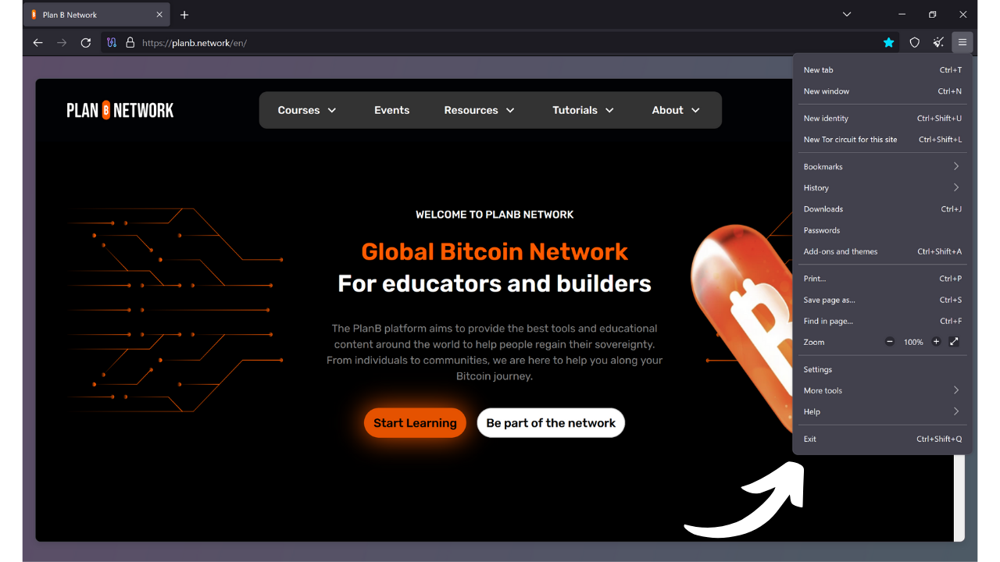

Jak už název napovídá, prohlížeč je software používaný k procházení internetu. Slouží jako brána mezi strojem uživatele a webem, překládá kód webových stránek na interaktivní a čitelné stránky. Výběr vašeho prohlížeče je velmi důležitý, protože nejen ovlivňuje vaše prohlížecí zážitky, ale také vaši online bezpečnost a soukromí.

Dávejte pozor, abyste prohlížeč nepletli s vyhledávačem. Prohlížeč je software, který používáte k přístupu na internet (jako Chrome nebo Firefox), zatímco vyhledávač je služba, jako například Google nebo Bing, která vám pomáhá najít informace online.

Dnes je Google Chrome zdaleka nejpoužívanějším prohlížečem. V roce 2024 má podíl přibližně 65% na celosvětovém trhu. Chrome je ceněn pro svou rychlost a výkon, ale není nutně nejlepší volbou pro každého, zejména pokud je pro vás prioritou soukromí. Chrome patří společnosti Google, která je známá sběrem a analýzou obrovského množství dat o svých uživatelích. A skutečně, jejich vlastní prohlížeč je v srdci jejich strategie sledování. Tento software je klíčovou součástí většiny vašich online interakcí. Ovládnutí sběru dat ve vašem prohlížeči je pro Google důležitou otázkou.

*Zdroj: [gs.statcounter.com](https://gs.statcounter.com/browser-market-share)*

Existuje několik hlavních rodin prohlížečů, každá založená na specifickém vykreslovacím enginu. Prohlížeče jako Google Chrome, Microsoft Edge, Brave, Opera nebo Vivaldi jsou všechny založeny na Chromium, lehké a open-source verzi Chrome vyvinuté společností Google. Všechny tyto prohlížeče používají vykreslovací engine Blink, který je forknutím WebKitu, ten je odvozen z KHTML. Převaha Chromium na trhu činí prohlížeče odvozené od něj obzvláště efektivní, protože weboví vývojáři mají tendenci optimalizovat své stránky primárně pro Blink.

Safari, prohlížeč společnosti Apple, používá WebKit, který také pochází z KHTML.

Na druhou stranu, prohlížeče jako Mozilla Firefox, LibreWolf a Tor Browser spoléhají na Gecko, odlišný vykreslovací engine, původně od prohlížeče Netscape.

Výběr správného prohlížeče závisí na vašich potřebách. Ale pokud vás alespoň trochu zajímá vaše soukromí, a tedy vaše bezpečnost, doporučuji jít s Firefoxem pro obecné použití a Tor Browser pro ještě větší soukromí. V tomto tutoriálu vám ukážu, jak snadno začít s Tor Browserem.

## Úvod do Tor Browseru

Tor Browser je prohlížeč specificky navržený pro bezpečné a co nejvíce soukromé procházení internetu. Prohlížeč je založen na Firefoxu, a tedy na vykreslovacím enginu Gecko.
Tor Browser používá síť Tor k šifrování a směrování vašeho provozu přes několik relay serverů před jeho přenosem do cíle. Tento proces vícevrstvého směrování, známý jako "*onion routing*", pomáhá skrýt vaši skutečnou IP adresu, což ztěžuje identifikaci vaší polohy a online aktivit. Nicméně, procházení je nutně pomalejší než s standardním prohlížečem, který síť Tor nepoužívá, jelikož je nepřímé.
Na rozdíl od jiných prohlížečů Tor Browser integruje specifické funkce k zabránění sledování vašich online aktivit, jako je izolace každé navštívené webové stránky a automatické mazání cookies a historie po zavření. Je také navržen tak, aby minimalizoval rizika fingerprintingu, tím, že všechny uživatele před navštívenými stránkami zobrazuje co nejpodobněji.
Můžete velmi dobře použít Tor Browser k přístupu na standardní webové stránky (`.com`, `.org` atd.). V tomto případě je váš provoz anonymizován procházením několika Tor uzlů, než dosáhne výstupního uzlu, který komunikuje s konečným webem na clearnetu. 
Tor Browser můžete také použít k přístupu k skrytým službám (adresy končící na `.onion`). V tomto scénáři veškerý provoz zůstává v rámci Tor sítě, bez výstupního uzlu, což zajišťuje úplné soukromí jak pro uživatele, tak pro cílový server. Tento způsob provozu je významně používán pro přístup k tomu, co se někdy nazývá "*dark web*", část internetu, která není indexována tradičními vyhledávači.

## Jaký je rozdíl mezi Tor sítí a Tor prohlížečem?

Tor síť a Tor prohlížeč jsou dvě odlišné věci, které by neměly být zaměňovány, ale jsou doplňkové. Tor síť je globální infrastruktura přeposílacích serverů, provozovaná uživateli, která anonymizuje internetový provoz procházením přes několik uzlů, než jej směruje do jeho konečného cíle. To je slavné cibulové směrování.

Tor prohlížeč, na druhou stranu, je specifický prohlížeč navržený k usnadnění přístupu k této síti jednoduchým způsobem. Integruje ve výchozím nastavení všechna potřebná nastavení pro připojení k Tor síti a používá upravenou verzi Firefoxu, aby poskytl známý prohlížecí zážitek při maximalizaci soukromí a bezpečnosti.

Tor síť není používána pouze Tor prohlížečem. Může být využívána různými softwary a aplikacemi k zabezpečení jejich komunikace. Například je možné povolit komunikaci přes Tor síť na vašem Bitcoin uzlu, aby se skryla vaše IP adresa před ostatními uživateli a zabránilo se sledování vašeho Bitcoinového provozu poskytovatelem internetových služeb.
Shrnutí, Tor síť je infrastruktura, která poskytuje soukromí při našem prohlížení internetu, a Tor prohlížeč je software, který nám umožňuje tuto síť používat jako součást našeho webového prohlížení.

## Jak nainstalovat Tor prohlížeč?

Tor prohlížeč je dostupný pro Windows, Linux a macOS pro počítače, stejně jako pro Android na smartphony. Pro instalaci Tor prohlížeče na vašem počítači navštivte [oficiální webové stránky Tor Project](https://www.torproject.org/).

Klikněte na tlačítko "*Stáhnout Tor prohlížeč*".

Vyberte verzi vhodnou pro váš operační systém.

Klikněte na spustitelný soubor pro zahájení instalace, poté vyberte svůj jazyk.

Vyberte složku, kde bude software nainstalován, poté klikněte na tlačítko "*Instalovat*".

Počkejte, až se instalace dokončí.

Nakonec klikněte na tlačítko "*Dokončit*".

## Jak používat Tor prohlížeč?

Tor prohlížeč se používá jako standardní prohlížeč.

Při prvním spuštění vás prohlížeč přivítá stránkou, která vás vyzve k připojení k Tor síti. Stačí kliknout na tlačítko "*Připojit*" pro navázání spojení.

Pokud chcete, aby se software automaticky připojoval k Tor síti při vašem budoucím používání, zaškrtněte možnost "*Vždy se automaticky připojit*".

Po připojení k Tor síti se dostanete na domovskou stránku.
Pro provedení vyhledávání na internetu jednoduše zadejte svůj dotaz do vyhledávacího pole a stiskněte klávesu "*enter*".

Poté obdržíte výsledky z vašeho vyhledávače stejným způsobem jako v ostatních prohlížečích.

Možnost "*Onionize*" na DuckDuckGo vám umožňuje používat vyhledávač prostřednictvím jeho skryté služby na síti Tor, a to přístupem na jeho adresu `.onion`.

## Jak nakonfigurovat Tor Browser?

Na horní části obrazovky vašeho prohlížeče najdete možnost importovat vaše oblíbené stránky. To vám umožní automaticky integrovat záložky z vašeho starého prohlížeče do Tor Browseru.

Máte také možnost přidat nové záložky kliknutím na ikonu hvězdy umístěnou v pravém horním rohu webové stránky, kterou navštěvujete.

V menu vpravo máte přístup k různým možnostem.
Tlačítko "*New identity*" vám umožní změnit vaši Tor identitu. Konkrétně to umožňuje začít novou uživatelskou relaci na Toru, což znamená změnu vaší IP adresy a resetování cookies a otevřených relací.

Menu "*Bookmarks*" vám umožňuje spravovat vaše záložky.

"*History*" vám dává přístup k vaší historii prohlížení, pokud jste ji povolili v nastavení.

Menu "*Add-ons and themes*" vám umožňuje přizpůsobit vzhled vašeho prohlížeče nebo přidat rozšíření. Jelikož je Tor Browser založen na Mozilla Firefox, můžete používat témata a rozšíření dostupná pro Firefox.

Nakonec vám tlačítko "*Settings*" dává přístup k nastavení vašeho prohlížeče.

Na kartě "*General*" v nastavení najdete různé možnosti, které vám umožní přizpůsobit uživatelské rozhraní Tor Browseru.

Na kartě "*Home*" můžete změnit výchozí stránku, která se zobrazí při otevření Tor Browseru a při otevření nových karet.

Na kartě "*Search*" si můžete vybrat vyhledávač. Tor Browser má jako výchozí DuckDuckGo, vyhledávač zaměřený na ochranu soukromí uživatelů, ale můžete si také vybrat například Google nebo Startpage.

Můžete také nastavit zkratky ve vašem vyhledávači.

Například můžete do vyhledávacího pole prohlížeče zadat "*@wikipedia*" následované vaším vyhledávacím termínem, jako například "*Bitcoin*".

Tato funkce poté provede vyhledávání vašeho termínu přímo na stránkách Wikipedie.

Takto můžete nastavit další vlastní zkratky pro různé stránky.

Dále, na kartě "*Privacy & Security*", najdete všechna nastavení související s ochranou soukromí a bezpečností.

Máte možnost ponechat nebo smazat vaši historii prohlížení.
 Můžete také spravovat přístupová oprávnění, která udělujete různým webovým stránkám.

Pro celkovou bezpečnost vašeho prohlížeče režimy "*Safer*" a "*Safest*" umožňují upravit webové funkce a skripty spouštěné stránkami, které navštěvujete. To minimalizuje rizika zneužití zranitelností, ale také to ovlivní zobrazení a interaktivitu stránek.  Najdete zde další bezpečnostní možnosti, včetně blokátoru nebezpečného obsahu a režimu pouze-HTTPS, který zajišťuje, že spojení se stránkami konzistentně respektuje tento protokol.  Nakonec v záložce "*Connection*" najdete všechna nastavení související s připojením k síti Tor. Zde můžete nakonfigurovat most pro přístup k Toru z regionů, kde může být jeho přístup cenzurován.  A to je vše, nyní jste připraveni procházet internet bezpečněji a soukroměji! Pokud vás téma online soukromí zajímá, doporučuji také objevit tento další tutoriál na Mullvad VPN:

https://planb.network/tutorials/others/mullvad