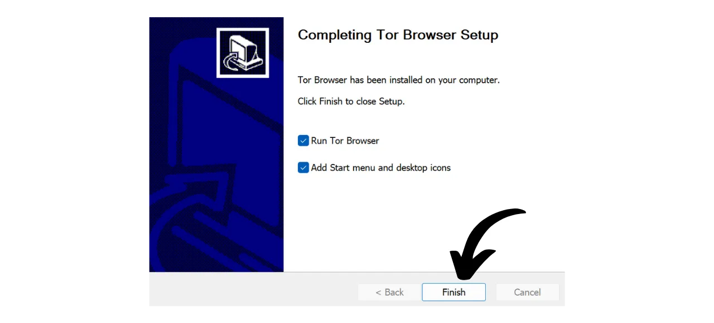
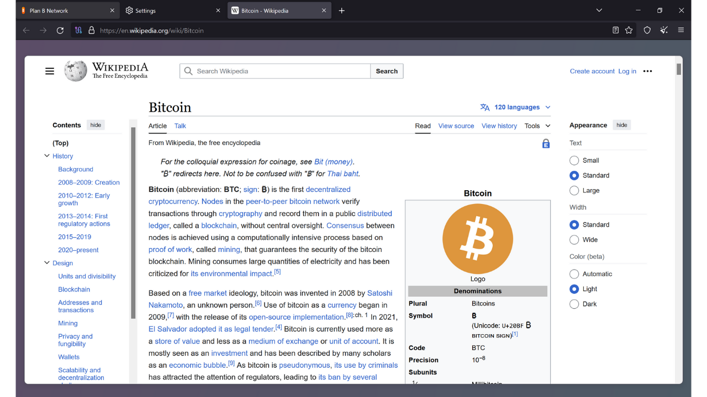
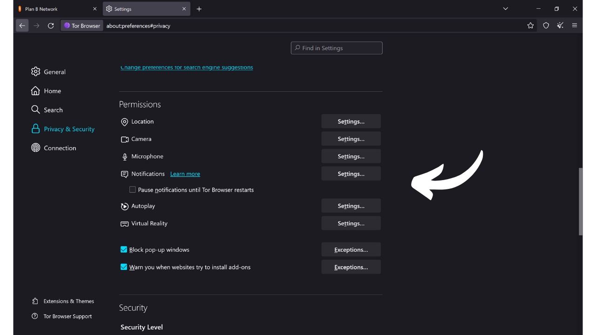

Wie der Name schon sagt, ist ein Browser eine Software, die zum Navigieren im Internet verwendet wird. Er dient als Tor zwischen der Maschine des Benutzers und dem Web und übersetzt den Code von Websites in interaktive und lesbare Seiten. Die Wahl Ihres Browsers ist sehr wichtig, da sie nicht nur Ihr Surf-Erlebnis beeinflusst, sondern auch Ihre Online-Sicherheit und Privatsphäre.

Achten Sie darauf, den Browser nicht mit der Suchmaschine zu verwechseln. Der Browser ist die Software, die Sie verwenden, um auf das Internet zuzugreifen (wie Chrome oder Firefox), während die Suchmaschine ein Dienst ist, wie zum Beispiel Google oder Bing, der Ihnen hilft, Informationen online zu finden.

Heute ist Google Chrome bei weitem der am meisten verwendete Browser. Er macht etwa 65% des globalen Marktes im Jahr 2024 aus. Chrome wird für seine Geschwindigkeit und Leistung geschätzt, ist aber nicht unbedingt die beste Wahl für jeden, besonders wenn Privatsphäre eine Priorität für Sie ist. Chrome gehört zu Google, einem Unternehmen, das dafür bekannt ist, riesige Mengen an Daten über seine Nutzer zu sammeln und zu analysieren. Und in der Tat ist ihr hauseigener Browser im Zentrum ihrer Überwachungsstrategie. Diese Software ist ein zentraler Bestandteil in der Mehrheit Ihrer Online-Interaktionen. Die Beherrschung der Datensammlung in Ihrem Browser ist ein wichtiges Thema für Google.

*Quelle: [gs.statcounter.com](https://gs.statcounter.com/browser-market-share)*

Es gibt mehrere große Familien von Browsern, die jeweils auf einem spezifischen Rendering-Engine basieren. Browser wie Google Chrome, Microsoft Edge, Brave, Opera oder Vivaldi basieren alle auf dem Chromium-Browser, einer leichten und Open-Source-Version von Chrome, die von Google entwickelt wurde. Alle diese Browser verwenden die Blink-Rendering-Engine, die ein Fork von WebKit ist, das wiederum von KHTML abgeleitet ist. Die Vorherrschaft von Chromium auf dem Markt macht Browser, die davon abgeleitet sind, besonders effizient, da Webentwickler ihre Seiten in erster Linie für Blink optimieren.

Safari, Apples Browser, verwendet WebKit, das ebenfalls von KHTML stammt.

Andererseits basieren Browser wie Mozilla Firefox, LibreWolf und Tor Browser auf Gecko, einer anderen Rendering-Engine, die ursprünglich vom Netscape-Browser stammt.

Die Wahl des richtigen Browsers hängt von Ihren Bedürfnissen ab. Aber wenn Sie sich zumindest um Ihre Privatsphäre und daher um Ihre Sicherheit sorgen, empfehle ich, für den allgemeinen Gebrauch Firefox und für noch mehr Privatsphäre den Tor Browser zu verwenden. In diesem Tutorial zeige ich Ihnen, wie Sie einfach mit dem Tor Browser beginnen können.

## Einführung in den Tor Browser

Der Tor Browser ist ein speziell für sicheres und so privat wie mögliches Internet-Surfen entwickelter Browser. Der Browser basiert auf Firefox und damit auf der Gecko-Rendering-Engine.
Der Tor Browser verwendet das Tor-Netzwerk, um Ihren Datenverkehr zu verschlüsseln und durch mehrere Relay-Server zu leiten, bevor er an das Ziel übertragen wird. Dieser Prozess des mehrschichtigen Routings, bekannt als "*Zwiebelrouting*", hilft, Ihre echte IP-Adresse zu verbergen, was es schwierig macht, Ihren Standort und Ihre Online-Aktivitäten zu identifizieren. Allerdings ist das Surfen notwendigerweise langsamer als mit einem Standardbrowser, der das Tor-Netzwerk nicht nutzt, da es indirekt ist.
Im Gegensatz zu anderen Browsern integriert der Tor Browser spezifische Funktionen, um das Tracking Ihrer Online-Aktivitäten zu verhindern, wie zum Beispiel das Isolieren jeder besuchten Website und das automatische Löschen von Cookies und Verlauf beim Schließen. Er ist auch so konzipiert, dass die Risiken des Fingerabdruckens minimiert werden, indem alle Benutzer den besuchten Seiten gegenüber so ähnlich wie möglich erscheinen.
Sie können den Tor-Browser sehr gut nutzen, um auf eine Standardwebsite (`.com`, `.org` usw.) zuzugreifen. In diesem Fall wird Ihr Traffic anonymisiert, indem er durch mehrere Tor-Knoten geleitet wird, bevor er einen Ausgangsknoten erreicht, der mit der endgültigen Seite im Clearnet kommuniziert.

Sie können den Tor-Browser auch verwenden, um auf versteckte Dienste (Adressen, die auf `.onion` enden) zuzugreifen. In diesem Szenario bleibt der gesamte Traffic innerhalb des Tor-Netzwerks, ohne einen Ausgangsknoten, was vollständige Privatsphäre sowohl für den Benutzer als auch für den Zielserver gewährleistet. Diese Betriebsart wird insbesondere genutzt, um auf das zuweilen so genannte "*Dark Web*" zuzugreifen, einen Teil des Internets, der nicht von traditionellen Suchmaschinen indiziert wird.

## Was ist der Unterschied zwischen dem Tor-Netzwerk und dem Tor-Browser?

Das Tor-Netzwerk und der Tor-Browser sind zwei unterschiedliche Dinge, die nicht verwechselt werden sollten, aber sie ergänzen sich. Das Tor-Netzwerk ist eine globale Infrastruktur von Relais-Servern, betrieben von Nutzern, die Internetverkehr anonymisiert, indem sie ihn durch mehrere Knoten leitet, bevor sie ihn zu seinem endgültigen Ziel dirigiert. Dies ist das berühmte Zwiebelrouting.

Der Tor-Browser hingegen ist ein spezifischer Browser, der darauf ausgelegt ist, den Zugang zu diesem Netzwerk auf einfache Weise zu ermöglichen. Er integriert standardmäßig alle notwendigen Einstellungen, um sich mit dem Tor-Netzwerk zu verbinden, und verwendet eine modifizierte Version von Firefox, um ein vertrautes Browsing-Erlebnis zu bieten, während Privatsphäre und Sicherheit maximiert werden.

Das Tor-Netzwerk wird nicht nur vom Tor-Browser genutzt. Es kann von verschiedenen Software und Anwendungen verwendet werden, um ihre Kommunikation zu sichern. Zum Beispiel ist es möglich, Kommunikationen über das Tor-Netzwerk auf Ihrem Bitcoin-Knoten zu aktivieren, um Ihre IP-Adresse vor anderen Nutzern zu verbergen und die Überwachung Ihres Bitcoin-bezogenen Traffics durch Ihren Internetdienstanbieter zu verhindern.
Zusammengefasst ist das Tor-Netzwerk die Infrastruktur, die Privatsphäre bei unserem Internet-Browsing bietet, und der Tor-Browser ist die Software, die es uns ermöglicht, dieses Netzwerk als Teil unseres Web-Browsings zu nutzen.

## Wie installiert man den Tor-Browser?

Der Tor-Browser ist verfügbar für Windows, Linux und macOS für Computer sowie für Android auf Smartphones. Um den Tor-Browser auf Ihrem Computer zu installieren, besuchen Sie [die offizielle Tor-Projekt-Website](https://www.torproject.org/).

Klicken Sie auf den Button "*Tor-Browser herunterladen*".

Wählen Sie die Version, die für Ihr Betriebssystem geeignet ist.

Klicken Sie auf die ausführbare Datei, um die Installation zu starten, und wählen Sie dann Ihre Sprache.

Wählen Sie den Ordner, in dem die Software installiert werden soll, und klicken Sie dann auf den Button "*Installieren*".

Warten Sie, bis die Installation abgeschlossen ist.

Klicken Sie schließlich auf den Button "*Fertigstellen*".

## Wie verwendet man den Tor-Browser?

Der Tor-Browser wird wie ein Standardbrowser verwendet.

Beim ersten Start präsentiert der Browser Ihnen eine Seite, die Sie einlädt, sich mit dem Tor-Netzwerk zu verbinden. Klicken Sie einfach auf den Button "*Verbinden*", um die Verbindung herzustellen.

Wenn Sie möchten, dass die Software bei Ihren zukünftigen Verwendungen automatisch eine Verbindung zum Tor-Netzwerk herstellt, aktivieren Sie die Option "*Immer automatisch verbinden*".

Sobald Sie mit dem Tor-Netzwerk verbunden sind, gelangen Sie auf die Startseite.
Um im Internet eine Suche durchzuführen, geben Sie einfach Ihre Anfrage in die Suchleiste ein und drücken Sie die "*Enter*" Taste.

Dann erhalten Sie die Ergebnisse von Ihrer Suchmaschine auf die gleiche Weise wie bei anderen Browsern.

Die Option "*Onionize*" bei DuckDuckGo ermöglicht es Ihnen, die Suchmaschine über ihren versteckten Dienst im Tor-Netzwerk zu nutzen, indem Sie auf ihre `.onion` Adresse zugreifen.

## Wie konfiguriert man den Tor-Browser?

Oben auf Ihrem Browserbildschirm finden Sie eine Option, um Ihre Favoriten zu importieren. Dies ermöglicht es Ihnen, die Lesezeichen aus Ihrem alten Browser automatisch in den Tor-Browser zu integrieren.

Sie haben auch die Möglichkeit, neue Lesezeichen hinzuzufügen, indem Sie auf das Sternsymbol klicken, das sich oben rechts auf der Webseite befindet, die Sie besuchen.

Im Menü auf der rechten Seite haben Sie Zugriff auf verschiedene Optionen.
Der Button "*Neue Identität*" ermöglicht es Ihnen, Ihre Tor-Identität zu ändern. Konkret ermöglicht dies den Start einer neuen Benutzersitzung auf Tor, was bedeutet, dass Ihre IP-Adresse geändert wird und Cookies sowie offene Sitzungen zurückgesetzt werden.

Das Menü "*Lesezeichen*" ermöglicht es Ihnen, Ihre Lesezeichen zu verwalten.

"*Verlauf*" gibt Ihnen Zugriff auf Ihren Browserverlauf, falls Sie diesen in den Einstellungen aktiviert haben.

Das Menü "*Add-ons und Themes*" ermöglicht es Ihnen, das Aussehen Ihres Browsers anzupassen oder Erweiterungen hinzuzufügen. Da der Tor-Browser auf Mozilla Firefox basiert, können Sie Themes und Erweiterungen verwenden, die für Firefox verfügbar sind.

Schließlich gibt Ihnen der Button "*Einstellungen*" Zugriff auf die Einstellungen Ihres Browsers.

Im Reiter "*Allgemein*" der Einstellungen gibt es verschiedene Optionen, die es Ihnen ermöglichen, die Benutzeroberfläche des Tor-Browsers anzupassen.

Im Reiter "*Startseite*" können Sie die Standardseite ändern, die beim Öffnen des Tor-Browsers und beim Öffnen neuer Tabs angezeigt wird.

Im Reiter "*Suche*" können Sie die Suchmaschine wählen. Standardmäßig verwendet der Tor-Browser DuckDuckGo, eine auf den Schutz der Privatsphäre der Nutzer ausgerichtete Suchmaschine, aber Sie können sich auch für Google oder Startpage entscheiden.

Sie können auch Abkürzungen in Ihrer Suchmaschine einrichten.

Zum Beispiel können Sie "*@wikipedia*" gefolgt von Ihrem Suchbegriff, wie "*Bitcoin*", in die Suchleiste des Browsers eingeben.

Diese Funktion führt dann eine Suche nach Ihrem Begriff direkt auf der Wikipedia-Seite durch.

So können Sie auch andere benutzerdefinierte Abkürzungen für verschiedene Seiten einrichten.

Weiterhin finden Sie im Reiter "*Datenschutz & Sicherheit*" alle Einstellungen, die sich auf Datenschutz und Sicherheit beziehen.

Sie haben die Möglichkeit, Ihren Browserverlauf zu behalten oder zu löschen.
 Sie können auch die Zugriffsberechtigungen verwalten, die Sie verschiedenen Websites erteilen.

Für die allgemeine Sicherheit Ihres Browsers ermöglichen die Modi "*Safer*" und "*Safest*" die Anpassung von Webfunktionalitäten und Skripten, die von den von Ihnen besuchten Seiten ausgeführt werden. Dies minimiert die Risiken der Ausnutzung von Schwachstellen, wird aber auch die Anzeige und Interaktivität der Seiten beeinträchtigen.  Sie finden weitere Sicherheitsoptionen, einschließlich eines Blockers für gefährliche Inhalte und des HTTPS-only-Modus, der sicherstellt, dass Verbindungen mit Websites konsequent dieses Protokoll respektieren.  Schließlich finden Sie im Tab "*Connection*" alle Einstellungen, die mit der Verbindung zum Tor-Netzwerk zusammenhängen. Hier können Sie eine Bridge konfigurieren, um Zugang zu Tor aus Regionen zu erhalten, in denen der Zugang möglicherweise zensiert wird.  Und damit sind Sie nun bereit, das Internet auf eine sicherere und privatere Weise zu navigieren! Wenn Online-Privatsphäre ein Thema ist, das Sie interessiert, empfehle ich auch, dieses weitere Tutorial über Mullvad VPN zu entdecken:

https://planb.network/tutorials/others/mullvad