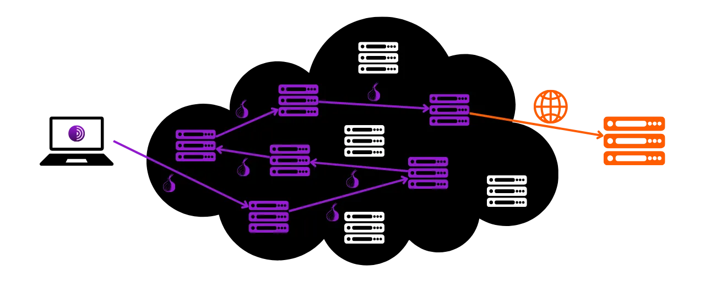

As its name suggests, a browser is a software used to navigate the Internet. It serves as a gateway between the user's machine and the web, translating the code of websites into interactive and readable pages. The choice of your browser is very important, as it not only influences your browsing experience but also your online security and privacy.

Be careful not to confuse the browser with the search engine. The browser is the software you use to access the Internet (like Chrome or Firefox), while the search engine is a service, such as Google or Bing, for example, that helps you find information online.

Today, Google Chrome is by far the most used browser. It accounts for about 65% of the global market in 2024. Chrome is appreciated for its speed and performance, but it's not necessarily the best choice for everyone, especially if privacy is a priority for you. Chrome belongs to Google, a company known for collecting and analyzing huge amounts of data on its users. And indeed, their in-house browser is at the heart of their surveillance strategy. This software is a central component in the majority of your online interactions. Mastering data collection on your browser is an important issue for Google.

*Source: [gs.statcounter.com](https://gs.statcounter.com/browser-market-share)*

There are several major families of browsers, each based on a specific rendering engine. Browsers like Google Chrome, Microsoft Edge, Brave, Opera, or Vivaldi are all established on the Chromium browser, a lightweight and open-source version of Chrome developed by Google. All these browsers use the Blink rendering engine, which is a fork of WebKit, itself derived from KHTML. The predominance of Chromium in the market makes browsers derived from it particularly efficient, as web developers tend to optimize their sites primarily for Blink.

Safari, Apple's browser, uses WebKit, which also comes from KHTML.

On the other hand, browsers like Mozilla Firefox, LibreWolf, and Tor Browser rely on Gecko, a different rendering engine, originally from the Netscape browser.

Choosing the right browser depends on your needs. But if you are at least concerned about your privacy, and therefore your security, I recommend going with Firefox for general use and Tor Browser for even more privacy. In this tutorial, I will show you how to easily get started with the Tor Browser.

## Introduction to Tor Browser

Tor Browser is a browser specifically designed for secure and as private as possible Internet navigation. The browser is based on Firefox, and therefore on the Gecko rendering engine.
Tor Browser uses the Tor network to encrypt and route your traffic through multiple relay servers before transmitting it to the destination. This process of multi-layered routing, known as "*onion routing*," helps to hide your real IP address, making it difficult to identify your location and online activities. However, browsing is necessarily slower than with a standard browser that does not use the Tor network, as it is indirect.
Unlike other browsers, Tor Browser integrates specific features to prevent tracking of your online activities, such as isolating each visited website and automatically deleting cookies and history upon closing. It is also designed to minimize the risks of fingerprinting, by making all users appear as similar as possible to the sites visited.

You can very well use Tor Browser to access a standard website (`.com`, `.org`, etc.). In this case, your traffic is anonymized by passing through several Tor nodes before reaching an exit node that communicates with the final site on the clearnet.

You can also use Tor Browser to access hidden services (addresses ending in `.onion`). In this scenario, all traffic remains within the Tor network, without an exit node, ensuring total privacy for both the user and the destination server. This mode of operation is notably used to access what is sometimes called the "*dark web*," a part of the Internet not indexed by traditional search engines.

## What is the difference between the Tor network and the Tor browser?

The Tor network and the Tor browser are two distinct things that should not be confused, but they are complementary. The Tor network is a global infrastructure of relay servers, operated by users, which anonymizes Internet traffic by passing it through several nodes before directing it to its final destination. This is the famous onion routing.

The Tor browser, on the other hand, is a specific browser designed to facilitate access to this network in a simple manner. It integrates by default all the necessary settings to connect to the Tor network and uses a modified version of Firefox to provide a familiar browsing experience while maximizing privacy and security.

The Tor network is not only used by the Tor browser. It can be utilized by various software and applications to secure their communications. For example, it is possible to enable communications via the Tor network on your Bitcoin node to hide your IP address from other users and prevent surveillance of your Bitcoin-related traffic by your internet service provider.
To summarize, the Tor network is the infrastructure that provides privacy in our internet browsing, and the Tor Browser is the software that allows us to use this network as part of our web browsing.

## How to install Tor Browser?

Tor Browser is available for Windows, Linux, and macOS for computers, as well as for Android on smartphones. To install Tor Browser on your computer, visit [the official Tor Project website](https://www.torproject.org/).

Click on the "*Download Tor Browser*" button.

Choose the version suitable for your operating system.

Click on the executable to start the installation, then choose your language.

Choose the folder where the software will be installed, then click on the "*Install*" button.

Wait for the installation to complete.

Finally, click on the "*Finish*" button.

## How to use Tor Browser?

Tor Browser is used like a standard browser.

At the first launch, the browser presents you with a page that invites you to connect to the Tor network. Simply click on the "*Connect*" button to establish the connection.

If you want the software to automatically connect to the Tor network during your future uses, check the "*Always connect automatically*" option.

Once connected to the Tor network, you will arrive at the homepage.

To perform a search on the Internet, simply enter your query in the search bar and press the "*enter*" key.

Then, you will get the results from your search engine in the same way as with other browsers.

The "*Onionize*" option on DuckDuckGo allows you to use the search engine via its hidden service on the Tor network, by accessing its `.onion` address.

## How to configure Tor Browser?

At the top of your browser screen, you will find an option to import your favorites. This allows you to automatically integrate the bookmarks from your old browser into Tor Browser.

You also have the option to add new bookmarks by clicking on the star icon located at the top right of the web page you are visiting.

In the menu on the right, you access various options.
The "*New identity*" button allows you to change your Tor identity. Specifically, this enables you to start a new user session on Tor, meaning changing your IP address and resetting cookies and open sessions.

The "*Bookmarks*" menu allows you to manage your bookmarks.

"*History*" gives you access to your browsing history if you have enabled it in the settings.

The "*Add-ons and themes*" menu allows you to customize the appearance of your browser or add extensions. Since Tor Browser is based on Mozilla Firefox, you can use themes and extensions available for Firefox.

Finally, the "*Settings*" button gives you access to your browser's settings.

In the "*General*" tab of the settings, there are various options that allow you to customize the Tor Browser user interface.

In the "*Home*" tab, you can choose to change the default page that is displayed when opening Tor Browser and when opening new tabs.

In the "*Search*" tab, you can choose the search engine. Tor Browser defaults to DuckDuckGo, a search engine focused on protecting users' privacy, but you can also opt for Google or Startpage, for example.

You can also set up shortcuts in your search engine.

For example, you can type "*@wikipedia*" followed by your search term, such as "*Bitcoin*", into the browser's search bar.

This feature then performs a search for your term directly on the Wikipedia site.

You can thus set up other custom shortcuts for different sites.

Next, in the "*Privacy & Security*" tab, you will find all the settings related to privacy and security.

You have the option to keep or delete your browsing history.

You can also manage the access permissions you grant to different websites.

For the overall security of your browser, the "*Safer*" and "*Safest*" modes allow you to adjust web functionalities and scripts executed by the sites you visit. This minimizes the risks of exploiting vulnerabilities, but it will also affect the display and interactivity of sites in return.  You will find other security options, including a dangerous content blocker and the HTTPS-only mode, which ensures that connections with sites consistently respect this protocol.  Finally, in the "*Connection*" tab, you will find all the settings related to connecting to the Tor network. This is where you can configure a bridge to access Tor from regions where its access might be censored.  And there you have it, you are now ready to navigate the Internet in a safer and more private manner! If online privacy is a topic that interests you, I also recommend discovering this other tutorial on Mullvad VPN:

https://planb.network/tutorials/others/mullvad