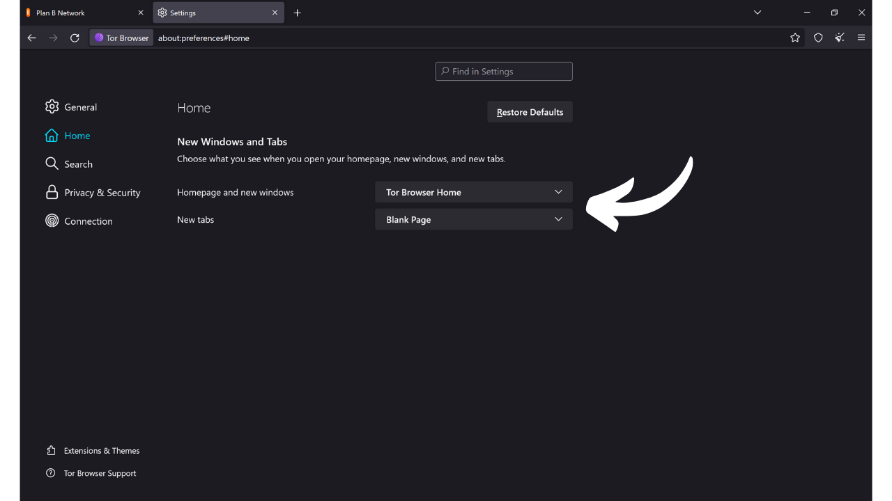

Como su nombre sugiere, un navegador es un software utilizado para navegar por Internet. Sirve como una puerta de enlace entre la máquina del usuario y la web, traduciendo el código de los sitios web en páginas interactivas y legibles. La elección de tu navegador es muy importante, ya que no solo influye en tu experiencia de navegación, sino también en tu seguridad y privacidad en línea.

Ten cuidado de no confundir el navegador con el motor de búsqueda. El navegador es el software que usas para acceder a Internet (como Chrome o Firefox), mientras que el motor de búsqueda es un servicio, como Google o Bing, por ejemplo, que te ayuda a encontrar información en línea.

Hoy en día, Google Chrome es, con diferencia, el navegador más utilizado. Representa alrededor del 65% del mercado global en 2024. Chrome es apreciado por su velocidad y rendimiento, pero no necesariamente es la mejor opción para todos, especialmente si la privacidad es una prioridad para ti. Chrome pertenece a Google, una compañía conocida por recopilar y analizar enormes cantidades de datos sobre sus usuarios. Y de hecho, su navegador propio está en el corazón de su estrategia de vigilancia. Este software es un componente central en la mayoría de tus interacciones en línea. Dominar la recopilación de datos en tu navegador es un tema importante para Google.

*Fuente: [gs.statcounter.com](https://gs.statcounter.com/browser-market-share)*

Hay varias familias principales de navegadores, cada una basada en un motor de renderizado específico. Navegadores como Google Chrome, Microsoft Edge, Brave, Opera o Vivaldi están todos establecidos en el navegador Chromium, una versión ligera y de código abierto de Chrome desarrollada por Google. Todos estos navegadores usan el motor de renderizado Blink, que es un fork de WebKit, derivado a su vez de KHTML. La predominancia de Chromium en el mercado hace que los navegadores derivados de él sean particularmente eficientes, ya que los desarrolladores web tienden a optimizar sus sitios principalmente para Blink.

Safari, el navegador de Apple, utiliza WebKit, que también proviene de KHTML.

Por otro lado, navegadores como Mozilla Firefox, LibreWolf y Tor Browser se basan en Gecko, un motor de renderizado diferente, originalmente del navegador Netscape.

Elegir el navegador adecuado depende de tus necesidades. Pero si te preocupa al menos tu privacidad, y por lo tanto tu seguridad, recomiendo optar por Firefox para uso general y Tor Browser para aún más privacidad. En este tutorial, te mostraré cómo empezar fácilmente con el Navegador Tor.

## Introducción al Navegador Tor

El Navegador Tor es un navegador específicamente diseñado para una navegación por Internet segura y lo más privada posible. El navegador se basa en Firefox, y por lo tanto en el motor de renderizado Gecko.
El Navegador Tor utiliza la red Tor para cifrar y enrutar tu tráfico a través de múltiples servidores de relevo antes de transmitirlo al destino. Este proceso de enrutamiento multicapa, conocido como "*enrutamiento de cebolla*", ayuda a ocultar tu verdadera dirección IP, dificultando la identificación de tu ubicación y actividades en línea. Sin embargo, la navegación es necesariamente más lenta que con un navegador estándar que no utiliza la red Tor, ya que es indirecta.
A diferencia de otros navegadores, el Navegador Tor integra características específicas para prevenir el seguimiento de tus actividades en línea, como aislar cada sitio web visitado y eliminar automáticamente cookies e historial al cerrar. También está diseñado para minimizar los riesgos de fingerprinting, haciendo que todos los usuarios parezcan lo más similares posible a los sitios visitados.
Puedes usar perfectamente el Navegador Tor para acceder a un sitio web estándar (`.com`, `.org`, etc.). En este caso, tu tráfico se anonimiza al pasar por varios nodos de Tor antes de llegar a un nodo de salida que se comunica con el sitio final en la red abierta. 
También puedes usar el Navegador Tor para acceder a servicios ocultos (direcciones que terminan en `.onion`). En este escenario, todo el tráfico permanece dentro de la red Tor, sin un nodo de salida, asegurando total privacidad tanto para el usuario como para el servidor de destino. Este modo de operación se utiliza notablemente para acceder a lo que a veces se llama la "*web oscura*", una parte de Internet no indexada por los motores de búsqueda tradicionales.

## ¿Cuál es la diferencia entre la red Tor y el navegador Tor?

La red Tor y el navegador Tor son dos cosas distintas que no deben confundirse, pero son complementarias. La red Tor es una infraestructura global de servidores de relevo, operada por usuarios, que anonimiza el tráfico de Internet al pasarlo a través de varios nodos antes de dirigirlo a su destino final. Este es el famoso enrutamiento de cebolla.

El navegador Tor, por otro lado, es un navegador específico diseñado para facilitar el acceso a esta red de manera simple. Integra por defecto todas las configuraciones necesarias para conectarse a la red Tor y utiliza una versión modificada de Firefox para proporcionar una experiencia de navegación familiar mientras maximiza la privacidad y la seguridad.

La red Tor no solo es utilizada por el navegador Tor. Puede ser utilizada por varios software y aplicaciones para asegurar sus comunicaciones. Por ejemplo, es posible habilitar comunicaciones a través de la red Tor en tu nodo de Bitcoin para ocultar tu dirección IP de otros usuarios y prevenir la vigilancia de tu tráfico relacionado con Bitcoin por parte de tu proveedor de servicios de internet.
Para resumir, la red Tor es la infraestructura que proporciona privacidad en nuestra navegación por internet, y el Navegador Tor es el software que nos permite usar esta red como parte de nuestra navegación web.

## ¿Cómo instalar el Navegador Tor?

El Navegador Tor está disponible para Windows, Linux y macOS para computadoras, así como para Android en smartphones. Para instalar el Navegador Tor en tu computadora, visita [el sitio web oficial del Proyecto Tor](https://www.torproject.org/).

Haz clic en el botón "*Descargar el Navegador Tor*".

Elige la versión adecuada para tu sistema operativo.

Haz clic en el ejecutable para iniciar la instalación, luego elige tu idioma.

Elige la carpeta donde se instalará el software, luego haz clic en el botón "*Instalar*".

Espera a que se complete la instalación.

Finalmente, haz clic en el botón "*Finalizar*".

## ¿Cómo usar el Navegador Tor?

El Navegador Tor se usa como un navegador estándar.

En el primer lanzamiento, el navegador te presenta una página que te invita a conectarte a la red Tor. Simplemente haz clic en el botón "*Conectar*" para establecer la conexión.

Si quieres que el software se conecte automáticamente a la red Tor durante tus futuros usos, marca la opción "*Conectar siempre automáticamente*".

Una vez conectado a la red Tor, llegarás a la página de inicio.
Para realizar una búsqueda en Internet, simplemente ingresa tu consulta en la barra de búsqueda y presiona la tecla "*enter*".

Luego, obtendrás los resultados de tu motor de búsqueda de la misma manera que con otros navegadores.

La opción "*Onionize*" en DuckDuckGo te permite usar el motor de búsqueda a través de su servicio oculto en la red Tor, accediendo a su dirección `.onion`.

## ¿Cómo configurar Tor Browser?

En la parte superior de la pantalla de tu navegador, encontrarás una opción para importar tus favoritos. Esto te permite integrar automáticamente los marcadores de tu navegador antiguo en Tor Browser.

También tienes la opción de añadir nuevos marcadores haciendo clic en el icono de estrella ubicado en la parte superior derecha de la página web que estás visitando.

En el menú de la derecha, accedes a varias opciones.
El botón "*Nueva identidad*" te permite cambiar tu identidad en Tor. Específicamente, esto te permite iniciar una nueva sesión de usuario en Tor, lo que significa cambiar tu dirección IP y restablecer cookies y sesiones abiertas.

El menú "*Marcadores*" te permite gestionar tus marcadores.

"*Historial*" te da acceso a tu historial de navegación si lo has habilitado en la configuración.

El menú "*Complementos y temas*" te permite personalizar la apariencia de tu navegador o añadir extensiones. Dado que Tor Browser se basa en Mozilla Firefox, puedes usar temas y extensiones disponibles para Firefox.

Finalmente, el botón "*Configuración*" te da acceso a la configuración de tu navegador.

En la pestaña "*General*" de la configuración, hay varias opciones que te permiten personalizar la interfaz de usuario de Tor Browser.

En la pestaña "*Inicio*", puedes elegir cambiar la página predeterminada que se muestra al abrir Tor Browser y al abrir nuevas pestañas.

En la pestaña "*Búsqueda*", puedes elegir el motor de búsqueda. Tor Browser utiliza por defecto DuckDuckGo, un motor de búsqueda enfocado en proteger la privacidad de los usuarios, pero también puedes optar por Google o Startpage, por ejemplo.

También puedes configurar accesos directos en tu motor de búsqueda.

Por ejemplo, puedes escribir "*@wikipedia*" seguido de tu término de búsqueda, como "*Bitcoin*", en la barra de búsqueda del navegador.

Esta función luego realiza una búsqueda de tu término directamente en el sitio de Wikipedia.

Así, puedes configurar otros accesos directos personalizados para diferentes sitios.

A continuación, en la pestaña "*Privacidad y seguridad*", encontrarás todas las configuraciones relacionadas con la privacidad y la seguridad.

Tienes la opción de mantener o eliminar tu historial de navegación.
 También puedes gestionar los permisos de acceso que otorgas a diferentes sitios web.

Para la seguridad general de tu navegador, los modos "*Safer*" y "*Safest*" te permiten ajustar las funcionalidades web y los scripts ejecutados por los sitios que visitas. Esto minimiza los riesgos de explotación de vulnerabilidades, pero también afectará la visualización e interactividad de los sitios en retorno.  Encontrarás otras opciones de seguridad, incluyendo un bloqueador de contenido peligroso y el modo solo HTTPS, que asegura que las conexiones con los sitios respeten consistentemente este protocolo.  Finalmente, en la pestaña de "*Connection*", encontrarás todos los ajustes relacionados con la conexión a la red Tor. Aquí es donde puedes configurar un puente para acceder a Tor desde regiones donde su acceso podría estar censurado.  ¡Y eso es todo, ahora estás listo para navegar por Internet de una manera más segura y privada! Si el tema de la privacidad en línea te interesa, también te recomiendo descubrir este otro tutorial sobre Mullvad VPN:

https://planb.network/tutorials/others/mullvad