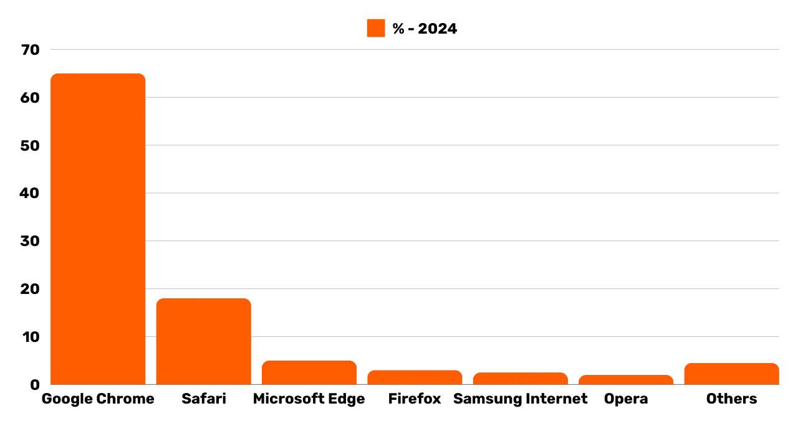
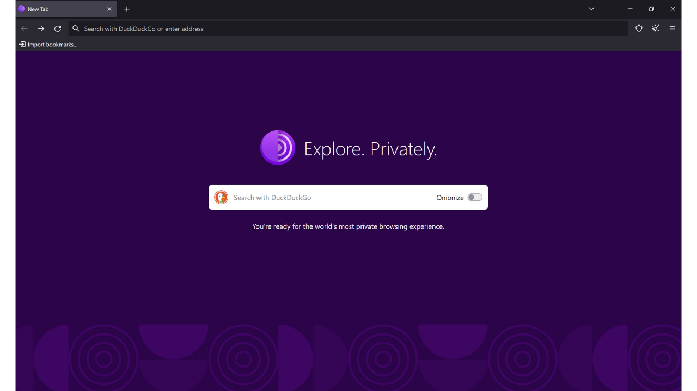
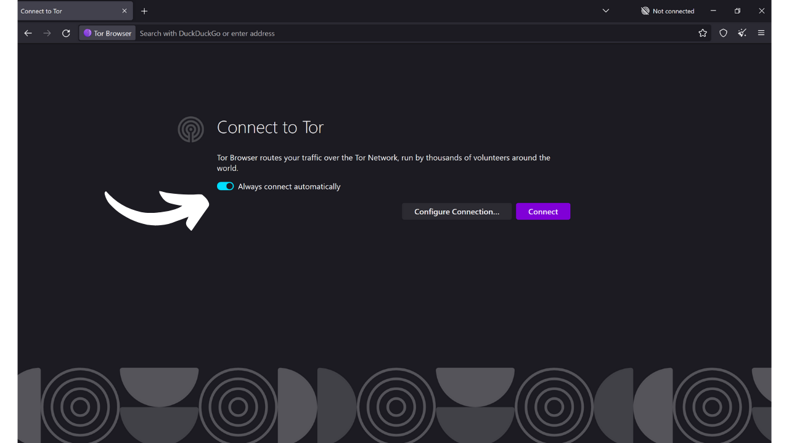
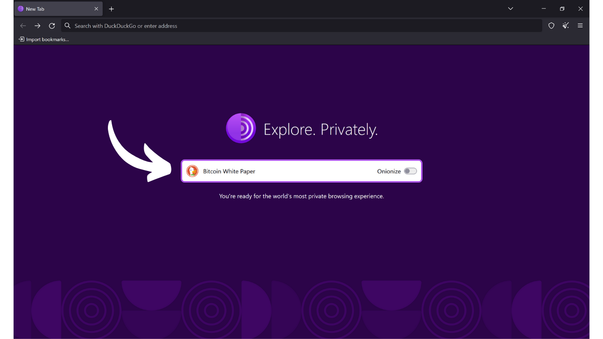
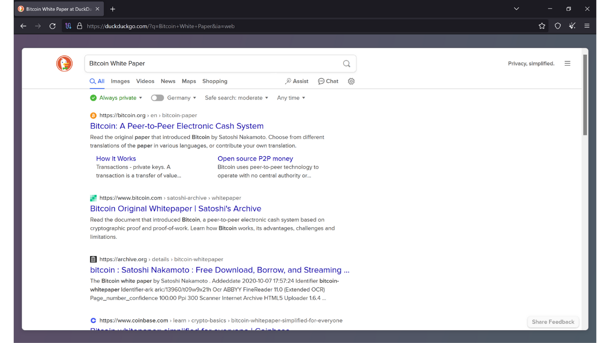
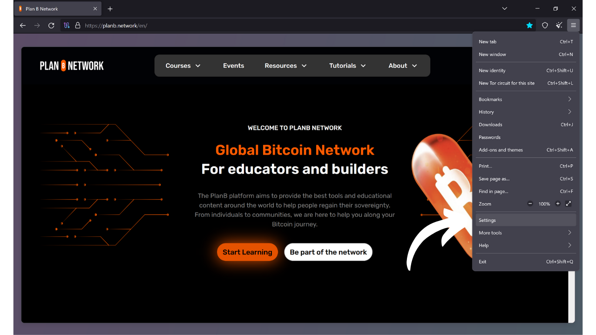
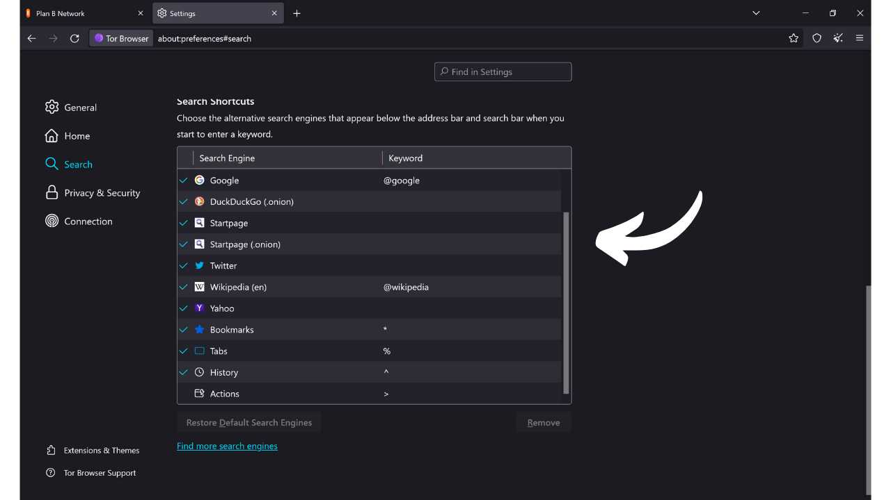

Kuten nimestä voi päätellä, selain on ohjelmisto, jota käytetään Internetissä navigointiin. Se toimii porttina käyttäjän koneen ja verkon välillä, muuntaen verkkosivujen koodin vuorovaikutteisiksi ja luettaviksi sivuiksi. Selaimen valinta on erittäin tärkeää, sillä se vaikuttaa paitsi selauskokemukseesi myös online-turvallisuuteesi ja yksityisyyteesi.

Ole varovainen, ettei selainta sekoita hakukoneeseen. Selain on ohjelmisto, jota käytät Internetiin pääsemiseksi (kuten Chrome tai Firefox), kun taas hakukone on palvelu, kuten Google tai Bing, esimerkiksi, joka auttaa sinua löytämään tietoa verkosta.

Nykyään Google Chrome on selvästi käytetyin selain. Se kattaa noin 65% globaalista markkinasta vuonna 2024. Chromea arvostetaan sen nopeuden ja suorituskyvyn vuoksi, mutta se ei välttämättä ole paras valinta kaikille, erityisesti jos yksityisyys on sinulle tärkeää. Chrome kuuluu Googlelle, yhtiölle, joka on tunnettu valtavien käyttäjätietomäärien keräämisestä ja analysoinnista. Ja todellakin, heidän oma selaimensa on keskeinen osa heidän valvontastrategiaansa. Tämä ohjelmisto on keskeinen osa useimpia online-vuorovaikutuksiasi. Tietojen keräämisen hallinta selaimellasi on Googlelle tärkeä kysymys.

*Lähde: [gs.statcounter.com](https://gs.statcounter.com/browser-market-share)*

On olemassa useita merkittäviä selainperheitä, jotka perustuvat tiettyyn renderöintimoottoriin. Selaimet kuten Google Chrome, Microsoft Edge, Brave, Opera tai Vivaldi perustuvat kaikki Chromium-selaimeen, kevyt ja avoimen lähdekoodin versio Chromesta, jonka Google on kehittänyt. Kaikki nämä selaimet käyttävät Blink-renderöintimoottoria, joka on WebKitin haara, joka puolestaan on peräisin KHTML:stä. Chromiumin hallitseva asema markkinoilla tekee siitä johdetuista selaimista erityisen tehokkaita, sillä web-kehittäjät pyrkivät optimoimaan sivustonsa ensisijaisesti Blinkille.

Safari, Applen selain, käyttää WebKitiä, joka on myös peräisin KHTML:stä.

Toisaalta selaimet kuten Mozilla Firefox, LibreWolf ja Tor Browser nojaavat Gecko-nimiseen eri renderöintimoottoriin, joka on alun perin peräisin Netscape-selaimesta.

Oikean selaimen valinta riippuu tarpeistasi. Mutta jos olet edes hieman huolissasi yksityisyydestäsi, ja siten turvallisuudestasi, suosittelen käyttämään Firefoxia yleiskäyttöön ja Tor-selainta vielä suuremman yksityisyyden saavuttamiseksi. Tässä oppaassa näytän, kuinka pääset helposti alkuun Tor-selaimen kanssa.

## Tor-selaimen esittely

Tor-selain on erityisesti turvalliseen ja mahdollisimman yksityiseen Internet-selaamiseen suunniteltu selain. Selain perustuu Firefoxiin, ja siten Gecko-renderöintimoottoriin.
Tor-selain käyttää Tor-verkkoa salatakseen ja reitittääkseen liikenteesi useiden välityspalvelimien kautta ennen sen lähettämistä määränpäähän. Tämä monikerroksinen reititysprosessi, jota kutsutaan "*sipulireititykseksi*", auttaa piilottamaan todellisen IP-osoitteesi, mikä tekee sijaintisi ja online-toimintasi tunnistamisen vaikeaksi. Kuitenkin selailu on välttämättä hitaampaa kuin standardiselaimella, joka ei käytä Tor-verkkoa, koska se on epäsuoraa.
Toisin kuin muut selaimet, Tor-selain sisältää erityisiä ominaisuuksia online-toimintasi seurannan estämiseksi, kuten eristämällä jokainen vierailtu verkkosivusto ja automaattisesti poistamalla evästeet ja historian sulkemisen yhteydessä. Se on myös suunniteltu minimoimaan sormenjälkien muodostumisen riskit, tekemällä kaikista käyttäjistä mahdollisimman samankaltaisia vierailtuja sivustoja kohtaan.
Voit hyvin käyttää Tor-selainta päästäksesi käsiksi tavallisiin verkkosivustoihin (`.com`, `.org` jne.). Tässä tapauksessa liikenteesi anonymisoidaan kuljettamalla se useiden Tor-solmujen läpi ennen kuin se saavuttaa ulostulonoden, joka kommunikoi lopullisen sivuston kanssa avoimessa verkossa (clearnet). 
Voit myös käyttää Tor-selainta päästäksesi käsiksi piilotettuihin palveluihin (osoitteet päättyvät `.onion`). Tässä skenaariossa kaikki liikenne pysyy Tor-verkossa ilman ulostulonodea, varmistaen täydellisen yksityisyyden sekä käyttäjälle että kohdepalvelimelle. Tätä toimintatapaa käytetään erityisesti pääsemiseksi siihen, mitä joskus kutsutaan "*dark webiksi*", Internetin osaksi, jota perinteiset hakukoneet eivät indeksoi. 

## Mikä on ero Tor-verkon ja Tor-selaimen välillä?

Tor-verkko ja Tor-selain ovat kaksi erillistä asiaa, joita ei tulisi sekoittaa, mutta ne täydentävät toisiaan. Tor-verkko on maailmanlaajuinen reititinsolmujen infrastruktuuri, jota käyttäjät operoivat, ja se anonymisoi Internet-liikenteen kuljettamalla sen useiden solmujen läpi ennen sen ohjaamista lopulliseen määränpäähänsä. Tämä on kuuluisa sipulireititys.

Tor-selain puolestaan on erityinen selain, joka on suunniteltu helpottamaan pääsyä tähän verkkoon yksinkertaisella tavalla. Se sisältää oletusarvoisesti kaikki tarvittavat asetukset Tor-verkkoon yhdistämiseksi ja käyttää muokattua versiota Firefoxista tarjotakseen tutun selailukokemuksen samalla kun se maksimoi yksityisyyden ja turvallisuuden.

Tor-verkkoa ei käytä ainoastaan Tor-selain. Sitä voidaan hyödyntää erilaisissa ohjelmistoissa ja sovelluksissa viestintänsä turvaamiseen. Esimerkiksi on mahdollista ottaa käyttöön viestintä Tor-verkon kautta Bitcoin-nodessasi piilottaaksesi IP-osoitteesi muilta käyttäjiltä ja estääksesi Bitcoin-liikenteeseesi liittyvän valvonnan Internet-palveluntarjoajasi toimesta.
Yhteenvetona, Tor-verkko on infrastruktuuri, joka tarjoaa yksityisyyttä internet-selailuumme, ja Tor-selain on ohjelmisto, joka mahdollistaa tämän verkon käytön osana web-selailuamme.

## Kuinka asentaa Tor-selain?

Tor-selain on saatavilla Windowsille, Linuxille ja macOS:lle tietokoneille sekä Androidille älypuhelimille. Asentaaksesi Tor-selaimen tietokoneellesi, vieraile [virallisella Tor Project -verkkosivustolla](https://www.torproject.org/). 
Napsauta "*Lataa Tor-selain*" -painiketta. 
Valitse käyttöjärjestelmällesi sopiva versio. 
Napsauta suoritettavaa tiedostoa aloittaaksesi asennuksen, sitten valitse kieli. 
Valitse kansio, johon ohjelmisto asennetaan, ja napsauta sitten "*Asenna*" -painiketta. 
Odota asennuksen valmistumista. 
Lopuksi napsauta "*Valmis*" -painiketta. 

## Kuinka käyttää Tor-selainta?

Tor-selainta käytetään kuten tavallista selainta. 
Ensimmäisellä käynnistyskerralla selain esittelee sinulle sivun, joka kutsuu sinut yhdistämään Tor-verkkoon. Napsauta yksinkertaisesti "*Yhdistä*" -painiketta muodostaaksesi yhteyden. 
Jos haluat ohjelmiston automaattisesti yhdistävän Tor-verkkoon tulevissa käyttökerroissasi, valitse "*Yhdistä aina automaattisesti*" -vaihtoehto. 
Kun olet yhdistänyt Tor-verkkoon, saavut kotisivulle.
Internetissä haun suorittaminen on yksinkertaista: kirjoita hakukyselysi hakupalkkiin ja paina "*enter*" -näppäintä.

Tämän jälkeen saat hakutulokset hakukoneeltasi samalla tavalla kuin muillakin selaimilla.

DuckDuckGo:n "*Onionize*" -vaihtoehto mahdollistaa hakukoneen käytön sen piilotetun palvelun kautta Tor-verkossa, käyttämällä sen `.onion` -osoitetta.

## Kuinka määrittää Tor-selain?

Selaimen yläosassa on vaihtoehto tuoda suosikkisi. Tämä mahdollistaa kirjanmerkkien automaattisen integroinnin vanhasta selaimestasi Tor-selaimeen.

Voit myös lisätä uusia kirjanmerkkejä napsauttamalla tähtikuvaketta, joka sijaitsee vierailemasi verkkosivun oikeassa yläkulmassa.

Oikeanpuoleisesta valikosta pääset käsiksi eri vaihtoehtoihin.
"*Uusi identiteetti*" -painike mahdollistaa Tor-identiteettisi vaihtamisen. Käytännössä tämä mahdollistaa uuden käyttäjäistunnon aloittamisen Torissa, mikä tarkoittaa IP-osoitteen vaihtamista ja evästeiden sekä avointen istuntojen nollaamista.

"*Kirjanmerkit*" -valikko mahdollistaa kirjanmerkkiesi hallinnan.

"*Historia*" antaa pääsyn selaushistoriaasi, jos olet ottanut sen käyttöön asetuksissa.

"*Lisäosat ja teemat*" -valikko mahdollistaa selaimen ulkonäön mukauttamisen tai laajennusten lisäämisen. Koska Tor-selain perustuu Mozilla Firefoxiin, voit käyttää Firefoxille saatavilla olevia teemoja ja laajennuksia.

Lopuksi, "*Asetukset*" -painike antaa pääsyn selaimen asetuksiin.

Asetusten "*Yleiset*" -välilehdessä on erilaisia vaihtoehtoja, jotka mahdollistavat Tor-selaimen käyttöliittymän mukauttamisen.

"*Koti*" -välilehdessä voit valita oletussivun, joka näytetään Tor-selainta avattaessa ja uusia välilehtiä avattaessa.

"*Haku*" -välilehdessä voit valita hakukoneen. Tor-selaimen oletusarvo on DuckDuckGo, hakukone, joka keskittyy käyttäjien yksityisyyden suojaamiseen, mutta voit myös valita esimerkiksi Googlen tai Startpagen.

Voit myös asettaa pikakuvakkeita hakukoneeseesi.

Esimerkiksi voit kirjoittaa selaimen hakupalkkiin "*@wikipedia*" seurattuna hakuterminäsi, kuten "*Bitcoin*".

Tämä toiminto suorittaa haun termilläsi suoraan Wikipedian sivustolla.

Voit näin ollen asettaa muita mukautettuja pikakuvakkeita eri sivustoille.

Seuraavaksi, "*Yksityisyys & Turvallisuus*" -välilehdellä, löydät kaikki yksityisyyteen ja turvallisuuteen liittyvät asetukset.

Sinulla on vaihtoehto säilyttää tai poistaa selaushistoriasi.
 Voit myös hallita eri verkkosivustoille myöntämiäsi käyttöoikeuksia.

Selaimen kokonaisturvallisuuden kannalta "*Turvallisempi*" ja "*Turvallisin*" tilat mahdollistavat verkkotoimintojen ja sivustojen suorittamien skriptien säätämisen. Tämä minimoi haavoittuvuuksien hyväksikäytön riskit, mutta vaikuttaa myös sivustojen näyttämiseen ja vuorovaikutteisuuteen.  Löydät muita turvallisuusasetuksia, mukaan lukien vaarallisen sisällön estäjän ja vain HTTPS -tilan, joka varmistaa, että yhteydet sivustoihin noudattavat johdonmukaisesti tätä protokollaa.  Lopuksi "*Yhteys*" -välilehdessä löydät kaikki asetukset, jotka liittyvät Tor-verkkoon yhdistämiseen. Täältä voit määrittää sillan päästäksesi Toriin alueilta, joissa sen käyttö saattaa olla sensuroitu.  Ja siinä se on, olet nyt valmis selaamaan Internetiä turvallisemmin ja yksityisemmin! Jos online-yksityisyys on aihe, joka kiinnostaa sinua, suosittelen myös tutustumaan tähän toiseen opastukseen Mullvad VPN:stä:

https://planb.network/tutorials/others/mullvad