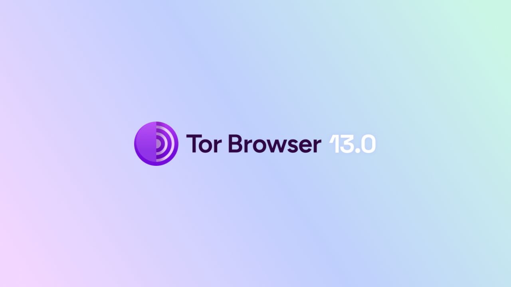
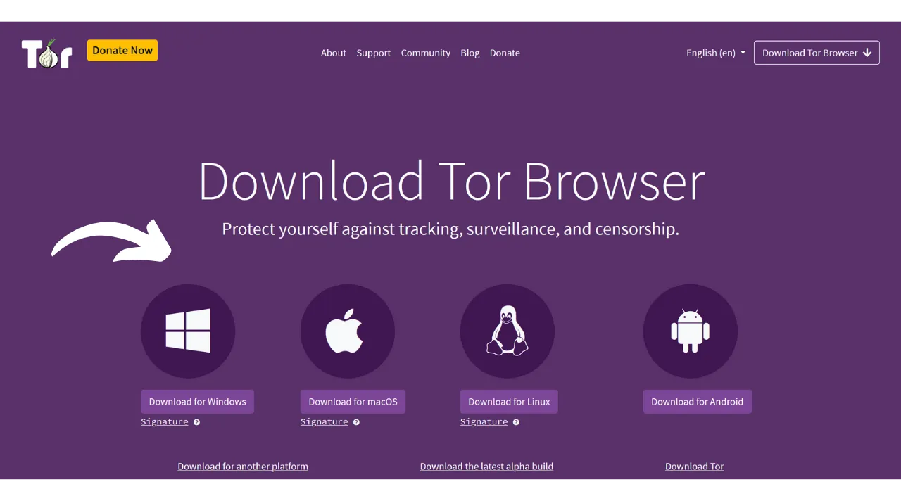
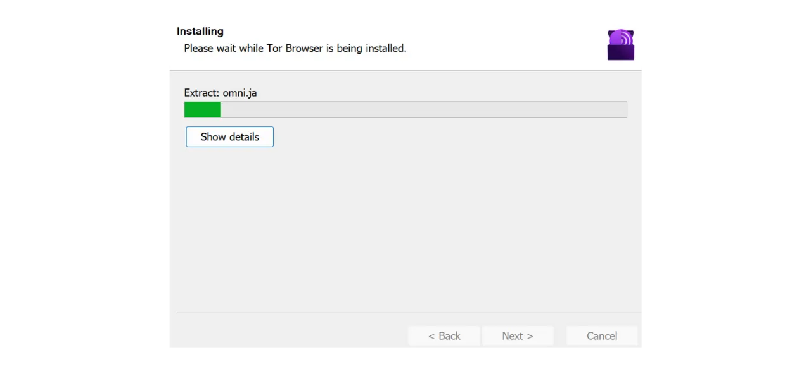
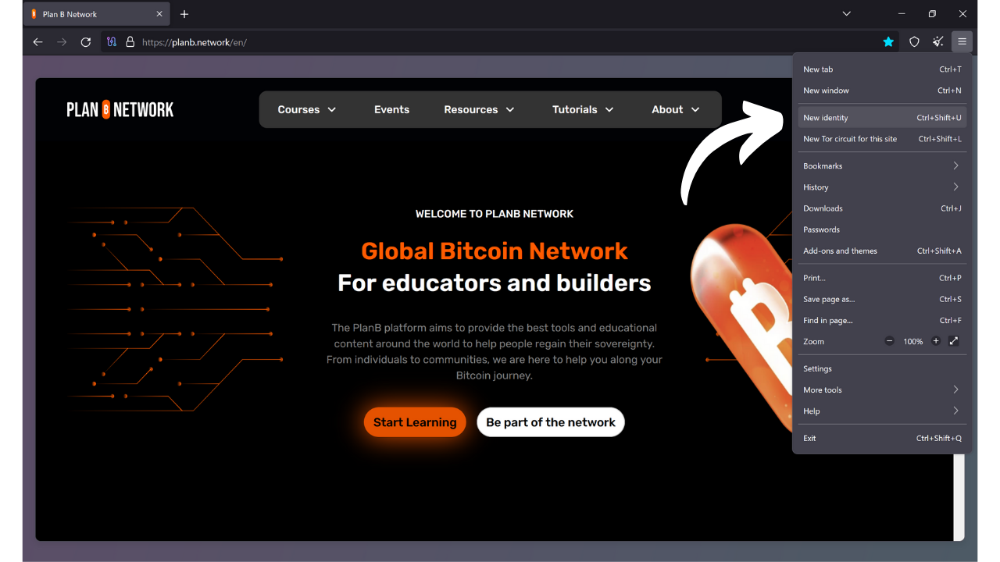
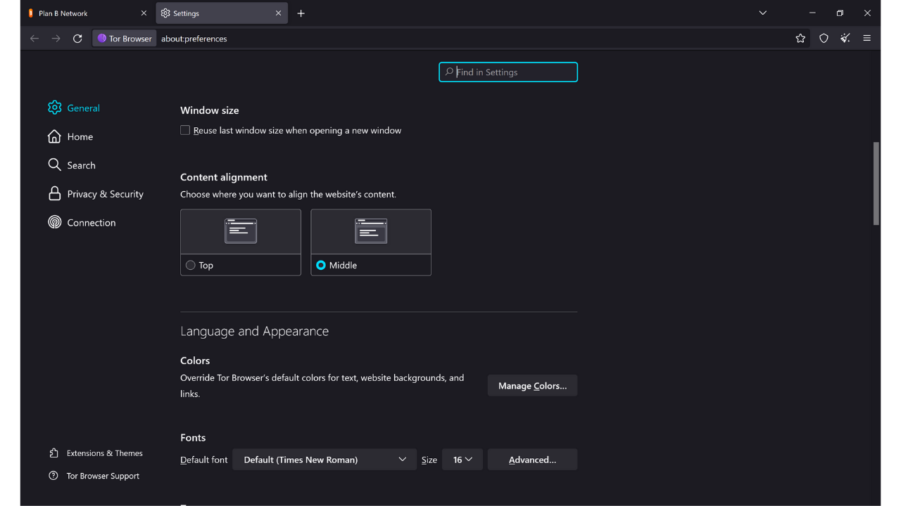
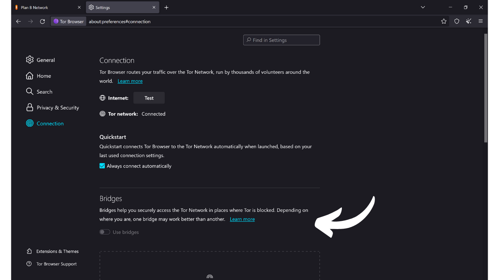

Comme son nom l'indique, un navigateur est un logiciel utilisé pour naviguer sur Internet. Il sert de passerelle entre la machine de l'utilisateur et le web, en traduisant le code des sites internet en pages interactives et lisibles. Le choix de votre navigateur est très important, car il influence non seulement votre expérience de navigation, mais aussi votre sécurité et votre confidentialité en ligne.

Attention, il ne faut pas confondre le navigateur avec le moteur de recherche. Le navigateur est le logiciel que vous utilisez pour accéder à Internet (comme Chrome ou Firefox), tandis que le moteur de recherche est un service, comme Google ou Bing, par exemple, qui vous aide à trouver des informations en ligne.

Aujourd'hui, Google Chrome est de loin le navigateur le plus utilisé. Il représente environ 65 % du marché mondial en 2024. Chrome est apprécié pour sa rapidité et ses performances, mais ce n'est pas nécessairement le meilleur choix pour tout le monde, surtout si la confidentialité est une priorité pour vous. Chrome appartient à Google, une entreprise connue pour collecter et analyser d'énormes quantités de données sur ses utilisateurs. Et justement, leur navigateur maison est au cœur de leur stratégie de surveillance. Ce logiciel est une composante centrale dans la majorité de vos interactions en ligne. Maîtriser la collecte de données sur votre navigateur est un enjeu important pour Google.

*Source : [gs.statcounter.com](https://gs.statcounter.com/browser-market-share)*

Il existe plusieurs grandes familles de navigateurs, chacune basée sur un moteur de rendu spécifique. Les navigateurs Google Chrome, Microsoft Edge, Brave, Opera ou encore Vivaldi sont tous établis sur le navigateur Chromium, une version allégée et open-source de Chrome développée par Google. Tous ces navigateurs utilisent le moteur de rendu Blink, qui est un fork de WebKit, lui-même issu de KHTML. La prédominance de Chromium sur le marché rend les navigateurs qui en découlent particulièrement performants, car les développeurs web tendent à optimiser leurs sites en priorité pour Blink.

Safari, le navigateur d'Apple, utilise WebKit, qui provient donc également de KHTML.

D'autre part, les navigateurs comme Mozilla Firefox, LibreWolf et Tor Browser s'appuient sur Gecko, un moteur de rendu différent, qui provient à l'origine du navigateur Netscape.

Choisir le bon navigateur dépend de vos besoins. Mais si vous êtes un minimum soucieux de votre vie privée, et donc de votre sécurité, je vous conseille de partir sur Firefox pour un usage généraliste et Tor Browser pour encore plus de confidentialité. Dans ce tutoriel, je vous présente comment prendre en main facilement le navigateur Tor.

## Présentation de Tor Browser

Tor Browser est un navigateur spécifiquement conçu pour avoir une navigation Internet sécurisée et la plus confidentielle possible. Le navigateur est basé sur Firefox, et donc sur le moteur de rendu Gecko.

Tor Browser utilise le réseau Tor pour chiffrer et acheminer votre trafic à travers plusieurs serveurs relais avant de le transmettre à la destination. Ce processus de routage en couches multiples, que l'on appelle "*routage en oignon*", permet de masquer votre adresse IP réelle, et rend ainsi difficile l'identification de votre localisation et de vos activités en ligne. En revanche, la navigation est forcément plus lente qu'avec un navigateur classique qui n'utilise pas le réseau Tor, car elle est indirecte.

Contrairement à d'autres navigateurs, Tor Browser intègre des fonctionnalités spécifiques pour éviter le traçage de vos activités en ligne, comme par exemple l'isolation de chaque site web visité et l'effacement automatique des cookies et de l'historique à la fermeture. Il est également conçu pour minimiser les risques de fingerprinting, en rendant tous les utilisateurs aussi similaires que possible aux yeux des sites visités.

Vous pouvez très bien utiliser Tor Browser pour accéder à un site web classique (`.com`, `.org`, etc.). Dans ce cas, votre trafic est anonymisé en passant par plusieurs nœuds Tor avant d'atteindre un nœud de sortie qui communique avec le site final sur le clearnet.

Vous pouvez également utiliser Tor Browser pour accéder à des services cachés (adresses terminant en `.onion`). Dans ce cas, tout le trafic reste au sein du réseau Tor, sans nœud de sortie, ce qui garantit une confidentialité totale à la fois pour l'utilisateur et pour le serveur de destination. Ce mode de fonctionnement est notamment exploité pour accéder à ce que l'on appelle parfois le "*dark web*", une partie d'Internet non indexée par les moteurs de recherche traditionnels.

## Quelle est la différence entre le réseau Tor et le navigateur Tor ?

Le réseau Tor et le navigateur Tor sont 2 choses distinctes qu'il ne faut pas confondre, mais elles sont complémentaires. Le réseau Tor est une infrastructure mondiale de serveurs relais, opérés par des utilisateurs, qui permet de rendre anonyme le trafic Internet en le faisant passer par plusieurs nœuds avant de le diriger vers sa destination finale. C'est le fameux routage en oignon.

Le navigateur Tor, quant à lui, est un navigateur spécifique conçu pour faciliter l'accès à ce réseau de manière simple. Il intègre par défaut tous les paramètres nécessaires pour se connecter au réseau Tor et utilise une version modifiée de Firefox pour avoir une expérience de navigation familière tout en maximisant la confidentialité et la sécurité.

Le réseau Tor n'est pas seulement utilisé par le navigateur Tor. Il peut être utilisé par divers logiciels et applications pour sécuriser leurs communications. Par exemple, il est possible d'activer les communications via le réseau Tor sur votre nœud Bitcoin afin de cacher votre adresse IP aux autres utilisateurs et empêcher la surveillance de votre trafic lié à Bitcoin par votre fournisseur d'accès à internet.

Pour résumer, le réseau Tor est l'infrastructure qui fournit la confidentialité dans notre navigation sur Internet, et le navigateur Tor est le logiciel qui nous permet d'utiliser ce réseau dans le cadre de notre navigation web.

## Comment installer Tor Browser ?

Tor Browser est disponible sous Windows, Linux, et macOS pour les ordinateurs, ainsi que pour Android sur les smartphones. Pour installer Tor Browser sur votre ordinateur, rendez-vous sur [le site officiel du projet Tor](https://www.torproject.org/).

Cliquez sur le bouton "*Download Tor Browser*".

Choisissez la version adaptée à votre système d'exploitation.

Cliquez sur l'exécutable pour lancer l'installation, puis choisissez votre langue.

Choisissez le dossier où sera installé le logiciel, puis cliquez sur le bouton "*Install*".

Patientez le temps de l'installation.

Enfin, cliquez sur le bouton "*Finish*".

## Comment utiliser Tor Browser ?

Tor Browser s'utilise comme un navigateur classique.

Au premier lancement, le navigateur vous présente une page qui vous invite à vous connecter au réseau Tor. Cliquez simplement sur le bouton "*Connect*" pour établir la connexion.

Si vous souhaitez que le logiciel se connecte automatiquement au réseau Tor lors de vos prochaines utilisations, cochez l'option "*Always connect automatically*".

Une fois connecté au réseau Tor, vous arriverez sur la page d'accueil.

Pour effectuer une recherche sur Internet, entrez simplement votre requête dans la barre du moteur de recherche et appuyez sur la touche "*enter*".

Puis, vous aurez les résultats de votre moteur de recherche de la même manière qu'avec les autres navigateurs.

L'option "*Onionize*" sur DuckDuckGo vous permet d'utiliser le moteur de recherche via son service caché sur le réseau Tor, en accédant à son adresse `.onion`.

## Comment configurer Tor Browser ?

En haut de l'écran de votre navigateur, vous trouverez une option pour importer vos favoris. Cela vous permet d'intégrer automatiquement les marque-pages de votre ancien navigateur dans Tor Browser.

Vous avez aussi la possibilité d'ajouter de nouveaux marque-pages en cliquant sur l'icône de l'étoile située en haut à droite de la page web que vous consultez.

Dans le menu à droite, vous accédez à diverses options.

Le bouton "*New identity*" vous permet de changer d'identité Tor. Concrètement, cela vous permet de faire une nouvelle session utilisateur sur Tor, c'est-à-dire de changer d'adresse IP et de réinitialiser les cookies et les sessions ouvertes.

Le menu "*Bookmarks*" vous permet de gérer vos marque-pages.

"*History*" vous permet d'accéder à votre historique de navigation si vous l'avez activé dans les paramètres.

Le menu "*Add-ons and themes*" vous permet de personnaliser l'apparence de votre navigateur ou d'ajouter des extensions. Étant donné que Tor Browser est basé sur Mozilla Firefox, vous pouvez utiliser les thèmes et extensions disponibles pour Firefox.

Enfin, le bouton "*Settings*" vous permet d'accéder aux paramètres de votre navigateur.

Dans l'onglet "*General*" des paramètres, il y a diverses options qui vous permettent de personnaliser l'interface utilisateur de Tor Browser.

Dans l'onglet "*Home*" vous pouvez choisir de modifier la page par défaut qui s'affiche à l'ouverture de Tor Browser et lors de l'ouverture de nouveaux onglets.

Dans l'onglet "*Search*", vous pouvez choisir le moteur de recherche. Tor Browser utilise par défaut DuckDuckGo, un moteur de recherche axé sur la protection de la vie privée des utilisateurs, mais vous pouvez également opter pour Google ou Startpage par exemple.

Vous pouvez également mettre en place des raccourcis dans votre moteur de recherche.

Par exemple, vous pouvez taper dans la barre de recherche du navigateur "*@wikipedia*" suivi de votre recherche, par exemple "*Bitcoin*".

Cette fonctionnalité effectue ensuite une recherche de votre terme directement sur le site de Wikipedia.

Vous pouvez ainsi paramétrer d'autres raccourcis personnalisés pour différents sites.

Ensuite, dans l'onglet "*Privacy & Security*", vous trouverez tous les réglages relatifs à la confidentialité et à la sécurité.

Vous avez le choix de conserver ou non votre historique de navigation.

Vous pouvez aussi gérer les autorisations d'accès que vous accordez aux différents sites web.

Pour la sécurité générale de votre navigateur, les modes "*Safer*" et "*Safest*" vous permettent d'ajuster les fonctionnalités web et les scripts exécutés par les sites que vous consultez. Cela minimise les risques d'exploitation de vulnérabilités, mais cela va aussi affecter en contrepartie l'affichage et l'interactivité des sites.

Vous trouverez encore d'autres options de sécurité, notamment un bloqueur de contenus dangereux et le mode HTTPS-only, qui assure que les connexions avec les sites respectent systématiquement ce protocole.

Enfin, dans l'onglet "*Connection*", vous retrouverez tous les paramètres liés à la connexion au réseau Tor. C'est notamment ici que vous pouvez configurer un bridge pour accéder à Tor depuis des régions où son accès pourrait être censuré.

Et voilà, vous êtes maintenant prêt à naviguer sur Internet d'une manière plus sûre et plus confidentielle ! Si la confidentialité en ligne est un sujet qui vous intéresse, je vous conseille également de découvrir cet autre tutoriel sur Mullvad VPN :

https://planb.network/tutorials/others/mullvad
