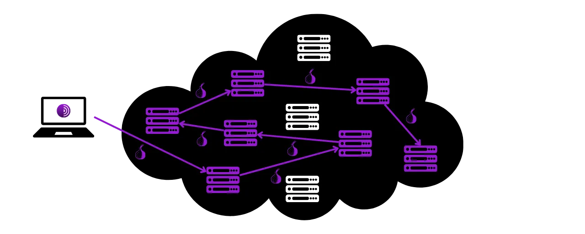
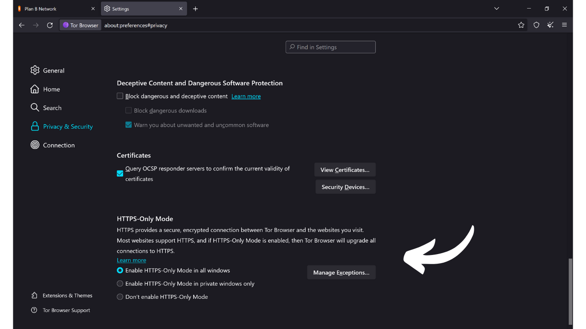

その名が示す通り、ブラウザはインターネットをナビゲートするために使用されるソフトウェアです。これは、ユーザーのマシンとウェブの間のゲートウェイとして機能し、ウェブサイトのコードをインタラクティブで読みやすいページに変換します。ブラウザの選択は非常に重要で、ブラウジング体験だけでなく、オンラインセキュリティとプライバシーにも影響を与えます。

ブラウザと検索エンジンを混同しないように注意してください。ブラウザはインターネットにアクセスするために使用するソフトウェア（ChromeやFirefoxなど）であり、検索エンジンはGoogleやBingなど、オンラインで情報を見つけるためのサービスです。

今日、Google Chromeは最も使用されているブラウザです。2024年には全世界の市場の約65%を占めています。Chromeはその速度とパフォーマンスで評価されていますが、特にプライバシーを重視する場合、すべての人にとって最適な選択とは限りません。Chromeは、ユーザーの大量のデータを収集・分析することで知られるGoogleの所有物です。そして確かに、彼らの自社ブラウザは彼らの監視戦略の中心にあります。このソフトウェアは、あなたのオンラインでのほとんどのやり取りの中心的な要素です。ブラウザ上でのデータ収集をマスターすることはGoogleにとって重要な課題です。

*出典: [gs.statcounter.com](https://gs.statcounter.com/browser-market-share)*

いくつかの主要なブラウザのファミリーがあり、それぞれが特定のレンダリングエンジンに基づいています。Google Chrome、Microsoft Edge、Brave、Opera、Vivaldiなどのブラウザはすべて、Googleによって開発されたChromeの軽量でオープンソースのバージョンであるChromiumブラウザに基づいています。これらのブラウザはすべて、WebKitから派生したBlinkレンダリングエンジンを使用しています。Chromiumの市場での優位性は、ウェブ開発者が主にBlink用にサイトを最適化する傾向があるため、それから派生したブラウザを特に効率的にします。

Safari、Appleのブラウザは、KHTMLから来たWebKitを使用しています。

一方、Mozilla Firefox、LibreWolf、Tor Browserなどのブラウザは、元々Netscapeブラウザからのものである異なるレンダリングエンジンであるGeckoに依存しています。

適切なブラウザの選択はあなたのニーズに依存します。しかし、少なくともあなたのプライバシー、そしてそれゆえにあなたのセキュリティについて心配している場合、一般的な使用にはFirefoxを、さらにプライバシーを重視する場合にはTorブラウザを使用することをお勧めします。このチュートリアルでは、Torブラウザの使い方を簡単に紹介します。

## Torブラウザの紹介

Torブラウザは、できるだけ安全でプライベートなインターネットナビゲーションのために特別に設計されたブラウザです。このブラウザはFirefoxに基づいており、したがってGeckoレンダリングエンジンに基づいています。
TorブラウザはTorネットワークを使用して、あなたのトラフィックを複数のリレーサーバーを通して暗号化し、ルーティングした後に目的地に送信します。この"*オニオンルーティング*"として知られる多層ルーティングのプロセスは、あなたの実際のIPアドレスを隠し、あなたの位置とオンライン活動を特定することを困難にします。しかし、Torネットワークを使用しない標準的なブラウザと比べて、ブラウジングは必然的に遅くなります。
他のブラウザとは異なり、Torブラウザは訪問した各ウェブサイトを隔離し、クッキーや履歴を閉じるたびに自動的に削除するなど、オンライン活動の追跡を防ぐための特定の機能を統合しています。また、訪問したサイトに対してすべてのユーザーをできるだけ似て見せることで、指紋取りのリスクを最小限に抑えるように設計されています。
Torブラウザを使用して、標準的なウェブサイト（`.com`、`.org`など）にアクセスすることができます。この場合、あなたのトラフィックは複数のTorノードを経由して匿名化され、最終的なサイトと通信する出口ノードに到達する前にクリアネット上で処理されます。

また、Torブラウザを使用して、隠されたサービス（`.onion`で終わるアドレス）にアクセスすることもできます。このシナリオでは、すべてのトラフィックは出口ノードなしでTorネットワーク内に留まり、ユーザーと目的地のサーバーの両方の完全なプライバシーを保証します。この運用モードは、伝統的な検索エンジンによってインデックスされていないインターネットの一部である「*ダークウェブ*」にアクセスするために特に使用されます。

## TorネットワークとTorブラウザの違いは何ですか？

TorネットワークとTorブラウザは、混同されるべきではない二つの異なるものですが、補完的な関係にあります。Torネットワークは、ユーザーによって運営されるリレーサーバーのグローバルなインフラであり、複数のノードを経由してインターネットトラフィックを匿名化し、最終目的地に向けて指示することで知られています。これが有名なオニオンルーティングです。

一方、Torブラウザは、このネットワークへのアクセスを簡単にするために設計された特定のブラウザです。デフォルトでTorネットワークに接続するために必要なすべての設定を統合し、プライバシーとセキュリティを最大化しながら、馴染みのあるブラウジング体験を提供するためにFirefoxの変更版を使用しています。

Torネットワークは、Torブラウザによってのみ使用されるわけではありません。様々なソフトウェアやアプリケーションが通信を保護するために利用することができます。例えば、他のユーザーからIPアドレスを隠し、インターネットサービスプロバイダーによるBitcoin関連のトラフィックの監視を防ぐために、BitcoinノードでTorネットワーク経由の通信を有効にすることが可能です。
要約すると、Torネットワークは私たちのインターネットブラウジングにプライバシーを提供するインフラであり、Torブラウザはこのネットワークを私たちのウェブブラウジングの一部として使用するためのソフトウェアです。

## Torブラウザのインストール方法は？

Torブラウザは、コンピュータ用のWindows、Linux、macOS、およびスマートフォン用のAndroidで利用可能です。コンピュータにTorブラウザをインストールするには、[公式のTorプロジェクトウェブサイト](https://www.torproject.org/)を訪れてください。

"*Download Tor Browser*"ボタンをクリックします。

お使いのオペレーティングシステムに適したバージョンを選択します。

実行可能ファイルをクリックしてインストールを開始し、言語を選択します。

ソフトウェアをインストールするフォルダを選択し、"*Install*"ボタンをクリックします。

インストールが完了するのを待ちます。

最後に、"*Finish*"ボタンをクリックします。

## Torブラウザの使用方法は？

Torブラウザは、標準的なブラウザと同様に使用されます。

最初に起動すると、ブラウザはTorネットワークに接続するように促すページを表示します。単に"*Connect*"ボタンをクリックして接続を確立します。

将来的にソフトウェアが自動的にTorネットワークに接続するようにしたい場合は、"*Always connect automatically*"オプションをチェックします。

Torネットワークに接続すると、ホームページに到着します。
インターネットで検索を行うには、検索バーにクエリを入力して「*enter*」キーを押すだけです。
その後、他のブラウザと同様に、検索エンジンからの結果が表示されます。
DuckDuckGoの「*Onionize*」オプションを使用すると、Torネットワーク上の隠されたサービスを介して、その`.onion`アドレスにアクセスすることで検索エンジンを使用できます。

## Torブラウザの設定方法は？

ブラウザ画面の上部には、お気に入りをインポートするオプションがあります。これにより、古いブラウザからTorブラウザにブックマークを自動的に統合できます。
訪問中のウェブページの右上にある星のアイコンをクリックすることで、新しいブックマークを追加することもできます。
右側のメニューから、さまざまなオプションにアクセスできます。「*New identity*」ボタンを使用すると、Torのアイデンティティを変更できます。具体的には、IPアドレスを変更し、クッキーとオープンセッションをリセットして、Tor上で新しいユーザーセッションを開始できます。
「*Bookmarks*」メニューでは、ブックマークを管理できます。
「*History*」では、設定で有効にしている場合、閲覧履歴にアクセスできます。
「*Add-ons and themes*」メニューでは、ブラウザの外観をカスタマイズしたり、拡張機能を追加したりできます。TorブラウザはMozilla Firefoxに基づいているため、Firefox用のテーマや拡張機能を使用できます。
最後に、「*Settings*」ボタンからブラウザの設定にアクセスできます。
設定の「*General*」タブには、Torブラウザのユーザーインターフェースをカスタマイズするためのさまざまなオプションがあります。
「*Home*」タブでは、Torブラウザを開いたときや新しいタブを開いたときに表示されるデフォルトページを変更できます。
「*Search*」タブでは、検索エンジンを選択できます。Torブラウザのデフォルトは、ユーザーのプライバシーを保護に焦点を当てた検索エンジンであるDuckDuckGoですが、GoogleやStartpageなども選択できます。
また、検索エンジンにショートカットを設定することもできます。
例えば、ブラウザの検索バーに「*@wikipedia*」に続けて検索用語、例えば「*Bitcoin*」を入力します。
この機能を使用すると、その用語についてWikipediaサイトで直接検索が行われます。
このようにして、異なるサイトに対する他のカスタムショートカットを設定することができます。

次に、「*Privacy & Security*」タブでは、プライバシーとセキュリティに関連するすべての設定が見つかります。
閲覧履歴を保持するか削除するかのオプションがあります。
 さまざまなウェブサイトに付与するアクセス許可を管理することもできます。

ブラウザの全体的なセキュリティのために、「*Safer*（より安全）」および「*Safest*（最も安全）」モードでは、訪問するサイトによって実行されるウェブ機能とスクリプトを調整できます。これにより、脆弱性の悪用リスクを最小限に抑えることができますが、その代わりにサイトの表示とインタラクティビティに影響を与えることになります。 他にも、危険なコンテンツブロッカーや、サイトとの接続がこのプロトコルを一貫して尊重することを保証するHTTPS-onlyモードなど、セキュリティオプションが見つかります。 最後に、「*Connection*（接続）」タブでは、Torネットワークへの接続に関連するすべての設定を見つけることができます。ここでは、アクセスが検閲されている地域からTorにアクセスするためのブリッジを設定できます。 これで準備は完了です。これで、より安全でプライベートな方法でインターネットをナビゲートする準備ができました！オンラインプライバシーが興味のあるトピックであれば、Mullvad VPNに関するこの他のチュートリアルもお勧めします：

https://planb.network/tutorials/others/mullvad