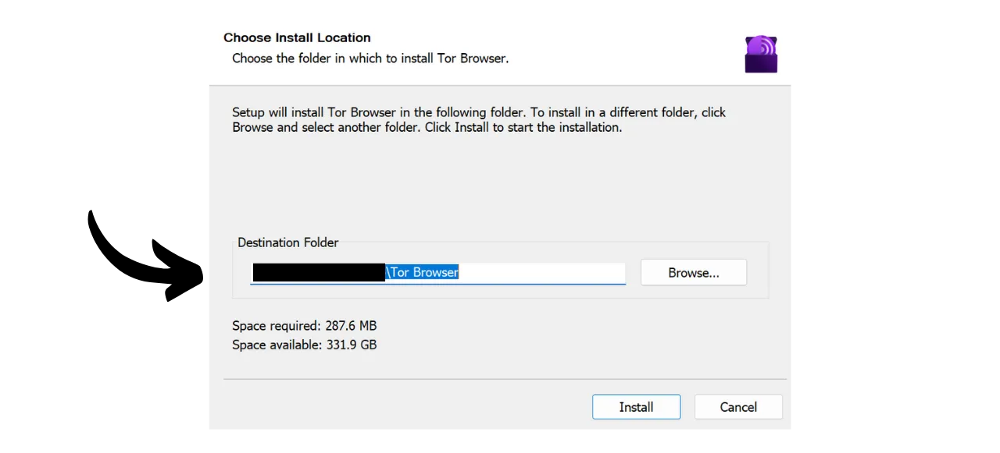
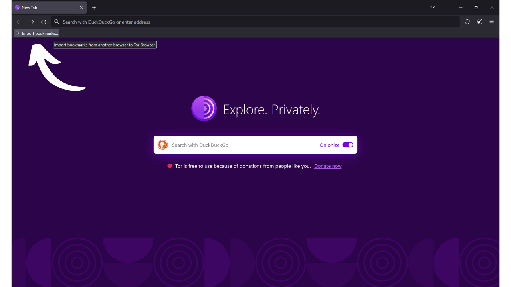
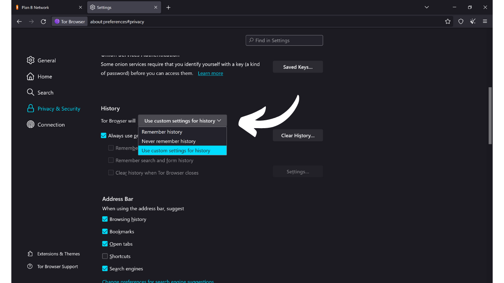

Como o nome sugere, um navegador é um software usado para navegar na Internet. Ele serve como um portal entre a máquina do usuário e a web, traduzindo o código dos sites em páginas interativas e legíveis. A escolha do seu navegador é muito importante, pois não influencia apenas sua experiência de navegação, mas também sua segurança e privacidade online.

Tenha cuidado para não confundir o navegador com o motor de busca. O navegador é o software que você usa para acessar a Internet (como Chrome ou Firefox), enquanto o motor de busca é um serviço, como o Google ou Bing, por exemplo, que ajuda você a encontrar informações online.

Hoje, o Google Chrome é de longe o navegador mais usado. Ele representa cerca de 65% do mercado global em 2024. O Chrome é apreciado por sua velocidade e desempenho, mas não é necessariamente a melhor escolha para todos, especialmente se a privacidade for uma prioridade para você. O Chrome pertence ao Google, uma empresa conhecida por coletar e analisar enormes quantidades de dados sobre seus usuários. E de fato, seu navegador próprio está no coração de sua estratégia de vigilância. Este software é um componente central na maioria de suas interações online. Dominar a coleta de dados no seu navegador é uma questão importante para o Google.

*Fonte: [gs.statcounter.com](https://gs.statcounter.com/browser-market-share)*

Existem várias famílias principais de navegadores, cada uma baseada em um motor de renderização específico. Navegadores como Google Chrome, Microsoft Edge, Brave, Opera ou Vivaldi estão todos estabelecidos no Chromium, uma versão leve e de código aberto do Chrome desenvolvida pelo Google. Todos esses navegadores usam o motor de renderização Blink, que é um fork do WebKit, derivado do KHTML. A predominância do Chromium no mercado torna os navegadores derivados dele particularmente eficientes, pois os desenvolvedores de web tendem a otimizar seus sites principalmente para o Blink.

O Safari, navegador da Apple, usa o WebKit, que também vem do KHTML.

Por outro lado, navegadores como Mozilla Firefox, LibreWolf e Tor Browser dependem do Gecko, um motor de renderização diferente, originalmente do navegador Netscape.

Escolher o navegador certo depende das suas necessidades. Mas se você está pelo menos preocupado com sua privacidade, e portanto sua segurança, eu recomendo usar o Firefox para uso geral e o Tor Browser para ainda mais privacidade. Neste tutorial, vou mostrar como começar facilmente com o Tor Browser.

## Introdução ao Tor Browser

O Tor Browser é um navegador especificamente projetado para navegação na Internet segura e o mais privada possível. O navegador é baseado no Firefox, e portanto no motor de renderização Gecko.
O Tor Browser usa a rede Tor para criptografar e rotear seu tráfego através de múltiplos servidores de retransmissão antes de transmiti-lo ao destino. Esse processo de roteamento em múltiplas camadas, conhecido como "*onion routing*", ajuda a ocultar seu verdadeiro endereço IP, tornando difícil identificar sua localização e atividades online. No entanto, a navegação é necessariamente mais lenta do que com um navegador padrão que não usa a rede Tor, pois é indireta.
Diferentemente de outros navegadores, o Tor Browser integra recursos específicos para evitar o rastreamento de suas atividades online, como isolar cada site visitado e deletar automaticamente cookies e histórico ao fechar. Ele também é projetado para minimizar os riscos de fingerprinting, fazendo com que todos os usuários pareçam o mais similares possível aos sites visitados.
Você pode muito bem usar o Tor Browser para acessar um site padrão (`.com`, `.org`, etc.). Neste caso, seu tráfego é anonimizado ao passar por vários nós da rede Tor antes de chegar a um nó de saída que se comunica com o site final na internet aberta. 
Você também pode usar o Tor Browser para acessar serviços ocultos (endereços terminados em `.onion`). Neste cenário, todo o tráfego permanece dentro da rede Tor, sem um nó de saída, garantindo total privacidade tanto para o usuário quanto para o servidor de destino. Este modo de operação é notavelmente usado para acessar o que às vezes é chamado de "*dark web*", uma parte da Internet não indexada pelos motores de busca tradicionais.

## Qual é a diferença entre a rede Tor e o navegador Tor?

A rede Tor e o navegador Tor são duas coisas distintas que não devem ser confundidas, mas são complementares. A rede Tor é uma infraestrutura global de servidores de retransmissão, operada por usuários, que anonimiza o tráfego da Internet ao passá-lo por vários nós antes de direcioná-lo ao seu destino final. Este é o famoso roteamento em cebola.

O navegador Tor, por outro lado, é um navegador específico projetado para facilitar o acesso a esta rede de maneira simples. Ele integra por padrão todas as configurações necessárias para se conectar à rede Tor e usa uma versão modificada do Firefox para proporcionar uma experiência de navegação familiar, maximizando a privacidade e a segurança.

A rede Tor não é usada apenas pelo navegador Tor. Ela pode ser utilizada por vários softwares e aplicações para proteger suas comunicações. Por exemplo, é possível habilitar comunicações via rede Tor no seu nó Bitcoin para esconder seu endereço IP de outros usuários e prevenir a vigilância do seu tráfego relacionado ao Bitcoin por seu provedor de serviços de internet.
Resumindo, a rede Tor é a infraestrutura que proporciona privacidade na nossa navegação na internet, e o Navegador Tor é o software que nos permite usar esta rede como parte da nossa navegação na web.

## Como instalar o Navegador Tor?

O Navegador Tor está disponível para Windows, Linux e macOS para computadores, assim como para Android em smartphones. Para instalar o Navegador Tor no seu computador, visite [o site oficial do Projeto Tor](https://www.torproject.org/).

Clique no botão "*Baixar o Navegador Tor*".

Escolha a versão adequada para o seu sistema operacional.

Clique no executável para iniciar a instalação, depois escolha seu idioma.

Escolha a pasta onde o software será instalado, depois clique no botão "*Instalar*".

Aguarde a conclusão da instalação.

Finalmente, clique no botão "*Concluir*".

## Como usar o Navegador Tor?

O Navegador Tor é usado como um navegador padrão.

Na primeira inicialização, o navegador apresenta uma página que o convida a se conectar à rede Tor. Basta clicar no botão "*Conectar*" para estabelecer a conexão.

Se você quiser que o software se conecte automaticamente à rede Tor durante seus futuros usos, marque a opção "*Sempre conectar automaticamente*".

Uma vez conectado à rede Tor, você chegará à página inicial.
Para realizar uma pesquisa na Internet, basta inserir sua consulta na barra de pesquisa e pressionar a tecla "*enter*".

Então, você obterá os resultados do seu motor de busca da mesma forma que com outros navegadores.

A opção "*Onionize*" no DuckDuckGo permite que você use o motor de busca através do seu serviço oculto na rede Tor, acessando seu endereço `.onion`.

## Como configurar o Tor Browser?

No topo da tela do seu navegador, você encontrará uma opção para importar seus favoritos. Isso permite que você integre automaticamente os marcadores do seu navegador antigo no Tor Browser.

Você também tem a opção de adicionar novos marcadores clicando no ícone de estrela localizado no canto superior direito da página web que está visitando.

No menu à direita, você acessa várias opções.
O botão "*Nova identidade*" permite que você mude sua identidade no Tor. Especificamente, isso permite que você inicie uma nova sessão de usuário no Tor, o que significa mudar seu endereço IP e redefinir cookies e sessões abertas.

O menu "*Marcadores*" permite que você gerencie seus marcadores.

"*Histórico*" dá acesso ao seu histórico de navegação, se você o ativou nas configurações.

O menu "*Complementos e temas*" permite personalizar a aparência do seu navegador ou adicionar extensões. Como o Tor Browser é baseado no Mozilla Firefox, você pode usar temas e extensões disponíveis para o Firefox.

Finalmente, o botão "*Configurações*" dá acesso às configurações do seu navegador.

Na aba "*Geral*" das configurações, existem várias opções que permitem personalizar a interface do usuário do Tor Browser.

Na aba "*Home*", você pode escolher alterar a página padrão que é exibida ao abrir o Tor Browser e ao abrir novas abas.

Na aba "*Pesquisa*", você pode escolher o motor de busca. O Tor Browser usa por padrão o DuckDuckGo, um motor de busca focado na proteção da privacidade dos usuários, mas você também pode optar pelo Google ou Startpage, por exemplo.

Você também pode configurar atalhos no seu motor de busca.

Por exemplo, você pode digitar "*@wikipedia*" seguido pelo seu termo de pesquisa, como "*Bitcoin*", na barra de pesquisa do navegador.

Essa funcionalidade então realiza uma pesquisa do seu termo diretamente no site da Wikipedia.

Assim, você pode configurar outros atalhos personalizados para diferentes sites.

A seguir, na aba "*Privacidade & Segurança*", você encontrará todas as configurações relacionadas à privacidade e segurança.

Você tem a opção de manter ou deletar seu histórico de navegação.
 Você também pode gerenciar as permissões de acesso que concede a diferentes sites.

Para a segurança geral do seu navegador, os modos "*Safer*" (Mais Seguro) e "*Safest*" (Mais Seguro Ainda) permitem ajustar as funcionalidades da web e os scripts executados pelos sites que você visita. Isso minimiza os riscos de exploração de vulnerabilidades, mas também afetará a exibição e a interatividade dos sites em troca.  Você encontrará outras opções de segurança, incluindo um bloqueador de conteúdo perigoso e o modo apenas HTTPS, que garante que as conexões com os sites respeitem consistentemente este protocolo.  Finalmente, na aba "*Connection*" (Conexão), você encontrará todas as configurações relacionadas à conexão com a rede Tor. É aqui que você pode configurar uma ponte para acessar o Tor de regiões onde seu acesso pode ser censurado.  E é isso, você está agora pronto para navegar na Internet de uma maneira mais segura e privada! Se a privacidade online é um tópico que lhe interessa, eu também recomendo descobrir este outro tutorial sobre o Mullvad VPN:

https://planb.network/tutorials/others/mullvad