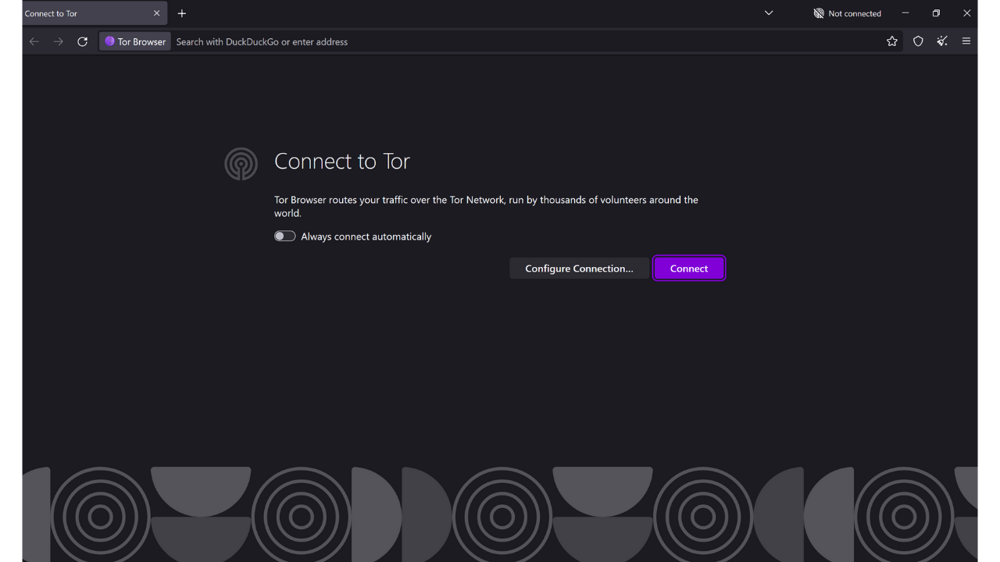
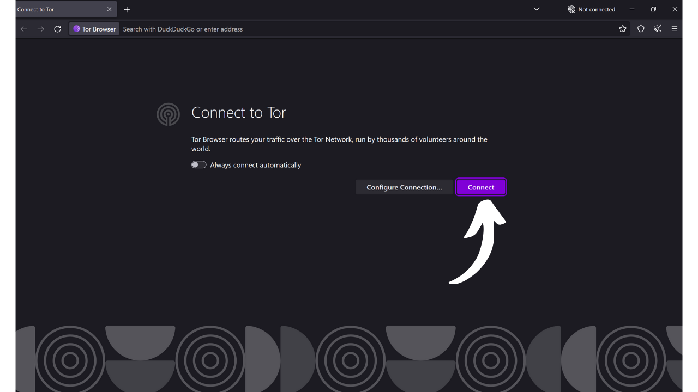

Как следует из названия, браузер - это программное обеспечение, используемое для навигации в Интернете. Он служит воротами между машиной пользователя и вебом, переводя код веб-сайтов в интерактивные и читаемые страницы. Выбор вашего браузера очень важен, поскольку он влияет не только на ваш опыт просмотра, но и на вашу онлайн-безопасность и конфиденциальность.

Будьте осторожны, чтобы не путать браузер с поисковой системой. Браузер - это программное обеспечение, которое вы используете для доступа в Интернет (например, Chrome или Firefox), в то время как поисковая система - это сервис, такой как Google или Bing, который помогает вам находить информацию в сети.

На сегодняшний день Google Chrome является самым используемым браузером. Он занимает около 65% мирового рынка в 2024 году. Chrome ценят за его скорость и производительность, но это не обязательно лучший выбор для всех, особенно если для вас приоритетна конфиденциальность. Chrome принадлежит Google, компании, известной сбором и анализом огромных объемов данных о своих пользователях. И действительно, их собственный браузер находится в самом центре их стратегии наблюдения. Это программное обеспечение является центральным элементом в большинстве ваших онлайн-взаимодействий. Владение сбором данных в вашем браузере является важной задачей для Google.

*Источник: [gs.statcounter.com](https://gs.statcounter.com/browser-market-share)*

Существует несколько основных семейств браузеров, каждое из которых основано на определенном движке рендеринга. Браузеры, такие как Google Chrome, Microsoft Edge, Brave, Opera или Vivaldi, все они основаны на Chromium - легковесной и открытой версии Chrome, разработанной Google. Все эти браузеры используют движок рендеринга Blink, который является ответвлением от WebKit, в свою очередь производным от KHTML. Преобладание Chromium на рынке делает браузеры, основанные на нем, особенно эффективными, поскольку веб-разработчики склонны оптимизировать свои сайты в первую очередь для Blink.

Safari, браузер от Apple, использует WebKit, который также происходит от KHTML.

С другой стороны, браузеры, такие как Mozilla Firefox, LibreWolf и Tor Browser, полагаются на Gecko, другой движок рендеринга, изначально от Netscape.

Выбор правильного браузера зависит от ваших потребностей. Но если вы хотя бы немного обеспокоены своей конфиденциальностью, а следовательно, и безопасностью, я рекомендую использовать Firefox для общего использования и Tor Browser для еще большей конфиденциальности. В этом руководстве я покажу вам, как легко начать работу с Tor Browser.

## Введение в Tor Browser

Tor Browser - это браузер, специально разработанный для безопасного и максимально конфиденциального интернет-сёрфинга. Браузер основан на Firefox, а следовательно, на движке рендеринга Gecko.
Tor Browser использует сеть Tor для шифрования и маршрутизации вашего трафика через несколько ретрансляционных серверов перед передачей его назначению. Этот процесс многоуровневой маршрутизации, известный как "*маршрутизация через луковицы*", помогает скрыть ваш реальный IP-адрес, делая трудным определение вашего местоположения и онлайн-активности. Однако просмотр страниц обязательно медленнее, чем с стандартным браузером, который не использует сеть Tor, поскольку он косвенный.
В отличие от других браузеров, Tor Browser интегрирует специфические функции для предотвращения отслеживания ваших онлайн-активностей, такие как изоляция каждого посещенного веб-сайта и автоматическое удаление cookies и истории при закрытии. Он также разработан для минимизации рисков фингерпринтинга, делая всех пользователей как можно более похожими для посещаемых сайтов.
Вы можете вполне использовать Tor Browser для доступа к стандартным сайтам (`.com`, `.org` и т.д.). В этом случае ваш трафик анонимизируется путем прохождения через несколько узлов Tor перед достижением выходного узла, который связывается с конечным сайтом в открытом интернете.

Также вы можете использовать Tor Browser для доступа к скрытым сервисам (адреса, заканчивающиеся на `.onion`). В этом сценарии весь трафик остается внутри сети Tor, без выходного узла, обеспечивая полную конфиденциальность как для пользователя, так и для сервера назначения. Этот режим работы часто используется для доступа к так называемому "*темному вебу*", части интернета, не индексируемой традиционными поисковыми системами.

## В чем разница между сетью Tor и браузером Tor?

Сеть Tor и браузер Tor - это две разные вещи, которые не следует путать, но они дополняют друг друга. Сеть Tor - это глобальная инфраструктура ретрансляционных серверов, управляемых пользователями, которая анонимизирует интернет-трафик, пропуская его через несколько узлов перед направлением к его конечному пункту назначения. Это знаменитая маршрутизация через "луковицу".

Браузер Tor, с другой стороны, - это специфический браузер, разработанный для упрощения доступа к этой сети простым способом. Он интегрирует по умолчанию все необходимые настройки для подключения к сети Tor и использует модифицированную версию Firefox для предоставления знакомого опыта просмотра, максимизируя при этом конфиденциальность и безопасность.

Сеть Tor используется не только браузером Tor. Ее могут использовать различные программы и приложения для защиты своих коммуникаций. Например, можно включить коммуникации через сеть Tor на вашем Bitcoin-узле, чтобы скрыть ваш IP-адрес от других пользователей и предотвратить слежку за вашим Bitcoin-трафиком вашим интернет-провайдером.
Подводя итог, сеть Tor - это инфраструктура, которая обеспечивает конфиденциальность при просмотре интернета, а браузер Tor - это программное обеспечение, позволяющее нам использовать эту сеть в рамках нашего веб-серфинга.

## Как установить Tor Browser?

Tor Browser доступен для Windows, Linux и macOS для компьютеров, а также для Android на смартфонах. Чтобы установить Tor Browser на ваш компьютер, посетите [официальный сайт проекта Tor](https://www.torproject.org/).

Нажмите на кнопку "*Скачать Tor Browser*".

Выберите версию, подходящую для вашей операционной системы.

Нажмите на исполняемый файл, чтобы начать установку, затем выберите ваш язык.

Выберите папку, в которой будет установлено программное обеспечение, затем нажмите на кнопку "*Установить*".

Дождитесь завершения установки.

Наконец, нажмите на кнопку "*Завершить*".

## Как использовать Tor Browser?

Tor Browser используется как стандартный браузер.

При первом запуске браузер представит вам страницу, которая приглашает вас подключиться к сети Tor. Просто нажмите на кнопку "*Подключиться*", чтобы установить соединение.

Если вы хотите, чтобы программа автоматически подключалась к сети Tor при ваших будущих использованиях, отметьте опцию "*Всегда подключаться автоматически*".

После подключения к сети Tor вы попадете на домашнюю страницу.
Чтобы выполнить поиск в Интернете, просто введите ваш запрос в строку поиска и нажмите клавишу "*enter*".
Затем вы получите результаты от вашей поисковой системы так же, как и в других браузерах.
Опция "*Onionize*" на DuckDuckGo позволяет использовать поисковую систему через её скрытый сервис в сети Tor, обращаясь к её адресу `.onion`.

## Как настроить Tor Browser?

В верхней части экрана вашего браузера вы найдете опцию для импорта ваших закладок. Это позволяет автоматически интегрировать закладки из вашего старого браузера в Tor Browser.
У вас также есть возможность добавить новые закладки, нажав на иконку звездочки, расположенную в верхнем правом углу посещаемой веб-страницы.
В меню справа вы получаете доступ к различным опциям.
Кнопка "*New identity*" позволяет изменить вашу идентичность в Tor. Конкретно это позволяет начать новую пользовательскую сессию в Tor, что означает изменение вашего IP-адреса и сброс куки и открытых сессий.
Меню "*Bookmarks*" позволяет управлять вашими закладками.
"*History*" дает доступ к вашей истории просмотров, если вы включили это в настройках.
Меню "*Add-ons and themes*" позволяет настраивать внешний вид вашего браузера или добавлять расширения. Поскольку Tor Browser основан на Mozilla Firefox, вы можете использовать темы и расширения, доступные для Firefox.
Наконец, кнопка "*Settings*" дает доступ к настройкам вашего браузера.
Во вкладке "*General*" настроек есть различные опции, позволяющие настроить пользовательский интерфейс Tor Browser.
Во вкладке "*Home*" вы можете выбрать изменение стандартной страницы, которая отображается при открытии Tor Browser и при открытии новых вкладок.
Во вкладке "*Search*" вы можете выбрать поисковую систему. По умолчанию в Tor Browser используется DuckDuckGo, поисковая система, сосредоточенная на защите конфиденциальности пользователей, но вы также можете выбрать, например, Google или Startpage.
Вы также можете настроить ярлыки в вашей поисковой системе.
Например, вы можете ввести "*@wikipedia*" за которым следует ваш поисковый запрос, например, "*Bitcoin*", в строку поиска браузера.
Эта функция затем выполняет поиск вашего термина непосредственно на сайте Wikipedia.
Таким образом, вы можете настроить другие пользовательские ярлыки для различных сайтов.

Далее, на вкладке "*Privacy & Security*", вы найдете все настройки, связанные с конфиденциальностью и безопасностью.
У вас есть возможность сохранить или удалить вашу историю просмотров.
Вы также можете управлять разрешениями на доступ, которые вы предоставляете различным веб-сайтам.

Для общей безопасности вашего браузера режимы "*Safer*" (Безопаснее) и "*Safest*" (Наиболее безопасно) позволяют вам настраивать веб-функционал и скрипты, выполняемые сайтами, которые вы посещаете. Это минимизирует риски использования уязвимостей, но также повлияет на отображение и интерактивность сайтов в ответ. Вы найдете другие опции безопасности, включая блокировщик опасного содержимого и режим "Только HTTPS", который гарантирует, что соединения с сайтами постоянно соответствуют этому протоколу.

Наконец, на вкладке "Соединение" вы найдете все настройки, связанные с подключением к сети Tor. Здесь вы можете настроить мост для доступа к Tor из регионов, где его доступ может быть подвергнут цензуре.

И вот вы готовы к более безопасному и конфиденциальному серфингу в Интернете! Если тема онлайн-приватности вас интересует, я также рекомендую ознакомиться с другим учебным пособием о Mullvad VPN:

https://planb.network/tutorials/others/mullvad