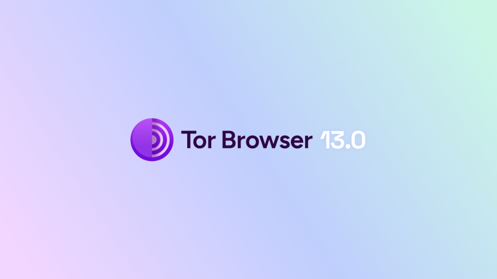

Như tên gọi của nó, trình duyệt là phần mềm được sử dụng để lướt Internet. Nó đóng vai trò như cánh cổng giữa máy của người dùng và web, chuyển đổi mã của các trang web thành các trang tương tác và có thể đọc được. Việc chọn lựa trình duyệt của bạn rất quan trọng, bởi nó không chỉ ảnh hưởng đến trải nghiệm duyệt web của bạn mà còn đến sự an toàn và riêng tư trực tuyến của bạn.

Hãy cẩn thận không nhầm lẫn trình duyệt với công cụ tìm kiếm. Trình duyệt là phần mềm bạn sử dụng để truy cập Internet (như Chrome hoặc Firefox), trong khi đó công cụ tìm kiếm là một dịch vụ, chẳng hạn như Google hoặc Bing, giúp bạn tìm kiếm thông tin trực tuyến.

Ngày nay, Google Chrome là trình duyệt được sử dụng nhiều nhất, chiếm khoảng 65% thị phần toàn cầu vào năm 2024. Chrome được đánh giá cao về tốc độ và hiệu suất, nhưng không nhất thiết là lựa chọn tốt nhất cho mọi người, đặc biệt nếu quyền riêng tư là ưu tiên của bạn. Chrome thuộc về Google, một công ty nổi tiếng với việc thu thập và phân tích lượng lớn dữ liệu từ người dùng của mình. Và thực sự, trình duyệt nội bộ của họ là trung tâm của chiến lược giám sát của họ. Phần mềm này là thành phần trung tâm trong phần lớn các tương tác trực tuyến của bạn. Việc thu thập dữ liệu trên trình duyệt của bạn là một vấn đề quan trọng đối với Google.
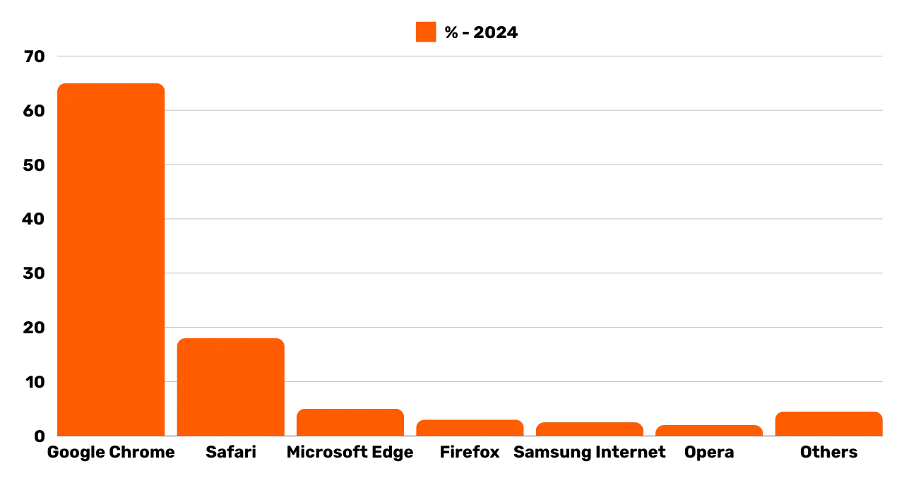
*Nguồn: [gs.statcounter.com](https://gs.statcounter.com/browser-market-share)*

Có một số họ trình duyệt chính, mỗi họ dựa trên một động cơ hiển thị cụ thể. Các trình duyệt như Google Chrome, Microsoft Edge, Brave, Opera, hoặc Vivaldi đều được xây dựng dựa trên Chromium, phiên bản Chrome mã nguồn mở và nhẹ do Google phát triển. Tất cả các trình duyệt này sử dụng động cơ hiển thị Blink, là một nhánh của WebKit, bản thân nó được phát triển từ KHTML. Sự thống trị của Chromium trên thị trường làm cho các trình duyệt dựa trên nó đặc biệt hiệu quả, vì các nhà phát triển web thường tối ưu hóa trang web của họ chủ yếu cho Blink.

Safari, trình duyệt của Apple, sử dụng WebKit, cũng xuất phát từ KHTML.

Mặt khác, các trình duyệt như Mozilla Firefox, LibreWolf, và Tor Browser dựa trên Gecko, một động cơ hiển thị khác, ban đầu từ trình duyệt Netscape.

Việc chọn trình duyệt phù hợp phụ thuộc vào nhu cầu của bạn. Nhưng nếu bạn ít nhất quan tâm đến quyền riêng tư, và do đó là an toàn của mình, tôi khuyên dùng Firefox cho mục đích sử dụng chung và Tor Browser cho quyền riêng tư cao hơn. Trong hướng dẫn này, tôi sẽ chỉ cho bạn cách dễ dàng bắt đầu với Tor Browser.

## Giới thiệu về Tor Browser

Tor Browser là một trình duyệt được thiết kế đặc biệt cho việc lướt Internet một cách an toàn và riêng tư nhất có thể. Trình duyệt này dựa trên Firefox, và do đó, dựa trên động cơ hiển thị Gecko.
Tor Browser sử dụng mạng Tor để mã hóa và định tuyến lưu lượng truy cập của bạn qua nhiều máy chủ trung gian trước khi truyền đến điểm đến. Quá trình định tuyến nhiều lớp này, được biết đến với tên gọi "*onion routing*," giúp ẩn địa chỉ IP thực của bạn, làm cho việc xác định vị trí và hoạt động trực tuyến của bạn trở nên khó khăn. Tuy nhiên, việc duyệt web chắc chắn sẽ chậm hơn so với trình duyệt tiêu chuẩn không sử dụng mạng Tor, vì nó là gián tiếp.
Không giống như các trình duyệt khác, Tor Browser tích hợp các tính năng cụ thể để ngăn chặn việc theo dõi hoạt động trực tuyến của bạn, chẳng hạn như cô lập mỗi trang web đã truy cập và tự động xóa cookie và lịch sử khi đóng. Nó cũng được thiết kế để giảm thiểu rủi ro của việc lấy dấu vân tay, bằng cách làm cho tất cả người dùng xuất hiện giống nhau nhất có thể đối với các trang web đã truy cập.
Bạn hoàn toàn có thể sử dụng Tor Browser để truy cập các trang web thông thường (`.com`, `.org`, v.v.). Trong trường hợp này, lưu lượng truy cập của bạn được ẩn danh bằng cách đi qua nhiều nút Tor trước khi đến nút thoát cuối cùng, nút này liên lạc với trang web cuối cùng trên clearnet.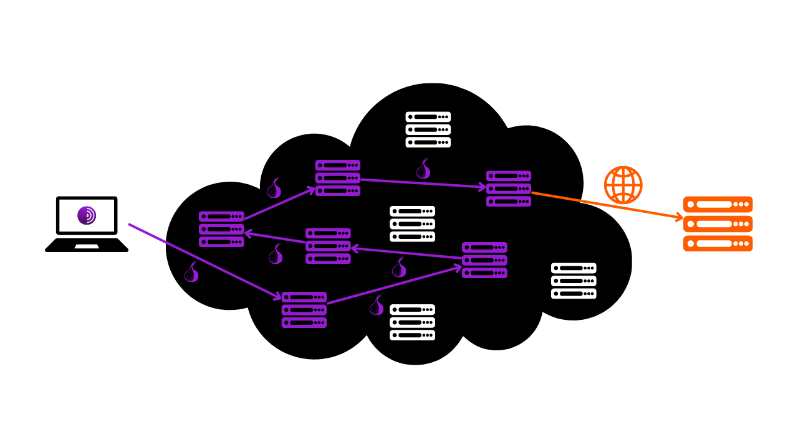
Bạn cũng có thể sử dụng Tor Browser để truy cập các dịch vụ ẩn (địa chỉ kết thúc bằng `.onion`). Trong kịch bản này, toàn bộ lưu lượng truy cập ở lại trong mạng Tor, không qua nút thoát, đảm bảo sự riêng tư tuyệt đối cho cả người dùng và máy chủ đích. Chế độ hoạt động này thường được sử dụng để truy cập những gì đôi khi được gọi là "*dark web*," một phần của Internet không được các công cụ tìm kiếm truyền thống lập chỉ mục.
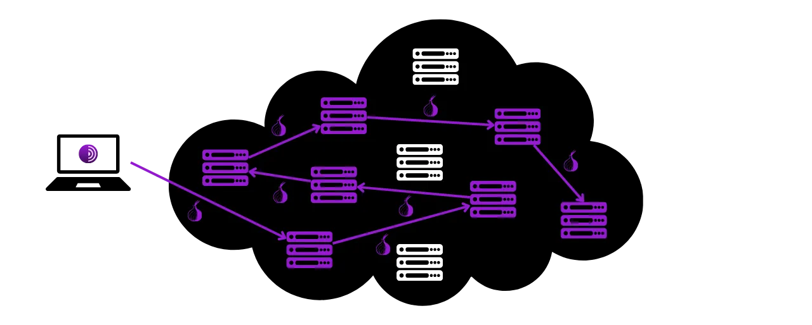

## Sự khác biệt giữa mạng Tor và trình duyệt Tor là gì?

Mạng Tor và trình duyệt Tor là hai thứ khác nhau và không nên nhầm lẫn, nhưng chúng bổ sung cho nhau. Mạng Tor là một cơ sở hạ tầng toàn cầu của các máy chủ chuyển tiếp, được vận hành bởi người dùng, làm ẩn danh lưu lượng Internet bằng cách chuyển nó qua nhiều nút trước khi hướng nó đến điểm đến cuối cùng. Đây là lập trình định tuyến hành tinh nổi tiếng.

Ngược lại, trình duyệt Tor là một trình duyệt cụ thể được thiết kế để dễ dàng truy cập mạng này một cách đơn giản. Nó tích hợp sẵn tất cả các cài đặt cần thiết để kết nối với mạng Tor và sử dụng một phiên bản được chỉnh sửa của Firefox để cung cấp trải nghiệm duyệt web quen thuộc trong khi tối đa hóa sự riêng tư và an ninh.

Mạng Tor không chỉ được sử dụng bởi trình duyệt Tor. Nó có thể được sử dụng bởi nhiều phần mềm và ứng dụng khác nhau để bảo mật giao tiếp của họ. Ví dụ, bạn có thể kích hoạt giao tiếp qua mạng Tor trên nút Bitcoin của mình để ẩn địa chỉ IP khỏi người dùng khác và ngăn chặn việc giám sát lưu lượng truy cập liên quan đến Bitcoin của bạn bởi nhà cung cấp dịch vụ Internet.
Tóm lại, mạng Tor là cơ sở hạ tầng cung cấp sự riêng tư trong lướt web của chúng ta, và Trình duyệt Tor là phần mềm cho phép chúng ta sử dụng mạng này như một phần của việc duyệt web.

## Cách cài đặt Trình duyệt Tor?

Trình duyệt Tor có sẵn cho Windows, Linux và macOS cho máy tính, cũng như cho Android trên điện thoại thông minh. Để cài đặt Trình duyệt Tor trên máy tính của bạn, hãy truy cập [trang web chính thức của Dự án Tor](https://www.torproject.org/).
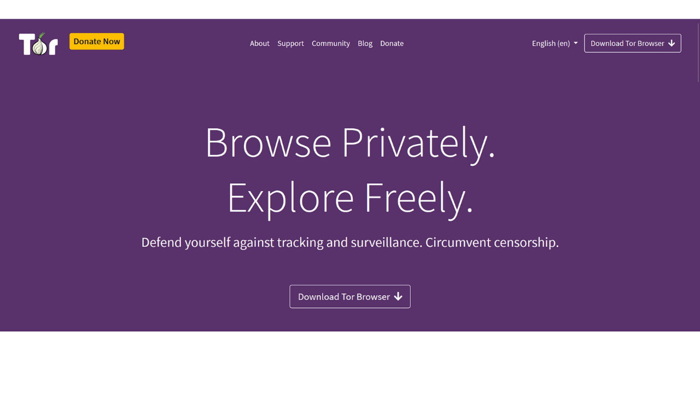
Nhấp vào nút "*Download Tor Browser*".
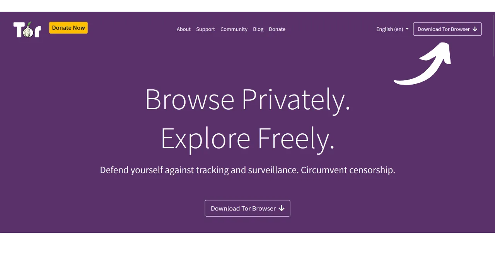
Chọn phiên bản phù hợp với hệ điều hành của bạn.
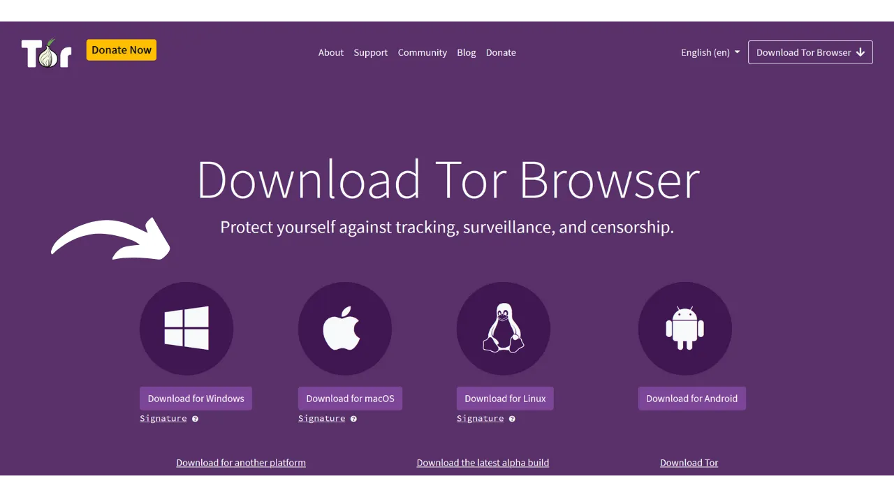
Nhấp vào tệp thực thi để bắt đầu quá trình cài đặt, sau đó chọn ngôn ngữ của bạn.

Chọn thư mục nơi phần mềm sẽ được cài đặt, sau đó nhấp vào nút "*Install*".
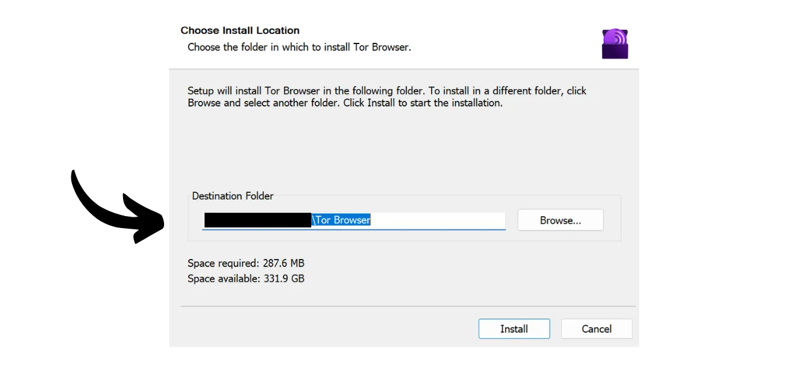
Chờ đợi quá trình cài đặt hoàn tất.
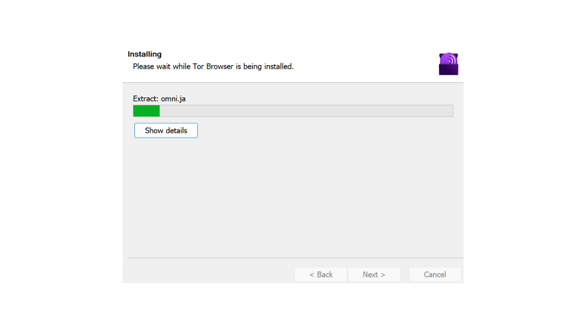
Cuối cùng, nhấp vào nút "*Finish*".
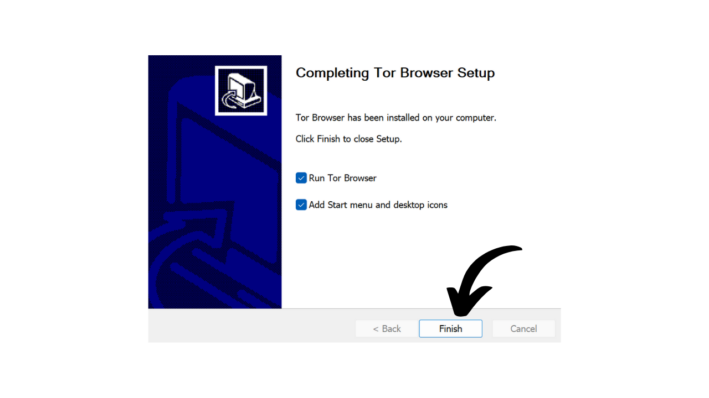

## Cách sử dụng Trình duyệt Tor?

Trình duyệt Tor được sử dụng như một trình duyệt thông thường.
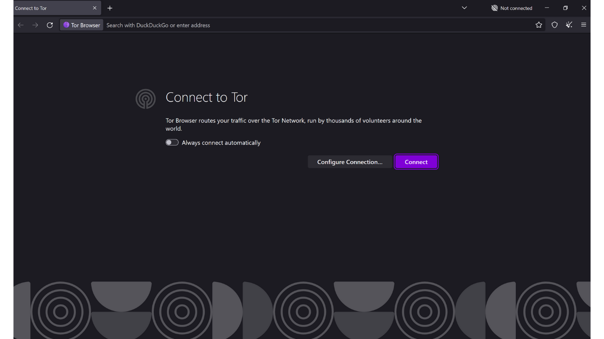
Khi khởi động lần đầu, trình duyệt sẽ hiển thị cho bạn một trang mời bạn kết nối với mạng Tor. Chỉ cần nhấp vào nút "*Connect*" để thiết lập kết nối.
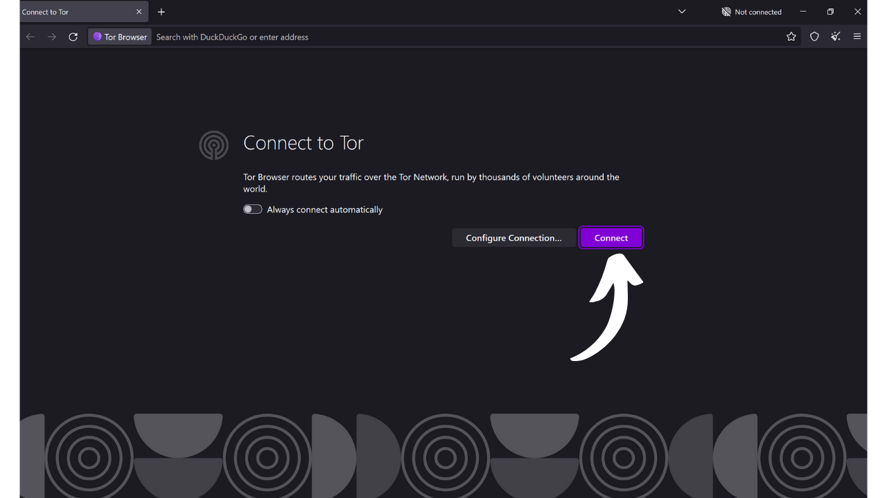
Nếu bạn muốn phần mềm tự động kết nối với mạng Tor trong các lần sử dụng sau, hãy kiểm tra tùy chọn "*Always connect automatically*".
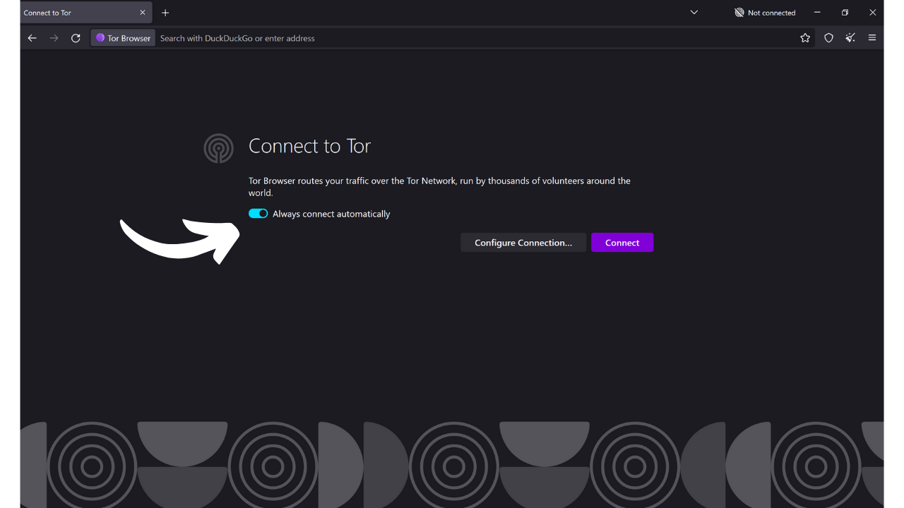
Một khi đã kết nối với mạng Tor, bạn sẽ đến trang chủ.
Để thực hiện một tìm kiếm trên Internet, bạn chỉ cần nhập truy vấn của mình vào thanh tìm kiếm và nhấn phím "*enter*".
Sau đó, bạn sẽ nhận được kết quả từ công cụ tìm kiếm của mình giống như khi sử dụng các trình duyệt khác.
Tùy chọn "*Onionize*" trên DuckDuckGo cho phép bạn sử dụng công cụ tìm kiếm thông qua dịch vụ ẩn của nó trên mạng Tor, bằng cách truy cập địa chỉ `.onion` của nó.

## Cách cấu hình Tor Browser?

Ở đầu màn hình trình duyệt của bạn, bạn sẽ tìm thấy một tùy chọn để nhập khẩu các dấu trang yêu thích của bạn. Điều này cho phép bạn tự động tích hợp các dấu trang từ trình duyệt cũ của bạn vào Tor Browser.
Bạn cũng có tùy chọn thêm dấu trang mới bằng cách nhấp vào biểu tượng ngôi sao nằm ở góc trên bên phải của trang web bạn đang truy cập.
Trong menu bên phải, bạn truy cập các tùy chọn khác nhau.
Nút "*New identity*" cho phép bạn thay đổi danh tính Tor của mình. Cụ thể, điều này cho phép bạn bắt đầu một phiên người dùng mới trên Tor, nghĩa là thay đổi địa chỉ IP và đặt lại cookie và các phiên mở.
Menu "*Bookmarks*" cho phép bạn quản lý các dấu trang của mình.
"*History*" cho bạn truy cập vào lịch sử duyệt web của mình nếu bạn đã kích hoạt nó trong cài đặt.
Menu "*Add-ons and themes*" cho phép bạn tùy chỉnh giao diện của trình duyệt hoặc thêm các tiện ích mở rộng. Vì Tor Browser dựa trên Mozilla Firefox, bạn có thể sử dụng các chủ đề và tiện ích mở rộng có sẵn cho Firefox.
Cuối cùng, nút "*Settings*" cho bạn truy cập vào cài đặt của trình duyệt.
Trong tab "*General*" của cài đặt, có các tùy chọn khác nhau cho phép bạn tùy chỉnh giao diện người dùng của Tor Browser.
Trong tab "*Home*", bạn có thể chọn thay đổi trang mặc định được hiển thị khi mở Tor Browser và khi mở các tab mới.
Trong tab "*Search*", bạn có thể chọn công cụ tìm kiếm. Tor Browser mặc định sử dụng DuckDuckGo, một công cụ tìm kiếm tập trung vào việc bảo vệ quyền riêng tư của người dùng, nhưng bạn cũng có thể chọn Google hoặc Startpage, chẳng hạn.
Bạn cũng có thể thiết lập các phím tắt trong công cụ tìm kiếm của mình.
Ví dụ, bạn có thể gõ "*@wikipedia*" theo sau là thuật ngữ tìm kiếm của mình, như "*Bitcoin*", vào thanh tìm kiếm của trình duyệt.
Tính năng này sau đó thực hiện tìm kiếm thuật ngữ của bạn trực tiếp trên trang Wikipedia.
Như vậy, bạn có thể thiết lập các phím tắt tùy chỉnh khác cho các trang web khác nhau.

Tiếp theo, trong tab "*Privacy & Security*", bạn sẽ tìm thấy tất cả các cài đặt liên quan đến quyền riêng tư và bảo mật.
Bạn có tùy chọn giữ hoặc xóa lịch sử duyệt web của mình.
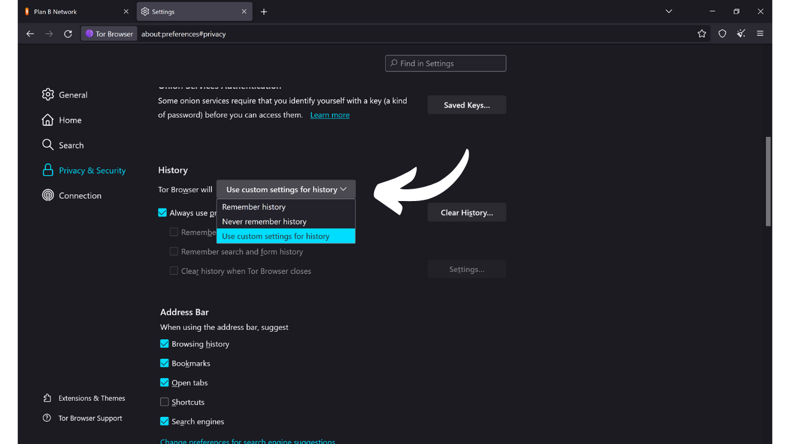 Bạn cũng có thể quản lý quyền truy cập mà bạn cấp cho các trang web khác nhau.
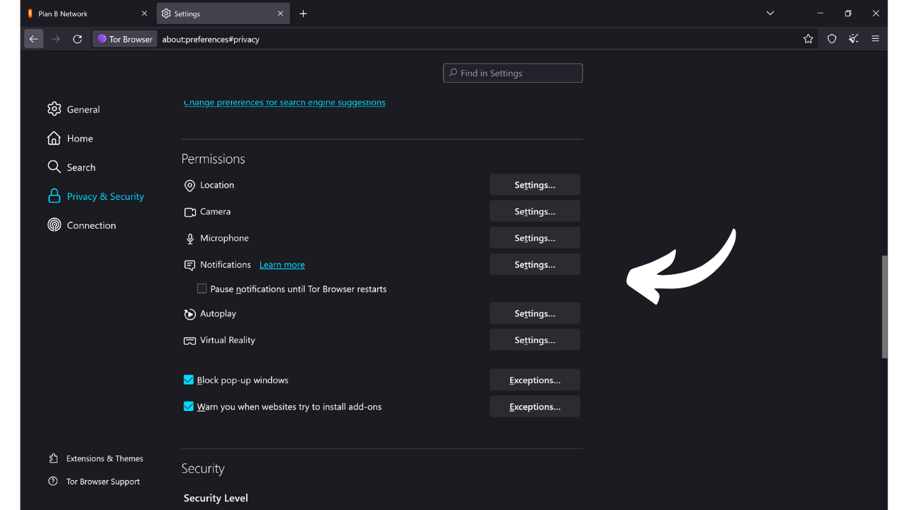
Để tăng cường an ninh cho trình duyệt của bạn, các chế độ "*Safer*" và "*Safest*" cho phép bạn điều chỉnh các chức năng web và các script được thực thi bởi các trang web bạn truy cập. Điều này giúp giảm thiểu rủi ro khai thác lỗ hổng, nhưng cũng sẽ ảnh hưởng đến hiển thị và tương tác của các trang web. 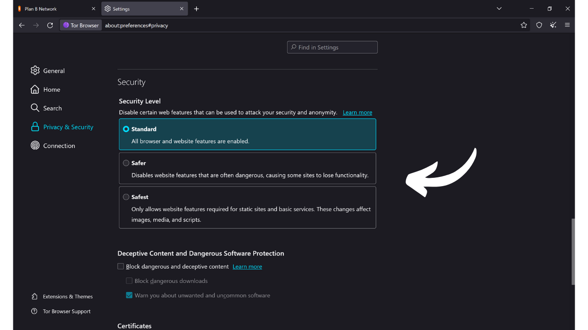 Bạn sẽ tìm thấy các tùy chọn bảo mật khác, bao gồm bộ chặn nội dung nguy hiểm và chế độ chỉ-HTTPS, đảm bảo rằng kết nối với các trang web luôn tuân thủ giao thức này. 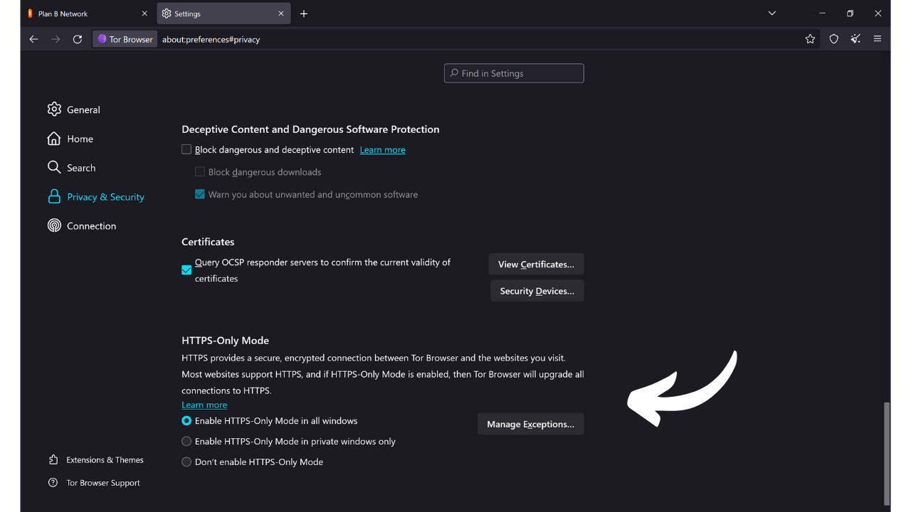 Cuối cùng, trong tab "*Connection*", bạn sẽ tìm thấy tất cả các cài đặt liên quan đến việc kết nối với mạng Tor. Đây là nơi bạn có thể cấu hình một cầu để truy cập Tor từ các khu vực nơi việc truy cập có thể bị kiểm duyệt. 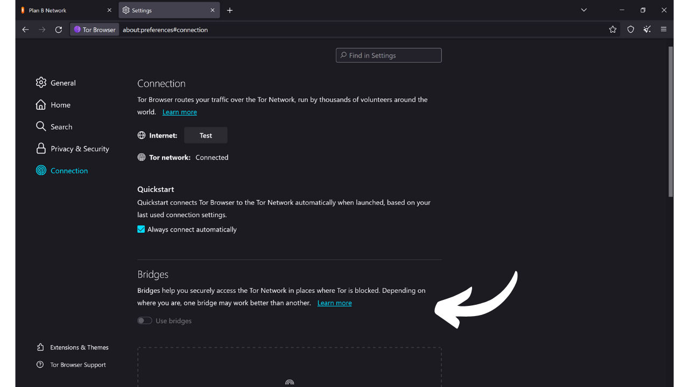 Và đó là tất cả, giờ đây bạn đã sẵn sàng để lướt Internet một cách an toàn và riêng tư hơn! Nếu quyền riêng tư trực tuyến là một chủ đề bạn quan tâm, tôi cũng khuyên bạn khám phá hướng dẫn khác này về Mullvad VPN:

https://planb.network/tutorials/others/mullvad