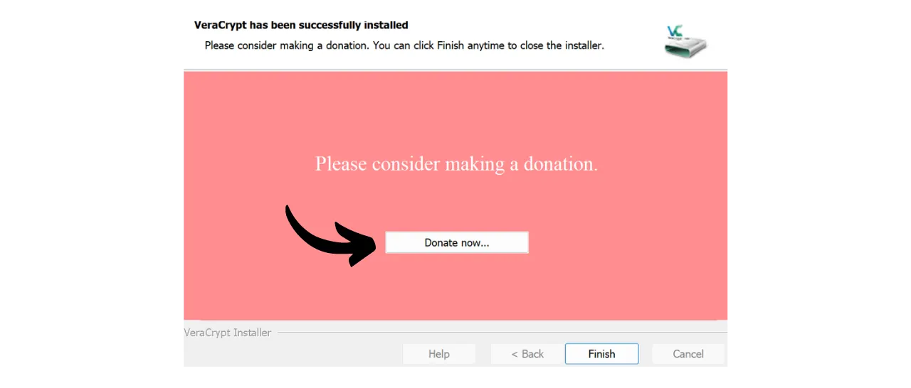
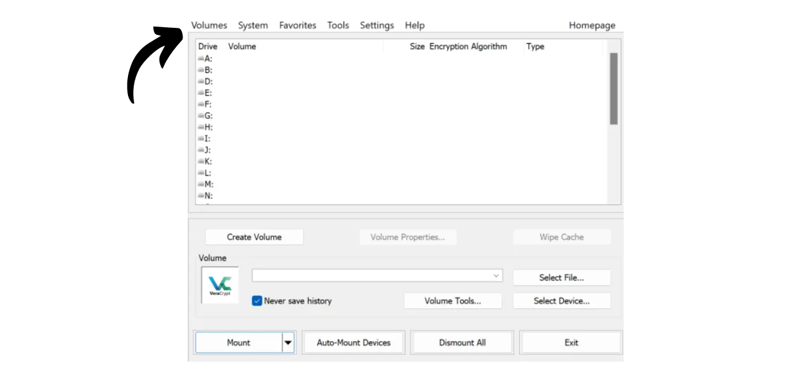
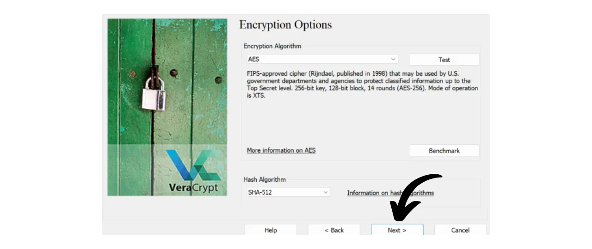

V dnešní době je důležité implementovat strategii, která zajistí dostupnost, bezpečnost a zálohování vašich souborů, jako jsou osobní dokumenty, fotografie nebo důležité projekty. Ztráta těchto dat může být katastrofální.

Aby se předešlo těmto problémům, doporučuji udržovat několik záloh vašich souborů na různých médiích. Běžně používaná strategie v informatice je "3-2-1" strategie zálohování, která zajišťuje ochranu vašich souborů:
- **3** kopie vašich souborů;
- Uložené na alespoň **2** různých typech médií;
- S alespoň **1** kopií uloženou mimo místo.

Jinými slovy, je vhodné ukládat vaše soubory na 3 různých místech, používat média různé povahy, jako je váš počítač, externí pevný disk, USB klíč nebo online úložiště. A konečně, mít kopii uloženou mimo místo znamená, že byste měli mít zálohu uloženou mimo váš domov nebo podnik. Tento poslední bod pomáhá vyhnout se totální ztrátě souborů v případě lokálních katastrof, jako jsou požáry nebo záplavy. Externí kopie, vzdálená od vašeho domova nebo podniku, zajišťuje, že vaše data přežijí nezávisle na lokálních rizicích.

Pro snadnou implementaci této strategie 3-2-1 můžete zvolit online úložné řešení, automaticky nebo periodicky synchronizující soubory z vašeho počítače s těmi ve vašem cloudu. Mezi těmito online zálohovacími řešeními jsou samozřejmě ty od velkých digitálních společností, které znáte: Google Drive, Microsoft OneDrive nebo Apple iCloud. Tyto však nejsou nejlepšími řešeními pro ochranu vašeho soukromí. V předchozím tutoriálu jsem vám představil alternativu, která šifruje vaše dokumenty pro lepší důvěrnost: Proton Drive.

https://planb.network/tutorials/others/proton-drive

Přijetím této strategie lokálního a cloudového zálohování již těžíte ze dvou různých typů médií pro vaše data, z nichž jedno je mimo místo. Pro dokončení strategie 3-2-1 stačí přidat další kopii. Co vám radím, je jednoduše periodicky exportovat vaše data přítomná lokálně a na vašem cloudu na fyzické médium, jako je USB klíč nebo externí pevný disk. Tímto způsobem, i když servery vašeho online úložného řešení jsou zničeny a váš počítač se pokazí současně, stále máte tuto třetí kopii na externím médiu, abyste neztratili svá data.

Ale je také důležité myslet na bezpečnost vašeho úložiště dat, aby k nim nemohl přistupovat nikdo jiný než vy nebo vaši blízcí. Jak lokální, tak online data jsou obvykle bezpečná. Na vašem počítači jste pravděpodobně nastavili heslo a pevné disky moderních počítačů jsou často šifrovány jako výchozí. Co se týče vašeho online úložiště (cloud), ukázal jsem vám v předchozím tutoriálu, jak zabezpečit váš účet silným heslem a dvoufaktorovou autentizací. Nicméně, pro vaši třetí kopii uloženou na fyzickém médiu, jedinou bezpečností je její fyzické držení. Pokud zloděj dokáže ukrást váš USB klíč nebo váš externí pevný disk, mohl by snadno přistupovat ke všem vašim datům.

Aby se předešlo tomuto riziku, je vhodné zašifrovat vaše fyzické médium. Takže jakýkoli pokus o přístup k datům bude vyžadovat zadání hesla pro dešifrování obsahu. Bez tohoto hesla bude nemožné přistupovat k datům, čímž se zabezpečí vaše osobní soubory i v případě krádeže vašeho USB klíče nebo vašeho externího pevného disku.

V tomto tutoriálu vám ukážu, jak snadno zašifrovat externí úložné médium pomocí VeraCrypt, open-source nástroje.
## Úvod do VeraCrypt

VeraCrypt je open-source software dostupný pro Windows, macOS a Linux, který vám umožňuje šifrovat vaše data různými způsoby a na různých médiích.

Tento software umožňuje vytváření a údržbu zašifrovaných svazků za běhu, což znamená, že vaše data jsou automaticky zašifrována před uložením a dešifrována před čtením. Tato metoda zajišťuje, že vaše soubory zůstanou chráněny i v případě krádeže vašeho úložného média. VeraCrypt nešifruje pouze soubory, ale také názvy souborů, metadata, složky a dokonce i volné místo na vašem úložném médiu.

VeraCrypt lze použít k šifrování souborů lokálně nebo celých oddílů, včetně systémového disku. Lze jej také použít k úplnému zašifrování externího média, jako je USB klíč nebo disk, jak uvidíme v tomto tutoriálu.

Velkou výhodou VeraCryptu oproti proprietárním řešením je, že je zcela open source, což znamená, že jeho kód může být ověřen kýmkoli.

## Jak nainstalovat VeraCrypt?

Přejděte na [oficiální webové stránky VeraCrypt](https://www.veracrypt.fr/en/Downloads.html) v záložce "*Downloads*".

Stáhněte si verzi vhodnou pro váš operační systém. Pokud používáte Windows, vyberte "*EXE Installer*".

Vyberte jazyk pro vaše rozhraní.

Přijměte podmínky licence.

Vyberte "*Install*".

Nakonec vyberte složku, kde bude software nainstalován, a poté klikněte na tlačítko "*Install*".

Počkejte, až se instalace dokončí.

Instalace je dokončena.

Pokud chcete, můžete přispět bitcoiny na podporu vývoje tohoto open-source nástroje.

## Jak zašifrovat úložné zařízení pomocí VeraCrypt?

Po prvním spuštění se dostanete na toto rozhraní:

Pro zašifrování úložného zařízení dle vašeho výběru nejprve připojte zařízení k vašemu počítači. Jak uvidíte později, proces vytváření nového zašifrovaného svazku na USB klíči nebo pevném disku bude trvat mnohem déle, pokud zařízení již obsahuje data, která nechcete smazat. Proto doporučuji použít prázdný USB klíč nebo předem vyprázdnit zařízení pro vytvoření zašifrovaného svazku, aby se ušetřil čas.

Na VeraCrypt klikněte na záložku "*Volumes*".

Poté na menu "*Create New Volume...*".

V nově otevřeném okně vyberte možnost "*Encrypt a non-system partition/drive*" a klikněte na "*Next*".

Poté budete muset vybrat mezi možnostmi "*Standardní VeraCrypt svazek*" a "*Skrytý VeraCrypt svazek*". První možnost vytvoří standardní šifrovaný svazek na vašem zařízení. Možnost "*Skrytý VeraCrypt svazek*" umožňuje vytvoření skrytého svazku uvnitř standardního VeraCrypt svazku. Tato metoda vám umožňuje popřít existenci tohoto skrytého svazku v případě nátlaku. Například, pokud vás někdo fyzicky donutí k dešifrování vašeho zařízení, můžete dešifrovat pouze standardní část, aby jste uspokojili útočníka, ale neodhalili skrytou část. V mém příkladu si vyberu standardní svazek. 
Na následující stránce klikněte na tlačítko "*Vybrat zařízení...*".

Otevře se nové okno, kde můžete vybrat oddíl vašeho úložného zařízení ze seznamu disků dostupných na vašem počítači. Obvykle bude oddíl, který chcete šifrovat, uveden pod řádkem s názvem "*Odstranitelný disk N*". Po výběru příslušného oddílu klikněte na tlačítko "*OK*".

Vybrané zařízení se objeví v okně. Nyní můžete kliknout na tlačítko "*Další*". 
Dále budete muset vybrat mezi možnostmi "*Vytvořit šifrovaný svazek a naformátovat ho*" nebo "*Šifrovat oddíl na místě*". Jak bylo zmíněno dříve, první možnost trvale smaže všechna data na vašem USB klíči nebo pevném disku. Tuto možnost vyberte pouze v případě, že je vaše zařízení prázdné; v opačném případě ztratíte všechna data, která obsahuje. Pokud si přejete zachovat stávající data, můžete je dočasně přenést jinam, vybrat "*Vytvořit šifrovaný svazek a naformátovat ho*" pro rychlejší proces, který vše smaže, nebo zvolit "*Šifrovat oddíl na místě*". Tato poslední možnost umožňuje šifrování svazku bez mazání již přítomných dat, ale proces bude mnohem delší. V tomto příkladu, protože můj USB klíč je prázdný, vyberu "*Vytvořit šifrovaný svazek a naformátovat ho*", možnost, která vše smaže.

Dále budete mít možnost vybrat šifrovací algoritmus a hašovací funkci. Pokud nemáte specifické požadavky, doporučuji ponechat výchozí možnosti. Klikněte na "*Další*", abyste pokračovali.

Ujistěte se, že uvedená velikost vašeho svazku je správná, abyste zašifrovali celý dostupný prostor na USB klíči, a ne jen část. Po ověření klikněte na "*Další*".

V této fázi budete muset nastavit heslo pro šifrování a dešifrování vašeho zařízení. Je důležité vybrat silné heslo, aby útočník nemohl dešifrovat váš obsah pomocí útoků hrubou silou. Heslo by mělo být náhodné, co nejdelší a obsahovat několik typů znaků. Doporučuji zvolit náhodné heslo o délce alespoň 20 znaků včetně malých písmen, velkých písmen, čísel a symbolů.

Doporučuji také uložit vaše heslo v správci hesel. To usnadňuje přístup a eliminuje riziko zapomenutí. Pro náš konkrétní případ je správce hesel preferován před papírovým médiem. Skutečně, v případě vloupání, i když může být vaše úložné zařízení ukradeno, heslo ve správci není pro útočníka nalezeno, což zabrání přístupu k datům. Naopak, pokud je váš správce hesel kompromitován, fyzický přístup k zařízení je stále nutný k využití hesla a přístupu k datům.

Pro více informací o správě hesel, doporučuji objevit tento další kompletní tutoriál:
Zadejte své heslo do dvou určených polí, poté klikněte na "*Další*". 
VeraCrypt vás poté zeptá, zda plánujete ukládat soubory větší než 4 GiB do šifrovaného svazku. Tato otázka umožňuje softwaru vybrat nejvhodnější souborový systém. Obvykle se používá systém FAT, protože je kompatibilní s většinou operačních systémů, ale ukládá maximální limit velikosti souboru 4 GiB. Pokud potřebujete spravovat větší soubory, můžete si vybrat systém exFAT.

Dále se dostanete na stránku, která vám umožní generovat náhodný klíč. Tento klíč je důležitý, protože bude použit k šifrování a dešifrování vašich dat. Bude uložen v konkrétní sekci vašeho média, která je sama zabezpečena heslem, které jste dříve nastavili. Aby VeraCrypt mohl generovat silný šifrovací klíč, potřebuje entropii. Proto software žádá, abyste náhodně pohybovali myší po okně; tyto pohyby jsou pak použity k generování klíče. Pokračujte v pohybu myši, dokud není ukazatel entropie zcela naplněn. Poté klikněte na "*Formátovat*", abyste začali vytvářet šifrovaný svazek.

Počkejte, až bude formátování dokončeno. U velkých svazků to může trvat dlouho.

Poté obdržíte potvrzení.

## Jak používat šifrovaný disk s VeraCrypt?

Prozatím je vaše médium šifrováno a proto jej nemůžete otevřít. Pro dešifrování přejděte na VeraCrypt.

Vyberte písmeno disku ze seznamu. Například jsem si vybral "*L:*".

Klikněte na tlačítko "*Vybrat zařízení...*".

Ze seznamu všech disků na vašem počítači vyberte šifrovaný svazek na vašem médiu, poté klikněte na tlačítko "*OK*".

Vidíte, že váš svazek je správně vybrán.

Klikněte na tlačítko "*Připojit*".

Zadejte heslo zvolené při vytváření svazku, poté klikněte na "*OK*".

Vidíte, že váš svazek je nyní dešifrován a přístupný na disku "*L:*".

Pro přístup k němu otevřete průzkumníka souborů a přejděte na disk "*L:*" (nebo jiné písmeno v závislosti na tom, které jste si vybrali v předchozích krocích). 
Po přidání vašich osobních souborů na médium, pro opětovné zašifrování svazku jednoduše klikněte na tlačítko "*Odpojit*".

Váš svazek již není zobrazen pod písmenem "*L:*". Je tedy znovu zašifrován.

Nyní můžete odstranit vaše úložné médium.

Gratulujeme, nyní máte šifrované médium pro bezpečné ukládání vašich osobních dat, čímž máte kompletní 3-2-1 strategii kromě kopie na vašem počítači a vašeho online úložiště.
Pokud chcete podpořit vývoj VeraCrypt, můžete také poskytnout dar v bitcoinech [na této stránce](https://www.veracrypt.fr/en/Donation.html).