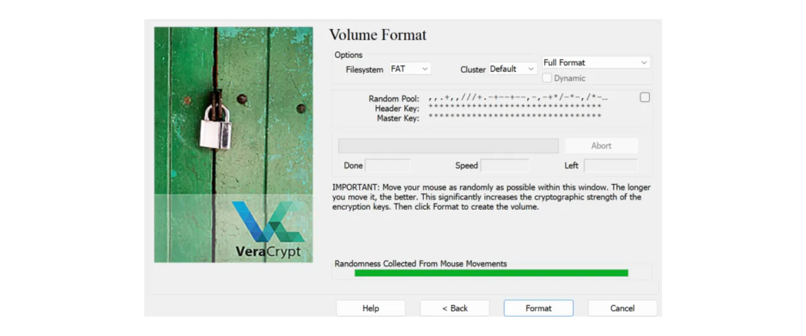
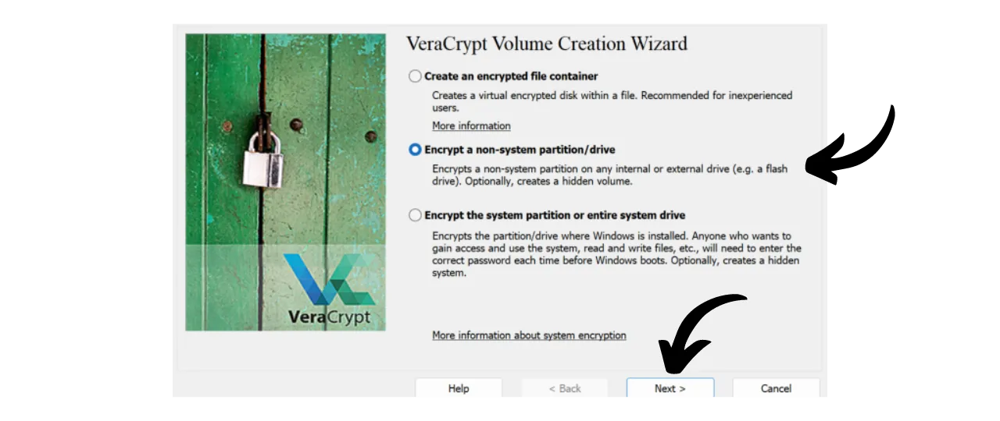
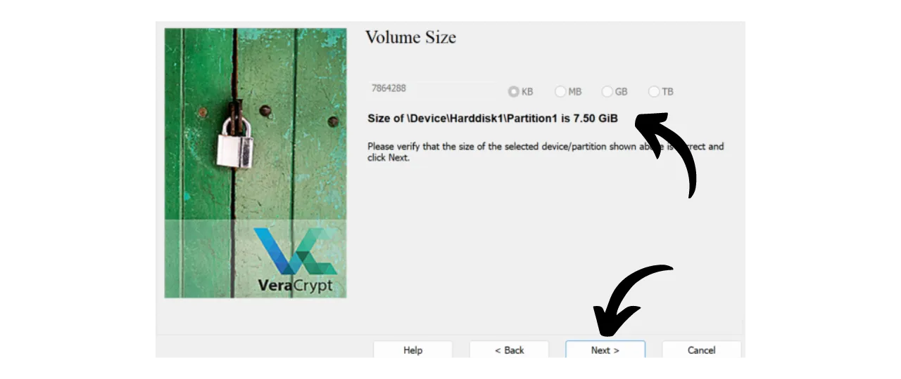
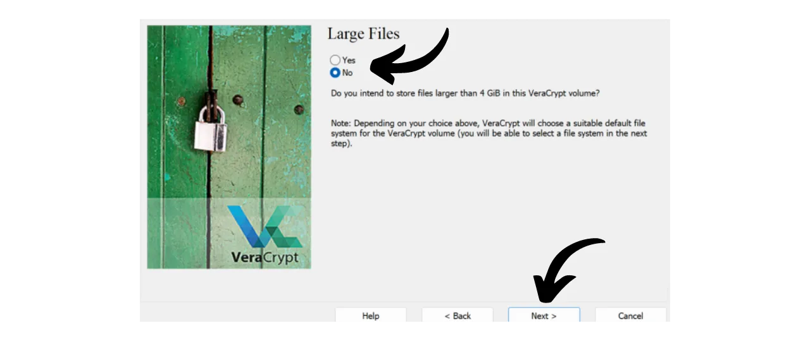
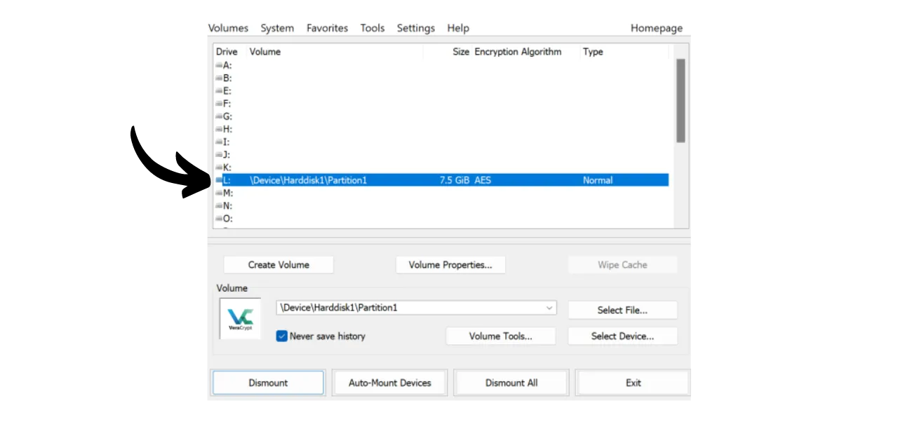

Heutzutage ist es wichtig, eine Strategie zu implementieren, um die Zugänglichkeit, Sicherheit und Datensicherung Ihrer Dateien, wie persönliche Dokumente, Fotos oder wichtige Projekte, zu gewährleisten. Der Verlust dieser Daten kann katastrophal sein.

Um diese Probleme zu verhindern, rate ich Ihnen, mehrere Backups Ihrer Dateien auf verschiedenen Medien zu pflegen. Eine in der Informatik häufig verwendete Strategie ist die "3-2-1"-Backup-Strategie, die den Schutz Ihrer Dateien sicherstellt:
- **3** Kopien Ihrer Dateien;
- Gespeichert auf mindestens **2** verschiedenen Arten von Medien;
- Mit mindestens **1** Kopie außerhalb des Standorts.

Mit anderen Worten, es ist ratsam, Ihre Dateien an 3 verschiedenen Orten zu speichern, unter Verwendung von Medien unterschiedlicher Art, wie Ihrem Computer, einer externen Festplatte, einem USB-Stick oder einem Online-Speicherdienst. Und schließlich bedeutet eine außerhalb des Standorts aufbewahrte Kopie, dass Sie ein Backup außerhalb Ihres Hauses oder Geschäfts haben sollten. Dieser letzte Punkt hilft, den Totalverlust Ihrer Dateien im Falle lokaler Katastrophen wie Brände oder Überschwemmungen zu vermeiden. Eine externe Kopie, fern von Ihrem Zuhause oder Geschäft, stellt sicher, dass Ihre Daten unabhängig von lokalen Risiken überleben.

Um diese 3-2-1-Backup-Strategie einfach zu implementieren, können Sie sich für eine Online-Speicherlösung entscheiden, indem Sie die Dateien von Ihrem Computer automatisch oder periodisch mit denen in Ihrer Cloud synchronisieren. Unter diesen Online-Backup-Lösungen gibt es natürlich jene von großen digitalen Unternehmen, die Sie kennen: Google Drive, Microsoft OneDrive oder Apple iCloud. Diese sind jedoch nicht die besten Lösungen zum Schutz Ihrer Privatsphäre. In einem vorherigen Tutorial habe ich Ihnen eine Alternative vorgestellt, die Ihre Dokumente zur besseren Vertraulichkeit verschlüsselt: Proton Drive.

https://planb.network/tutorials/others/proton-drive

Indem Sie diese Strategie des lokalen und Cloud-Backups anwenden, profitieren Sie bereits von zwei verschiedenen Arten von Medien für Ihre Daten, von denen eines außerhalb des Standorts ist. Um die 3-2-1-Strategie zu vervollständigen, müssen Sie lediglich eine zusätzliche Kopie hinzufügen. Was ich Ihnen rate zu tun, ist einfach, Ihre Daten, die lokal und in Ihrer Cloud vorhanden sind, periodisch auf ein physisches Medium zu exportieren, wie einen USB-Stick oder eine externe Festplatte. Auf diese Weise haben Sie, selbst wenn die Server Ihrer Online-Speicherlösung zerstört werden und Ihr Computer gleichzeitig ausfällt, immer noch diese dritte Kopie auf einem externen Medium, um Ihre Daten nicht zu verlieren.

Es ist jedoch auch wichtig, über die Sicherheit Ihrer Datenspeicherung nachzudenken, um sicherzustellen, dass niemand außer Ihnen oder Ihren Liebsten darauf zugreifen kann. Sowohl lokale als auch Online-Daten sind normalerweise sicher. Auf Ihrem Computer haben Sie wahrscheinlich ein Passwort eingerichtet, und die Festplatten moderner Computer sind oft standardmäßig verschlüsselt. Bezüglich Ihres Online-Speichers (Cloud) habe ich Ihnen im vorherigen Tutorial gezeigt, wie Sie Ihr Konto mit einem starken Passwort und einer Zwei-Faktor-Authentifizierung sichern können. Für Ihre dritte Kopie, die auf einem physischen Medium gespeichert ist, besteht die einzige Sicherheit jedoch im physischen Besitz. Wenn es einem Einbrecher gelingt, Ihren USB-Stick oder Ihre externe Festplatte zu stehlen, könnte er leicht auf alle Ihre Daten zugreifen.

Um dieses Risiko zu verhindern, ist es ratsam, Ihr physisches Medium zu verschlüsseln. So wird jeder Versuch, auf die Daten zuzugreifen, die Eingabe eines Passworts erfordern, um den Inhalt zu entschlüsseln. Ohne dieses Passwort wird es unmöglich sein, auf die Daten zuzugreifen, und Ihre persönlichen Dateien sind selbst im Falle eines Diebstahls Ihres USB-Sticks oder Ihrer externen Festplatte gesichert.

In diesem Tutorial zeige ich Ihnen, wie Sie ein externes Speichermedium mit VeraCrypt, einem Open-Source-Tool, einfach verschlüsseln können.
## Einführung in VeraCrypt

VeraCrypt ist eine Open-Source-Software, die auf Windows, macOS und Linux verfügbar ist und es Ihnen ermöglicht, Ihre Daten auf verschiedene Weisen und auf unterschiedlichen Medien zu verschlüsseln.

Diese Software ermöglicht das Erstellen und Verwalten von verschlüsselten Volumes on the fly, was bedeutet, dass Ihre Daten automatisch verschlüsselt werden, bevor sie gespeichert und entschlüsselt werden, bevor sie gelesen werden. Diese Methode stellt sicher, dass Ihre Dateien auch im Falle eines Diebstahls Ihres Speichermediums geschützt bleiben. VeraCrypt verschlüsselt nicht nur Dateien, sondern auch Dateinamen, Metadaten, Ordner und sogar den freien Speicherplatz auf Ihrem Speichermedium.

VeraCrypt kann verwendet werden, um Dateien lokal oder ganze Partitionen, einschließlich der Systemdisk, zu verschlüsseln. Es kann auch verwendet werden, um ein externes Medium wie einen USB-Stick oder eine Festplatte vollständig zu verschlüsseln, wie wir in diesem Tutorial sehen werden.

Ein großer Vorteil von VeraCrypt gegenüber proprietären Lösungen ist, dass es vollständig Open Source ist, was bedeutet, dass sein Code von jedem überprüft werden kann.

## Wie installiert man VeraCrypt?

Gehen Sie auf [die offizielle VeraCrypt-Website](https://www.veracrypt.fr/en/Downloads.html) im Tab "*Downloads*".

Laden Sie die für Ihr Betriebssystem geeignete Version herunter. Wenn Sie Windows verwenden, wählen Sie "*EXE Installer*".

Wählen Sie die Sprache für Ihre Oberfläche.

Akzeptieren Sie die Lizenzbedingungen.

Wählen Sie "*Installieren*".

Wählen Sie abschließend den Ordner, in dem die Software installiert werden soll, und klicken Sie auf den Button "*Installieren*".

Warten Sie, bis die Installation abgeschlossen ist.

Die Installation ist abgeschlossen.

Wenn Sie möchten, können Sie eine Spende in Bitcoins leisten, um die Entwicklung dieses Open-Source-Tools zu unterstützen.

## Wie verschlüsselt man ein Speichergerät mit VeraCrypt?

Beim ersten Start gelangen Sie zu dieser Oberfläche:

Um das Speichergerät Ihrer Wahl zu verschlüsseln, beginnen Sie damit, es an Ihre Maschine anzuschließen. Wie Sie später sehen werden, dauert der Prozess der Erstellung eines neuen verschlüsselten Volumes auf einem USB-Stick oder einer Festplatte viel länger, wenn das Gerät bereits Daten enthält, die Sie nicht löschen möchten. Daher empfehle ich, einen leeren USB-Stick zu verwenden oder das Gerät vorher zu leeren, um das verschlüsselte Volume zu erstellen, um Zeit zu sparen.

Klicken Sie in VeraCrypt auf den Tab "*Volumes*".

Dann auf das Menü "*Create New Volume...*".

In dem sich öffnenden neuen Fenster wählen Sie die Option "*Encrypt a non-system partition/drive*" und klicken auf "*Weiter*".

Sie müssen dann zwischen "*Standard VeraCrypt volume*" und "*Hidden VeraCrypt Volume*" wählen. Die erste Option erstellt ein standardmäßig verschlüsseltes Volume auf Ihrem Gerät. Die Option "*Hidden VeraCrypt Volume*" ermöglicht es, ein verstecktes Volume innerhalb eines Standard-VeraCrypt-Volumes zu erstellen. Diese Methode ermöglicht es Ihnen, die Existenz dieses versteckten Volumes im Falle von Zwang zu leugnen. Wenn Sie beispielsweise körperlich gezwungen werden, Ihr Gerät zu entschlüsseln, können Sie nur den Standardteil entschlüsseln, um den Aggressor zufriedenzustellen, ohne den versteckten Teil preiszugeben. In meinem Beispiel werde ich mich für ein Standardvolume entscheiden. 
Auf der folgenden Seite klicken Sie auf den Button "*Select Device...*".

Ein neues Fenster öffnet sich, in dem Sie die Partition Ihres Speichergeräts aus der Liste der auf Ihrem Computer verfügbaren Disks auswählen können. Normalerweise wird die zu verschlüsselnde Partition unter einer Zeile mit dem Titel "*Removable Disk N*" aufgeführt. Nachdem Sie die entsprechende Partition ausgewählt haben, klicken Sie auf den Button "*OK*".

Das ausgewählte Laufwerk erscheint im Feld. Sie können nun auf den Button "*Next*" klicken. 
Als Nächstes müssen Sie zwischen den Optionen "*Create encrypted volume and format it*" oder "*Encrypt partition in place*" wählen. Wie bereits erwähnt, wird die erste Option alle Daten auf Ihrem USB-Stick oder Ihrer Festplatte dauerhaft löschen. Wählen Sie diese Option nur, wenn Ihr Gerät leer ist; andernfalls verlieren Sie alle darauf befindlichen Daten. Wenn Sie vorhandene Daten behalten möchten, können Sie diese vorübergehend anderswo übertragen, "*Create encrypted volume and format it*" für einen schnelleren Prozess wählen, der alles löscht, oder sich für "*Encrypt partition in place*" entscheiden. Diese letzte Option ermöglicht es, das Volume zu verschlüsseln, ohne die bereits vorhandenen Daten zu löschen, aber der Prozess wird viel länger dauern. Für dieses Beispiel, da mein USB-Stick leer ist, wähle ich "*Create encrypted volume and format it*", die Option, die alles löscht.

Als Nächstes haben Sie die Möglichkeit, den Verschlüsselungsalgorithmus und die Hash-Funktion zu wählen. Sofern Sie keine spezifischen Anforderungen haben, rate ich Ihnen, die Standardoptionen beizubehalten. Klicken Sie auf "*Next*", um fortzufahren.

Stellen Sie sicher, dass die angegebene Größe für Ihr Volume korrekt ist, um den gesamten verfügbaren Speicherplatz auf dem USB-Stick zu verschlüsseln und nicht nur einen Teil. Nach der Überprüfung klicken Sie auf "*Next*".

In diesem Stadium müssen Sie ein Passwort festlegen, um Ihr Gerät zu verschlüsseln und zu entschlüsseln. Es ist wichtig, ein starkes Passwort zu wählen, um zu verhindern, dass ein Angreifer Ihren Inhalt mit Brute-Force-Angriffen entschlüsselt. Das Passwort sollte zufällig, so lang wie möglich und mehrere Arten von Zeichen enthalten. Ich rate Ihnen, sich für ein zufälliges Passwort von mindestens 20 Zeichen zu entscheiden, einschließlich Kleinbuchstaben, Großbuchstaben, Zahlen und Symbolen.

Ich rate Ihnen auch, Ihr Passwort in einem Passwortmanager zu speichern. Dies erleichtert den Zugriff und eliminiert das Risiko des Vergessens. Für unseren spezifischen Fall ist ein Passwortmanager einem Papiermedium vorzuziehen. Tatsächlich kann im Falle eines Einbruchs, obwohl Ihr Speichergerät gestohlen werden kann, das Passwort im Manager vom Angreifer nicht gefunden werden, was den Zugriff auf die Daten verhindert. Umgekehrt ist bei einem kompromittierten Passwortmanager immer noch der physische Zugriff auf das Gerät notwendig, um das Passwort auszunutzen und auf die Daten zuzugreifen.

Für weitere Informationen zur Verwaltung von Passwörtern rate ich Ihnen, dieses andere vollständige Tutorial zu entdecken:
Geben Sie Ihr Passwort in die 2 vorgesehenen Felder ein und klicken Sie dann auf "*Weiter*". 
VeraCrypt wird Sie anschließend fragen, ob Sie vorhaben, Dateien größer als 4 GiB im verschlüsselten Volume zu speichern. Diese Frage ermöglicht es der Software, das am besten geeignete Dateisystem auszuwählen. Allgemein wird das FAT-System verwendet, da es mit der Mehrheit der Betriebssysteme kompatibel ist, aber es legt eine maximale Dateigröße von 4 GiB fest. Wenn Sie größere Dateien verwalten müssen, können Sie sich für das exFAT-System entscheiden.

Als Nächstes erreichen Sie eine Seite, die es Ihnen ermöglicht, einen zufälligen Schlüssel zu generieren. Dieser Schlüssel ist wichtig, da er zur Verschlüsselung und Entschlüsselung Ihrer Daten verwendet wird. Er wird in einem spezifischen Abschnitt Ihres Speichermediums gespeichert, der selbst durch das zuvor festgelegte Passwort gesichert ist. Um einen starken Verschlüsselungsschlüssel zu generieren, benötigt VeraCrypt Entropie. Deshalb fordert die Software Sie auf, Ihre Maus zufällig über das Fenster zu bewegen; diese Bewegungen werden dann verwendet, um den Schlüssel zu generieren. Fahren Sie mit dem Bewegen der Maus fort, bis die Entropieanzeige vollständig gefüllt ist. Klicken Sie dann auf "*Formatieren*", um mit dem Erstellen des verschlüsselten Volumes zu beginnen.

Warten Sie, während das Formatieren durchgeführt wird. Dies kann bei großen Volumen lange dauern.

Anschließend erhalten Sie eine Bestätigung.

## Wie verwendet man ein verschlüsseltes Laufwerk mit VeraCrypt?

Derzeit ist Ihr Speichermedium verschlüsselt und daher können Sie es nicht öffnen. Um es zu entschlüsseln, gehen Sie zu VeraCrypt.

Wählen Sie einen Laufwerksbuchstaben aus der Liste aus. Ich habe zum Beispiel "*L:*" gewählt.

Klicken Sie auf den Button "*Gerät auswählen...*".

Wählen Sie aus der Liste aller Festplatten auf Ihrem Rechner das verschlüsselte Volume auf Ihrem Speichermedium aus und klicken Sie dann auf den Button "*OK*".

Sie können sehen, dass Ihr Volume gut ausgewählt ist.

Klicken Sie auf den Button "*Einbinden*".

Geben Sie das während der Volumenerstellung gewählte Passwort ein und klicken Sie auf "*OK*".

Sie können sehen, dass Ihr Volume jetzt entschlüsselt und auf dem Laufwerksbuchstaben "*L:*" zugänglich ist.

Um darauf zuzugreifen, öffnen Sie Ihren Datei-Explorer und gehen Sie zum Laufwerk "*L:*" (oder einem anderen Buchstaben, je nachdem, welchen Sie in den vorherigen Schritten gewählt haben). 
Nachdem Sie Ihre persönlichen Dateien zum Speichermedium hinzugefügt haben, um das Volume erneut zu verschlüsseln, klicken Sie einfach auf den Button "*Aushängen*".

Ihr Volume erscheint nicht mehr unter dem Buchstaben "*L:*". Es ist somit wieder verschlüsselt.

Sie können jetzt Ihr Speichermedium entfernen.

Herzlichen Glückwunsch, Sie haben jetzt ein verschlüsseltes Medium, um Ihre persönlichen Daten sicher zu speichern, und somit eine komplette 3-2-1-Strategie zusätzlich zur Kopie auf Ihrem Computer und Ihrer Online-Speicherlösung.
Wenn Sie die Entwicklung von VeraCrypt unterstützen möchten, können Sie auch eine Spende in Bitcoins [auf dieser Seite](https://www.veracrypt.fr/en/Donation.html) tätigen.