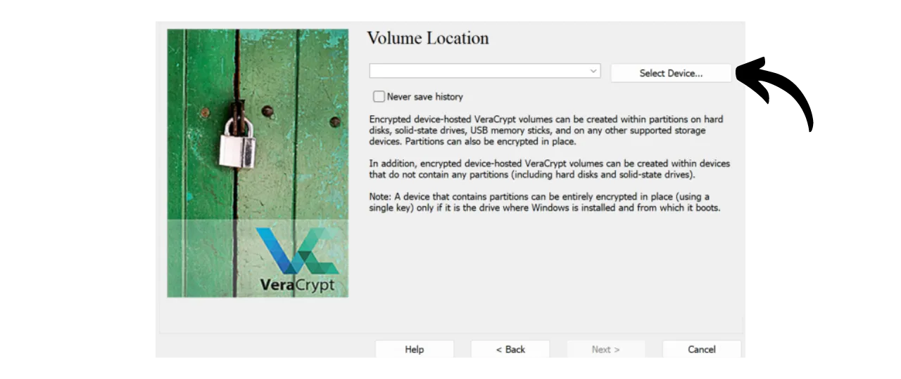

Nowadays, it's important to implement a strategy to ensure the accessibility, security, and backup of your files, such as your personal documents, photos, or important projects. Losing these data can be catastrophic.

To prevent these problems, I advise you to maintain multiple backups of your files on different media. A commonly used strategy in computing is the "3-2-1" backup strategy, which ensures the protection of your files:
- **3** copies of your files;
- Saved on at least **2** different types of media;
- With at least **1** copy kept offsite.

In other words, it's advisable to store your files in 3 different locations, using media of different nature, such as your computer, an external hard drive, a USB stick, or an online storage service. And finally, having an offsite copy means that you should have a backup stored outside of your home or business. This last point helps to avoid the total loss of your files in case of local disasters such as fires or floods. An external copy, distant from your home or business, ensures that your data will survive independent of local risks.

To easily implement this 3-2-1 backup strategy, you can opt for an online storage solution, by automatically or periodically syncing the files from your computer with those in your cloud. Among these online backup solutions, there are obviously those from big digital companies you know: Google Drive, Microsoft OneDrive, or Apple iCloud. However, these are not the best solutions for protecting your privacy. In a previous tutorial, I introduced you to an alternative that encrypts your documents for better confidentiality: Proton Drive.

https://planb.network/tutorials/others/proton-drive

By adopting this strategy of local and cloud backup, you already benefit from two different types of media for your data, one of which is offsite. To complete the 3-2-1 strategy, you simply need to add an additional copy. What I advise you to do is simply to periodically export your data present locally and on your cloud to a physical medium, like a USB stick or an external hard drive. In this way, even if the servers of your online storage solution are destroyed and your computer breaks down simultaneously, you still have this third copy on an external medium so as not to lose your data.

But it's also important to think about the security of your data storage to ensure that no one other than you or your loved ones can access it. Both local and online data are normally secure. On your computer, you've probably set up a password, and the hard drives of modern computers are often encrypted by default. Regarding your online storage (cloud), I showed you in the previous tutorial how to secure your account with a strong password and two-factor authentication. However, for your third copy stored on a physical medium, the only security is its physical possession. If a burglar manages to steal your USB stick or your external hard drive, they could easily access all your data.

To prevent this risk, it is advisable to encrypt your physical medium. Thus, any attempt to access the data will require entering a password to decrypt the content. Without this password, it will be impossible to access the data, securing your personal files even in the event of theft of your USB stick or your external hard drive.

In this tutorial, I'll show you how to easily encrypt an external storage medium using VeraCrypt, an open-source tool.

## Introduction to VeraCrypt

VeraCrypt is an open-source software available on Windows, macOS, and Linux, which allows you to encrypt your data in various ways and on different mediums.

This software enables the creation and maintenance of encrypted volumes on the fly, meaning your data is automatically encrypted before being saved and decrypted before being read. This method ensures that your files remain protected even in the event of theft of your storage medium. VeraCrypt not only encrypts files but also file names, metadata, folders, and even the free space on your storage medium.

VeraCrypt can be used to encrypt files locally or entire partitions, including the system disk. It can also be used to fully encrypt an external medium such as a USB stick or a disk as we will see in this tutorial.

A major advantage of VeraCrypt over proprietary solutions is that it is entirely open source, meaning its code can be verified by anyone.

## How to install VeraCrypt?

Go to [the official VeraCrypt website](https://www.veracrypt.fr/en/Downloads.html) in the "*Downloads*" tab.

Download the version suitable for your operating system. If you are on Windows, choose "*EXE Installer*".

Choose the language for your interface.

Accept the terms of the license.

Select "*Install*".

Finally, choose the folder where the software will be installed, then click on the "*Install*" button.

Wait for the installation to complete.

The installation is finished.

If you wish, you can make a donation in bitcoins to support the development of this open-source tool.

## How to encrypt a storage device with VeraCrypt?

Upon first launch, you will arrive at this interface:

To encrypt the storage device of your choice, start by connecting it to your machine. As you will see later, the process of creating a new encrypted volume on a USB stick or a hard drive will take much longer if the device already contains data that you do not wish to delete. Therefore, I recommend using a blank USB stick or emptying the device beforehand to create the encrypted volume, in order to save time.

On VeraCrypt, click on the "*Volumes*" tab.

Then on the "*Create New Volume...*" menu.

In the new window that opens, select the option "*Encrypt a non-system partition/drive*" and click on "*Next*".

You will then have to choose between "*Standard VeraCrypt volume*" and "*Hidden VeraCrypt Volume*". The first option creates a standard encrypted volume on your device. The "*Hidden VeraCrypt Volume*" option allows creating a hidden volume within a standard VeraCrypt volume. This method enables you to deny the existence of this hidden volume in case of coercion. For example, if someone physically forces you to decrypt your device, you can decrypt only the standard part to satisfy the aggressor but not reveal the hidden part. In my example, I will stick with a standard volume.

On the following page, click on the "*Select Device...*" button.

A new window opens where you can select the partition of your storage device from the list of disks available on your machine. Normally, the partition you wish to encrypt will be listed under a line titled "*Removable Disk N*". After selecting the appropriate partition, click on the "*OK*" button.

The selected support appears in the box. You can now click on the "*Next*" button. 
Next, you will need to choose between the options "*Create encrypted volume and format it*" or "*Encrypt partition in place*". As mentioned earlier, the first option will permanently delete all data on your USB stick or hard drive. Choose this option only if your device is empty; otherwise, you will lose all the data it contains. If you wish to keep existing data, you can temporarily transfer it elsewhere, choose "*Create encrypted volume and format it*" for a faster process that erases everything, or opt for "*Encrypt partition in place*". This last option allows encrypting the volume without erasing the data already present, but the process will be much longer. For this example, as my USB stick is empty, I select "*Create encrypted volume and format it*", the option that erases everything.

Next, you will have the option to choose the encryption algorithm and the hash function. Unless you have specific needs, I advise you to keep the default options. Click on "*Next*" to continue.

Make sure the indicated size for your volume is correct, to encrypt the entire available space on the USB stick, and not just a part. Once verified, click on "*Next*".

At this stage, you will need to set a password to encrypt and decrypt your device. It is important to choose a strong password to prevent an attacker from decrypting your content with brute force attacks. The password should be random, as long as possible, and include several types of characters. I advise you to opt for a random password of at least 20 characters including lowercase letters, uppercase letters, numbers, and symbols.

I also advise you to save your password in a password manager. This makes it easier to access and eliminates the risk of forgetting. For our specific case, a password manager is preferable to a paper medium. Indeed, in the event of a burglary, although your storage device may be stolen, the password in the manager cannot be found by the attacker, which will prevent access to the data. Conversely, if your password manager is compromised, physical access to the device is still necessary to exploit the password and access the data.

For more information on managing passwords, I advise you to discover this other complete tutorial:

https://planb.network/tutorials/others/bitwarden
Enter your password in the 2 designated fields, then click on "*Next*". 
VeraCrypt will then ask you if you plan to store files larger than 4 GiB in the encrypted volume. This question allows the software to select the most suitable file system. Generally, the FAT system is used because it is compatible with the majority of operating systems, but it imposes a maximum file size limit of 4 GiB. If you need to manage larger files, you can opt for the exFAT system.

Next, you will reach a page that allows you to generate a random key. This key is important, as it will be used to encrypt and decrypt your data. It will be stored in a specific section of your media, itself secured by the password you previously established. To generate a strong encryption key, VeraCrypt needs entropy. That's why the software asks you to move your mouse randomly over the window; these movements are then used to generate the key. Continue moving the mouse until the entropy gauge is completely filled. Then, click on "*Format*" to start creating the encrypted volume.

Wait while the formatting is done. This can take a long time for large volumes.

You will then receive a confirmation.

## How to use an encrypted drive with VeraCrypt?

For now, your media is encrypted and therefore you cannot open it. To decrypt it, go to VeraCrypt.

Select a drive letter from the list. For example, I chose "*L:*".

Click on the "*Select Device...*" button.

From the list of all the disks on your machine, select the encrypted volume on your media, then click on the "*OK*" button.

You can see that your volume is well selected.

Click on the "*Mount*" button.

Enter the password chosen during the volume creation, then click on "*OK*".

You can see that your volume is now decrypted and accessible on the drive letter "*L:*".

To access it, open your file explorer and go to the "*L:*" drive (or another letter depending on the one you chose in the previous steps). 
After adding your personal files to the media, to encrypt the volume again, simply click on the "*Dismount*" button.

Your volume no longer appears under the letter "*L:*". It is thus encrypted again.

You can now remove your storage media.

Congratulations, you now have an encrypted medium to securely store your personal data, thus having a complete 3-2-1 strategy in addition to the copy on your computer and your online storage solution.

If you wish to support the development of VeraCrypt, you can also make a donation in bitcoins [on this page](https://www.veracrypt.fr/en/Donation.html).